# Collargraph System Architecture Design Catalog (C4 Model)

## Master Architecture Navigation Hub

This document is the master architectural design catalog for **Collargraph**, organized hierarchically according to the **C4 Model** (Context, Containers, Components, Code) paired with **EventStorming domain modeling**, **runtime sequence diagrams**, and **Architecture Decision Records (ADRs)**.

---

## 1. Executive Summary & System Requirements

- **System Purpose**: Next-generation task graph orchestration, context engineering, and autonomous agent platform.
- **Core Strategy**: Unified Cordis capability spine, zero-framework nominal Graph IR, topological scheduler, fail-closed OS sandboxing, and real-time WebSocket JSON-RPC synchronization.
- **Requirements Specification**: [`requirements.md`](file:///Users/goldenfung/Documents/collargraph/docs/design-catalog/requirements.md)
- **Agent Lifecycle Specification**: [`../architecture/agent-life-cycle.md`](file:///Users/goldenfung/Documents/collargraph/docs/architecture/agent-life-cycle.md)
- **UI Design System & Tokens**: [`../../DESIGN.md`](file:///Users/goldenfung/Documents/collargraph/DESIGN.md)

---

## 2. Level 1: System Context (C1)

The System Context level defines the boundary of the Collargraph platform, human personas, and external platform dependencies.

### 2.1 System Context Diagram
*Source file: [`c1-context/context.mmd`](file:///Users/goldenfung/Documents/collargraph/docs/design-catalog/c1-context/context.mmd)*

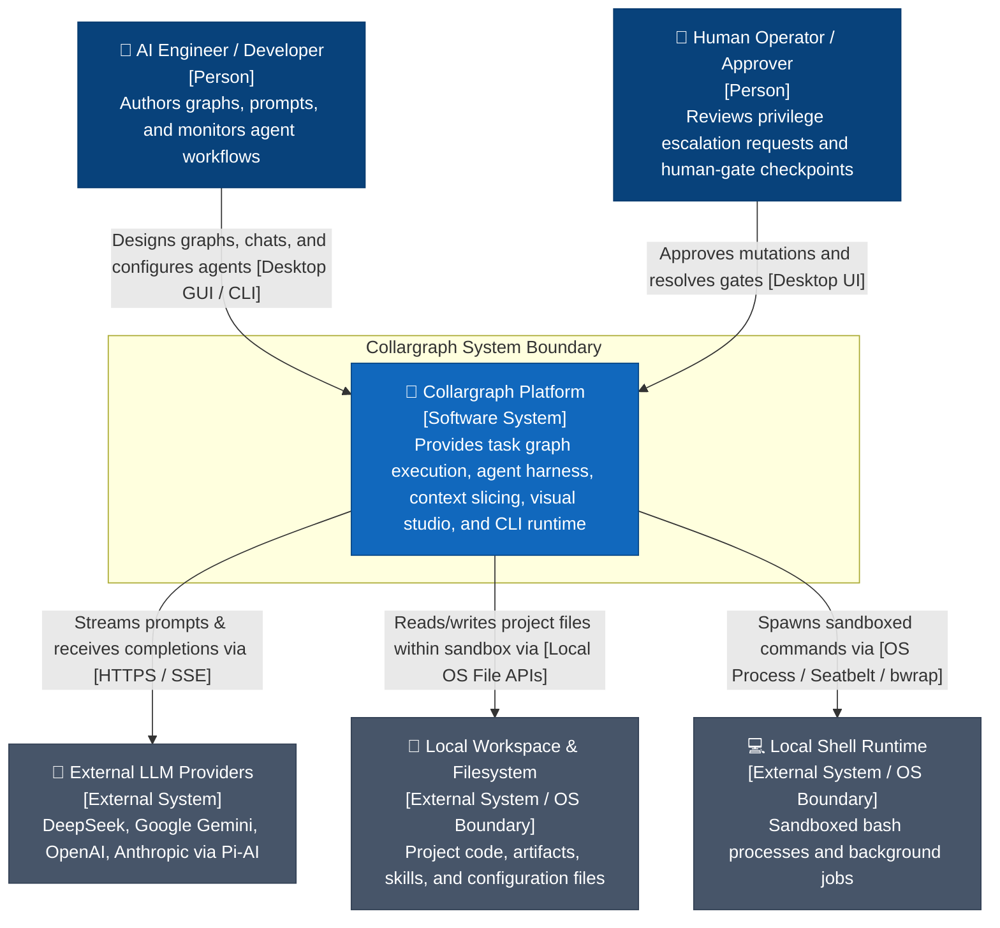

### 2.2 Big-Picture Domain EventStorming
*Source file: [`c1-context/big-picture-events.mmd`](file:///Users/goldenfung/Documents/collargraph/docs/design-catalog/c1-context/big-picture-events.mmd)*

```mermaid
flowchart LR
    %% EventStorming Semantic Styling
    classDef event fill:#ff9800,stroke:#e65100,color:#000
    classDef command fill:#2196f3,stroke:#0d47a1,color:#fff
    classDef actor fill:#ffeb3b,stroke:#f57f17,color:#000
    classDef system fill:#9c27b0,stroke:#4a148c,color:#fff
    classDef aggregate fill:#4caf50,stroke:#1b5e20,color:#fff
    classDef policy fill:#e91e63,stroke:#880e4f,color:#fff
    classDef hotspot fill:#f44336,stroke:#b71c1c,color:#fff

    User[Developer / User]:::actor
    Orch[Orchestrator Agent]:::actor
    Approver[Human Approver]:::actor

    CmdStart[Start Session / Submit Objective]:::command
    EvtSessionStarted[Session Initialized]:::event
    AggSession[Session Aggregate]:::aggregate
    PolInit[Whenever Session Initialized -> Mount Presets & Scope]:::policy

    CmdCreateGraph[Decompose Objective Into Graph]:::command
    EvtGraphCreated[Task Graph Defined]:::event
    AggGraph[Graph Aggregate]:::aggregate
    PolSchedule[Whenever Graph Ready -> Schedule Topological Wavefront]:::policy

    CmdRunNode[Execute Task Node]:::command
    EvtNodeRunning[Node Execution Started]:::event
    AggNode[Node Runner Aggregate]:::aggregate
    SysLLM[External LLM Provider]:::system

    EvtWriteDenied[Sandbox Mutation Denied]:::event
    PolEscalate[Whenever Out-of-Workspace Mutation -> Request HITL Approval]:::policy
    CmdDecide[Decide Approval Request]:::command
    EvtApproved[Privilege Escalation Granted]:::event

    EvtNodeCompleted[Node Execution Finished]:::event
    PolPropagate[Whenever Node Finished -> Pipe Port Data & Ingest Triples]:::policy
    AggKG[Knowledge Graph Aggregate]:::aggregate
    EvtGraphCompleted[Task Graph Execution Completed]:::event

    User --> CmdStart
    CmdStart --> EvtSessionStarted
    EvtSessionStarted --> AggSession
    AggSession --> PolInit

    PolInit --> CmdCreateGraph
    Orch --> CmdCreateGraph
    CmdCreateGraph --> EvtGraphCreated
    EvtGraphCreated --> AggGraph
    AggGraph --> PolSchedule

    PolSchedule --> CmdRunNode
    CmdRunNode --> EvtNodeRunning
    EvtNodeRunning --> AggNode
    AggNode --> SysLLM

    AggNode --> EvtWriteDenied
    EvtWriteDenied --> PolEscalate
    PolEscalate --> CmdDecide
    Approver --> CmdDecide
    CmdDecide --> EvtApproved
    EvtApproved --> AggNode

    AggNode --> EvtNodeCompleted
    EvtNodeCompleted --> PolPropagate
    PolPropagate --> AggKG
    PolPropagate --> EvtGraphCompleted
```

---

## 3. Level 2: Containers & Deployment Topology (C2)

The Container level details the deployable processes, tech stacks, and inter-container communication protocols.

### 3.1 Container Topology Diagram
*Source file: [`c2-containers/containers.mmd`](file:///Users/goldenfung/Documents/collargraph/docs/design-catalog/c2-containers/containers.mmd)*

```mermaid
flowchart TB
    %% C2 Container Diagram for Collargraph
    classDef person fill:#08427b,stroke:#073b6f,color:#fff;
    classDef container fill:#1168bd,stroke:#0b4884,color:#fff;
    classDef database fill:#1e40af,stroke:#1d4ed8,color:#fff;
    classDef external fill:#475569,stroke:#334155,color:#fff;
    classDef boundary fill:none,stroke:#94a3b8,stroke-width:2px,stroke-dasharray: 5 5;

    User["👤 Developer / Approver<br/>[Person]"]:::person

    subgraph CollargraphBoundary ["Collargraph System Boundary"]
        DesktopApp["💻 Desktop IDE & Studio<br/>[Container: Tauri 2.0 / React 19 / Vite]<br/>Provides React Flow canvas, CodeMirror editor, chat stream, and settings UI"]:::container
        
        CLIDaemon["⚙️ CLI & Background Sync Daemon<br/>[Container: Node.js / TypeScript CLI]<br/>Hosts SyncServer, JSON-RPC dispatcher, and batch execution commands"]:::container

        CapabilitySpine["🧠 Capability Harness & Graph Engine<br/>[Container: Cordis Plugin Substrate]<br/>Hosts graph scheduler, relational memory, agent loop, tool sandbox, and Pi-AI routing"]:::container

        SQLiteDB[("🗄️ Session Persistence Database<br/>[Container: SQLite WAL]<br/>Durable append-only event log & message journals")]:::database

        ConfigFileStore[("📄 Configuration Vault<br/>[Container: Local YAML / JSON Files]<br/>Stores settings.yaml, credentials.yaml, and presets.yaml")]:::database

        WorkerSandbox["📦 Code Sandbox Worker Threads<br/>[Container: node:worker_threads]<br/>Isolates deterministic script execution with CPU/memory limits")]:::container
    end

    LLMProviders["🤖 External LLM Providers<br/>[External System: DeepSeek / OpenAI / Gemini / Anthropic]"]:::external
    LocalOS["🖥️ Local Operating System<br/>[External System: File System & Shell / Seatbelt / bwrap]"]:::external

    User -->|"Interacts with visual studio [GUI]"| DesktopApp
    User -->|"Runs headless commands [Terminal / Shell]"| CLIDaemon

    DesktopApp -->|"WebSocket RPC & Event Stream [ws://127.0.0.1:<port> / JSON-RPC 2.0]"| CLIDaemon
    DesktopApp -->|"Window control & native shell [Tauri IPC]"| LocalOS

    CLIDaemon -->|"Mounts via createCapabilityContext() [In-Process / Cordis]"| CapabilitySpine

    CapabilitySpine -->|"Commits immutable journal events [SQL / WAL Lock]"| SQLiteDB
    CapabilitySpine -->|"Loads configuration & secrets [File I/O]"| ConfigFileStore
    CapabilitySpine -->|"Executes deterministic code [Node.js Worker MessageChannel]"| WorkerSandbox
    CapabilitySpine -->|"Dispatches completions [HTTPS / SSE]"| LLMProviders
    CapabilitySpine -->|"Executes sandboxed file/shell operations [OS APIs / Seatbelt / bwrap]"| LocalOS
```

### 3.2 Deployment & Process Topology
*Source file: [`c2-containers/deployment.mmd`](file:///Users/goldenfung/Documents/collargraph/docs/design-catalog/c2-containers/deployment.mmd)*

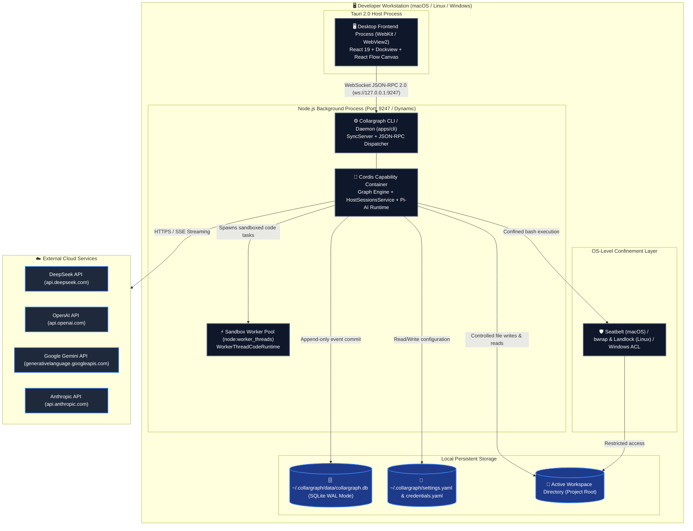

---

## 4. Level 3: Component Architecture (C3)

The Component level zooms into each container to expose modular blocks, responsibilities, and internal interfaces.

### 4.1 Desktop IDE Components (`apps/desktop`)
*Source file: [`c3-components/component-desktop.mmd`](file:///Users/goldenfung/Documents/collargraph/docs/design-catalog/c3-components/component-desktop.mmd)*

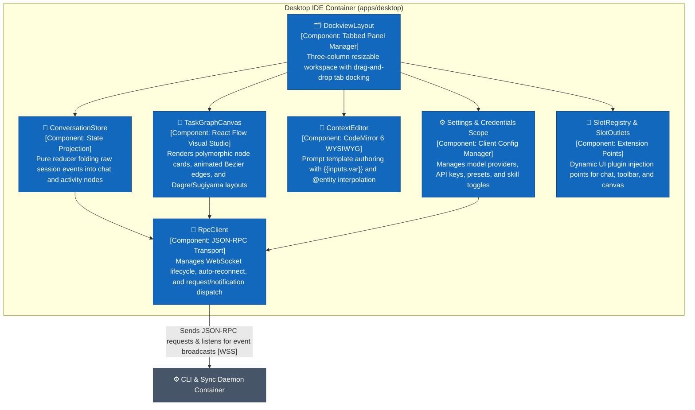

### 4.2 Daemon & Sync Plugin Components (`packages/harness-plugin-sync`)
*Source file: [`c3-components/component-daemon-sync.mmd`](file:///Users/goldenfung/Documents/collargraph/docs/design-catalog/c3-components/component-daemon-sync.mmd)*

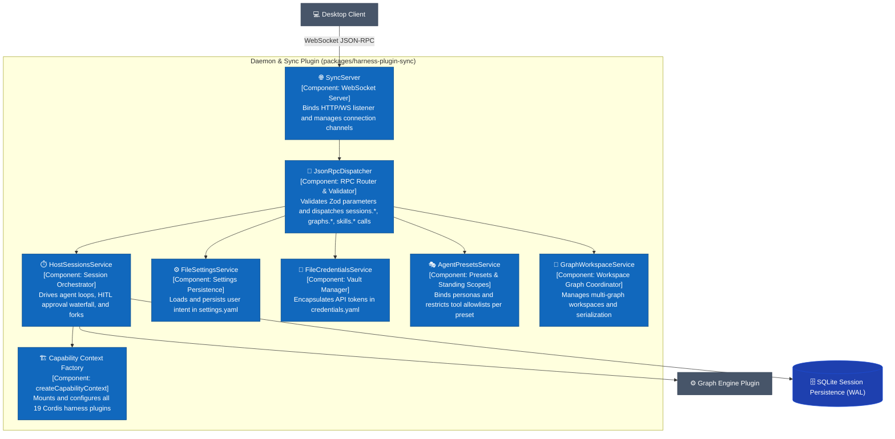

### 4.3 Graph Execution Engine Components (`packages/harness-plugin-graph`)
*Source file: [`c3-components/component-graph-engine.mmd`](file:///Users/goldenfung/Documents/collargraph/docs/design-catalog/c3-components/component-graph-engine.mmd)*

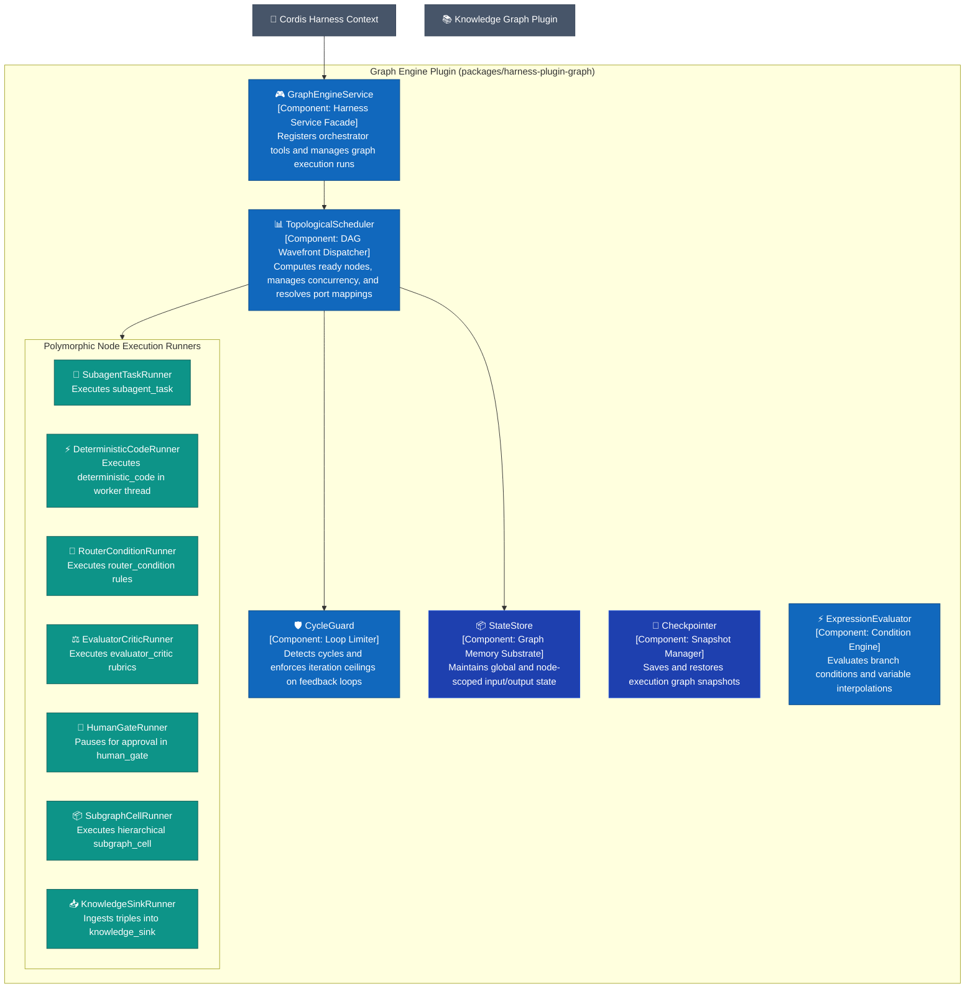

---

## 5. Level 4: Code & Detailed Dynamics (C4)

The Code & Dynamics level details data schemas (ERD), finite state machines, runtime sequence orchestrations, and critical process flows.

### 5.1 Data Model (ERD)
*Source file: [`c4-code/data/erd.mmd`](file:///Users/goldenfung/Documents/collargraph/docs/design-catalog/c4-code/data/erd.mmd)*

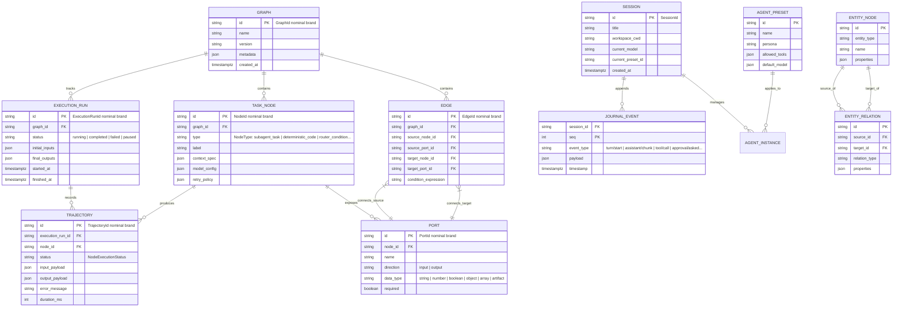

### 5.2 State Machines

#### 5.2.1 Task Node Lifecycle State Machine
*Source file: [`c4-code/data/state-node.mmd`](file:///Users/goldenfung/Documents/collargraph/docs/design-catalog/c4-code/data/state-node.mmd)*

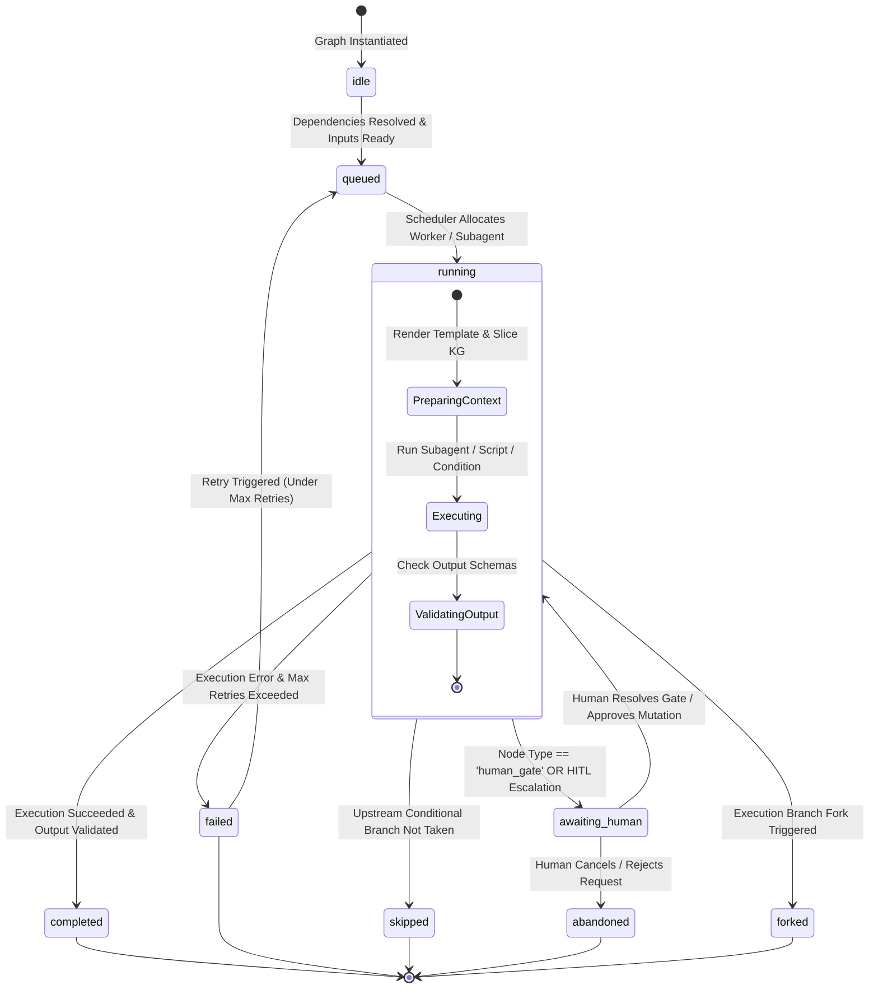

#### 5.2.2 Agent Session Turn Lifecycle State Machine
*Source file: [`c4-code/data/state-turn.mmd`](file:///Users/goldenfung/Documents/collargraph/docs/design-catalog/c4-code/data/state-turn.mmd)*

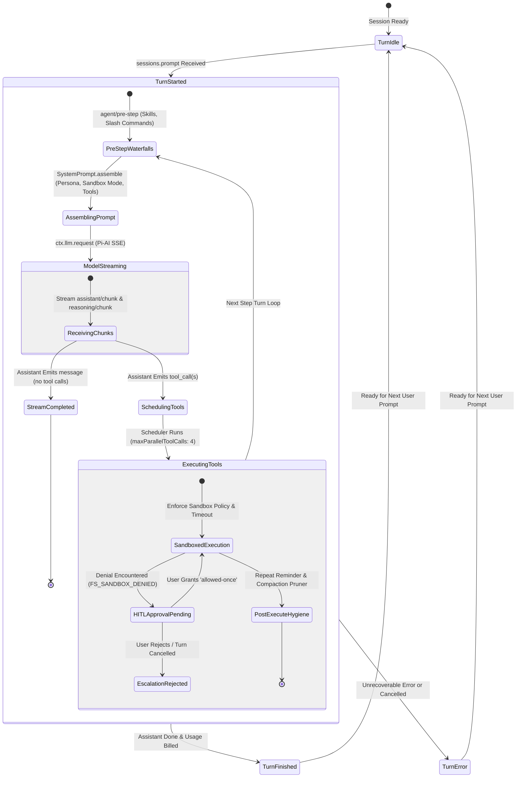

### 5.3 Runtime Interaction Flows

#### 5.3.1 Graph Execution & Topological Scheduling Sequence
*Source file: [`c4-code/flows/sequence-graph-exec.mmd`](file:///Users/goldenfung/Documents/collargraph/docs/design-catalog/c4-code/flows/sequence-graph-exec.mmd)*

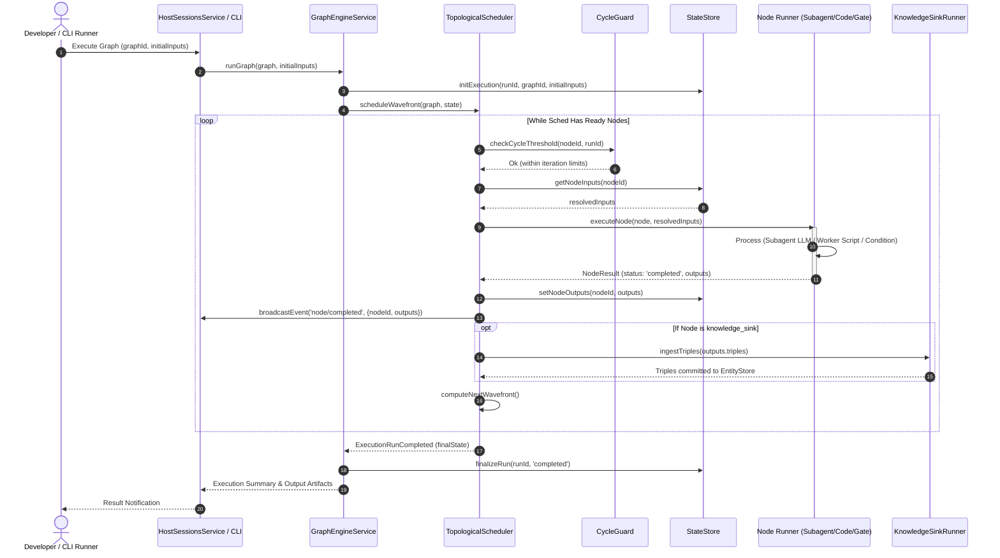

#### 5.3.2 Human-in-the-Loop (HITL) Sandbox Escalation Sequence
*Source file: [`c4-code/flows/sequence-hitl.mmd`](file:///Users/goldenfung/Documents/collargraph/docs/design-catalog/c4-code/flows/sequence-hitl.mmd)*

```mermaid
sequenceDiagram
    %% Runtime Sequence: Human-in-the-Loop (HITL) Sandbox Escalation
    autonumber
    actor User as Desktop User / Approver
    participant UI as Desktop UI (ConversationStore)
    participant RPC as RpcClient / Dispatcher
    participant Host as HostSessionsService
    participant Loop as AgentLoop
    participant Sched as Tool Scheduler
    participant FS as SandboxedFileSystem
    participant Appr as ApprovalService

    Loop->>Sched: Execute tool 'write' (target outside workspace)
    Sched->>FS: writeText(path, content, policy)
    FS--x Sched: FsError("FS_SANDBOX_DENIED")
    
    Sched->>Appr: ctx.approval.request({callId, reason: 'Escalate to write out of workspace'})
    activate Appr
    Appr->>Appr: Append journal opener (approval/asked)
    Appr-->>Host: dispatch 'approval/request' waterfall
    Host-->>RPC: broadcast 'approval/asked' (+call params)
    RPC-->>UI: fold into ApprovalRequestNode (pending)
    deactivate Appr

    Note over User,UI: User inspects path, diff & justification
    User->>UI: Click "Allow Once"
    UI->>RPC: sessions.approval.decide {approvalId, decision: 'allowed-once'}
    RPC->>Host: approval.decide(params)
    Host->>Appr: resolvePendingAsk('allowed-once')
    
    activate Appr
    Appr->>Appr: Append journal closer (approval/decided)
    Appr-->>Sched: Grant single-shot widened policy
    deactivate Appr

    Sched->>FS: Retry writeText under single-shot grant
    FS-->>Sched: Write Succeeded
    Sched-->>Loop: Tool Result (Success)
    Loop-->>UI: Broadcast tool/finish & stream next assistant turn
```

### 5.4 Critical Process Deep Dives

#### 5.4.1 Single Task Node Execution & State Propagation
*Source file: [`c4-code/processes/process-node-run.mmd`](file:///Users/goldenfung/Documents/collargraph/docs/design-catalog/c4-code/processes/process-node-run.mmd)*

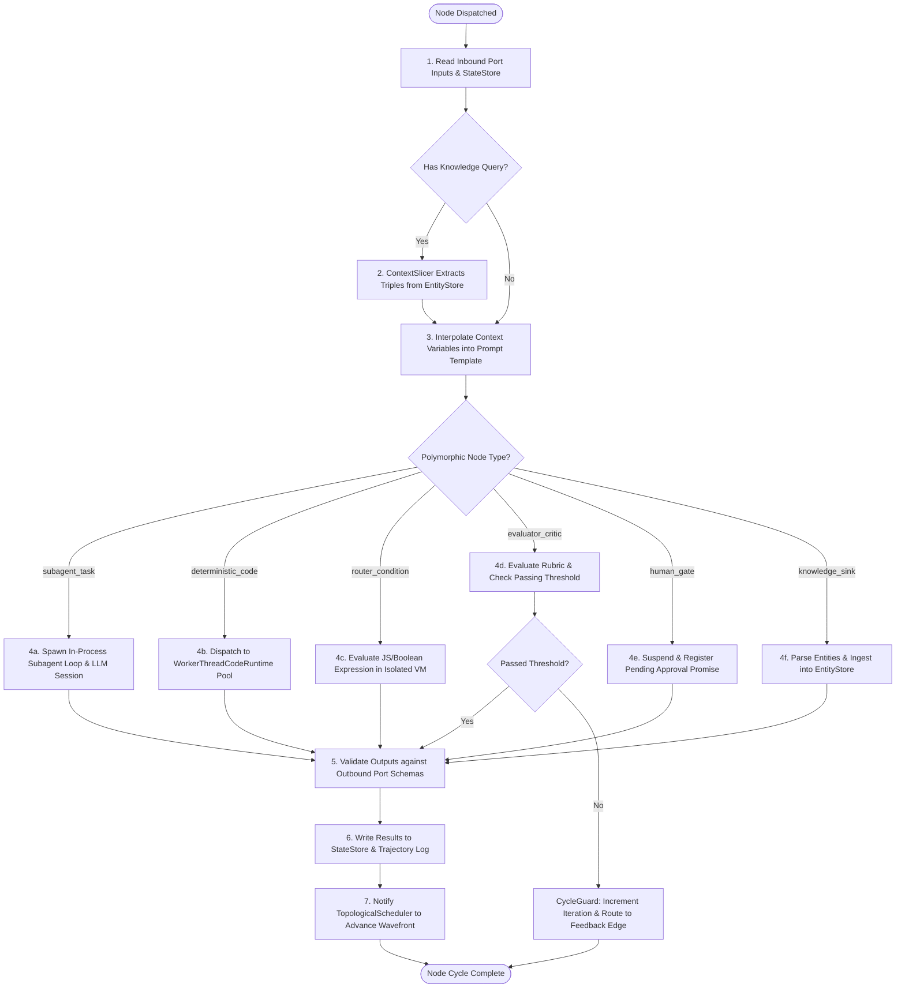

#### 5.4.2 End-to-End Session Prompt Dispatch
*Source file: [`c4-code/processes/process-session-prompt.mmd`](file:///Users/goldenfung/Documents/collargraph/docs/design-catalog/c4-code/processes/process-session-prompt.mmd)*

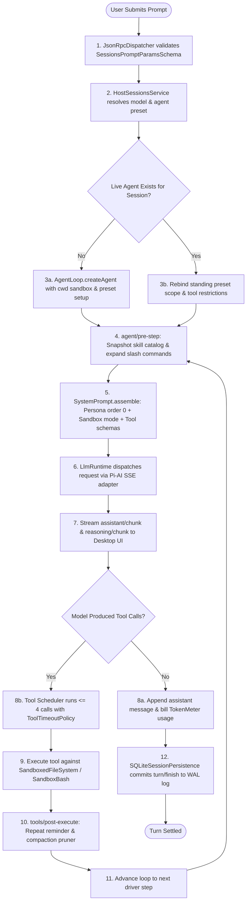

---

## 6. Architecture Decision Records (ADRs)

| ADR | Title | Decision Summary | Status |
|---|---|---|---|
| [`ADR-001`](file:///Users/goldenfung/Documents/collargraph/docs/design-catalog/adrs/adr-001-unified-cordis-capability-spine.md) | **Unified Cordis Capability Spine** | Mount all entry points (CLI, Daemon, Desktop) onto one capability spine via `createCapabilityContext()`. | Accepted |
| [`ADR-002`](file:///Users/goldenfung/Documents/collargraph/docs/design-catalog/adrs/adr-002-deterministic-sqlite-wal-journaling.md) | **Deterministic SQLite WAL Session Journaling** | Single-writer SQLite persistence in WAL mode for replayability and time-travel session forks. | Accepted |
| [`ADR-003`](file:///Users/goldenfung/Documents/collargraph/docs/design-catalog/adrs/adr-003-zero-framework-branded-graph-ir.md) | **Zero-Framework Nominal Branded Graph IR** | Dependency-free branded nominal types and Zod schemas for graph models. | Accepted |
| [`ADR-004`](file:///Users/goldenfung/Documents/collargraph/docs/design-catalog/adrs/adr-004-websocket-jsonrpc-synchronization.md) | **WebSocket JSON-RPC 2.0 Synchronization** | Loopback WebSocket protocol for bidirectional client-daemon RPC and streaming events. | Accepted |
| [`ADR-005`](file:///Users/goldenfung/Documents/collargraph/docs/design-catalog/adrs/adr-005-fail-closed-sandboxed-execution.md) | **Fail-Closed Security Fence & Confinement** | Workspace-anchored paths, OS Seatbelt/bwrap confinement, and single-shot HITL escalation grants. | Accepted |
