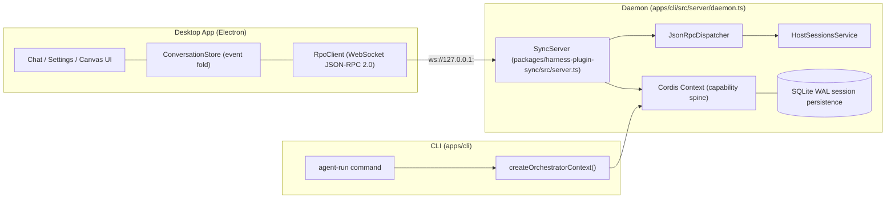
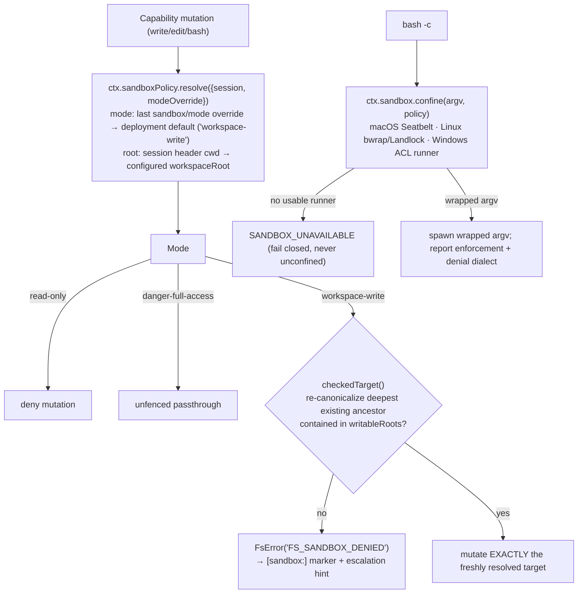

# Collargraph Agent Life Cycle Architecture

This document specifies the end-to-end life cycle of an agent session in Collargraph: how a user prompt travels from the Desktop UI or CLI through the unified Cordis capability spine, how model turns execute against sandboxed capabilities, where human-in-the-loop (HITL) gates intercept dangerous operations, and how every lifecycle event streams back to the interface.

It reflects the implemented state of the codebase (`packages/harness-plugin-sync`, `apps/cli`, `apps/desktop`) after completion of remediation phases 1–7 described in [`docs/defects/agent-life-cycle-defects.md`](../defects/agent-life-cycle-defects.md).

---

## 1. Runtime Topology

Collargraph runs **one canonical capability spine** shared by all entry points:



- **Desktop/Daemon path** — `SyncServer.start()` calls `createCapabilityContext()` on its own Cordis context ([`server.ts:146-155`](../../packages/harness-plugin-sync/src/server.ts)); `HostSessionsService` binds listeners and drives sessions over JSON-RPC.
- **CLI path** — `createOrchestratorContext()` ([`agent-run.ts:61-69`](../../apps/cli/src/commands/agent-run.ts)) is a thin wrapper over the same factory. There is no second initialization pathway.

---

## 2. The Capability Spine

`createCapabilityContext()` ([`capability-context.ts`](../../packages/harness-plugin-sync/src/capability-context.ts)) mounts every layer of the harness onto one Cordis context. Mounted services become capability facts (`ctx.fs`, `ctx.shell`, `ctx.tools`, `ctx.skills`, `ctx.approval`, …) that tool adapters translate into model-facing tools.

| #   | Layer                  | Plugins                                                                                                                                                      | Service facts / Tools produced                                                                            |
| --- | ---------------------- | ------------------------------------------------------------------------------------------------------------------------------------------------------------ | --------------------------------------------------------------------------------------------------------- |
| 1   | File-backed config     | `FileSettingsService`, `FileCredentialsService`, `AgentPresetsService` + `CordisSettingsProvider`, `CordisCredentialsProvider`, `CordisAgentPresetsProvider` | settings, credential vault, `ctx.agentPresets`                                                            |
| 2   | Storage substrate      | `@deepseek-ai/dsh-storage`                                                                                                                                   | `ctx.storage`                                                                                             |
| 3   | Prompt & tool registry | `SystemPrompt {includeHarnessIdentity, includeRuntimeContext}`, `ToolRuntime`                                                                                | system prompt assembly, `ctx.tools` registry                                                              |
| 4   | Governance guards      | `ToolTimeoutPolicy`, `RepeatToolReminder {thresholds:[3,5,8]}`                                                                                               | `tools/execute` deadline, post-execute loop breaker                                                       |
| 5   | Process substrate      | `LocalSubprocessRuntime`, `LocalJobRegistry`                                                                                                                 | background jobs (`job_list` / `job_output` / `job_kill`)                                                  |
| 6   | Confinement fence      | `LocalSandboxProvider`, `SandboxPolicyService {mode:'workspace-write', workspaceRoot}`                                                                       | `ctx.sandbox`, `ctx.sandboxPolicy`                                                                        |
| 7   | HITL approval          | `ApprovalService {policy:'ask'}`                                                                                                                             | `ctx.approval`, `approval/request` waterfall                                                              |
| 8   | Filesystem seam        | `SandboxedFileSystem` (or `LocalFileSystem` when disabled) + `FsObservationPolicy` + `FsToolPlugin`                                                          | `read`, `write`, `edit`                                                                                   |
| 9   | Shell seam             | `ShellEnvPlugin` + `SandboxBashExecutor` (or local) + `BashToolPlugin` + `JobToolsPlugin`                                                                    | `bash`, job tools                                                                                         |
| 10  | Web seam               | `WebRuntime` + `DeepSeekWebSearch` + `HttpWebFetch` + `WebToolPlugin`                                                                                        | `web_search`, `web_fetch` (30 s cooperative budgets)                                                      |
| 11  | Task state             | `TodoToolPlugin {allowParallelInProgress:true}`, `GoalService`                                                                                               | `todo_write`, goals                                                                                       |
| 12  | Delegation seam        | `SubagentRuntime` + spawn/fork in-process providers + `SubagentToolPlugin` ×2                                                                                | `subagent`, `subagent_fork`                                                                               |
| 13  | Skill seam             | `SkillRegistry` + `SkillFilesystemPlugin` (watched roots) + `ToolSkillPlugin` + governance provider bridge                                                   | `<available_skills>` pre-step catalog, slash commands, `skill` tool                                       |
| 14  | LLM runtime            | `LlmRuntime` + PiAi adapter (built-in + settings-defined providers)                                                                                          | `ctx.llm` model routing                                                                                   |
| 15  | Sessions               | `SessionStore` + `SqliteSessionPersistence {journalMode:'wal'}`                                                                                              | durable event journals                                                                                    |
| 16  | Agent loop             | `AgentRegistry` + `AgentLoop {maxParallelToolCalls:4}`                                                                                                       | scoped agents, driver, teardown                                                                           |
| 17  | Compaction             | `TokenMeter` + `ToolResultPruner {thresholdChars:50000}`                                                                                                     | oversized-result pruning with token shadow-pricing                                                        |
| 18  | Secure code runtime    | `WorkerThreadCodeRuntime {computeMs:10000, maxWallMs:30000}`                                                                                                 | `ctx.codeRuntime` (worker-thread TypeScript execution)                                                    |
| 19  | Orchestration          | `GraphEngineService` + task-graph tool suite                                                                                                                 | 11 graph tools (`create_task_node`, `connect_task_nodes`, `validate_task_graph`, `resolve_human_gate`, …) |

Toggle flags (`enableFsTools`, `enableBashTool`, `enableSkills`, …) allow entry points to slim the spine without forking the factory.

---

## 3. End-to-End Agent Life Cycle Data Flow

The sequence below traces one user prompt through a full turn containing a denied write, a HITL escalation, and a successful retry.

```mermaid
sequenceDiagram
    autonumber
    actor User as User (Desktop)
    participant RPC as RpcClient / Dispatcher
    participant Host as HostSessionsService
    participant Loop as AgentLoop (scoped agent)
    participant Pre as agent/pre-step waterfalls
    participant SP as SystemPrompt assembler
    participant LLM as LlmRuntime (PiAi SSE)
    participant Sched as Tool scheduler (≤4 parallel)
    participant Guard as Guards (timeout / repeat / pruner)
    participant FS as SandboxedFileSystem
    participant Appr as ApprovalService
    participant Store as ConversationStore (UI fold)

    User->>RPC: sessions.prompt { sessionId, text, agentPreset?, model? }
    RPC->>Host: prompt(params)
    Host->>Loop: createAgent({ meta:{cwd, agentPreset}, setup })
    Note over Loop: setup(): bindScopeParent(agentKey, presetStandingScope)<br/>mount PersonaPlugin @ order 0<br/>ctx.tools.restrict({allow: preset.tools})
    Host->>Loop: agent.send(UserMessage,'next-turn')
    Loop->>Pre: dispatch 'agent/pre-step'
    Note over Pre: ToolSkillPlugin: digest skill catalog,<br/>inject <available_skills> if changed;<br/>expand /slash-command into skill-invocation message
    Loop->>SP: assemble({scope})
    Note over SP: persona @ order 0 + runtime-context snapshot<br/>+ ToolRuntime.view(scope) schemas
    SP->>LLM: request (tools array, history)
    LLM-->>Sched: assistant message with tool_call(s)
    Loop->>Store: session/event tool/call → tool/start
    Sched->>Guard: tools/execute waterfall (deadline armed)
    Guard->>FS: writeText(target,…,sandboxPolicy)
    FS--x Sched: FsError("FS_SANDBOX_DENIED") [outside writableRoots]
    Note over Sched: tool-fs maps denial → [sandbox:] marker<br/>+ same-turn escalation hint
    Sched->>Appr: ctx.approval.request({callId, reason})
    Appr->>Appr: append audit pair opener (approval/asked)
    Appr-->>User: approval/request waterfall → pending map →<br/>broadcast approval/asked (+parameters, root-session fan-out)
    Store->>Store: fold → ApprovalRequestNode (Allow Once / Reject)
    User->>RPC: sessions.approval.decide {approvalId,'allowed-once'}
    RPC-->>Appr: waterfall resolves 'allowed-once'
    Appr->>Appr: append approval/decided (single-shot grant)
    Sched->>FS: retried write under strictly-wider per-call policy
    FS-->>Guard: write outcome
    Guard->>Guard: post-execute: repeat reminder @ [3,5,8];<br/>prune result >50k chars (TokenMeter shadow price)
    Loop-->>Store: tool/result → tool/finish; turn/end → turn/finish
```

### 3.1 Phase A — Session acquisition (`sessions.prompt`)

1. `JsonRpcDispatcher` validates params against `SessionsPromptParamsSchema` (`sessionId`, `text`, optional `model`, optional `agentPreset`) and routes to `HostSessionsService.prompt()` ([`host-sessions-service.ts:395`](../../packages/harness-plugin-sync/src/host-sessions-service.ts)).
2. Model selection resolution order: explicit param → per-session selection → `{deepseek, deepseek-chat}` default.
3. Preset resolution order: explicit param → per-session selection (`selectPreset` / `agent-preset/selected` event). If no live agent exists for the session id, a new one is created (step 4); if an agent already exists, changing the preset dynamically recomposes the active agent context (re-binding standing scope, updating `@deepseek-ai/dsh-persona`, and adjusting tool restrictions; or cleanly unmounting when set to `'none'`).
4. **Agent creation** goes through `agentLoop.createAgent(ctx, { sessionId, meta:{cwd, agentPreset}, agentOptions, setup })`. The session header carries a validated absolute `cwd` — the same value `SandboxPolicyService.resolve()` uses as the per-session `workspace-write` boundary. The `setup` callback runs before publication, so persona and tool restrictions exist before the first prompt assembly:
   - `bindScopeParent(agentKey, presetStandingScope)` joins the agent to the preset's standing scope (one standing scope per preset id, created once and reused across agents).
   - `PersonaPlugin` mounts inside the agent scope, shadowing the global `deployment:persona` section at `PERSONA_ORDER = 0`.
   - `ctx.tools.restrict({allow})` narrows the visible schema set to the preset's whitelisted tools (unknown names are ignored, never fatal).

### 3.2 Phase B — Step preparation

Each driver step fires the `agent/pre-step` waterfall chain before assembly:

- **Skill catalog** — `dsh-tool-skill` snapshots `ctx.skills.snapshot({scope, cwd})`, compares the catalog digest against the last published one, and injects an `<available_skills>` context block whenever the winning set changed. It also intercepts user `/skill-name` prompts, replacing them with the rendered `<skill_content>` body tagged with the durable `skill-invocation` message source.
- **Catalog visibility** — the filesystem provider ranks roots (`project-dsh` > `project-agents` > custom dirs > `~/.collargraph/skills` > `~/.agents/skills` > bundled) and watches them for hot reload. A Collargraph-owned governance provider (`collargraph-skills-governance`, rank 10) re-publishes any skill the user disabled in the Desktop settings with `invocation: {modelInvocable:false, userInvocable:false}`, masking it from both the catalog and the `skill` tool.

`SystemPrompt.assemble({scope})` then folds, in order: harness identity → scope persona (`deployment:persona`, order 0) → dynamic runtime-context snapshot (sandbox mode, approval policy, cwd) → `ToolRuntime.view(scope)` tool schemas (restriction-aware).

### 3.3 Phase C — Model request & tool execution

- The step messages plus tool schemas go to `ctx.llm`; the PiAi adapter resolves the provider profile, pulls secrets through `ctx.credentials` (never from settings files), and streams SSE deltas back as `assistant/chunk` session events.
- Tool calls are scheduled up to `maxParallelToolCalls: 4` concurrently.
- `'tools/execute'` wraps each call with the timeout guard: a tool declaring `timeoutMs` (web tools attach 30 s) gets a cooperative `AbortSignal` deadline; expiry substitutes the typed `TOOL_TIMEOUT` error instead of hanging the loop.
- Executors enforce the confinement fence (§4). Denials surface as structured errors with escalation hints rather than raw stack traces.
- `'tools/post-execute'` runs the hygiene guards:
  - **Repeat reminder** — consecutive identical canonicalized calls trigger advisory steering reminders into the next step at thresholds `[3, 5, 8]` (arguments quoted up to `argumentsPreviewChars: 500`; detection always compares the full arguments).
  - **Compaction pruner** — results above `thresholdChars: 50000` code points are replaced by head/middle/tail-truncated content citing the shadowed original; a `compaction/prune` shadow-price event bills the elided tokens through `TokenMeter` so usage accounting stays faithful.

### 3.4 Phase D — Human-in-the-loop escalation

Escalation is a structured protocol, not a string convention:

1. Under a confining backend, mutating fs/bash tool schemas advertise `sandbox_permissions` and `justification`.
2. On `FS_SANDBOX_DENIED` (or a bash denial marker), the tool layer retries **once** through `ctx.approval.request({agent, toolName, callId, reason})` when the model supplied escalation arguments.
3. `ApprovalService` requires an open turn, appends the `approval/asked` audit opener, and dispatches the `approval/request` **waterfall**. `HostSessionsService` claims the request, keys the pending decision by the exact audit id (matched via `req.callId`, which survives concurrent parallel calls), and broadcasts `approval/asked` — enriching it with the parsed call parameters and fanning it out to the root session so nested-subagent escalations remain visible in the parent chat.
4. The Desktop folds it into an `ApprovalRequestNode` ("Allow Once" / "Reject"). `sessions.approval.decide` resolves exactly one pending promise; aborting the turn settles outstanding asks as `'cancelled'`.
5. Outcomes are audited as the paired `approval/decided` event. `'allowed-once'` grants a single-shot strictly-wider policy for that call only; privilege decays immediately afterwards. Missing answerers fail closed to `'unavailable'`.

Session-level approval policy defaults to `'ask'` (overridable via `COLLARGRAPH_APPROVAL_POLICY` or the runtime-context switch); `'never'` auto-rejects every ask without prompting.

### 3.5 Phase E — Turn settlement

`turn/end` closes the turn: error reasons map to `turn/error` (with JSON-RPC error codes); success maps to `turn/finish` carrying `TurnExecutionStats` (input/output/total tokens captured from the final `assistant/message` usage). Every event above was appended to the session journal **before** broadcast, so the durable log is authoritative.

---

## 4. Confinement Fence Detail



Invariants:

- **Fail-closed everywhere**: unavailable confinement refuses to run the command; fs denials throw the structured `FS_SANDBOX_DENIED`.
- **TOCTOU narrowing**: containment re-checks re-canonicalize symlinks immediately before delegation, and the checked identity is the mutated identity.
- **Single policy home**: fs fence and bash wrapper consume the _same_ resolved `SandboxExecutionPolicy` per call, so they cannot drift.
- **Per-call policies**: escalations stamp a wider policy on one call only; two consumers may confine under different modes simultaneously.

---

## 5. Event Streaming & Surface Projection

Cordis session events are the single source of truth. `handleSessionEvent()` translates them to protocol events, dedupes by `(sessionId, seq)`, and fans out to subscribers; the dispatcher wraps them as `session/event` JSON-RPC notifications.

| Cordis journal event                             | Protocol event                                        | UI projection                                                                                                        |
| ------------------------------------------------ | ----------------------------------------------------- | -------------------------------------------------------------------------------------------------------------------- |
| `turn/start`                                     | `turn/start`                                          | opens turn, resets chunk counters                                                                                    |
| `user/message` (`source.kind === 'user'`)        | `user/message`                                        | `UserNode` (human user query bubble)                                                                                 |
| `user/message` (`source.kind !== 'user'`)        | _(suppressed / internal context)_                     | Filtered from user chat feed (model history only; e.g. `<available_skills>`, `<system-reminder>`, runtime snapshots) |
| `assistant/chunk` (text-delta / reasoning-delta) | `assistant/chunk` / `reasoning/chunk`                 | streaming `AssistantNode`                                                                                            |
| `tool/call`                                      | `tool/start` (parsed parameters)                      | `ToolCallNode` (running)                                                                                             |
| `tool/result`                                    | `tool/finish`                                         | `ToolCallNode` (completed/failed)                                                                                    |
| `approval/asked`                                 | `approval/asked` (+ parameters, root-session fan-out) | `ApprovalRequestNode` (pending)                                                                                      |
| `approval/decided`                               | `approval/decided`                                    | `ApprovalRequestNode` (settled)                                                                                      |
| `subagent/start` / `event` / `end`               | same                                                  | `SubagentNode` stream                                                                                                |
| `agent-preset/selected`                          | same                                                  | preset badge state                                                                                                   |
| `turn/end` (complete / error)                    | `turn/finish` / `turn/error`                          | `TurnTailNode` stats or inline error                                                                                 |

`ConversationStore.fold()` is a pure reducer over these events (`useSyncExternalStore`), so the timeline is a deterministic projection of the journal — replay-safe and identical for late joiners once catch-up events are folded. Only genuine human user queries produce `UserNode` chat bubbles, ensuring internal skill catalogs, instructions, and system snapshots remain invisible in the user message feed.

---

## 6. Persistence & Forks

- Every journal event commits through `SqliteSessionPersistence` (WAL) before observers run; replay reconstructs identical sessions via `deriveMessages()`.
- `sessions.fork` seeds a fresh child session with the balanced completed-turn prefix of the parent log (`meta.parentSession`, `seedLength`), preserving model/preset/plan-mode selections and mounting the preset composition in the child's `setup`.

---

## 7. Security Posture Summary

| Surface                 | Control                                                                                                 |
| ----------------------- | ------------------------------------------------------------------------------------------------------- |
| Filesystem writes/edits | workspace-write fence, TOCTOU re-canonicalization, `FS_SANDBOX_DENIED` fail-closed                      |
| Shell execution         | OS-level runners (Seatbelt / bwrap+Landlock / Windows ACL), `SANDBOX_UNAVAILABLE` fail-closed           |
| Privilege escalation    | HITL waterfall + audited single-shot grant, immediate decay                                             |
| Secrets                 | credentials resolved per-call from the vault; API keys never enter settings or logs                     |
| Code execution          | worker-thread isolation with ELU compute quota, wall-clock ceiling, output ledger (`node:vm` is banned) |
| Loop hygiene            | timeouts, repeat reminders, output compaction                                                           |

---

## 8. Known Limitations

1. **Code Mode has no model-facing tool yet.** `ctx.codeRuntime` (worker thread) exists and serves the graph engine's `deterministic_code` runner, but there is no `run_code` chat tool, `presentAs('code')` presentation, or generated SDK surface — interactive chat cannot execute code programs.
2. **Bash confinement tests assert execution, not denial.** The suite verifies commands run through the sandbox executor but does not yet assert out-of-workspace denial signatures or the `SANDBOX_UNAVAILABLE` path.
3. **Plan mode is not enforced server-side.** `plan/mode` is stored and streamed but does not yet gate tool execution in `prompt()`.

These are tracked as follow-up work items; none affect the correctness of the flows documented above.
