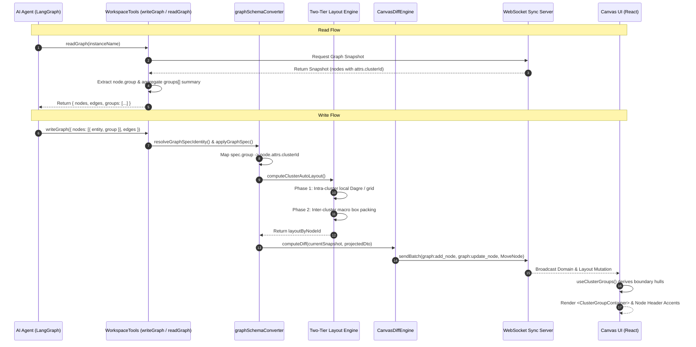

# Clustering & Grouping Canvas Architecture

> **Status**: Approved Design  
> **Approach**: Option A (Computed / Derived Cluster Layer)  
> **Scope**: Canvas UI, Two-Tier Spatial Layout, Agent Graph Tools, and WebSocket Diff Pipeline

---

## Table of Contents

1. [Executive Summary & Core Architectural Decision](#1-executive-summary--core-architectural-decision)
2. [Current State Audit & Deficiencies](#2-current-state-audit--deficiencies)
3. [End-to-End System Data Flow](#3-end-to-end-system-data-flow)
4. [Agent Tooling & Pipeline Alignment](#4-agent-tooling--pipeline-alignment)
5. [Two-Tier Hierarchical Auto-Layout Engine](#5-two-tier-hierarchical-auto-layout-engine)
6. [Canvas UI & Visual Group Presentation](#6-canvas-ui--visual-group-presentation)
7. [Constants, Error Taxonomy, & Quality Invariants](#7-constants-error-taxonomy--quality-invariants)

---

## 1. Executive Summary & Core Architectural Decision

CollarAgent integrates hierarchical community detection ([Leiden algorithm](file:///Users/goldenfung/Documents/collaragent/src/workspace/canvas/domain/analysis/clustering/leiden)) with a scholarly desktop visual canvas. To provide a complete clustering experience without breaking the existing storage model, CollarAgent adopts **Option A: Computed / Derived Cluster Layer**:

### Architectural Trade-off Evaluation: Computed vs. Explicit Entities

| Dimension                     | Option A: Computed / Derived Cluster Layer (Selected)                                                                                                                                  | Option B: First-Class `groups` Domain Entity                                       |
| :---------------------------- | :------------------------------------------------------------------------------------------------------------------------------------------------------------------------------------- | :--------------------------------------------------------------------------------- |
| **Schema Impact**             | **Zero breaking changes**. Uses existing `node.attrs.clusterId` in [`GraphCanvasDTO`](file:///Users/goldenfung/Documents/collaragent/src/workspace/persistence/graphCanvasDto.ts).     | Requires bumping `schemaVersion: 2` and adding `groups: Record<string, GroupDTO>`. |
| **Sync & WebSocket Pipeline** | **Zero wire disruption**. Leverages existing [`CanvasDiffEngine`](file:///Users/goldenfung/Documents/collaragent/src/collaragent/runtime/CanvasDiffEngine.ts) node attribute diffing.  | Requires new CRDT / WebSocket message types and reconciliation logic.              |
| **Time-Travel & Checkpoints** | Reuses existing mathematical command inversion ([`InverseCommandEngine.ts`](file:///Users/goldenfung/Documents/collaragent/src/collaragent/runtime/InverseCommandEngine.ts)) on nodes. | Requires new inverse command types for group lifecycle.                            |
| **Effort & Risk**             | Low to Medium. Highly incremental and non-destructive.                                                                                                                                 | High. High risk of state desynchronization across sessions.                        |
| **Verdict**                   | **Adopted**. Group enclosures and metrics are derived on-the-fly from node positions and cluster IDs.                                                                                  | Reserved for future roadmap if manual nested container authoring is needed.        |

---

## 2. Current State Audit & Deficiencies

Leiden clustering is partially wired into the canvas domain and state management via an undocumented keyboard shortcut, but it is completely unwired from the visual rendering layer, spatial layout, and agent tool controls.

Below is the concrete evidence and analysis across the three requested paths:

---

### 1. Domain Implementation: [`src/workspace/canvas/domain/analysis/clustering/leiden`](file:///Users/goldenfung/Documents/collaragent/src/workspace/canvas/domain/analysis/clustering/leiden)

The Leiden clustering package is fully implemented in the domain layer:

- **Core Algorithm**: [`leidenCore.ts`](file:///Users/goldenfung/Documents/collaragent/src/workspace/canvas/domain/analysis/clustering/leiden/leidenCore.ts#L87-L96) implements local moving, refinement, aggregation, and signed modularity optimization.
- **DTO Adapter**: [`graphAdapter.ts`](file:///Users/goldenfung/Documents/collaragent/src/workspace/canvas/domain/analysis/clustering/leiden/graphAdapter.ts#L47-L135) transforms [`GraphCanvasDTO`](file:///Users/goldenfung/Documents/collaragent/src/workspace/persistence/graphCanvasDto.ts) into numeric multiplex representations.
- **Worker Execution**: [`leiden.worker.ts`](file:///Users/goldenfung/Documents/collaragent/src/workspace/canvas/domain/analysis/clustering/leiden/leiden.worker.ts#L34-L60) and [`workerClient.ts`](file:///Users/goldenfung/Documents/collaragent/src/workspace/canvas/domain/analysis/clustering/leiden/workerClient.ts#L31-L100) run the clustering off-thread with `AbortSignal` cancellation and progress event forwarding.
- **Result Stamping**: In [`index.ts`](file:///Users/goldenfung/Documents/collaragent/src/workspace/canvas/domain/analysis/clustering/leiden/index.ts#L105-L122), [`runHierarchicalLeidenOnDto`](file:///Users/goldenfung/Documents/collaragent/src/workspace/canvas/domain/analysis/clustering/leiden/index.ts#L32) stamps clustering metadata into `node.attrs`:
  ```ts
  (attrs as any).clusterRunId = clusterRunId;
  (attrs as any).clusterParams = { ... };
  (attrs as any).clusterPath = clusterPathByNodeIndex[i];
  (attrs as any).clusterId = clusterIdByNodeIndex[i];
  ```
- **Crucial Detail**: [`runHierarchicalLeidenOnDto`](file:///Users/goldenfung/Documents/collaragent/src/workspace/canvas/domain/analysis/clustering/leiden/index.ts#L32-L127) **only assigns cluster partitions** to `node.attrs`. It **does not compute or modify node positions** `(x, y)` in `dto.layout.layoutByNodeId`.

---

### 2. Canvas Integration: [`src/workspace/canvas/components/Canvas.tsx`](file:///Users/goldenfung/Documents/collaragent/src/workspace/canvas/components/Canvas.tsx)

In [`Canvas.tsx`](file:///Users/goldenfung/Documents/collaragent/src/workspace/canvas/components/Canvas.tsx#L391-L460), Leiden clustering is wired via keyboard shortcuts:

- **Execution (<kbd>Cmd/Ctrl</kbd> + <kbd>Shift</kbd> + <kbd>L</kbd>)**:
  Lines [391–448](file:///Users/goldenfung/Documents/collaragent/src/workspace/canvas/components/Canvas.tsx#L391-L448) serialize the canvas state into a DTO via [`serializeCanvas(state)`](file:///Users/goldenfung/Documents/collaragent/src/workspace/persistence/canvasSerialization.ts#L40), invoke [`runHierarchicalLeidenOnDtoInWorker`](file:///Users/goldenfung/Documents/collaragent/src/workspace/canvas/domain/analysis/clustering/leiden/workerClient.ts#L31) (with fallback to [`runHierarchicalLeidenOnDto`](file:///Users/goldenfung/Documents/collaragent/src/workspace/canvas/domain/analysis/clustering/leiden/index.ts#L32)), and dispatch the updated graph into canvas state:
  ```ts
  dispatchCommand({
    type: 'ReplaceGraph',
    payload: {
      dto,
      graphId: String((state.domain.graph as any).id)
    }
  })
  ```
- **Cancellation (<kbd>Cmd/Ctrl</kbd> + <kbd>Shift</kbd> + <kbd>C</kbd>)**:
  Lines [453–460](file:///Users/goldenfung/Documents/collaragent/src/workspace/canvas/components/Canvas.tsx#L453-L460) abort in-flight clustering via `leidenAbortRef.current.abort()`.
- **UI Triggers**:
  There are no buttons or context menu entries in [`CanvasToolbar.tsx`](file:///Users/goldenfung/Documents/collaragent/src/workspace/canvas/components/CanvasToolbar.tsx) or the UI; the shortcut is the only execution path.
- **Misleading Comment**:
  Line 391 comments `// Ctrl/Cmd + Shift + L: run Leiden layout`. However, Leiden performs partition analysis, not geometric layout positioning. Because node positions are not modified, running this shortcut does not physically rearrange nodes on the canvas.

---

### 3. Node Component: [`src/workspace/canvas/components/CanvasNode.tsx`](file:///Users/goldenfung/Documents/collaragent/src/workspace/canvas/components/CanvasNode.tsx)

In [`CanvasNode.tsx`](file:///Users/goldenfung/Documents/collaragent/src/workspace/canvas/components/CanvasNode.tsx), Leiden clustering is **completely absent**:

- Neither `clusterId`, `clusterPath`, `clusterRunId`, nor `clusterParams` is referenced.
- `node.attrs` is ignored when rendering the node frame, header ([`NodeHeader.tsx`](file:///Users/goldenfung/Documents/collaragent/src/workspace/canvas/components/NodeHeader.tsx)), and body ([`NodeFrame.tsx`](file:///Users/goldenfung/Documents/collaragent/src/workspace/canvas/components/NodeFrame.tsx)).
- There are **no visual indicators** (no cluster badges, cluster boundary boxes, color-coded node headers/borders, or group containers).

---

### Summary Matrix

| Layer / Component         | Status               | Evidence                                                                                                                                                                                                                               |
| :------------------------ | :------------------- | :------------------------------------------------------------------------------------------------------------------------------------------------------------------------------------------------------------------------------------- |
| **Clustering Domain**     | **Fully Built**      | [`clustering/leiden`](file:///Users/goldenfung/Documents/collaragent/src/workspace/canvas/domain/analysis/clustering/leiden) provides hierarchical partitioning, multiplex graph adapters, and worker execution.                       |
| **Canvas State Pipeline** | **Wired (Headless)** | [`Canvas.tsx`](file:///Users/goldenfung/Documents/collaragent/src/workspace/canvas/components/Canvas.tsx#L391-L448) runs clustering via <kbd>Cmd/Ctrl</kbd>+<kbd>Shift</kbd>+<kbd>L</kbd> and updates domain state via `ReplaceGraph`. |
| **Canvas Node UI**        | **Not Wired**        | [`CanvasNode.tsx`](file:///Users/goldenfung/Documents/collaragent/src/workspace/canvas/components/CanvasNode.tsx) does not read or render any cluster attributes.                                                                      |
| **Spatial Layout**        | **Not Implemented**  | Leiden only stamps `node.attrs`; it does not compute 2D positions `(x, y)` for cluster visualization.                                                                                                                                  |
| **Canvas UI Controls**    | **Not Wired**        | [`CanvasToolbar.tsx`](file:///Users/goldenfung/Documents/collaragent/src/workspace/canvas/components/CanvasToolbar.tsx) has no clustering button or indicator.                                                                         |

---

## 3. End-to-End System Data Flow

Aligning the agent tools and layout pipeline is the critical missing link. If the canvas visualizes clusters, the AI agent must be able to **perceive** existing clusters, **author** new groups, and the layout engine must **arrange** nodes so that clusters remain spatially coherent.

Currently, the agent graph pipeline is completely blind to clusters:

1. [`manageGraph.ts`](file:///Users/goldenfung/Documents/collaragent/src/workspace/wstools/manageGraph.ts#L40-L51) strips everything except `memo` in `executeReadGraph`.
2. [`sendGraphPayload.ts`](file:///Users/goldenfung/Documents/collaragent/src/workspace/wstools/sendGraphPayload.ts#L25-L29) strips all node attributes except `name` and `memo`.
3. [`graphSchemaConverter.ts`](file:///Users/goldenfung/Documents/collaragent/src/workspace/wstools/graphSchemaConverter.ts#L27-L35) does not allow defining a `group` or `clusterId` in `NodeSpecSchema`.
4. [`computeAutoLayout`](file:///Users/goldenfung/Documents/collaragent/src/workspace/wstools/graphSchemaConverter.ts#L384-L460) runs a single, monolithic Dagre layout that ignores clusters and scatters nodes from the same cluster across unrelated ranks.

Under **Option A (Computed / Derived Cluster Layer)**, the complete end-to-end data flow operates as follows:



---

## 4. Agent Tooling & Pipeline Alignment

### 4.1. Schema & Contract Alignment ([`graphSchemaConverter.ts`](file:///Users/goldenfung/Documents/collaragent/src/workspace/wstools/graphSchemaConverter.ts))

To allow both manual grouping by the agent and algorithmic clustering by Leiden without schema drift:

#### A. Add `group` to [`NodeSpecSchema`](file:///Users/goldenfung/Documents/collaragent/src/workspace/wstools/graphSchemaConverter.ts#L27-L35)

```ts
export const NodeSpecSchema = z
  .object({
    entity: z.string().min(1).describe('Unique name for this node (stable ID or alias).'),
    name: z.string().optional().describe('Display name for the node.'),
    memo: z.string().optional().describe('Optional memo text (always in markdown format).'),
    clearMemo: z.boolean().optional().describe('Set to true to clear existing memo content.'),
    group: z.string().optional().describe('Optional semantic group or cluster name for this node.')
  })
  .passthrough()
```

#### B. Map `group` into `node.attrs` in `buildGraphNode`

When building or updating the node DTO:

```ts
function buildGraphNode(spec: NodeSpec): GraphCanvasNodeDTO {
  const attrs: Record<string, unknown> = { ...spec.attrs }
  if (spec.memo) attrs.memo = spec.memo
  if (spec.group) {
    attrs.clusterId = spec.group
  }
  return {
    id: spec.entity,
    type: 'card',
    name: spec.name || spec.entity,
    attrs: Object.keys(attrs).length > 0 ? attrs : undefined
  }
}
```

#### C. Preserve Existing `clusterId` on Merge

In `mergeIntoGraph` ([`graphSchemaConverter.ts:L565`](file:///Users/goldenfung/Documents/collaragent/src/workspace/wstools/graphSchemaConverter.ts#L565)), ensure that when new nodes or edges are merged, existing nodes do not have their `clusterId` wiped out unless explicitly updated by the incoming spec.

---

### 4.2. Read Graph Tool Alignment ([`manageGraph.ts`](file:///Users/goldenfung/Documents/collaragent/src/workspace/wstools/manageGraph.ts) & [`WorkspaceTools.ts`](file:///Users/goldenfung/Documents/collaragent/src/collaragent/tools/WorkspaceTools.ts))

When the agent inspects the canvas via `readGraph`, it currently only receives node names and edge connections. It cannot see high-level architectural domains.

#### Changes in [`executeReadGraph`](file:///Users/goldenfung/Documents/collaragent/src/workspace/wstools/manageGraph.ts#L27-L77):

1. **Include Cluster Metadata per Node**:
   ```ts
   const resultNode: any = {
     nodeId: node?.id,
     entity: node?.name,
     hasMemo,
     group: node?.attrs?.clusterId ?? undefined
   }
   ```
2. **Synthesize a High-Level `groups` Summary**:
   Return a roll-up list so the agent does not have to parse every node to discover groups:
   ```ts
   const groupsMap = new Map<string, string[]>()
   for (const rawNode of Object.values(nodeRecords)) {
     const clusterId = rawNode?.attrs?.clusterId
     if (clusterId) {
       const list = groupsMap.get(clusterId) || []
       list.push(rawNode.name || rawNode.id)
       groupsMap.set(clusterId, list)
     }
   }

   const groups = Array.from(groupsMap.entries()).map(([name, entities]) => ({
     name,
     nodeCount: entities.length,
     entities
   }))
   ```
3. **Tool Output in [`WorkspaceTools.ts:L933-L942`](file:///Users/goldenfung/Documents/collaragent/src/collaragent/tools/WorkspaceTools.ts#L933-L942)**:
   Include `groups` in the return object. The LLM immediately sees:
   ```json
   {
     "status": "success",
     "nodeCount": 6,
     "edgeCount": 5,
     "groups": [
       { "name": "Frontend", "nodeCount": 3, "entities": ["UI", "Store", "Router"] },
       { "name": "Backend", "nodeCount": 3, "entities": ["API", "Auth", "DB"] }
     ]
   }
   ```

---

### 4.3. Write Graph Tool Alignment ([`WorkspaceTools.ts`](file:///Users/goldenfung/Documents/collaragent/src/collaragent/tools/WorkspaceTools.ts))

#### A. MindMap Branch Grouping ([`writeMindMap:L1082`](file:///Users/goldenfung/Documents/collaragent/src/collaragent/tools/WorkspaceTools.ts#L1082))

In `flattenMindMap`, automatically assign the name of top-level children under `root` as the `group` for their entire subtree. For instance, in a mind map with branches `"Architecture"`, `"Data Flow"`, and `"Deployment"`, all descending nodes naturally belong to their respective branch group.

#### B. Explicit Grouping in `writeGraph`

Update the tool description in [`WorkspaceTools.ts:L1034-L1076`](file:///Users/goldenfung/Documents/collaragent/src/collaragent/tools/WorkspaceTools.ts#L1034-L1076) so the LLM understands how to group related nodes:

```json
{
  "instanceName": "System-Architecture",
  "direction": "LR",
  "mode": "replace",
  "nodes": [
    { "entity": "Web Client", "group": "Frontend" },
    { "entity": "Desktop App", "group": "Frontend" },
    { "entity": "API Gateway", "group": "Backend" },
    { "entity": "Auth Service", "group": "Backend" }
  ],
  "edges": [{ "from": "Web Client", "to": "API Gateway", "label": "HTTP" }]
}
```

---

### 4.4. Diff & Payload Sync Fixes ([`sendGraphPayload.ts`](file:///Users/goldenfung/Documents/collaragent/src/workspace/wstools/sendGraphPayload.ts) & [`CanvasDiffEngine.ts`](file:///Users/goldenfung/Documents/collaragent/src/collaragent/runtime/CanvasDiffEngine.ts))

#### Fix `sendGraphPayload.ts` Data Loss

In [`sendGraphPayload.ts:L25-L29`](file:///Users/goldenfung/Documents/collaragent/src/workspace/wstools/sendGraphPayload.ts#L25-L29):

```ts
// Currently:
nodes: Object.values(payload.graph?.nodes || {}).map((n: any) => ({
  entity: n.id,
  name: n.name,
  memo: n.attrs?.memo
}))

// Fix: Preserve all attributes including clusterId:
nodes: Object.values(payload.graph?.nodes || {}).map((n: any) => ({
  entity: n.id,
  name: n.name,
  memo: n.attrs?.memo,
  group: n.attrs?.clusterId,
  attrs: n.attrs
}))
```

#### Diff Engine Verification

[`CanvasDiffEngine.ts:L86`](file:///Users/goldenfung/Documents/collaragent/src/collaragent/runtime/CanvasDiffEngine.ts#L86) already performs:

```ts
const attrsChanged = JSON.stringify(currNode.attrs || {}) !== JSON.stringify(projNode.attrs || {})
```

Because `CanvasDiffEngine` already diffs the full `attrs` dictionary and emits `graph:update_node` commands whenever `attrs` change, ensuring `clusterId` stays in `attrs` means WebSocket synchronization and undo/redo time-travel will work out of the box with zero custom sync code.

---

### 4.5. Summary Checklist of Changes Across Both Sides

| Component        | File                                                                                                                         | Required Change                                                                                           |
| :--------------- | :--------------------------------------------------------------------------------------------------------------------------- | :-------------------------------------------------------------------------------------------------------- |
| **Spec Schema**  | [`graphSchemaConverter.ts`](file:///Users/goldenfung/Documents/collaragent/src/workspace/wstools/graphSchemaConverter.ts)    | Add `group?: string` to `NodeSpecSchema`; map to `attrs.clusterId`.                                       |
| **Auto Layout**  | [`graphSchemaConverter.ts`](file:///Users/goldenfung/Documents/collaragent/src/workspace/wstools/graphSchemaConverter.ts)    | Implement Two-Tier `computeClusterAutoLayout` (intra-cluster Dagre + inter-cluster box packing).          |
| **Read Tool**    | [`manageGraph.ts`](file:///Users/goldenfung/Documents/collaragent/src/workspace/wstools/manageGraph.ts)                      | Return `group` on nodes and aggregate `groups: [...]` summary in `executeReadGraph`.                      |
| **Payload Sync** | [`sendGraphPayload.ts`](file:///Users/goldenfung/Documents/collaragent/src/workspace/wstools/sendGraphPayload.ts)            | Stop stripping `attrs.clusterId` in node mapping.                                                         |
| **Agent Tool**   | [`WorkspaceTools.ts`](file:///Users/goldenfung/Documents/collaragent/src/collaragent/tools/WorkspaceTools.ts)                | Surface `group` in `writeGraphInputSchema` and update system instructions with grouping examples.         |
| **Canvas UI**    | [`Canvas.tsx`](file:///Users/goldenfung/Documents/collaragent/src/workspace/canvas/components/Canvas.tsx) & `CanvasNode.tsx` | Render derived `<ClusterGroupContainer>` using the clustered coordinates and display node header accents. |

---

## 5. Two-Tier Hierarchical Auto-Layout Engine

### 5.1. The Problem

Both [`runHierarchicalLeidenOnDto`](file:///Users/goldenfung/Documents/collaragent/src/workspace/canvas/domain/analysis/clustering/leiden/index.ts#L32) and incoming `writeGraph` specs assign nodes to logical groups (`clusterId` / `group`), but [`computeAutoLayout`](file:///Users/goldenfung/Documents/collaragent/src/workspace/wstools/graphSchemaConverter.ts#L384) feeds all nodes and edges into one global Dagre graph. Nodes in the same cluster are placed solely based on global edge rank, interleaving different clusters and scattering related nodes arbitrarily.

### 5.2. Two-Tier Layout Architecture (`computeClusterAutoLayout`)

To ensure visual cohesion, we introduce a deterministic two-tier hierarchical layout pass in [`graphSchemaConverter.ts`](file:///Users/goldenfung/Documents/collaragent/src/workspace/wstools/graphSchemaConverter.ts) (callable directly or via `src/workspace/canvas/domain/analysis/clustering/clusterLayout.ts`):

1. **Partition Nodes by Cluster**:
   - Separate nodes into discrete buckets based on `node.attrs.clusterId` or `spec.group`.
   - Nodes without an assigned cluster are assigned to a default cluster bucket (`__unassigned__`).
2. **Tier 1 (Intra-Cluster Subgraph Layout)**:
   - For each cluster $C_k$, run `computeAutoLayout` on only the nodes in $C_k$ and the internal edges whose endpoints both belong to $C_k$.
   - If no internal edges exist within the cluster, arrange them in a compact grid flow with `DEFAULT_NODE_SEP` and `DEFAULT_RANK_SEP`.
   - Measure each cluster's bounding box:
     $$W_k = \max(x) - \min(x) + \text{width} + 2 \times \text{DEFAULT\_CLUSTER\_PADDING}$$
     $$H_k = \max(y) - \min(y) + \text{height} + 2 \times \text{DEFAULT\_CLUSTER\_PADDING}$$
3. **Tier 2 (Inter-Cluster Macro Layout & Packing)**:
   - Construct a macro-graph where each cluster $C_k$ is a single macro-node of size $(W_k, H_k)$.
   - Edges between nodes in cluster $A$ and cluster $B$ become a single directed macro-edge $A \to B$ with separation `DEFAULT_CLUSTER_MARGIN` (e.g., 120px).
   - Run Dagre on the macro-graph to compute the global top-left macro-coordinate $(X_k, Y_k)$ for each cluster enclosure.
4. **Coordinate Projection & Flattening**:
   - For each node $i$ in cluster $C_k$, compute its absolute canvas coordinates:
     $$x_{\text{final}} = X_k + \text{DEFAULT\_CLUSTER\_PADDING} + (x_{i, \text{local}} - \min x_{\text{local}})$$
     $$y_{\text{final}} = Y_k + \text{DEFAULT\_CLUSTER\_PADDING} + (y_{i, \text{local}} - \min y_{\text{local}})$$
   - Fallback guard: If a graph contains no clusters or only a single cluster, bypass the macro-pass and fall back directly to standard single-tier Dagre.

---

## 6. Canvas UI & Visual Group Presentation

### 6.1. Visual Group Enclosures (`<ClusterGroupContainer>`)

#### The Problem

Currently, [`Canvas.tsx`](file:///Users/goldenfung/Documents/collaragent/src/workspace/canvas/components/Canvas.tsx#L615-L690) renders only `<Edge>`, `<CanvasNode>`, and the interactive marquee. There is no visual container representing a cluster.

#### Recommended Implementation

1. **Computed Cluster Groups (Selector / Hook)**:
   - Create a hook `useClusterGroups(state)` that inspects `state.domain.graph.nodesById` and `state.layout.layoutByNodeId`.
   - Groups nodes sharing the same `node.attrs.clusterId`.
   - Computes each cluster's aggregate bounding box:
     $$x_{\min} = \min(x_i) - \text{DEFAULT\_CLUSTER\_PADDING},\quad y_{\min} = \min(y_i) - \text{DEFAULT\_CLUSTER\_PADDING},\quad \text{width}, \quad \text{height}$$
2. **Create `<ClusterGroupContainer>` component**:
   - Render inside `Canvas.tsx` at `z-index: 5` (behind nodes and edges, above canvas grid).
   - Render a rounded container or SVG hull for each cluster:
     - Background: translucent wash using categorical palette tokens from [`base.css`](file:///Users/goldenfung/Documents/collaragent/src/renderer/assets/base.css) (e.g., `--color-cluster-1`, `--color-cluster-2` derived deterministically from `hash(clusterId)`).
     - Border: subtle dashed or solid border matching the cluster accent.
3. **Cluster Header / Action Bar**:
   - Top-left badge displaying:
     - Cluster Name / Label (e.g., `Cluster L1:0 (4 cards)`).
     - "Select All" button (dispatches `SELECT_NODE` with multi-select).
     - Drag handle: dragging the cluster header moves all member nodes as a batch via `dispatchTransaction(moveCommands)`, reusing the existing multi-node movement pattern in [`CanvasNode.tsx`](file:///Users/goldenfung/Documents/collaragent/src/workspace/canvas/components/CanvasNode.tsx#L214-L230).

---

### 6.2. Node-Level Affordances in `CanvasNode.tsx`

#### The Problem

[`CanvasNode.tsx`](file:///Users/goldenfung/Documents/collaragent/src/workspace/canvas/components/CanvasNode.tsx#L340-L400) does not read `node.attrs.clusterId`. When zooming in or panning, users lose context of which cluster a node belongs to.

#### Recommended Implementation

1. **Node Header Accent**:
   - In [`NodeHeader.tsx`](file:///Users/goldenfung/Documents/collaragent/src/workspace/canvas/components/NodeHeader.tsx), read `node.attrs.clusterId`.
   - Add a subtle colored accent bar on the left edge or a tiny cluster badge next to the title.
2. **Hover / Focus Linking**:
   - When hovering a cluster group or cluster badge, highlight all sibling nodes in the same cluster.

---

### 6.3. Canvas Controls & Lifecycle in `CanvasToolbar.tsx`

#### The Problem

Clustering is only accessible via <kbd>Cmd/Ctrl</kbd> + <kbd>Shift</kbd> + <kbd>L</kbd>, with no visible button, status indicator, or cancel feedback.

#### Recommended Implementation

1. **Toolbar Button in [`CanvasToolbar.tsx`](file:///Users/goldenfung/Documents/collaragent/src/workspace/canvas/components/CanvasToolbar.tsx)**:
   - Add an **"Auto-Group / Cluster"** button.
   - Provide a dropdown menu offering:
     - **Cluster & Rearrange**: runs Leiden + spatial layout.
     - **Cluster Only**: runs Leiden and applies color/boundary hulls without moving existing manual node positions.
     - **Hierarchy Level**: select granularity (e.g., fine-grained `L0` vs coarse `L1/L2`).
     - **Clear Clusters**: strips `clusterId` attributes from nodes.
2. **Progress & Cancellation Indicator**:
   - [`workerClient.ts`](file:///Users/goldenfung/Documents/collaragent/src/workspace/canvas/domain/analysis/clustering/leiden/workerClient.ts#L82) already streams `onProgress` events (`clone`, `validate`, `adapt`, `run`, `stamp`).
   - Wire this into canvas UI state (e.g., `state.ui.clusteringProgress`).
   - Display a non-blocking progress pill with a cancel button (<kbd>Esc</kbd> or click) during worker execution.

---

## 7. Constants, Error Taxonomy, & Quality Invariants

In strict adherence to project coding rules (zero hardcoded values, zero `any`, typed error taxonomy, fail-closed security):

### 7.1. Centralized Constants ([`src/shared/constants/`](file:///Users/goldenfung/Documents/collaragent/src/shared/constants))

All geometric, layout, and styling parameters must be defined as centralized constants:

```ts
export const DEFAULT_CLUSTER_PADDING = 32 // px surrounding cluster bounding box
export const DEFAULT_CLUSTER_MARGIN = 120 // px macro-separation between distinct clusters
export const CLUSTER_HEADER_HEIGHT = 28 // px height for cluster title badge
export const DEFAULT_CLUSTER_PALETTE = [
  'var(--color-cluster-1)',
  'var(--color-cluster-2)',
  'var(--color-cluster-3)',
  'var(--color-cluster-4)',
  'var(--color-cluster-5)',
  'var(--color-cluster-6)'
] as const
```

### 7.2. Centralized Error Taxonomy ([`src/shared/errors/`](file:///Users/goldenfung/Documents/collaragent/src/shared))

Define typed errors under `WORKSPACE_` subsystem:

```ts
export enum WorkspaceErrorCode {
  WORKSPACE_CLUSTER_EXECUTION_FAILED = 'WORKSPACE_CLUSTER_EXECUTION_FAILED',
  WORKSPACE_INVALID_CLUSTER_SPEC = 'WORKSPACE_INVALID_CLUSTER_SPEC',
  WORKSPACE_LAYOUT_COMPUTATION_FAILED = 'WORKSPACE_LAYOUT_COMPUTATION_FAILED'
}
```

### 7.3. TypeScript & Contract Integrity

- **Zero `any` Policy**: Replace all loose `any` casts in [`graphAdapter.ts`](file:///Users/goldenfung/Documents/collaragent/src/workspace/canvas/domain/analysis/clustering/leiden/graphAdapter.ts), [`index.ts`](file:///Users/goldenfung/Documents/collaragent/src/workspace/canvas/domain/analysis/clustering/leiden/index.ts), and [`manageGraph.ts`](file:///Users/goldenfung/Documents/collaragent/src/workspace/wstools/manageGraph.ts) with strict type guards or `Record<string, unknown>`.
- **Runtime Schema Validation**: Validate incoming cluster specifications via Zod (`NodeSpecSchema` and `WriteGraphSpecSchema`) at tool boundaries.
- **Automated Verification**:
  - Add unit tests in `src/workspace/wstools/__tests__/clusterLayout.test.ts` verifying that two-tier Dagre respects cluster bounding boxes and prevents cross-cluster interleaving.
  - Verify that `executeReadGraph` and `executeWriteGraph` roundtrip cluster metadata accurately across WebSocket snapshots.
