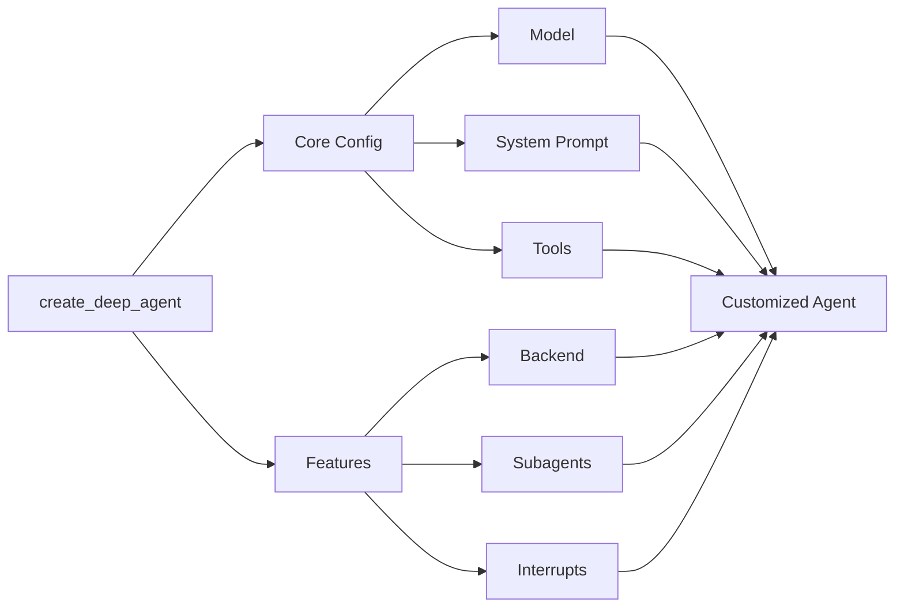

# Deep Agents

> Build agents that can plan, use subagents, and leverage file systems for complex tasks

[`deepagents`](https://www.npmjs.com/package/deepagents) is a standalone library for building agents that can tackle complex, multi-step tasks. Built on LangGraph and inspired by applications like Claude Code, Deep Research, and Manus, deep agents come with planning capabilities, file systems for context management, and the ability to spawn subagents.

## When to use deep agents

Use deep agents when you need agents that can:

* **Handle complex, multi-step tasks** that require planning and decomposition
* **Manage large amounts of context** through file system tools
* **Delegate work** to specialized subagents for context isolation
* **Persist memory** across conversations and threads

For simpler use cases, consider using LangChain's [`createAgent`](docs/langchain/agents) or building a custom [LangGraph](docs/langgraph/overview) workflow.

## Core capabilities

  - Deep agents include a built-in `write_todos` tool that enables agents to break down complex tasks into discrete steps, track progress, and adapt plans as new information emerges.

  - File system tools (`ls`, `read_file`, `write_file`, `edit_file`) allow agents to offload large context to memory, preventing context window overflow and enabling work with variable-length tool results.

  - A built-in `task` tool enables agents to spawn specialized subagents for context isolation. This keeps the main agent's context clean while still going deep on specific subtasks.

  - Extend agents with persistent memory across threads using LangGraph's Store. Agents can save and retrieve information from previous conversations.

## Relationship to the LangChain ecosystem

Deep agents is built on top of:

* [LangGraph](docs/langgraph/overview) - Provides the underlying graph execution and state management
* [LangChain](docs/langchain/overview) - Tools and model integrations work seamlessly with deep agents

## Quickstart

> Build your first deep agent in minutes

This guide walks you through creating your first deep agent with planning, file system tools, and subagent capabilities. You'll build a research agent that can conduct research and write reports.

### Prerequisites

Before you begin, make sure you have an API key from a model provider (e.g., Anthropic, OpenAI).

#### Step 1: Install dependencies

<CodeGroup>
  ```bash npm theme={null}
  npm install deepagents @langchain/tavily
  ```

  ```bash yarn theme={null}
  yarn add deepagents @langchain/tavily
  ```

  ```bash pnpm theme={null}
  pnpm add deepagents @langchain/tavily
  ```
</CodeGroup>

#### Step 2: Set up your API keys

```bash  theme={null}
export ANTHROPIC_API_KEY="your-api-key"
export TAVILY_API_KEY="your-tavily-api-key"
```

#### Step 3: Create a search tool

```typescript  theme={null}
import { tool } from "langchain";
import { TavilySearch } from "@langchain/tavily";
import { z } from "zod";

const internetSearch = tool(
  async ({
    query,
    maxResults = 5,
    topic = "general",
    includeRawContent = false,
  }: {
    query: string;
    maxResults?: number;
    topic?: "general" | "news" | "finance";
    includeRawContent?: boolean;
  }) => {
    const tavilySearch = new TavilySearch({
      maxResults,
      tavilyApiKey: process.env.TAVILY_API_KEY,
      includeRawContent,
      topic,
    });
    return await tavilySearch._call({ query });
  },
  {
    name: "internet_search",
    description: "Run a web search",
    schema: z.object({
      query: z.string().describe("The search query"),
      maxResults: z
        .number()
        .optional()
        .default(5)
        .describe("Maximum number of results to return"),
      topic: z
        .enum(["general", "news", "finance"])
        .optional()
        .default("general")
        .describe("Search topic category"),
      includeRawContent: z
        .boolean()
        .optional()
        .default(false)
        .describe("Whether to include raw content"),
    }),
  },
);
```

#### Step 4: Create a deep agent

```typescript  theme={null}
import { createDeepAgent } from "deepagents";

// System prompt to steer the agent to be an expert researcher
const researchInstructions = `You are an expert researcher. Your job is to conduct thorough research and then write a polished report.

You have access to an internet search tool as your primary means of gathering information.

## \`internet_search\`

Use this to run an internet search for a given query. You can specify the max number of results to return, the topic, and whether raw content should be included.
`;

const agent = createDeepAgent({
  tools: [internetSearch],
  systemPrompt: researchInstructions,
});
```

#### Step 5: Run the agent

```typescript  theme={null}
const result = await agent.invoke({
  messages: [{ role: "user", content: "What is langgraph?" }],
});

// Print the agent's response
console.log(result.messages[result.messages.length - 1].content);
```

### What happened?

Your deep agent automatically:

1. **Planned its approach**: Used the built-in `write_todos` tool to break down the research task
2. **Conducted research**: Called the `internet_search` tool to gather information
3. **Managed context**: Used file system tools (`write_file`, `read_file`) to offload large search results
4. **Spawned subagents** (if needed): Delegated complex subtasks to specialized subagents
5. **Synthesized a report**: Compiled findings into a coherent response

### Next steps

Now that you've built your first deep agent:

* **Customize your agent**: Learn about [customization options] including custom system prompts, tools, and subagents.
* **Understand middleware**: Dive into the [middleware architecture](docs/deepagents/core-capabilities/deepagent-middleware) that powers deep agents.
* **Add long-term memory**: Enable [persistent memory](/oss/javascript/deepagents/core-capabilities/long-term-memory) across conversations.

---

## Customize Deep Agents

> Learn how to customize deep agents with system prompts, tools, subagents, and more



### Model

By default, `deepagents` uses [`claude-sonnet-4-5-20250929`](https://platform.claude.com/docs/en/about-claude/models/overview). You can customize the model used by passing any supported <Tooltip tip="A string that follows the format `provider:model` (e.g. openai:gpt-5)" cta="See mappings" href="https://reference.langchain.com/python/langchain/models/#langchain.chat_models.init_chat_model(model)">model identifier string</Tooltip> or [LangChain model object](docs/integrations/chat).

```typescript  theme={null}
import { ChatAnthropic } from "@langchain/anthropic";
import { ChatOpenAI } from "@langchain/openai";
import { createDeepAgent } from "deepagents";

// Using Anthropic
const agent = createDeepAgent({
  model: new ChatAnthropic({
    model: "claude-sonnet-4-20250514",
    temperature: 0,
  }),
});

// Using OpenAI
const agent2 = createDeepAgent({
  model: new ChatOpenAI({
    model: "gpt-5",
    temperature: 0,
  }),
});
```

### System prompt

Deep agents come with a built-in system prompt inspired by Claude Code's system prompt. The default system prompt contains detailed instructions for using the built-in planning tool, file system tools, and subagents.

Each deep agent tailored to a use case should include a custom system prompt specific to that use case.

```typescript  theme={null}
import { createDeepAgent } from "deepagents";

const researchInstructions = `You are an expert researcher. Your job is to conduct thorough research, and then write a polished report.`;

const agent = createDeepAgent({
  systemPrompt: researchInstructions,
});
```

### Tools

Just like tool-calling agents, a deep agent gets a set of top level tools that it has access to.

```typescript  theme={null}
import { tool } from "langchain";
import { TavilySearch } from "@langchain/tavily";
import { createDeepAgent } from "deepagents";
import { z } from "zod";

const internetSearch = tool(
  async ({
    query,
    maxResults = 5,
    topic = "general",
    includeRawContent = false,
  }: {
    query: string;
    maxResults?: number;
    topic?: "general" | "news" | "finance";
    includeRawContent?: boolean;
  }) => {
    const tavilySearch = new TavilySearch({
      maxResults,
      tavilyApiKey: process.env.TAVILY_API_KEY,
      includeRawContent,
      topic,
    });
    return await tavilySearch._call({ query });
  },
  {
    name: "internet_search",
    description: "Run a web search",
    schema: z.object({
      query: z.string().describe("The search query"),
      maxResults: z.number().optional().default(5),
      topic: z
        .enum(["general", "news", "finance"])
        .optional()
        .default("general"),
      includeRawContent: z.boolean().optional().default(false),
    }),
  },
);

const agent = createDeepAgent({
  tools: [internetSearch],
});
```

In addition to any tools that you provide, deep agents also get access to a number of default tools:

* `write_todos` – Update the agent's to-do list
* `ls` – List all files in the agent's filesystem
* `read_file` – Read a file from the agent's filesystem
* `write_file` – Write a new file in the agent's filesystem
* `edit_file` – Edit an existing file in the agent's filesystem
* `task` – Spawn a subagent to handle a specific task

---
