# CollarAgent Architecture Design Catalog

Welcome to the **CollarAgent Design Catalog**. This document serves as the master navigation hub and comprehensive architectural blueprint for the CollarAgent platform.

It is structured following the **C4 Level Architecture Model** (Context, Containers, Components, and Code/Dynamics), paired with **EventStorming domain workflows**, **inlined Mermaid visual specifications**, and formal **Architecture Decision Records (ADRs)**.

---

## Catalog Navigation Map

```
docs/design-catalog/
├── README.md                     # Master navigation hub with all embedded Mermaid diagrams
├── requirements.md               # Functional & non-functional requirements + constraints
├── api-requirements.md           # Formal API specifications (REST, WebSocket, IPC, Tool Calling)
├── core-engine-wiring.md         # Subsystem architectural wiring (Canvas, Editor, Agent Runtime)
├── c1-context/                   # Level 1: System Context
│   ├── context.mmd               # C1 System Context Diagram
│   └── big-picture-events.mmd    # Big-picture EventStorming domain timeline
├── c2-containers/                # Level 2: Container & Deployment Topology
│   ├── containers.mmd            # C2 Container Diagram (deployables, tech stack, protocols)
│   └── deployment.mmd            # Infrastructure / desktop process deployment map
├── c3-components/                # Level 3: Component Architecture (per container)
│   ├── component-main-host.mmd   # Electron Main Host & Process Orchestration
│   ├── component-utility-server.mmd # Storage Daemon & Express API
│   ├── component-renderer-ui.mmd # React 19 / Dockview / Canvas / Editor UI
│   └── component-agent-runtime.mmd # DeepAgent LangGraph Engine & Middleware
├── c4-code/                      # Level 4: Detailed Structural & Dynamic Design
│   ├── data/                     # Entity relationships & state models
│   │   ├── erd.mmd
│   │   ├── state-agent-turn.mmd
│   │   └── state-checkpoint.mmd
│   ├── flows/                    # Runtime sequence & interaction flows
│   │   ├── sequence-agent-chat-flow.mmd
│   │   ├── sequence-checkpoint-restore.mmd
│   │   └── sequence-websocket-canvas-sync.mmd
│   └── processes/                # Critical EventStorming deep dives
│       ├── process-canvas-mutation.mmd
│       ├── process-document-patch.mmd
│       └── process-websocket-state-sync.mmd
└── adrs/                         # Architecture Decision Records
    ├── adr-001-multi-process-electron-utility-daemon.md
    ├── adr-002-sharded-v3-cagent-storage-engine.md
    ├── adr-003-nominal-id-branding-for-graph-entities.md
    ├── adr-004-progressive-disclosure-agent-skills.md
    ├── adr-005-deterministic-inverse-command-rollback.md
    ├── adr-006-large-tool-output-eviction-protocol.md
    ├── adr-007-websocket-staged-proposal-protocol.md
    └── adr-008-hierarchical-leiden-clustering-and-spatial-layout.md
```

> [!NOTE]
> **Evaluation & Telemetry Architecture Catalog**: The deterministic evaluation suite, OpenTelemetry/Langfuse tracing, metrics taxonomy, and evaluation ADRs are organized in a dedicated catalog under [docs/evaluations/](file:///Users/goldenfung/Documents/collaragent/docs/evaluations/README.md).

---

## 1. Requirements & Core Subsystem Specifications

- **System Requirements & Constraints**: Refer to [requirements.md](file:///Users/goldenfung/Documents/collaragent/docs/design-catalog/requirements.md) for functional requirements, quality attributes, and architectural constraints.
- **API & Protocol Specifications**: Refer to [api-requirements.md](file:///Users/goldenfung/Documents/collaragent/docs/design-catalog/api-requirements.md) for REST endpoints, WebSocket message taxonomy, Electron IPC contracts, and Workspace Tool schemas.
- **Core Engine Subsystem Wiring**: Refer to [core-engine-wiring.md](file:///Users/goldenfung/Documents/collaragent/docs/design-catalog/core-engine-wiring.md) for detailed end-to-end wiring, sequence flows, block identity weakmaps, and staging proposal mechanics connecting Graph Canvas, Document Editor, and ReAct Agent Tool Calling.
- **Evaluation & Telemetry Catalog**: Refer to [docs/evaluations/README.md](file:///Users/goldenfung/Documents/collaragent/docs/evaluations/README.md) for the evaluation harness and telemetry architecture.

---

## 2. Level 1: System Context (C1)

The **System Context** establishes the boundaries of CollarAgent, the primary human users, and external integrations with cloud LLMs, MCP servers, and local storage.

### 2.1 System Context Diagram

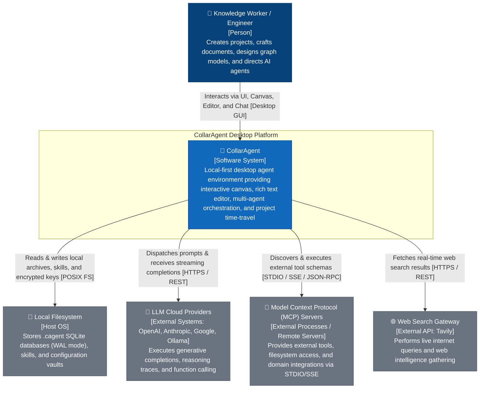

### 2.2 Big-Picture Domain EventStorming

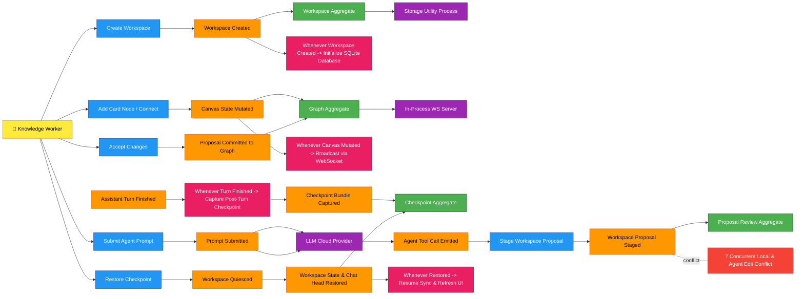

---

## 3. Level 2: Containers (C2)

The **Container** diagram decomposes the system into separately runnable processes and stores, defining explicit network and IPC protocols.

### 3.1 Container Topology Diagram

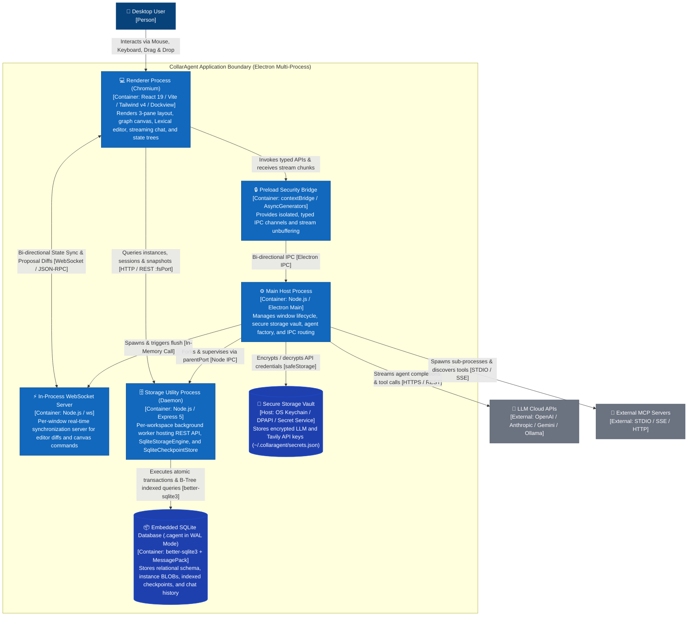

### 3.2 Desktop Process Deployment Topology

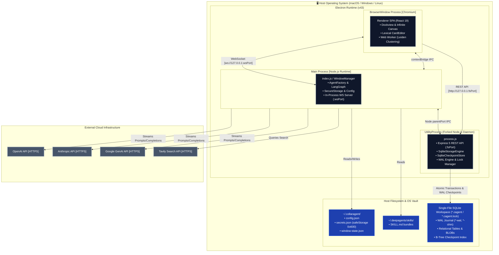

---

## 4. Level 3: Components (C3)

### 4.1 Electron Main Host Process (`src/main`)

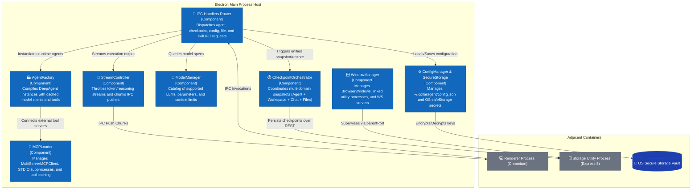

---

### 4.2 Storage Utility Daemon Process (`src/main/server/fileServer`)

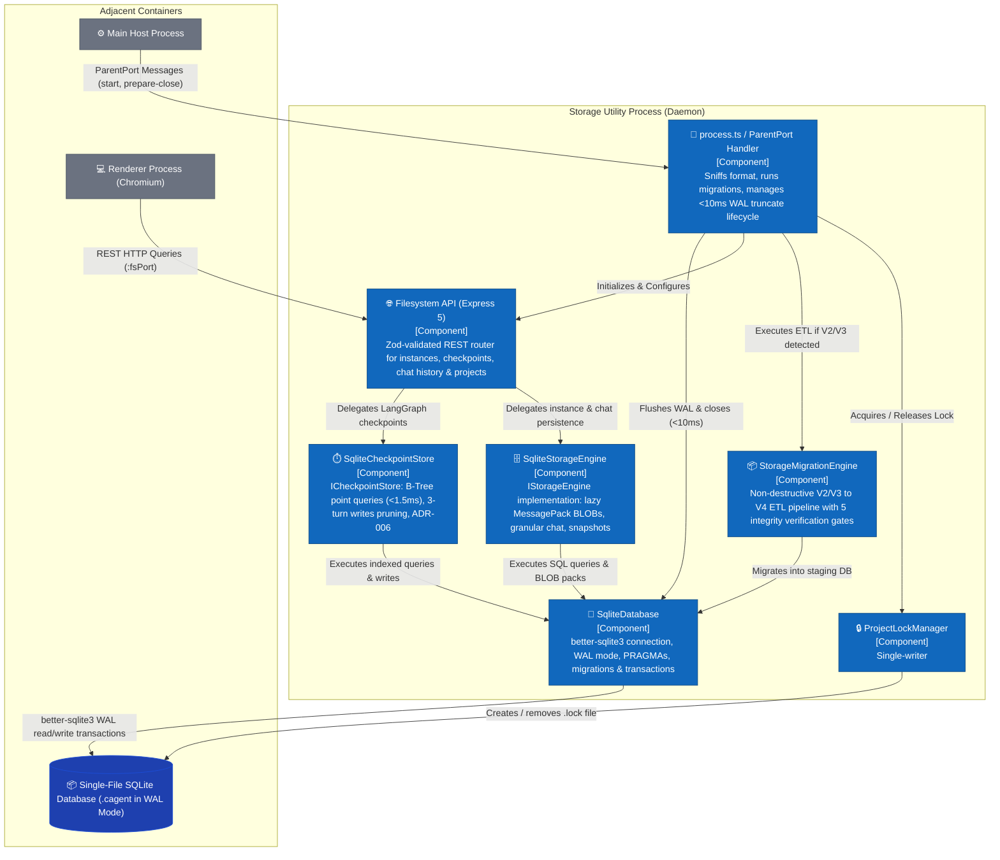

---

### 4.3 Renderer UI & Workspace Engine (`src/renderer` & `src/workspace`)

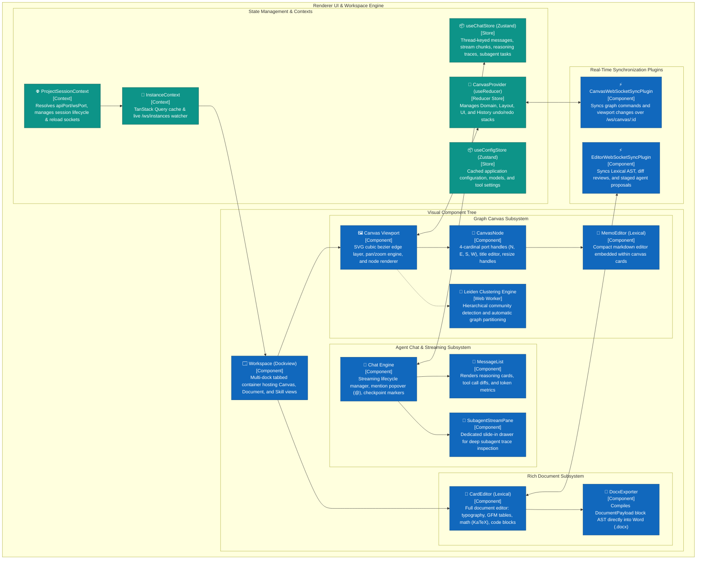

---

### 4.4 Agent Runtime & Tooling Architecture (`src/collaragent`)

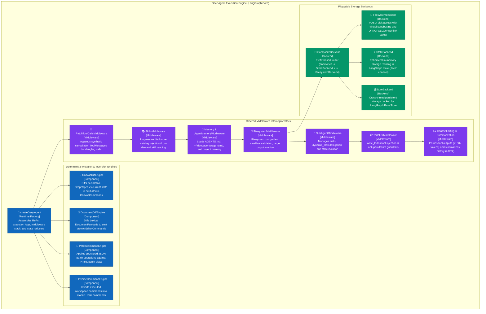

---

## 5. Level 4: Code & Detailed Dynamics (C4)

### 5.1 Data Model (ERD)

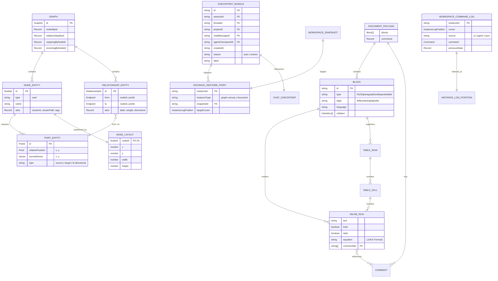

---

### 5.2 State Transitions

#### A. Agent Turn State Machine

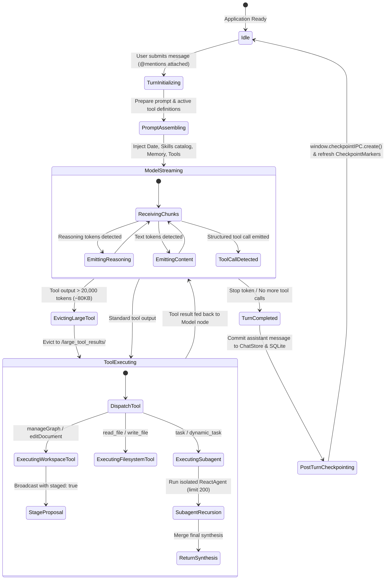

#### B. Checkpoint & Time-Travel State Machine

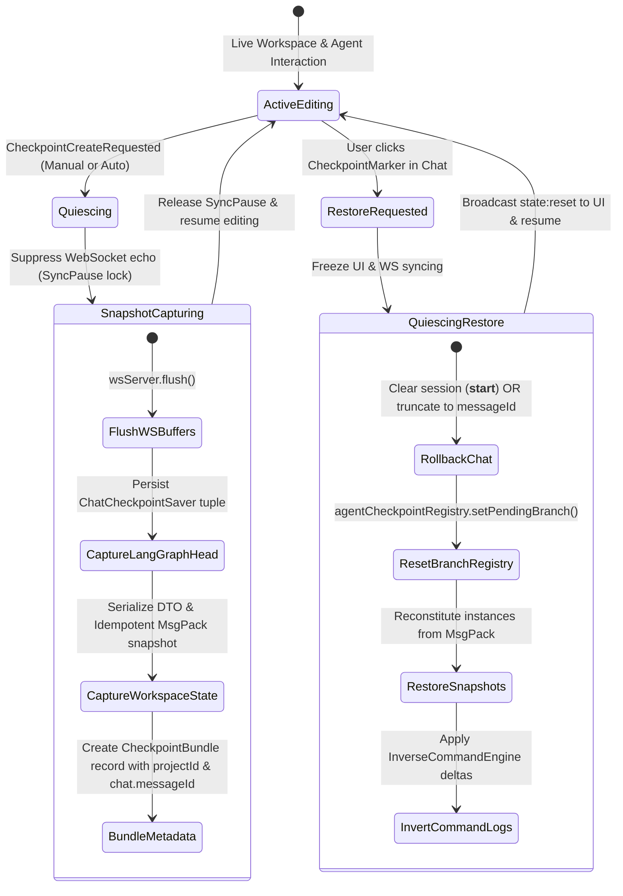

---

### 5.3 Runtime Interaction Sequences

#### Sequence 1: Agent Chat Turn & Staged Proposal Review

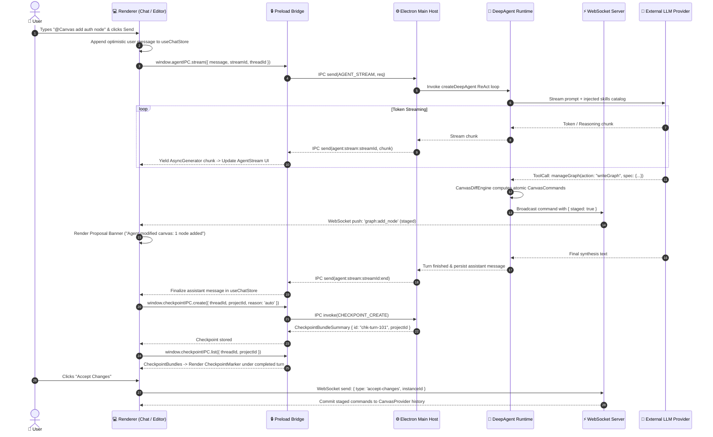

#### Sequence 2: Multi-Domain Point-in-Time Checkpoint Restore

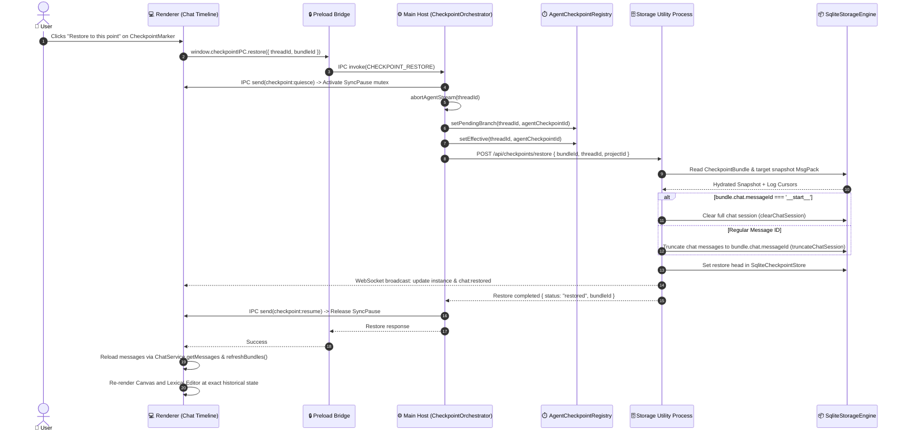

#### Sequence 3: WebSocket Canvas Synchronization & Staged Proposal Review

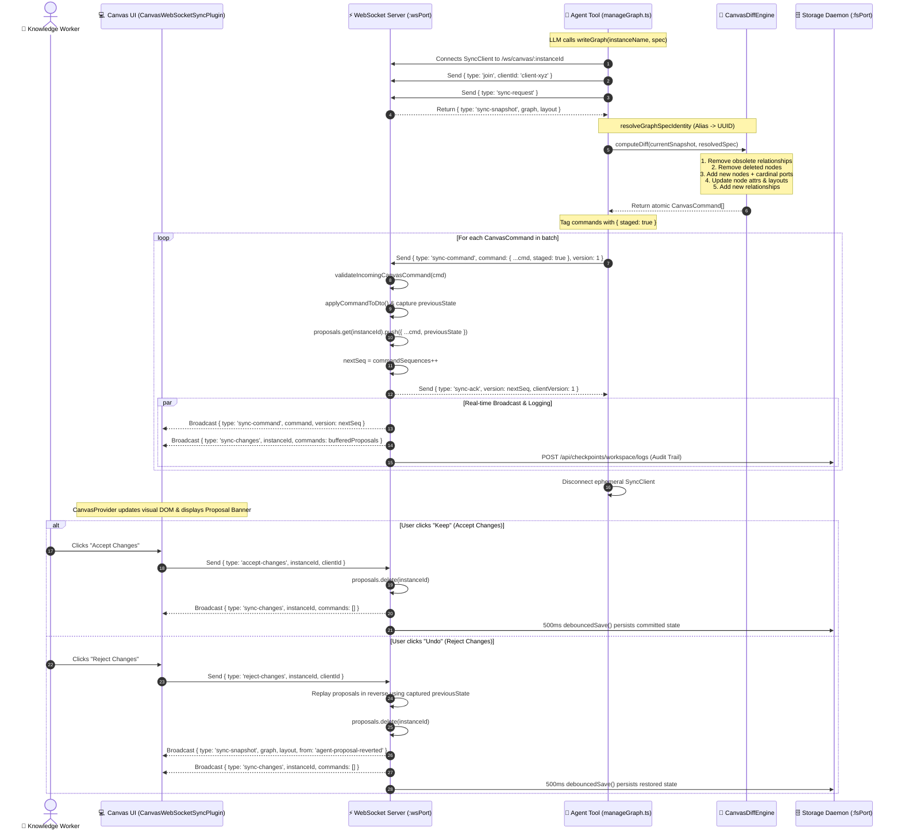

---

### 5.4 Critical Process Deep Dives

#### Process 1: Canvas Graph Spec Diffing & Execution

```mermaid
flowchart LR
    %% Process EventStorming Styling
    classDef event fill:#ff9800,stroke:#e65100,color:#000
    classDef command fill:#2196f3,stroke:#0d47a1,color:#fff
    classDef actor fill:#ffeb3b,stroke:#f57f17,color:#000
    classDef system fill:#9c27b0,stroke:#4a148c,color:#fff
    classDef aggregate fill:#4caf50,stroke:#1b5e20,color:#fff
    classDef policy fill:#e91e63,stroke:#880e4f,color:#fff
    classDef hotspot fill:#f44336,stroke:#b71c1c,color:#fff

    Agent[🤖 DeepAgent ReAct Loop]:::actor

    CmdWriteGraph[Command: writeGraph<br/>spec: WriteGraphSpec]:::command
    EvtSpecReceived[Event: GraphSpec Received]:::event
    AggDiffEngine[Aggregate: CanvasDiffEngine]:::aggregate

    PolDiff[Policy: Whenever Spec Received -> Diff vs CanvasSnapshot & Order Commands]:::policy

    EvtCmdsGenerated[Event: Atomic CanvasCommands Generated<br/>1. Remove links<br/>2. Remove nodes<br/>3. Add nodes<br/>4. Update attrs/layout<br/>5. Add links]:::event

    CmdBroadcastStaged[Command: Broadcast Staged Commands]:::command
    SysWS[System: In-Process WS Server]:::system
    EvtStagedOnUI[Event: Proposal Banner Displayed in UI]:::event

    User[👤 Knowledge Worker]:::actor
    CmdAccept[Command: Accept Changes]:::command
    EvtCommitted[Event: Changes Committed to History Stack]:::event
    AggGraph[Aggregate: Graph Aggregate]:::aggregate

    Agent --> CmdWriteGraph
    CmdWriteGraph --> EvtSpecReceived
    EvtSpecReceived --> PolDiff
    PolDiff --> AggDiffEngine
    AggDiffEngine --> EvtCmdsGenerated
    EvtCmdsGenerated --> CmdBroadcastStaged
    CmdBroadcastStaged --> SysWS
    SysWS --> EvtStagedOnUI

    User --> CmdAccept
    CmdAccept --> EvtCommitted
    EvtCommitted --> AggGraph
```

#### Process 2: Document JSON Patching & Inline Review

```mermaid
flowchart LR
    %% Process EventStorming Styling
    classDef event fill:#ff9800,stroke:#e65100,color:#000
    classDef command fill:#2196f3,stroke:#0d47a1,color:#fff
    classDef actor fill:#ffeb3b,stroke:#f57f17,color:#000
    classDef system fill:#9c27b0,stroke:#4a148c,color:#fff
    classDef aggregate fill:#4caf50,stroke:#1b5e20,color:#fff
    classDef policy fill:#e91e63,stroke:#880e4f,color:#fff
    classDef hotspot fill:#f44336,stroke:#b71c1c,color:#fff

    Agent[🤖 DeepAgent ReAct Loop]:::actor

    CmdEditDoc[Command: editDocument<br/>operations: JSONPatch[]]:::command
    EvtPatchReceived[Event: Document Patch Received]:::event
    AggPatchEngine[Aggregate: PatchCommandEngine]:::aggregate

    PolValidate[Policy: Whenever Patch Received -> Validate Block Existence & Compute Diffs]:::policy

    EvtEditorCmds[Event: Atomic EditorCommands Emitted<br/>• editor:update_block<br/>• editor:insert_block<br/>• editor:remove_block]:::event

    CmdStagedWS[Command: Stage Over WebSocket /ws/editor/:id]:::command
    SysWS[System: WebSocket Sync Engine]:::system
    EvtDiffView[Event: Visual Inline Diff Rendered in Lexical]:::event

    User[👤 Knowledge Worker]:::actor
    CmdReview[Command: Review & Commit Proposal]:::command
    EvtDocUpdated[Event: Document AST Updated & Persisted]:::event
    AggDoc[Aggregate: Document Payload Aggregate]:::aggregate

    Agent --> CmdEditDoc
    CmdEditDoc --> EvtPatchReceived
    EvtPatchReceived --> PolValidate
    PolValidate --> AggPatchEngine
    AggPatchEngine --> EvtEditorCmds
    EvtEditorCmds --> CmdStagedWS
    CmdStagedWS --> SysWS
    SysWS --> EvtDiffView

    User --> CmdReview
    CmdReview --> EvtDocUpdated
    EvtDocUpdated --> AggDoc
```

#### Process 3: WebSocket Real-Time State Sync & Staged Proposal Review

```mermaid
flowchart LR
    %% Process EventStorming Styling
    classDef event fill:#ff9800,stroke:#e65100,color:#000
    classDef command fill:#2196f3,stroke:#0d47a1,color:#fff
    classDef actor fill:#ffeb3b,stroke:#f57f17,color:#000
    classDef system fill:#9c27b0,stroke:#4a148c,color:#fff
    classDef aggregate fill:#4caf50,stroke:#1b5e20,color:#fff
    classDef policy fill:#e91e63,stroke:#880e4f,color:#fff
    classDef hotspot fill:#f44336,stroke:#b71c1c,color:#fff

    Agent[🤖 Agent Tool / Client]:::actor

    CmdSyncCmd[Command: sync-command<br/>{ command, staged: true, clientId }]:::command
    EvtCmdReceived[Event: Staged Command Received]:::event
    AggWSServer[Aggregate: WsServer In-Memory DTO]:::aggregate

    PolValidate[Policy: Whenever sync-command received -> validateCanonicalNodeId & applyCommandToDto]:::policy

    EvtStateMutated[Event: DTO Mutated & previousState Captured]:::event
    EvtBuffered[Event: Command Buffered in proposals Map]:::event

    CmdBroadcast[Command: Broadcast sync-command & sync-changes]:::command
    SysWSChannel[System: /ws/canvas/:instanceId Channel]:::system

    EvtUIReflected[Event: UI Renders New Nodes & Shows Proposal Banner]:::event
    User[👤 Knowledge Worker]:::actor

    CmdDecision[Command: accept-changes OR reject-changes]:::command
    PolResolve[Policy: If accept -> clear buffer & save; If reject -> revert via previousState & broadcast snapshot]:::policy
    EvtFinalized[Event: Workspace State Finalized & Persisted to Disk]:::event

    Agent --> CmdSyncCmd
    CmdSyncCmd --> EvtCmdReceived
    EvtCmdReceived --> PolValidate
    PolValidate --> AggWSServer
    AggWSServer --> EvtStateMutated
    EvtStateMutated --> EvtBuffered
    EvtBuffered --> CmdBroadcast
    CmdBroadcast --> SysWSChannel
    SysWSChannel --> EvtUIReflected
    User --> CmdDecision
    CmdDecision --> PolResolve
    PolResolve --> EvtFinalized
```

---

## 6. Architecture Decision Records (ADRs)

| ADR                                                                                                                                             | Title                                                                                              | Decision & Key Rationale                                                                                                                                                                                                                                             |
| ----------------------------------------------------------------------------------------------------------------------------------------------- | -------------------------------------------------------------------------------------------------- | -------------------------------------------------------------------------------------------------------------------------------------------------------------------------------------------------------------------------------------------------------------------- |
| [ADR-001](file:///Users/goldenfung/Documents/collaragent/docs/design-catalog/adrs/adr-001-multi-process-electron-utility-daemon.md)             | **Multi-Process Electron Host with Forked Utility Daemons**                                        | Fork heavy project file I/O, compression, and Express REST server into independent `UtilityProcess` instances to keep the Main process and UI rendering at 60 FPS.                                                                                                   |
| [ADR-002](file:///Users/goldenfung/Documents/collaragent/docs/design-catalog/adrs/adr-002-sharded-v3-cagent-storage-engine.md)                  | **Sharded V3 Storage Engine (Superseded by V4 SQLite Engine)**                                     | Historical V3 sharded layout (`manifest.json`, `instances/*.json`, `snapshots/*.msgpack`). Superseded by V4 single-file SQLite database with WAL journaling and B-Tree indexing.                                                                                     |
| [ADR-003](file:///Users/goldenfung/Documents/collaragent/docs/design-catalog/adrs/adr-003-nominal-id-branding-for-graph-entities.md)            | **Nominal ID Branding for Graph Entities**                                                         | Brand `NodeId`, `RelationshipId`, `PortId`, and `GraphId` nominal types to eliminate accidental identifier cross-assignment bugs at compile time.                                                                                                                    |
| [ADR-004](file:///Users/goldenfung/Documents/collaragent/docs/design-catalog/adrs/adr-004-progressive-disclosure-agent-skills.md)               | **Progressive Disclosure Architecture for Agent Skills**                                           | Inject only a compact YAML frontmatter catalog into system prompts; agent loads complete `SKILL.md` files on-demand via `read_file`, cutting token overhead by ~85%.                                                                                                 |
| [ADR-005](file:///Users/goldenfung/Documents/collaragent/docs/design-catalog/adrs/adr-005-deterministic-inverse-command-rollback.md)            | **Deterministic Inverse Command Rollback Engine**                                                  | Capture `previousState` on every mutation to mathematically compute inverse commands, powering unified Undo/Redo, proposal rejection, and checkpoint restoration.                                                                                                    |
| [ADR-006](file:///Users/goldenfung/Documents/collaragent/docs/design-catalog/adrs/adr-006-large-tool-output-eviction-protocol.md)               | **Large Tool Output Eviction Protocol**                                                            | Automatically evict tool results exceeding 20,000 tokens to `/large_tool_results/` and replace prompt messages with truncated previews to prevent LLM context exhaustion.                                                                                            |
| [ADR-007](file:///Users/goldenfung/Documents/collaragent/docs/design-catalog/adrs/adr-007-websocket-staged-proposal-protocol.md)                | **WebSocket Real-Time Synchronization & Staged Proposal Protocol**                                 | Stream real-time canvas mutations over dedicated WebSocket channels with `staged: true` buffering, monotonic sequence acks, and one-click accept/revert capabilities.                                                                                                |
| [ADR-008](file:///Users/goldenfung/Documents/collaragent/docs/design-catalog/adrs/adr-008-hierarchical-leiden-clustering-and-spatial-layout.md) | **Hierarchical Leiden Community Detection, Derived Group Enclosures, and Two-Tier Spatial Layout** | Adopt Option A (derived cluster layer in `node.attrs`) with a two-tier spatial layout engine (intra-cluster Dagre/grid + inter-cluster shelf-packing), off-thread WebWorker delta patching for concurrency safety, and granular transactional WebSocket persistence. |

---

## 7. Architectural Checklist & Quality Verification

- [x] **C1 System Context**: Documented personas, primary system boundaries, and external cloud/MCP integrations.
- [x] **C2 Containers**: Defined deployable processes (`Main Host`, `UtilityProcess`, `Chromium Renderer`, `WebSocket Server`) with explicit network protocols (`[IPC]`, `[WebSocket]`, `[REST/HTTP]`, `[STDIO/SSE]`).
- [x] **C3 Components**: Decomposed Main host orchestrators, storage utility daemons, renderer UI tree, and DeepAgent LangGraph middleware pipelines.
- [x] **C4 Code & Dynamics**: Formalized domain ERD schemas, state machines, sequence diagrams, and process EventStorming flows.
- [x] **Standardized Design Catalog**: All assets generated under `docs/design-catalog/` adhering to the standard hierarchy.
