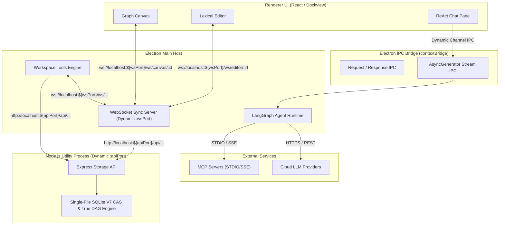
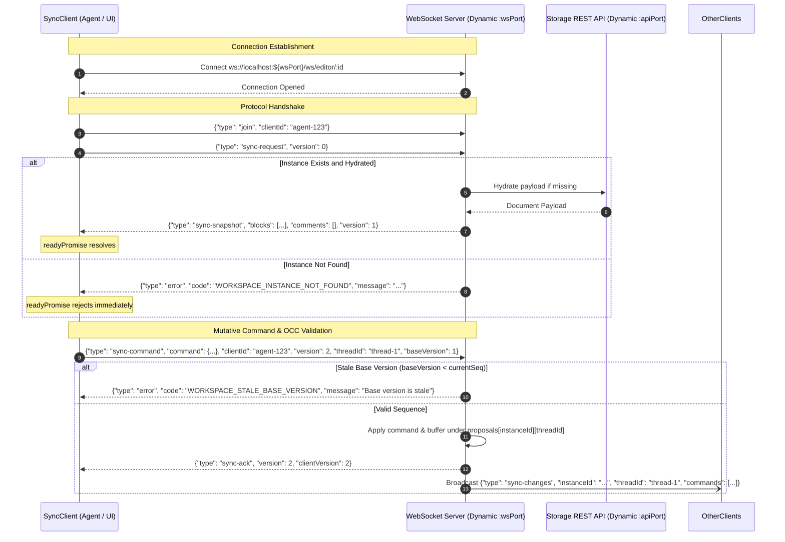

# CollarAgent API Requirements & Interface Specifications

This document defines the formal API requirements, communication protocols, request/response payload schemas, error taxonomies, and interface contracts for all subsystems in the CollarAgent platform.

---

## 1. System Communication Taxonomy

CollarAgent uses four specialized communication channels tailored to specific latency, durability, and execution requirements:



| Layer                    | Transport / Protocol               | Port / Endpoint                                              | Primary Responsibility                                                                      |
| ------------------------ | ---------------------------------- | ------------------------------------------------------------ | ------------------------------------------------------------------------------------------- |
| **Storage REST API**     | HTTP 1.1 / JSON                    | `http://127.0.0.1:${apiPort}/api/*` (Dynamic ephemeral port) | Instance discovery, project management, binary export, checkpoint restoration               |
| **Realtime Sync API**    | WebSocket / JSON                   | `ws://127.0.0.1:${wsPort}/ws/*` (Dynamic ephemeral port)     | Realtime state synchronization, staged proposals, collaborative mutation, command inversion |
| **Electron Desktop IPC** | Electron `ipcRenderer` / `ipcMain` | Dynamic channels                                             | Chat invocation, token stream unbuffering, native dialogs, hardware key encryption          |
| **Agent Tool Calling**   | TypeScript In-Process Functions    | `WorkspaceTools.ts`                                          | Programmatic manipulation of workspace documents, graph nodes, and files                    |

### 1.1 Dynamic Ephemeral Port Allocation & Session Discovery

CollarAgent runs both the Storage REST API and the Realtime WebSocket Sync Server on **dynamically allocated ephemeral ports** rather than fixed static ports:

- **Per-Window Ephemeral Allocation**: On workspace/window initialization (`WindowManager.ts`), the main process forks the storage daemon (`utilityProcess.fork`) and starts `ws-server` by binding to port `0`. The operating system allocates free ephemeral ports on demand, ensuring zero port collisions across multiple open windows, test runners, or concurrent instances.
- **Renderer Discovery via URL Query Parameters**: The allocated ports are passed into the renderer `BrowserWindow` through URL search parameters (`?apiPort=${fsPort}&wsPort=${wsHandle.port}&filePath=${filePath}`).
- **Client Session Context**: The frontend React app (`ProjectSession.tsx`) extracts `apiPort` and `wsPort` from `window.location.search` and exposes them via `InstanceContext` and `ProjectSessionContext`.
- **Agent Tool Execution**: The LangGraph agent runtime and tool executor (`WorkspaceTools.ts`, `ClientConnection.ts`) receive `wsPort` and `apiPort` from the active session context for all workspace operations.

---

## 2. Storage REST API Requirements (`src/main/server/fileServer`)

The Storage REST API runs inside a dedicated Node.js `UtilityProcess` and provides deterministic, schema-validated CRUD operations for workspaces, instances, and checkpoints.

### 2.1 Standard Envelopes & Error Contracts

All REST API responses must adhere to strictly typed JSON envelopes. Arbitrary top-level raw arrays or naked objects without field validation are forbidden.

#### Standard Error Response Envelope

```json
{
  "error": "WORKSPACE_INSTANCE_NOT_FOUND",
  "message": "Instance \"doc-uuid-1\" could not be found in active project.",
  "statusCode": 404,
  "timestamp": "2026-08-30T12:00:00.000Z"
}
```

### 2.2 Endpoint Specifications

#### 1. `GET /api/instances`

Returns a list of all document and canvas instances in the active project.

- **Query Parameters**:
  - `projectId` _(optional, string)_: Filter instances by project ID.
- **Success Response (`200 OK`)**:
  ```json
  {
    "instances": [
      {
        "id": "4a73ec31-6ec6-4f40-9a28-971c66f7d0a1",
        "name": "System Architecture",
        "projectId": "default",
        "type": "document",
        "updatedAt": "2026-08-30T07:15:00.000Z",
        "metadata": {
          "wordCount": 1420
        }
      },
      {
        "id": "9b12cc88-2ff1-4ab3-8e41-018dca44f210",
        "name": "Service Topology Canvas",
        "projectId": "default",
        "type": "canvas",
        "updatedAt": "2026-08-30T07:20:00.000Z",
        "metadata": {
          "nodeCount": 18
        }
      }
    ]
  }
  ```
- **Validation Schema (Zod)**:
  ```typescript
  export const InstancesApiResponseSchema = z.object({
    instances: z.array(
      z.object({
        id: z.string().min(1),
        projectId: z.string().optional(),
        updatedAt: z.string().optional(),
        name: z.string().optional(),
        type: z.enum(['document', 'canvas']).optional(),
        metadata: z.record(z.string(), z.unknown()).optional()
      })
    )
  })
  ```

#### 2. `GET /api/instances/:id`

Retrieves the raw persisted state payload of an individual instance.

- **Path Parameters**:
  - `id` _(string, required)_: The UUID of the instance.
- **Success Response (`200 OK`)**:
  - For Document: `{ "blocks": [...], "comments": [...] }`
  - For Canvas: `{ "type": "graph-canvas", "graph": { "nodes": [...], "edges": [...] }, "layout": { ... } }`
- **Error Responses**:
  - `404 Not Found`: `{ "error": "WORKSPACE_INSTANCE_NOT_FOUND", "message": "..." }`

#### 3. `POST /api/instances`

Creates a new document or canvas instance.

- **Request Body**:
  ```json
  {
    "id": "optional-custom-uuid",
    "name": "New Research Document",
    "projectId": "proj-uuid",
    "type": "document",
    "initialPayload": {
      "blocks": [
        {
          "id": "block-1",
          "type": "paragraph",
          "children": [{ "text": "Initial paragraph content." }]
        }
      ],
      "comments": []
    }
  }
  ```
- **Success Response (`201 Created`)**: `{ "success": true, "instanceId": "...", "createdAt": "..." }`

#### 4. `GET /api/projects`

Lists all workspaces/projects registered in the storage engine.

- **Success Response (`200 OK`)**:
  ```json
  {
    "projects": [
      {
        "id": "default",
        "name": "Default Project",
        "createdAt": "2026-08-01T00:00:00.000Z",
        "updatedAt": "2026-08-30T07:00:00.000Z"
      }
    ]
  }
  ```

#### 5. `POST /api/checkpoints/restore`

Restores the complete project state, instance snapshots, and chat history to a designated checkpoint bundle.

- **Request Body**:
  ```json
  {
    "bundleId": "chk-turn-14-uuid",
    "threadId": "chat-thread-uuid",
    "sessionId": "chat-session-uuid",
    "projectId": "default"
  }
  ```
- **Validation Schema (Zod)**:
  ```typescript
  export const CheckpointRestoreBodySchema = z.object({
    bundleId: z.string().min(1),
    sessionId: z.string().optional(),
    threadId: z.string().optional(),
    projectId: z.string().optional()
  })
  ```
- **Success Response (`200 OK`)**:
  ```json
  {
    "status": "restored",
    "bundleId": "chk-turn-14-uuid",
    "bundle": {
      "id": "chk-turn-14-uuid",
      "sessionId": "chat-session-uuid",
      "threadId": "chat-thread-uuid",
      "projectId": "default",
      "chat": { "messageId": "msg-14", "blockIndex": 0 },
      "instances": []
    }
  }
  ```
- **Behavioral Guarantees**:
  1. **Non-Destructive True DAG Chat Branch Switching**: Checkpoint restore does not destroy or truncate historical messages. Instead, `setActiveBranch(threadId, activeMessageId, activeCheckpointId)` pivots the active pointer of the thread (`active_message_id = bundle.chat.messageId`, `active_checkpoint_id = bundle.id`, or `NULL` for initial start). When rendering the chat timeline, the storage engine executes a recursive Common Table Expression (CTE) traversing from `active_message_id` upward along `parent_message_id`. All messages across alternate branches and abandoned exploratory paths remain permanently preserved in SQLite.
  2. **Fail-Closed CAS Snapshot Hydration**: Target instance snapshots are resolved from CAS `workspace_blobs` via `blob_hash`. If snapshot data cannot be resolved or is null, the restore operation aborts immediately and throws `StorageError(StorageErrorCode.STORAGE_CHECKPOINT_NOT_FOUND)`, ensuring live instances are never overwritten with empty state.
  3. **DAG Lineage & LangGraph Head Synchronization**: Updates `LANGGRAPH_RESTORE_HEADS` and registers `AgentCheckpointRegistry.setPendingBranch()` and `setEffectiveBundleId()` so subsequent agent turns correctly branch in the DAG tree.
  4. **WebSocket OCC Sequence & Proposal Realignment**: Emits a `system-checkpoint-restore` protocol update to the WebSocket server, resetting `commandSequences.set(instanceId, seq)` to the restore point's cursor and purging any pending proposals in `proposals[instanceId]`. Also emits `chat:restored` and `chat:sessionsUpdated`.

#### 6. `POST /api/checkpoints/workspace/snapshots`

Captures an idempotent, two-tier content-addressed binary MessagePack instance snapshot.

- **Request Body**: Raw binary buffer (`application/octet-stream` containing MessagePack-encoded instance payload) or JSON payload with DTO.
- **Query Parameters**:
  - `instanceId` _(required, string)_: Instance UUID.
  - `instanceType` _(required, string)_: `'graph-canvas' | 'document'`.
  - `projectId` _(optional, string)_: Scoped project UUID.
  - `parentSnapshotRef` _(optional, string)_: Previous snapshot reference sha256.
- **Success Response (`200 OK` / `201 Created`)**:
  ```json
  {
    "snapshotId": "snap-uuid-101",
    "snapshotRef": "3a7b9c...sha256.msgpack",
    "blobHash": "3a7b9c...sha256",
    "size": 4096
  }
  ```
- **Two-Tier CAS Architecture & Idempotency Guarantee**: The payload is hashed (SHA-256) and upserted into `workspace_blobs (hash, content_msgpack, byte_size, created_at)`. A pointer record is then inserted into `workspace_snapshots (id, instance_id, project_id, snapshot_ref, snapshot_hash, blob_hash, snapshot_cursor_json)`. If an identical blob exists, the existing record is referenced, preventing data bloat and granting cascade-deletion immunity.

#### 7. `GET /api/checkpoints/bundles` & `PUT /api/checkpoints/bundles`

Lists and stores checkpoint bundles scoped by session, thread, and project with DAG tree lineage.

- **`GET /api/checkpoints/bundles` Query Parameters**:
  - `threadId` _(optional, string)_
  - `sessionId` _(optional, string)_
  - `projectId` _(optional, string)_: Filters bundles to the active project, preventing cross-project metadata pollution.
- **`PUT /api/checkpoints/bundles` Request Body**: Validated `CheckpointBundleSchema` payload including non-linear DAG properties (`parentBundleId?: string` and `branchName?: string`).

---

## 3. Realtime WebSocket Protocol Specifications (`src/main/server/ws`)

The WebSocket server provides bidirectional synchronization between UI clients (Canvas, Editor) and the Agent Tool execution engine.

### 3.1 Connection Handshake & Endpoint Routing

All WebSocket endpoints are served over the dynamically bound `${wsPort}` resolved during workspace initialization (`ws://127.0.0.1:${wsPort}`).

| Route                    | Purpose                        | Message Types Handled                                                                                                        |
| ------------------------ | ------------------------------ | ---------------------------------------------------------------------------------------------------------------------------- |
| `/ws/canvas/:instanceId` | Realtime Graph Canvas Sync     | `join`, `sync-request`, `sync-command`, `sync-ack`, `sync-changes`, `accept-changes`, `reject-changes`, `flush`, `flush-ack` |
| `/ws/editor/:instanceId` | Realtime Document Editor Sync  | `join`, `sync-request`, `sync-command`, `sync-ack`, `sync-changes`, `accept-changes`, `reject-changes`, `flush`, `flush-ack` |
| `/ws/editor-content`     | Legacy Single-Doc Route        | Same as editor route                                                                                                         |
| `/ws/instances`          | Live Instance Registry Watcher | `hello`, `watchInstances`, `instancesSync`                                                                                   |

### 3.2 Protocol Sequence Flow



### 3.3 Protocol Message Taxonomy

#### 1. Client-to-Server Messages

- **`join`**: Declares client identification.
  ```json
  { "type": "join", "clientId": "agent-client-uuid" }
  ```
- **`sync-request`**: Requests the full current state snapshot.
  ```json
  { "type": "sync-request", "version": 0 }
  ```
- **`sync-command`**: Dispatches an incremental mutation command with optional staging, thread isolation, and OCC base sequence.
  ```json
  {
    "type": "sync-command",
    "clientId": "agent-client-uuid",
    "version": 1,
    "threadId": "chat-thread-101",
    "baseVersion": 5,
    "command": {
      "type": "insert-block",
      "staged": true,
      "block": {
        "id": "block-uuid-5",
        "type": "paragraph",
        "children": [{ "text": "Inserted analysis text." }]
      },
      "targetIndex": 2
    }
  }
  ```
- **`accept-changes`**: Approves staged changes proposed by an agent (optionally scoped to a specific thread).
  ```json
  {
    "type": "accept-changes",
    "instanceId": "doc-uuid-1",
    "clientId": "user-client-uuid",
    "threadId": "chat-thread-101"
  }
  ```
- **`reject-changes`**: Rolls back staged changes for the targeted thread via inverse command dispatch.
  ```json
  {
    "type": "reject-changes",
    "instanceId": "doc-uuid-1",
    "clientId": "user-client-uuid",
    "threadId": "chat-thread-101"
  }
  ```
- **`flush`**: Dispatches a transactional read barrier request. The WebSocket server awaits completion of active and coalesced writes via `SerializedDrainQueue` for the specified `instanceId` (or all instances if omitted) and responds with `flush-ack`.
  ```json
  {
    "type": "flush",
    "instanceId": "doc-uuid-1",
    "flushId": "c4d5e6f7-a8b9-4c0d-1e2f-3a4b5c6d7e8f"
  }
  ```

#### 2. Server-to-Client Messages

- **`sync-snapshot`**: Full state dump answering `sync-request`.
  ```json
  {
    "type": "sync-snapshot",
    "version": 1,
    "blocks": [ ... ],
    "comments": [ ... ]
  }
  ```
- **`sync-ack`**: Monotonic sequence confirmation for a submitted command.
  ```json
  { "type": "sync-ack", "version": 2, "clientVersion": 1, "instanceId": "doc-uuid-1" }
  ```
- **`sync-changes`**: Broadcast of applied or staged commands to connected peers with thread isolation metadata.
  ```json
  {
    "type": "sync-changes",
    "instanceId": "doc-uuid-1",
    "threadId": "chat-thread-101",
    "commands": [ ... ]
  }
  ```
- **`flush-ack`**: Transactional read barrier acknowledgment confirming all in-flight persistence writes have settled to SQLite disk.
  ```json
  {
    "type": "flush-ack",
    "flushId": "c4d5e6f7-a8b9-4c0d-1e2f-3a4b5c6d7e8f"
  }
  ```
- **`error`**: Deterministic protocol-level error notification (e.g. OCC conflict, instance not found).
  ```json
  {
    "type": "error",
    "code": "WORKSPACE_STALE_BASE_VERSION",
    "message": "Base version 2 is stale. Current instance sequence is 5."
  }
  ```
- **`system-checkpoint-restore`**: Internal system message dispatched by the Storage Daemon upon point-in-time restoration. Resets `commandSequences.set(instanceId, sequenceNumber ?? 0)` to prevent OCC collisions and evicts uncommitted thread proposals from memory.
  ```json
  {
    "type": "update",
    "instanceId": "doc-uuid-1",
    "payload": { "blocks": [ ... ] },
    "clientId": "system-checkpoint-restore",
    "sequenceNumber": 5
  }
  ```

---

## 4. Electron Desktop IPC Contracts (`src/preload`, `src/main`)

Electron IPC channels use context-isolated `contextBridge` interfaces with strict runtime parameter validation.

### 4.1 IPC Channel Registry

```mermaid
flowchart LR
    Renderer["Renderer Process"]
    Preload["contextBridge Bridge"]
    Main["Main Process"]

    Renderer -->|"window.collarAPI.invokeChat(req)"| Preload
    Preload -->|"ipcRenderer.invoke('workspace:chat', req)"| Main
    Main -->>|"ipcRenderer.send('workspace:chat:stream:chunk', chunk)"| Preload
    Preload -->>|"AsyncGenerator.next()"| Renderer
```

| Channel Name                  | Direction        | Payload Shape                                                      | Description                                                             |
| ----------------------------- | ---------------- | ------------------------------------------------------------------ | ----------------------------------------------------------------------- |
| `workspace:chat`              | Bidirectional    | `{ message: string, threadId: string, modelConfig: ModelConfig }`  | Initiates an agent execution turn                                       |
| `workspace:chat:stream:chunk` | Main -> Renderer | `{ type: 'token' \| 'tool_call' \| 'reasoning', content: string }` | Streams tokens and reasoning traces                                     |
| `app:open-project`            | Renderer -> Main | `{ projectPath?: string }`                                         | Opens native file/directory picker and mounts workspace SQLite database |
| `app:export-project`          | Renderer -> Main | `{ targetZipPath: string }`                                        | Exports/packages workspace database into standalone `.cagent` archive   |
| `settings:save-key`           | Renderer -> Main | `{ provider: string, apiKey: string }`                             | Encrypts API key via OS `safeStorage`                                   |
| `settings:get-keys`           | Renderer -> Main | `void` -> `{ [provider: string]: boolean }`                        | Checks key presence without leaking plaintext                           |

---

## 5. Agent Tool Interface Specifications (`src/collaragent/tools`)

Workspace tools provide the ReAct agent with atomic, deterministic operations over the workspace.

### 5.1 Document Management Tools

#### 1. `readDocument`

Reads the complete block structure, identity mapping, and comments of a document.

- **Input Parameters (Zod)**:
  ```typescript
  export const ReadDocumentInputSchema = z.object({
    instanceName: z.string().describe('The name or UUID of the document to read.'),
    projectName: z.string().optional().describe('Optional project name to disambiguate.')
  })
  ```
- **Return Type (`ReadDocumentResult`)**:
  ```typescript
  export interface ReadDocumentResult {
    status: 'success'
    action: 'Read'
    instanceName: string
    projectName?: string
    editable_blocks: Array<{
      id: string // Persistent UUID (e.g. "b7a2-...")
      html: string // Clean HTML without data-block-id attributes
    }>
    comments: CommentItem[]
  }
  ```
- **Error Invariants**:
  - Throws `WORKSPACE_INSTANCE_NOT_FOUND` if the instance name cannot be resolved.
  - Throws `WORKSPACE_BLOCK_IDENTITY_MISSING` if any block in the payload lacks a valid string `id`.
  - Throws `WORKSPACE_PAYLOAD_INVALID` if the document blocks structure is not an array.

#### 2. `editDocument`

Performs atomic block updates, insertions, or deletions with staged proposal tracking and unified diff generation.

- **Input Parameters (Zod)**:
  ```typescript
  export const EditDocumentInputSchema = z.object({
    instanceName: z.string().describe('Target document name or UUID.'),
    operation: z.enum(['update', 'insert', 'delete']).describe('Edit action.'),
    targetBlockId: z.string().optional().describe('Block ID to update, delete, or anchor against.'),
    anchor: z.enum(['before', 'after']).optional().describe('Anchor position for insert.'),
    newHtml: z.string().optional().describe('HTML string for update or insert.')
  })
  ```
- **Unified Diff Output**:
  Every successful `editDocument` execution returns a structured unified diff:
  ```text
  [diff_block_start]
  @@ -2,3 +2,3 @@
   <p>Original unmodified text.</p>
  -<p>Old paragraph content.</p>
  +<p>Updated paragraph content with revised citations.</p>
   <p>Next paragraph.</p>
  [diff_block_end]
  ```

#### 3. `createDocument`

Creates a brand new document instance with initial HTML content.

- **Input Parameters (Zod)**:
  ```typescript
  export const CreateDocumentInputSchema = z.object({
    name: z.string().describe('Display name of the new document.'),
    content: z.string().optional().describe('Initial HTML or Markdown content.'),
    projectName: z.string().optional().describe('Target project name.')
  })
  ```

### 5.2 Graph Canvas & Spatial Modeling Tools

#### 1. `manageGraph` (`writeGraph` / `writeMindMap`)

Dispatches declarative graph specifications (`WriteGraphSpec`) or mindmap trees to update canvas nodes, directional relationships, and auto-layouts.

- **Input Parameters (Zod)**:
  ```typescript
  export const ManageGraphInputSchema = z.object({
    action: z
      .enum(['writeGraph', 'writeMindMap', 'readGraph'])
      .describe('Graph manipulation action.'),
    instanceName: z.string().describe('Target canvas instance name or UUID.'),
    spec: z
      .record(z.string(), z.unknown())
      .optional()
      .describe('Declarative GraphSpec containing nodes, links, and layout.'),
    staged: z
      .boolean()
      .optional()
      .describe('Whether to buffer as a staged proposal (default: false).')
  })
  ```

### 5.3 LLM Wiki & Knowledge Ledger Tools (`src/collaragent/tools/wiki`)

CollarAgent provides a specialized tool suite for grounded claims, relational triple ledgers, and semantic validation:

| Tool Function      | Description                                                                                                                                                       | Read Barrier Option                                                         |
| ------------------ | ----------------------------------------------------------------------------------------------------------------------------------------------------------------- | --------------------------------------------------------------------------- |
| `loadLedger`       | Retrieves the active relational knowledge ledger triples `(source, predicate, target, claimId)` and entity nodes.                                                 | Supports `flushBeforeRead: true` to guarantee fresh read-after-write state. |
| `compileGraph`     | Compiles wiki document blocks and claims into knowledge graph card nodes and directional edges.                                                                   | Resolves blocks via `BlockIdPlugin` persistent UUIDs.                       |
| `lintWorkspace`    | Executes L1 structural integrity audit (`L1StructuralLinter`) for broken anchors and unreferenced claims, and L2 contradiction audits (`L2ContradictionAuditor`). | Supports `flushBeforeAudit: true` to flush pending mutations before audit.  |
| `ingestSource`     | Ingests external source research into grounded document paragraphs with assigned persistent block IDs.                                                            | Commits blocks to Lexical AST.                                              |
| `queryAndFileBack` | Queries relational triples and grounded claims, returning structured evidence citations for agent reasoning.                                                      | Supports `flushBeforeRead: true`.                                           |

#### Transactional Read Barrier Contract (`WikiAdapterReadOptions`)

```typescript
export interface WikiAdapterReadOptions {
  signal?: AbortSignal
  timeoutMs?: number
  flushBeforeRead?: boolean
}
```

When `flushBeforeRead: true` is passed (or enabled by default in `LiveWikiWorkspaceAdapter`), the adapter executes `await flush(instanceId)` before reading payloads, dispatching `{ type: 'flush', instanceId, flushId }` to the WebSocket server to await disk settlement of in-flight writes.

---

## 6. Error Code Taxonomy & Diagnostic Mapping

CollarAgent enforces a centralized, typed error code taxonomy across all subsystems:

| Subsystem     | Prefix       | Example Code                       | Semantic Meaning & Recovery                                             |
| ------------- | ------------ | ---------------------------------- | ----------------------------------------------------------------------- |
| **Workspace** | `WORKSPACE_` | `WORKSPACE_INSTANCE_NOT_FOUND`     | Document or canvas does not exist. Call `listWorkspaceItems` to verify. |
|               |              | `WORKSPACE_BLOCK_IDENTITY_MISSING` | Block payload is corrupted. Save/normalize document.                    |
|               |              | `WORKSPACE_PAYLOAD_INVALID`        | Payload does not match document or canvas schema.                       |
|               |              | `WORKSPACE_STALE_BASE_VERSION`     | OCC sequence mismatch. Re-fetch current snapshot and retry.             |
| **System**    | `SYS_`       | `SYS_STORAGE_IO_ERROR`             | Disk read/write failure in storage daemon.                              |
|               |              | `SYS_UTILITY_PROCESS_CRASHED`      | Storage background process crashed; respawn required.                   |
| **Agent**     | `AGENT_`     | `AGENT_RECURSION_LIMIT_EXCEEDED`   | Subagent loop exceeded max step count (200).                            |
|               |              | `AGENT_TOOL_CALL_SCHEMA_ERROR`     | LLM generated invalid tool arguments. Retried with feedback.            |
| **Sync**      | `SYNC_`      | `SYNC_HANDSHAKE_TIMEOUT`           | WebSocket handshake failed to complete.                                 |
|               |              | `SYNC_COMMAND_VERSION_MISMATCH`    | Sequence version mismatch. Client re-requests snapshot.                 |
|               |              | `SYNC_DRAIN_ABORTED`               | Persistence drain or barrier aborted via cancellation token.            |
|               |              | `SYNC_DRAIN_PERSIST_FAILED`        | Single-flight disk persistence exhausted retry attempts.                |
|               |              | `SYNC_DRAIN_BARRIER_TIMEOUT`       | Barrier resolution exceeded configured timeout deadline.                |
|               |              | `SYNC_DRAIN_QUEUE_DISPOSED`        | Drain queue was disposed during active persistence.                     |
|               |              | `SYNC_DRAIN_PAYLOAD_INVALID`       | Payload failed schema validation prior to write.                        |
|               |              | `SYNC_DRAIN_WORKER_FAULTED`        | Drain worker entered unrecoverable fault state.                         |
| **Storage**   | `STORAGE_`   | `STORAGE_CHECKPOINT_NOT_FOUND`     | CAS snapshot blob unresolvable during restore. Fail-closed safeguard.   |
