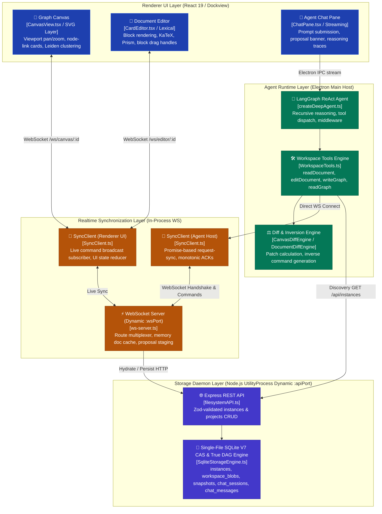
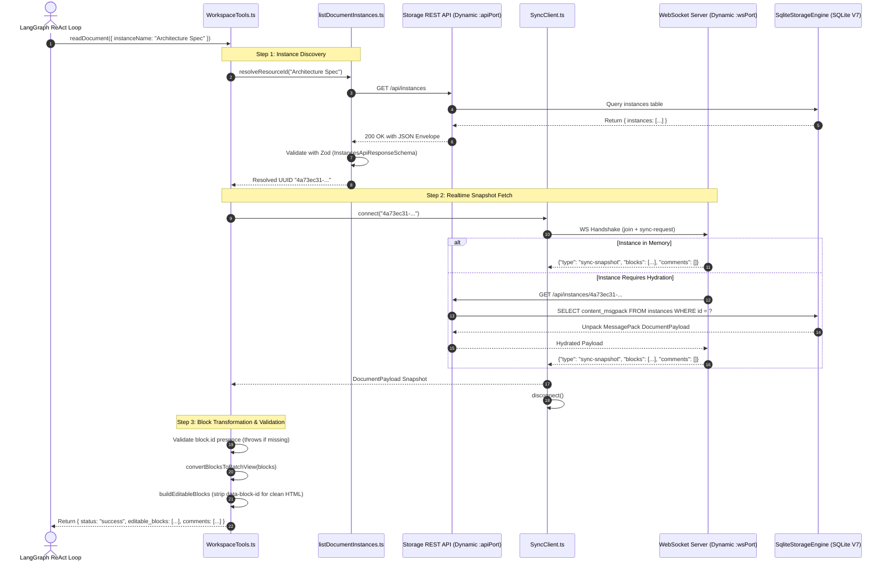

# CollarAgent Core Engine Architecture & Subsystem Wiring

This document provides a deep architectural analysis of the **Core Engine** in CollarAgent, detailing the end-to-end wiring between the **Visual Graph Canvas**, the **Lexical Rich-Text Editor**, the **ReAct Agent Tool Calling Subsystem**, and the **Realtime WebSocket Synchronization Layer**.

---

## 1. Executive Architecture Overview

CollarAgent unifies visual node-link thinking, structured document authoring, and autonomous agent orchestration into a single reactive workspace. The core engine ensures that all three execution surfaces operate on a single source of truth with bidirectional synchronization, non-destructive staged proposals, and mathematical rollback capabilities.



---

## 2. Core Engine Subsystems & Responsibilities

### 2.1 Visual Graph Canvas (`src/workspace/canvas`)

- **Interactive State**: Renders nodes and edges on an infinite canvas with CSS transforms (`scale`, `translate`).
- **Port Generation**: Computes 4-cardinal ports (North, South, East, West) with cubic Bezier curved paths.
- **Embedded Editor Nodes**: Embeds Lexical `MemoEditor` cards within graph nodes, allowing direct rich-text editing inside canvas cards.
- **Automated Layouts**: Coordinates Dagre hierarchical layouts, D3 radial tree projections, and off-thread Leiden community clustering via Web Workers (`leiden.worker.ts`).

### 2.2 Rich-Text Lexical Document Editor (`src/workspace/editor`)

- **Block Identity WeakMap**: Uses `blockIdentityRegistry.ts` to map transient Lexical AST `NodeKey` identifiers to persistent, immutable UUID `blockId` strings.
- **HTML <-> Block Conversions**: `htmlContentConversion.ts` serializes Lexical state into clean semantic HTML without leaking internal Lexical node attributes, while preserving `data-block-id` markers in patch views.
- **Plugin Architecture**: KaTeX math formulas, Prism code blocks, GFM tables, and block drag-and-drop handles for dragging paragraphs directly into the graph canvas.

### 2.3 Agent Tool Calling Engine (`src/collaragent/tools`)

- **Instance Name Resolution**: `resolveResourceId()` dynamically discovers documents and canvases by name or UUID via `listDocumentInstances()`.
- **Block Patch View Transformation**: Converts structured JSON `Block[]` arrays into line-oriented patch views (`<p data-block-id="uuid">...</p>`) for deterministic agent readability and precise targeted editing.
- **Strict Block ID Invariant**: Enforces that all blocks emitted to the agent context contain persistent IDs, throwing `WORKSPACE_BLOCK_IDENTITY_MISSING` if data corruption is detected.
- **Unified Diff Generation**: Automatically calculates and formats standard unified diff blocks (`[diff_block_start]...[diff_block_end]`) on every document mutation.

### 2.4 Realtime WebSocket Synchronization Engine (`src/workspace/sync`, `src/main/server/ws`)

- **Deterministic Handshake**: Enforces fail-fast connection semantics (`readyPromise` with explicit `readyRejecter` handling), eliminating hanging connections and speculative timeouts.
- **Direct Workspace Mutations vs. Staged Proposals**: By default, agent workspace tools (`createDocument`, `editDocument`, `writeGraph`, `writeMindMap`) execute with `staged: false`, committing changes directly into memory and enqueuing an event into `SerializedDrainQueue` (`drainQueue.enqueue()`) to execute a single-flight persistence write to SQLite without temporal debounce delay. When `staged: true` is explicitly passed, changes enter a staged state isolated in `proposals[instanceId][threadId]` memory buffers, prompting an interactive review banner allowing users to `Accept` (commit to SQLite) or `Reject` (apply inverse commands).
- **Monotonic Sequence ACKs**: Assigns increasing integer versions to ensure linear execution ordering and detect stale client state.

### 2.5 Relational Knowledge Ledger & Grounded Claim Engine (`src/workspace/wiki`, `src/workspace/editor`)

- **Block Identity Integration**: `BlockIdPlugin` assigns and preserves immutable UUIDs for Lexical blocks. The relational ledger anchors knowledge triples directly to block IDs via `InlineClaimBadgeNode` elements.
- **Relational Ledger Triple Store**: Maintains the active `RelationalLedgerPayload` (`instances` table with `type = 'ledger'`) tracking entity nodes, predicates, and claim anchors `(source, predicate, target, claimId)`.
- **Epistemological Integrity Linters**: `L1StructuralLinter` validates structural graph integrity and claim references; `L2ContradictionAuditor` evaluates semantic contradictions across document assertions.
- **Deterministic Ledger Rollback**: `InverseLedgerCommand.ts` mathematically generates inverse operations for ledger triples, ensuring exact rollback on proposal rejection.

### 2.6 Event-Driven Serialized Drain Queue & Read Barrier Architecture (`src/workspace/sync/drain`)

- **Single-Flight Serialization**: `InstanceDrainWorker` enforces `Concurrency = 1` per instance ID (`activeDrainPromise`), eliminating concurrent SQLite write lock contention.
- **In-Memory Dirty Coalescing**: Subsequent mutations arriving during an active disk write update the in-memory pending payload and set `isDirty = true` (`COALESCING` state), dispatching the next write immediately upon resolution without timers.
- **Transactional Read Barriers (`flush()`)**: Deferred barrier promises registered by `SerializedDrainQueue.flush()` resolve only when all active and coalesced writes have settled to SQLite, enabling zero-stale-read guarantees for agent tools and tests.
- **Cancellation & Backoff**: Binds directly to `AbortSignal` for graceful teardown; transient errors retry via pure mathematical exponential backoff with full jitter (`BackoffPolicyEngine`).

---

## 3. End-to-End Execution Sequence Flows

### 3.1 Document Read Pipeline Flow

This diagram illustrates how an LLM agent executes the `readDocument` tool to resolve instance names, hydrate document payloads, and receive clean editable block structures:



---

### 3.2 Document Edit & Staged Proposal Pipeline Flow

This diagram illustrates how an LLM agent executes `editDocument`, generates atomic diffs, broadcasts staged proposals to the UI, and handles user acceptance or inverse rollback:

```mermaid
sequenceDiagram
    autonumber
    actor LLM as LangGraph ReAct Loop
    participant Tools as WorkspaceTools.ts
    participant DiffEngine as DocumentDiffEngine
    participant SyncAgent as SyncClient (Agent Host)
    participant WSServer as WebSocket Server
    participant SyncUI as SyncClient (Renderer UI)
    participant UI as Editor UI / Review Banner
    actor User as Knowledge Worker

    LLM->>Tools: editDocument({ instanceName: "Spec", operation: "update", targetBlockId: "blk-2", newHtml: "<p>New text</p>" })

    Tools->>Tools: Fetch current snapshot & baseVersion via SyncClient
    Tools->>DiffEngine: computePatch(currentBlocks, { op: "update", blkId: "blk-2", html: "..." })
    DiffEngine-->>Tools: { patchCommand, inverseCommand, unifiedDiff }

    Note over Tools,WSServer: Dispatch Staged Mutation with Thread Lineage & OCC
    Tools->>SyncAgent: send(patchCommand, { threadId: "thread-101", baseVersion: 3 })
    SyncAgent->>WSServer: {"type": "sync-command", "command": patchCommand, "clientId": "agent-1", "threadId": "thread-101", "baseVersion": 3}
    WSServer->>WSServer: OCC validation (baseVersion >= currentSeq); buffer in proposals[instanceId][threadId]
    WSServer-->>SyncAgent: {"type": "sync-ack", "version": 4}

    WSServer-)SyncUI: Broadcast {"type": "sync-changes", "threadId": "thread-101", "commands": [patchCommand]}
    SyncUI->>UI: Apply patch to Lexical editor view
    UI->>UI: Display Staged Proposal Banner for Thread 101 (Accept / Reject)

    Tools-->>LLM: Return { status: "success", diff: "[diff_block_start]...", message: "Block updated." }

    Note over User,WSServer: User Review Decision (Thread-Scoped)
    alt User Clicks 'Accept'
        User->>UI: Click "Keep Changes"
        UI->>SyncUI: acceptChanges("thread-101")
        SyncUI->>WSServer: {"type": "accept-changes", "instanceId": "doc-uuid", "threadId": "thread-101"}
        WSServer->>WSServer: Commit thread-101 proposals & persist to disk
    else User Clicks 'Reject'
        User->>UI: Click "Undo / Reject"
        UI->>SyncUI: rejectChanges("thread-101")
        SyncUI->>WSServer: {"type": "reject-changes", "instanceId": "doc-uuid", "threadId": "thread-101"}
        WSServer->>WSServer: Apply thread inverse commands & broadcast rollback
        WSServer-)SyncUI: Broadcast rollback changes
        SyncUI->>UI: Restore original Lexical editor state
    end
```

---

### 3.3 Canvas-to-Editor Cross-Wiring & Drag-and-Drop

CollarAgent provides fluid cross-modal interaction between visual graph cards and linear documents:

```mermaid
flowchart LR
    subgraph EditorSubsystem ["Lexical Document Editor"]
        LexicalBlock["Document Block<br/>[<p data-block-id='blk-1'>]"]
        DragHandle["@atlaskit Drag Handle"]
        LexicalBlock --- DragHandle
    end

    subgraph DnDBridge ["Pragmatic Drag-and-Drop Bridge"]
        MIMEPayload["Custom MIME Payload<br/>application/x-collar-block<br/>{ blockId, html, text, sourceDocId }"]
    end

    subgraph CanvasSubsystem ["Visual Graph Canvas"]
        DropTarget["Canvas Surface Drop Target"]
        NewNode["Created Graph Card Node<br/>{ id: uuid, title: 'Excerpt', content: html }"]
        EdgeConnect["Automatic Dependency Edge<br/>[Source Doc -> Canvas Node]"]
    end

    DragHandle -->|"Drag start"| MIMEPayload
    MIMEPayload -->|"Drop on canvas coordinate (x,y)"| DropTarget
    DropTarget -->|"Convert block to node"| NewNode
    NewNode -->|"Optional reference link"| EdgeConnect
```



---

## 4. Invariants & Reliability Principles

To maintain strict determinism and eliminate bugs across the core engine, all components adhere to the following non-negotiable invariants:

1. **Persistent Block Identity**: Block UUIDs are immutable and guaranteed by `blockIdentityRegistry.ts`. Transient UI AST re-renders never modify or reassign existing block IDs.
2. **Deterministic WebSocket Protocol**: Every request sent to the WebSocket server (`join`, `sync-request`, `sync-command`) must deterministically receive a typed response (`sync-snapshot`, `sync-ack`, or `error`). Silent returns or unchecked hangs are forbidden.
3. **Fail-Fast Error Handling**: Network failures, invalid schemas, and corrupted block identities reject promises immediately with structured domain error codes (`WORKSPACE_INSTANCE_NOT_FOUND`, `WORKSPACE_BLOCK_IDENTITY_MISSING`), avoiding arbitrary timeout waits.
4. **Zero-Any TypeScript Discipline**: All inputs, API response envelopes, and protocol messages are validated with runtime Zod schemas and typed without `any` casts.
5. **Reversible Command Inversion**: Every state-mutating command generated by an agent must provide an exact mathematical inverse command, ensuring 100% reliable rollback during user rejection or time-travel checkpoint restoration.
6. **Fail-Closed Checkpoint Integrity**: Checkpoint restoration and snapshot resolution must fail closed with structured error codes (`STORAGE_CHECKPOINT_NOT_FOUND`) if backing CAS blobs are unresolvable, strictly prohibiting destructive in-memory or database overwrites with empty or null state.
7. **Non-Destructive True DAG History**: Chat history branching and checkpoint time travel must not execute destructive row truncation or deletions (`DELETE FROM chat_messages`). Branch switching must pivot active message pointers (`active_message_id`, `active_checkpoint_id`) and reconstruct thread history via recursive Common Table Expressions (CTE), preserving all historical turns and exploration branches.
8. **Self-Contained LangGraph Checkpoint Blobs**: Checkpoint storage must store complete, self-contained tuples matching official LangGraph specifications (`checkpoint_json`, `metadata_json`, `parent_checkpoint_id`). Dynamic state computation across branches must be isolated without version sequence collisions or parent state bleed.
9. **Zero Temporal Timers in Persistence & Sync**: Elimination of arbitrary `setTimeout` debounce delays and sleep calls. All persistence transitions, batching, and flushes must be driven by deterministic lifecycle events (`SerializedDrainQueue`).
10. **Read-After-Write Consistency via Transactional Barriers**: All agent tool queries and workspace audit tools must pass `flushBeforeRead: true` to await disk settlement of in-flight mutations before reading, guaranteeing zero stale reads with zero artificial delay.
