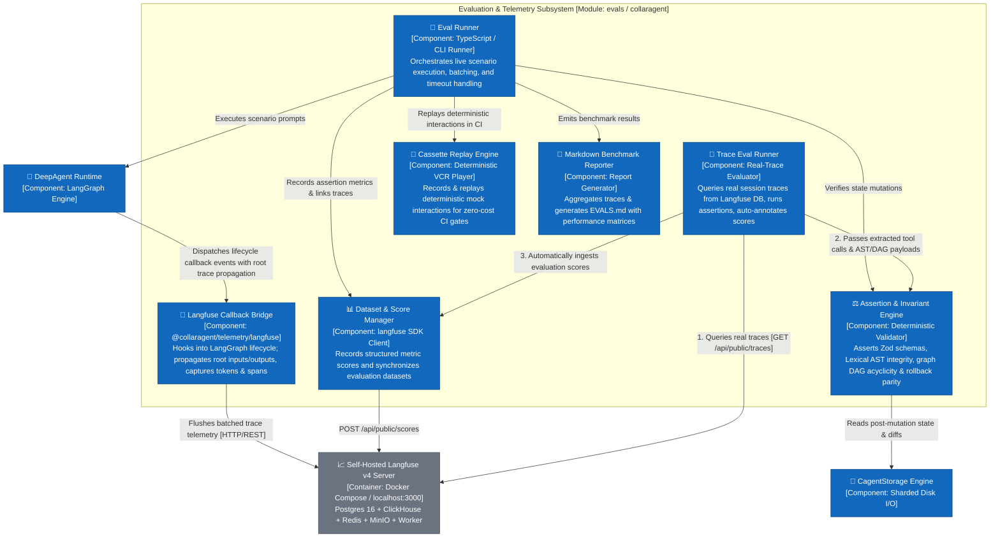
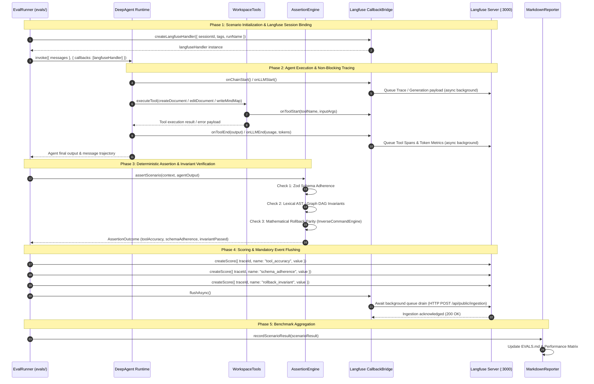
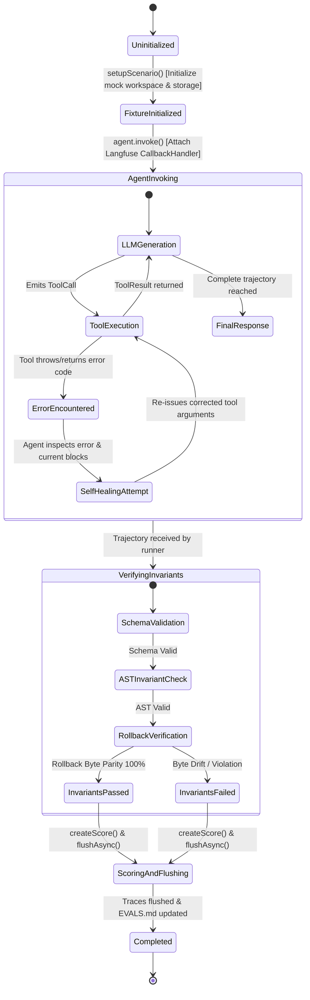

# Agent Evaluation & Telemetry Architecture

Welcome to the **CollarAgent Evaluation & Telemetry Architecture Catalog**. This directory is dedicated to the deterministic evaluation harness, OpenTelemetry/Langfuse tracing infrastructure, quantitative metrics taxonomy, and standardized test scenarios.

---

## Evaluation Catalog Structure

```
docs/evaluations/
├── README.md                         # Master Evaluation Hub & Architecture Overview
├── telemetry-architecture.md         # Langfuse Telemetry, Tracing & Scoring Specification
├── c3-components/
│   └── component-telemetry-eval.mmd  # C3 Level Component Architecture for Evaluation
├── c4-code/
│   ├── data/
│   │   └── state-evaluation-run.mmd  # C4 State Machine for Scenario Execution
│   └── flows/
│       └── sequence-telemetry-eval-flow.mmd # C4 Runtime Telemetry & Scoring Flow
└── adrs/
    └── adr-001-langfuse-telemetry-and-eval-architecture.md # Telemetry & Evaluation ADR
```

---

## 1. System Overview & Mission

The Evaluation and Telemetry Suite serves as the production quality gate and observability backbone for CollarAgent. It provides:

1. **Real-Trace Evaluation & Auto-Annotation**: Programmatic querying of real conversation traces from self-hosted Langfuse DB, verifying Zod schemas, Lexical AST integrity, and Canvas DAG invariants, and automatically writing standardized benchmark scores back to Langfuse.
2. **Deterministic Live & Replay Harness**: Automated test execution measuring tool selection accuracy, schema adherence, autonomous error recovery, and mathematical rollback parity.
3. **Local Open-Source Tracing (Langfuse v4)**: Non-invasive execution DAG tracing, root trace input/output propagation, latency waterfalls (TTFT, step execution times), and token cost profiling via `@langfuse/langchain` and native ingestion handlers.
4. **Automated Benchmark Reporting**: Generates root-level `EVALS.md` reports with cross-model benchmark comparisons.

---

## 2. Component Architecture (C3)



---

## 3. Runtime Telemetry Sequence (C4)



---

## 4. Scenario Execution State Machine (C4)



---

## 5. Architecture Decision Records

| ADR                                                                                                                                 | Title                                                     | Key Decision                                                                                                                                                                 |
| ----------------------------------------------------------------------------------------------------------------------------------- | --------------------------------------------------------- | ---------------------------------------------------------------------------------------------------------------------------------------------------------------------------- |
| [ADR-001](file:///Users/goldenfung/Documents/collaragent/docs/evaluations/adrs/adr-001-langfuse-telemetry-and-eval-architecture.md) | **Langfuse Telemetry, Tracing & Evaluation Architecture** | Non-invasively trace LangGraph execution DAGs with `@langfuse/langchain`, log deterministic assertion scores to datasets, and profile latency/costs on self-hosted Langfuse. |
