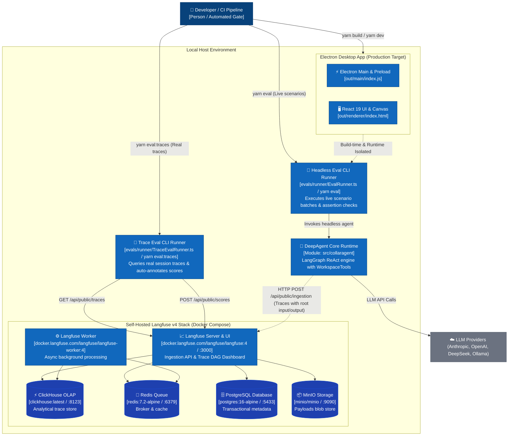
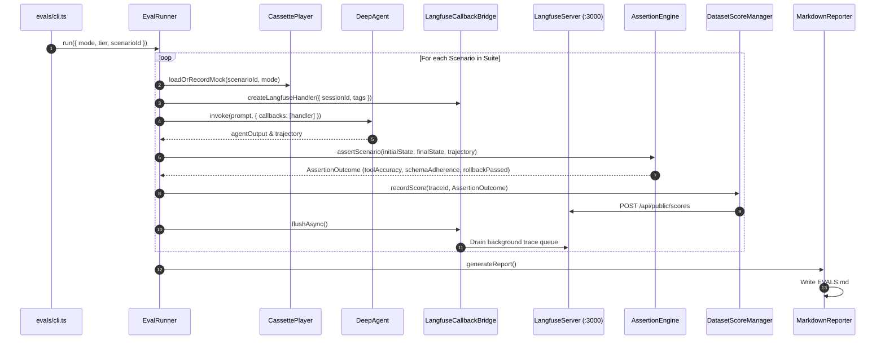

# Technical Specification: Langfuse Observability, Telemetry & Evaluation Subsystem

## 1. Document Control & Architectural Context

- **System**: CollarAgent Desktop IDE & DeepAgent Runtime
- **Subsystem**: Evaluation, Telemetry, and Observability (`evals/`)
- **Status**: Draft / Proposed
- **Architectural References**:
  - Master Evaluation Hub: [`docs/evaluations/README.md`](file:///Users/goldenfung/Documents/collaragent/docs/evaluations/README.md)
  - Telemetry Specification: [`docs/evaluations/telemetry-architecture.md`](file:///Users/goldenfung/Documents/collaragent/docs/evaluations/telemetry-architecture.md)
  - Architectural Decision Record: [`docs/evaluations/adrs/adr-001-langfuse-telemetry-and-eval-architecture.md`](file:///Users/goldenfung/Documents/collaragent/docs/evaluations/adrs/adr-001-langfuse-telemetry-and-eval-architecture.md)
- **Official Documentation Source-of-Truth**:
  - LangChain Tracing: [`docs/langfuse/langchain.md`](file:///Users/goldenfung/Documents/collaragent/docs/langfuse/langchain.md) & [`docs/langfuse/tracing.md`](file:///Users/goldenfung/Documents/collaragent/docs/langfuse/tracing.md)
  - Tracing Best Practices: [`docs/langfuse/best-practices.md`](file:///Users/goldenfung/Documents/collaragent/docs/langfuse/best-practices.md)
  - Evaluation & Scoring SDK: [`docs/langfuse/evaluation-scores-sdk.md`](file:///Users/goldenfung/Documents/collaragent/docs/langfuse/evaluation-scores-sdk.md) & [`docs/langfuse/evaluation.md`](file:///Users/goldenfung/Documents/collaragent/docs/langfuse/evaluation.md)
  - Experiments & Dataset Model: [`docs/langfuse/data-model.md`](file:///Users/goldenfung/Documents/collaragent/docs/langfuse/data-model.md)
  - Experiments via SDK: [`docs/langfuse/evaluation-experiments-sdk.md`](file:///Users/goldenfung/Documents/collaragent/docs/langfuse/evaluation-experiments-sdk.md)
  - Sessions & Grouping: [`docs/langfuse/sessions.md`](file:///Users/goldenfung/Documents/collaragent/docs/langfuse/sessions.md)
  - Tags & Categorization: [`docs/langfuse/tracing-features-tags.md`](file:///Users/goldenfung/Documents/collaragent/docs/langfuse/tracing-features-tags.md)
  - Docker Self-Hosting: [`docs/langfuse/self-hosting.md`](file:///Users/goldenfung/Documents/collaragent/docs/langfuse/self-hosting.md)

---

## 2. System Goals, Non-Goals & Invariants

### 2.1 Strategic Goals

1. **Real-Trace Evaluation & Auto-Annotation**: Evaluate real application traces queried directly from self-hosted Langfuse DB, validate AST/DAG invariants, and auto-ingest quantitative scores.
2. **Deterministic Quality Gate**: Automate standardized test scenarios evaluating tool selection accuracy, argument schema adherence, Lexical AST integrity, and mathematical rollback parity.
3. **Non-Invasive Tracing with Root Trace Updates**: Capture multi-step LangGraph ReAct cycles, tool execution spans, and subagent handoffs via `@collaragent/telemetry/langfuse` with guaranteed root trace input/output propagation.
4. **Quantitative Metrics Profiling**: Measure Time to First Token (TTFT), step execution latencies, input/output tokens, and Anthropic prompt caching hit rates across model providers.
5. **Local-First Privacy**: Self-host Langfuse locally via Docker Compose on `localhost:3000` with official Langfuse v4 distributed architecture (Web, Worker, ClickHouse, Redis, PostgreSQL, MinIO).
6. **Zero-Overhead Production Decoupling**: Isolate evaluation code outside the Electron desktop build. When keys are absent, telemetry defaults to a strict no-op with zero network or CPU overhead.

### 2.2 Non-Goals

1. **No Cloud-Lock-In**: Telemetry must not rely on proprietary SaaS endpoints for core IDE functionality.
2. **No Monolithic Runtime Coupling**: The Electron desktop application must not require Docker or Langfuse to be running to start or function normally.
3. **No Dynamic Monkey-Patching**: Tracing must use official LangChain callback hooks and native handlers instead of runtime method hijacking.

### 2.3 Critical Architectural Invariants

1. **Build Boundary Invariant**: Files under `evals/` must never be imported into `src/main`, `src/preload`, or `src/renderer`, and must be excluded from production Rollup bundles.
2. **Fail-Closed / Zero-Lock-In Invariant**: If `LANGFUSE_PUBLIC_KEY` or `LANGFUSE_SECRET_KEY` is unset, `createLangfuseHandler()` must return `undefined` and execute with `callbacks: []`.
3. **Root Trace Propagation Invariant**: Top-level chain inputs and final outputs must be propagated to root trace (`updateRoot: true`), ensuring no null root payloads in Langfuse DB.
4. **Async Queue Flush Invariant**: All CLI execution paths must `await flushTelemetry(handler)` or `await langfuse.flushAsync()` in a `finally` block before exiting the process to guarantee zero dropped traces.
5. **Rollback Byte Parity Invariant**: All mathematical rollbacks must achieve 100% byte-identical state restoration via `InverseCommandEngine`.

---

## 3. Container & Process Topology (C2)



---

## 4. Telemetry Data Model & Observation Taxonomy

Grounded in [`docs/langfuse/data-model.md`](file:///Users/goldenfung/Documents/collaragent/docs/langfuse/data-model.md).

### 4.1 Trace Metadata Interface

```typescript
/**
 * Metadata attached to root Langfuse traces generated by CollarAgent.
 */
export interface CollarTraceMetadata {
  /** Unique session identifier (e.g. "eval-20260902-run1" or workspace instance ID) */
  readonly sessionId: string
  /** Invocation context: e.g. "eval-runner", "ci-worker", or local profile identifier */
  readonly userId: string
  /** Categorical tags for filtering in UI: e.g. ["evals", "tier1_doc", "claude-3-7-sonnet"] */
  readonly tags: readonly string[]
  /** Scenario ID if invoked under test harness: e.g. "SCN-DOC-01" */
  readonly scenarioId?: string
  /** Evaluation tier: e.g. "tier1_doc" | "tier2_graph" | "tier3_errors" | "tier4_rollback" | "tier5_subagents" */
  readonly tier?: string
  /** Execution mode */
  readonly executionMode: 'live' | 'replay' | 'dev'
  /** Additional structured operational attributes */
  readonly metadata?: Readonly<Record<string, unknown>>
}
```

### 4.2 Observation Hierarchy Specification

Traces recorded into Langfuse conform to the following nested structure:

```
Trace [sessionId, userId, tags: ["evals", "tier1_doc", "claude-3-7-sonnet"]]
 │
 └── Span (Root Chain): "DeepAgent.invoke"
      │
      ├── Generation: "LLM Step 1: Planning"
      │    ├── Model: "claude-3-7-sonnet-20250219"
      │    ├── Usage: { promptTokens: 1420, completionTokens: 185, totalTokens: 1605 }
      │    └── Latency: { ttftMs: 420, totalMs: 1150 }
      │
      ├── Span (Tool Call): "WorkspaceTools.createDocument"
      │    ├── Input: { instanceId: "doc-1", title: "Research Methodology", format: "lexical" }
      │    └── Output: { success: true, instanceId: "doc-1", version: 1 }
      │
      ├── Span (Subagent Delegation): "Subagent.APAExecutionSpecialist" [type: "agent"]
      │    ├── Generation: "Subagent Planning"
      │    └── Span (Tool Call): "WorkspaceTools.editDocument"
      │
      └── Generation: "LLM Step 2: Final Synthesis"
           ├── Usage: { promptTokens: 2100, completionTokens: 320, totalTokens: 2420 }
           └── Output: "Document 'Research Methodology' created with APA formatting."
```

---

## 5. Quantitative Scoring & Metric Taxonomy

Grounded in [`docs/langfuse/evaluation-scores-sdk.md`](file:///Users/goldenfung/Documents/collaragent/docs/langfuse/evaluation-scores-sdk.md).

Evaluation metrics are programmatically computed by the assertion engine and ingested via `langfuse.score.create()`:

| Score Metric Name           | Data Type | Value Domain             | Calculation & Invariant Logic                                                                          |
| :-------------------------- | :-------- | :----------------------- | :----------------------------------------------------------------------------------------------------- |
| `tool_selection_accuracy`   | `NUMERIC` | `0.0` or `1.0`           | $1.0$ if the first tool invoked by the agent matches `expectedTools[0]`; $0.0$ otherwise.              |
| `schema_adherence`          | `NUMERIC` | `0.0` or `1.0`           | $1.0$ if all generated tool arguments conform strictly to the Zod tool schema without re-prompting.    |
| `invariant_integrity`       | `NUMERIC` | `0.0` or `1.0`           | $1.0$ if Lexical block IDs are unique, table dimensions are consistent, and Canvas DAG is acyclic.     |
| `rollback_invariant_passed` | `BOOLEAN` | `0` (false) / `1` (true) | `1` if applying `InverseCommandEngine` inverse commands returns state to 100% byte-identical snapshot. |
| `error_recovery_success`    | `BOOLEAN` | `0` (false) / `1` (true) | `1` if the agent autonomously repaired an injected error in $\le 2$ turns; `0` otherwise.              |
| `latency_ttft_ms`           | `NUMERIC` | Milliseconds ($\ge 0$)   | Duration from LLM request dispatch to the arrival of the first output token.                           |
| `total_tokens`              | `NUMERIC` | Integer ($\ge 0$)        | Total prompt + completion tokens consumed in the trajectory.                                           |

---

## 6. LangChain / LangGraph Callback Bridge Specification

Grounded in [`docs/langfuse/langchain.md`](file:///Users/goldenfung/Documents/collaragent/docs/langfuse/langchain.md).

Located at `evals/telemetry/langfuse.ts`:

```typescript
import { CallbackHandler } from '@langfuse/langchain'
import type { CollarTraceMetadata } from './types'

export interface CreateLangfuseHandlerOptions extends Partial<CollarTraceMetadata> {
  readonly runName?: string
}

/**
 * Creates a Langfuse CallbackHandler for non-invasive LangChain/LangGraph execution tracing.
 * Returns undefined if environment credentials are not present (Zero-Lock-in / Fail-Safe Mode).
 */
export function createLangfuseHandler(
  options?: CreateLangfuseHandlerOptions
): CallbackHandler | undefined {
  const publicKey = process.env.LANGFUSE_PUBLIC_KEY
  const secretKey = process.env.LANGFUSE_SECRET_KEY
  const baseUrl =
    process.env.LANGFUSE_BASE_URL ?? process.env.LANGFUSE_HOST ?? 'http://localhost:3000'

  if (!publicKey || !secretKey) {
    return undefined
  }

  return new CallbackHandler({
    publicKey,
    secretKey,
    baseUrl,
    sessionId: options?.sessionId,
    userId: options?.userId,
    tags: options?.tags ? [...options.tags] : undefined,
    metadata: options?.metadata ? { ...options.metadata } : undefined
  })
}

/**
 * Mandatory asynchronous lifecycle flushing function for short-lived processes (CLI / Vitest).
 * Drains background HTTP queues to guarantee zero dropped traces.
 */
export async function flushTelemetry(handler?: CallbackHandler): Promise<void> {
  if (handler) {
    await handler.flushAsync()
  }
}
```

---

## 7. Deterministic Assertion & Invariant Engine

Located at `evals/assertions/AssertionEngine.ts`:

```typescript
export interface AssertionOutcome {
  readonly toolAccuracy: number // 0.0 or 1.0
  readonly schemaAdherence: number // 0.0 or 1.0
  readonly invariantIntegrity: number // 0.0 or 1.0
  readonly rollbackPassed: boolean // true or false
  readonly errorRecovered?: boolean // true or false
  readonly diagnosticErrors: readonly string[]
}

export class AssertionEngine {
  /**
   * Asserts Zod schema validity across all tool calls in the trajectory.
   */
  public assertToolSchemas(trajectory: readonly ToolCallRecord[]): {
    passed: boolean
    errors: string[]
  }

  /**
   * Asserts Lexical AST invariants:
   * 1. Unique block / node keys across the document tree.
   * 2. Valid heading level sequences (e.g. no H1 -> H4 skips).
   * 3. Rectangular table structures with balanced column spans.
   * 4. KaTeX formula delimiters and AST math node validity.
   */
  public assertLexicalAST(documentState: unknown): { passed: boolean; errors: string[] }

  /**
   * Asserts Visual Canvas DAG invariants:
   * 1. Valid node and relationship UUIDs matching nominal brands.
   * 2. Port connectivity integrity.
   * 3. Acyclicity for directed dependency trees.
   */
  public assertCanvasGraph(canvasState: unknown): { passed: boolean; errors: string[] }

  /**
   * Asserts mathematical rollback parity using InverseCommandEngine:
   * State(t0) == State(t0 -> mutate -> inverse(mutate))
   */
  public assertRollbackParity(
    initialStateBytes: Uint8Array,
    postMutationStateBytes: Uint8Array,
    inverseCommands: readonly unknown[]
  ): { passed: boolean; byteDelta: number }
}
```

---

## 8. 30 Standardized Benchmark Scenarios (5-Tier Taxonomy)

Grounded in [`docs/langfuse/evaluation-experiments-sdk.md`](file:///Users/goldenfung/Documents/collaragent/docs/langfuse/evaluation-experiments-sdk.md).

```
evals/scenarios/
├── tier1_doc.ts        # 8 Scenarios: Document Authoring & AST Mutations
├── tier2_graph.ts      # 8 Scenarios: Graph Canvas & Topology Operations
├── tier3_errors.ts     # 5 Scenarios: Error Recovery & Autonomous Self-Healing
├── tier4_rollback.ts   # 5 Scenarios: Mathematical Rollback Invariants
├── tier5_subagents.ts  # 4 Scenarios: Subagent Delegation & Context Synthesis
└── index.ts            # Master scenario registry
```

### Scenario Specification Matrix

| Tier              | Scenario ID  | Name & Objective                               | Expected Tool Sequence    | Invariant Validated                    |
| :---------------- | :----------- | :--------------------------------------------- | :------------------------ | :------------------------------------- |
| **Tier 1: Doc**   | `SCN-DOC-01` | Create Lexical Document with Title & Headings  | `createDocument`          | Lexical AST validity, unique block IDs |
|                   | `SCN-DOC-02` | Insert KaTeX LaTeX Equation Block              | `editDocument`            | MathNode AST formatting                |
|                   | `SCN-DOC-03` | Insert 3x3 GFM Structured Table                | `editDocument`            | TableNode cell count parity            |
|                   | `SCN-DOC-04` | Import Markdown File with Mixed Content        | `importMarkdown`          | Block conversion integrity             |
|                   | `SCN-DOC-05` | Selective Block Update by BlockId              | `patchDocumentBlock`      | Targeted node replacement              |
|                   | `SCN-DOC-06` | Document Export to DOCX & HTML                 | `exportDocument`          | Zero-loss schema serialization         |
|                   | `SCN-DOC-07` | Lexical Footnotes & Academic Citations         | `editDocument`            | Citation key resolution                |
|                   | `SCN-DOC-08` | Deep Document Refactoring (>2000 words)        | `editDocument`            | Token context compaction               |
| **Tier 2: Graph** | `SCN-GRP-01` | Create Visual Canvas & Root Concept Node       | `writeMindMap`            | NodeId nominal branding                |
|                   | `SCN-GRP-02` | Generate 5-Node Concept Hierarchy              | `writeMindMap`            | Edge connection validity               |
|                   | `SCN-GRP-03` | Execute Dagre Hierarchical Layout              | `layoutGraph`             | Coordinate computation                 |
|                   | `SCN-GRP-04` | Execute Leiden Graph Clustering                | `clusterGraph`            | Community partition integrity          |
|                   | `SCN-GRP-05` | Add Bi-directional Cross-Links                 | `linkNodes`               | Graph acyclicity checks                |
|                   | `SCN-GRP-06` | Sync Concept Node to Lexical Document          | `linkDocToNode`           | Cross-pane nominal binding             |
|                   | `SCN-GRP-07` | Mass Node Batch Creation (20 nodes)            | `batchCreateNodes`        | Graph JSON-RPC throughput              |
|                   | `SCN-GRP-08` | Graph Partitioning & Sub-canvas Isolation      | `partitionGraph`          | Graph ID boundary containment          |
| **Tier 3: Error** | `SCN-ERR-01` | Self-Heal Malformed Tool Arguments             | `editDocument`            | Schema recovery $\le 2$ turns          |
|                   | `SCN-ERR-02` | Self-Heal Nonexistent InstanceId               | `createDocument`          | Instance resolution recovery           |
|                   | `SCN-ERR-03` | Handle Graph Disconnected Port Error           | `linkNodes`               | Fallback port reconnection             |
|                   | `SCN-ERR-04` | Recovery from Stale Block Version Conflict     | `patchDocumentBlock`      | Conflict resolution                    |
|                   | `SCN-ERR-05` | LLM Rate Limit / Retry Middleware Recovery     | `invoke`                  | Exponential backoff tolerance          |
| **Tier 4: Undo**  | `SCN-REV-01` | Single Block Insert & Mathematical Undo        | `editDocument`            | 100% Byte Parity                       |
|                   | `SCN-REV-02` | Multi-step Node Mutation & Rollback            | `writeMindMap`            | 100% Byte Parity                       |
|                   | `SCN-REV-03` | Reversible Table Column Append                 | `editDocument`            | 100% Byte Parity                       |
|                   | `SCN-REV-04` | Full Document Reversion after Multi-Turn Edits | `InverseCommandEngine`    | 100% Byte Parity                       |
|                   | `SCN-REV-05` | Redo Stack Parity after Undo Inversion         | `PatchCommandEngine`      | 100% Byte Parity                       |
| **Tier 5: Sub**   | `SCN-SUB-01` | Delegate APA Citation Check to Subagent        | `task` (APA Specialist)   | Subagent observation tree              |
|                   | `SCN-SUB-02` | Delegate Canvas Layout to Graph Subagent       | `task` (Graph Specialist) | Subagent observation tree              |
|                   | `SCN-SUB-03` | Multi-Turn Subagent Synthesis                  | `task` -> `editDocument`  | Cross-agent state merging              |
|                   | `SCN-SUB-04` | Anthropic Prompt Caching Verification          | `invoke`                  | Cache read token count > 0             |

---

## 9. Headless CLI Runner & VCR Cassette Replay Engine

Located at `evals/cli.ts` & `evals/runner/EvalRunner.ts`:

### 9.1 CLI Interface

```bash
# Live evaluation against local Langfuse (real LLM calls)
yarn eval:live [--tier <tier1_doc|tier2_graph|...>] [--scenario <id>]

# Zero-cost, zero-network offline replay in CI
yarn eval:replay [--tier <tier1_doc|tier2_graph|...>]

# Record deterministic cassettes for scenario baselines
yarn eval:record [--tier <tier1_doc|tier2_graph|...>]
```

### 9.2 Execution Sequence Flow



---

## 10. Self-Hosted Local Infrastructure & Docker Blueprint

Grounded in [`docs/langfuse/self-hosting.md`](file:///Users/goldenfung/Documents/collaragent/docs/langfuse/self-hosting.md).

File: `docker-compose.langfuse.yml`:

```yaml
version: '3.8'

services:
  langfuse-server:
    image: docker.langfuse.com/langfuse/langfuse:4
    restart: unless-stopped
    depends_on:
      db:
        condition: service_healthy
      clickhouse:
        condition: service_healthy
      redis:
        condition: service_healthy
      minio:
        condition: service_healthy
    ports:
      - '3000:3000'
    environment:
      - DATABASE_URL=postgresql://postgres:postgres@db:5432/langfuse
      - NEXTAUTH_SECRET=local-dev-secret-string-min-32-chars-long
      - SALT=local-dev-salt-string-min-32-chars-long
      - ENCRYPTION_KEY=0000000000000000000000000000000000000000000000000000000000000000
      - NEXTAUTH_URL=http://localhost:3000
      - TELEMETRY_ENABLED=false
      - LANGFUSE_ENABLE_EXPERIMENTAL_FEATURES=true
      - CLICKHOUSE_URL=http://clickhouse:8123
      - CLICKHOUSE_MIGRATION_URL=clickhouse://clickhouse:9000
      - CLICKHOUSE_USER=default
      - CLICKHOUSE_PASSWORD=clickhouse
      - CLICKHOUSE_CLUSTER_ENABLED=false
      - REDIS_CONNECTION_STRING=redis://redis:6379
      - LANGFUSE_S3_EVENT_UPLOAD_BUCKET=langfuse
      - LANGFUSE_S3_EVENT_UPLOAD_ENDPOINT=http://minio:9000
      - LANGFUSE_S3_EVENT_UPLOAD_ACCESS_KEY_ID=minioadmin
      - LANGFUSE_S3_EVENT_UPLOAD_SECRET_ACCESS_KEY=minioadmin
      - LANGFUSE_S3_EVENT_UPLOAD_FORCE_PATH_STYLE=true
      - LANGFUSE_S3_EVENT_UPLOAD_REGION=us-east-1
      - LANGFUSE_MIGRATION_V4_WRITE_MODE=dual
      - TZ=UTC

  langfuse-worker:
    image: docker.langfuse.com/langfuse/langfuse-worker:4
    restart: unless-stopped
    depends_on:
      db:
        condition: service_healthy
      clickhouse:
        condition: service_healthy
      redis:
        condition: service_healthy
      minio:
        condition: service_healthy
    environment:
      - DATABASE_URL=postgresql://postgres:postgres@db:5432/langfuse
      - ENCRYPTION_KEY=0000000000000000000000000000000000000000000000000000000000000000
      - TELEMETRY_ENABLED=false
      - CLICKHOUSE_URL=http://clickhouse:8123
      - CLICKHOUSE_MIGRATION_URL=clickhouse://clickhouse:9000
      - CLICKHOUSE_USER=default
      - CLICKHOUSE_PASSWORD=clickhouse
      - CLICKHOUSE_CLUSTER_ENABLED=false
      - REDIS_CONNECTION_STRING=redis://redis:6379
      - LANGFUSE_S3_EVENT_UPLOAD_BUCKET=langfuse
      - LANGFUSE_S3_EVENT_UPLOAD_ENDPOINT=http://minio:9000
      - LANGFUSE_S3_EVENT_UPLOAD_ACCESS_KEY_ID=minioadmin
      - LANGFUSE_S3_EVENT_UPLOAD_SECRET_ACCESS_KEY=minioadmin
      - LANGFUSE_S3_EVENT_UPLOAD_FORCE_PATH_STYLE=true
      - LANGFUSE_S3_EVENT_UPLOAD_REGION=us-east-1
      - LANGFUSE_MIGRATION_V4_WRITE_MODE=dual
      - TZ=UTC

  clickhouse:
    image: clickhouse/clickhouse-server:latest
    restart: always
    environment:
      - CLICKHOUSE_DB=default
      - CLICKHOUSE_USER=default
      - CLICKHOUSE_PASSWORD=clickhouse
      - TZ=UTC
    ports:
      - '8123:8123'
      - '9000:9000'
    volumes:
      - langfuse_clickhouse_data:/var/lib/clickhouse
    healthcheck:
      test: ['CMD-SHELL', 'wget --spider -q http://127.0.0.1:8123/ping']
      interval: 3s
      timeout: 3s
      retries: 10

  redis:
    image: redis:7.2-alpine
    restart: always
    ports:
      - '6379:6379'
    volumes:
      - langfuse_redis_data:/data
    healthcheck:
      test: ['CMD', 'redis-cli', 'ping']
      interval: 3s
      timeout: 3s
      retries: 10

  db:
    image: postgres:16-alpine
    restart: always
    environment:
      - POSTGRES_USER=postgres
      - POSTGRES_PASSWORD=postgres
      - POSTGRES_DB=langfuse
      - TZ=UTC
    ports:
      - '5433:5432'
    volumes:
      - langfuse_postgres_data:/var/lib/postgresql/data
    healthcheck:
      test: ['CMD-SHELL', 'pg_isready -U postgres']
      interval: 3s
      timeout: 3s
      retries: 10

  minio:
    image: minio/minio
    restart: always
    command: server /data --console-address ":9091"
    environment:
      - MINIO_ROOT_USER=minioadmin
      - MINIO_ROOT_PASSWORD=minioadmin
    ports:
      - '9090:9000'
      - '9091:9091'
    volumes:
      - langfuse_minio_data:/data
    healthcheck:
      test: ['CMD', 'curl', '-f', 'http://localhost:9000/minio/health/live']
      interval: 3s
      timeout: 3s
      retries: 10

  minio-create-bucket:
    image: minio/mc
    depends_on:
      minio:
        condition: service_healthy
    entrypoint: >
      /bin/sh -c "
      /usr/bin/mc alias set myminio http://minio:9000 minioadmin minioadmin;
      /usr/bin/mc mb --ignore-existing myminio/langfuse;
      exit 0;
      "

volumes:
  langfuse_postgres_data:
  langfuse_clickhouse_data:
  langfuse_redis_data:
  langfuse_minio_data:
```

Environment Template (`.env.eval.example`):

```bash
# Langfuse Local Telemetry Configuration
LANGFUSE_PUBLIC_KEY=pk-lf-local-eval-key
LANGFUSE_SECRET_KEY=sk-lf-local-eval-secret
LANGFUSE_BASE_URL=http://localhost:3000
```

---

## 11. Verification & Quality Gates

| Verification Gate            | Command                                | Success Criteria                                                             |
| :--------------------------- | :------------------------------------- | :--------------------------------------------------------------------------- |
| **TypeScript Integrity**     | `yarn typecheck`                       | 0 errors across Node (`tsconfig.node.json`) and Web (`tsconfig.web.json`).   |
| **Offline CI Benchmark**     | `yarn eval:replay`                     | 30/30 scenarios pass invariant assertions without outbound network calls.    |
| **Live Tracing Ingestion**   | `yarn eval:live`                       | Traces and scores correctly visualized in `http://localhost:3000`.           |
| **Rollback Byte Parity**     | `yarn eval:live --tier tier4_rollback` | Inverted states match original snapshots with 0 byte drift.                  |
| **Electron Build Isolation** | `yarn build`                           | Packaged binaries in `out/` and `dist/` contain zero references to `evals/`. |
