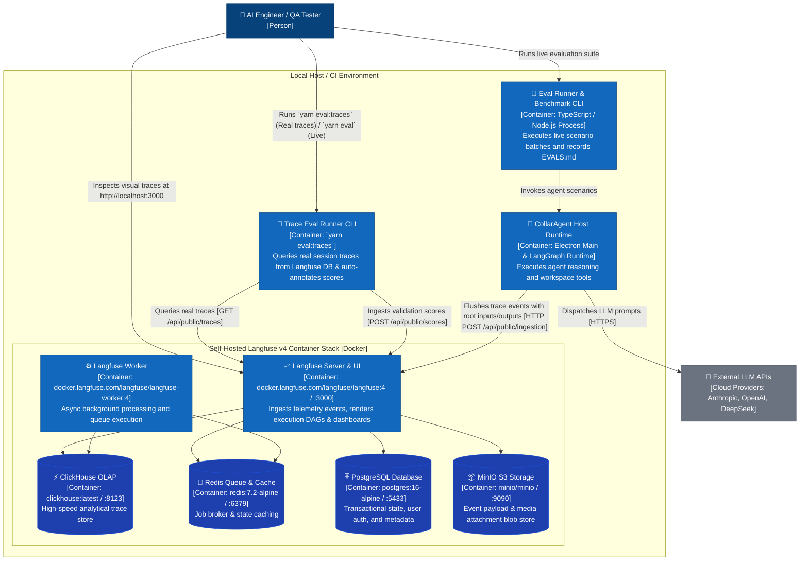
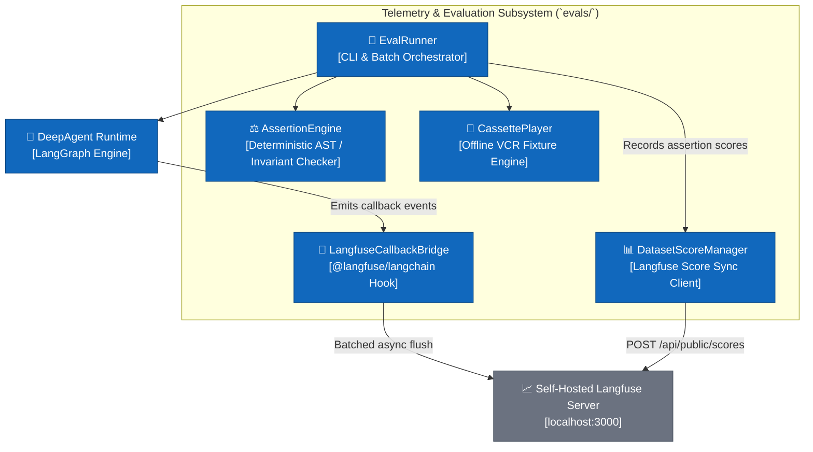
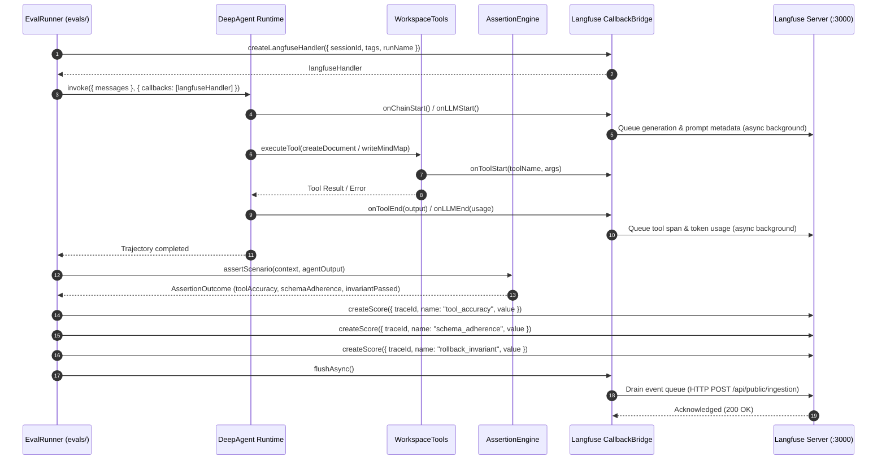

# Langfuse Observability, Telemetry & Evaluation Architecture

## 1. Executive Summary & Architectural Mission

This document formalizes the integration of the open-source, self-hosted **Langfuse** observability and evaluation platform into CollarAgent.

By leveraging LangChain's native callback hooks (`@langfuse/langchain`) and the Langfuse JS SDK (`langfuse`), CollarAgent achieves production-grade telemetry:

- **Full Agent Execution DAGs**: Non-intrusively traces multi-step ReAct cycles, tool calls, and subagent handoffs.
- **Quantitative Benchmark Scoring**: Programmatically records deterministic assertions (AST schema validity, rollback parity, error recovery rates) onto Langfuse evaluation datasets.
- **Cost & Latency Profiling**: Real-time token usage breakdown (Prompt, Completion, and Cached tokens) and latency waterfalls (TTFT, step execution times).
- **Self-Hosted Privacy**: Runs locally on `localhost:3000` via Docker Compose, guaranteeing that sensitive workspace files, `.cagent` archives, and API credentials never leave the host.

---

## 2. Stack Inventory & Source-Driven Citations

```
STACK DETECTED & VERIFIED:
- Node.js 20+ / TypeScript 7.0.2 / Electron 43
- @langchain/core 1.2.9 / @langchain/langgraph 1.4.12 / langchain 1.5.10
- langfuse 3.38.20 / @langfuse/langchain 5.11.0 / @opentelemetry/api 1.9.1
- Langfuse v4 Self-Hosted Stack: langfuse:4, langfuse-worker:4, clickhouse:24.3, redis:7.2, postgres:16, minio
```

All implementation patterns in this specification are grounded directly in official Langfuse documentation:

| Domain                            | Pattern / API                                                            | Official Documentation Source Citation                                                                           |
| :-------------------------------- | :----------------------------------------------------------------------- | :--------------------------------------------------------------------------------------------------------------- |
| **LangChain & LangGraph Tracing** | `CallbackHandler` from `@langfuse/langchain` & native root trace updates | [https://langfuse.com/integrations/frameworks/langchain](https://langfuse.com/integrations/frameworks/langchain) |
| **Tracing Best Practices**        | Root inputs/outputs propagation, nested spans, descriptive names         | [https://langfuse.com/docs/observability/best-practices](https://langfuse.com/docs/observability/best-practices) |
| **Evaluation & Scoring**          | `createScore` / `score.create` API & Real-Trace Evaluation               | [https://langfuse.com/docs/evaluation/overview](https://langfuse.com/docs/evaluation/overview)                   |
| **Sessions & Grouping**           | `sessionId` dynamic metadata & session querying                          | [https://langfuse.com/docs/tracing-features/sessions](https://langfuse.com/docs/tracing-features/sessions)       |
| **Tags & Categorization**         | `tags` array on traces                                                   | [https://langfuse.com/docs/tracing-features/tags](https://langfuse.com/docs/tracing-features/tags)               |
| **Self-Hosting Docker Setup**     | Langfuse v4 (Web + Worker + ClickHouse + Redis + MinIO + PostgreSQL)     | [https://langfuse.com/self-hosting](https://langfuse.com/self-hosting)                                           |

---

## 3. C4 Architecture Level Models

### 3.1 Level 2: Container Topology (C2)



---

### 3.2 Level 3: Component Architecture (C3)



---

### 3.3 Level 4: Execution Sequence Flow (C4)



---

## 4. Telemetry Schema & Attribute Standards

### 4.1 Trace Metadata Attributes

Every Langfuse trace generated by CollarAgent conforms to the following taxonomy:

```typescript
export interface CollarTraceMetadata {
  readonly langfuseSessionId: string // e.g. "eval-session-20260902" or workspace session ID
  readonly langfuseUserId: string // e.g. "eval-runner" or local profile identifier
  readonly langfuseTags: readonly string[] // e.g. ["evals", "tier1_doc", "claude-3-7-sonnet"]
  readonly scenarioId?: string // e.g. "SCN-DOC-01"
  readonly tier?: string // e.g. "tier1_doc"
  readonly executionMode: 'live' | 'replay' | 'dev'
}
```

### 4.2 Standardized Quantitative Evaluation Scores

Scores are attached to dataset experiment items and traces via `langfuse.createScore()`:

| Score Name                  | Data Type | Value Range      | Description                                                                          |
| :-------------------------- | :-------- | :--------------- | :----------------------------------------------------------------------------------- |
| `tool_selection_accuracy`   | `NUMERIC` | `0.0` or `1.0`   | $1.0$ if the agent called the exact expected tool for the objective.                 |
| `schema_adherence`          | `NUMERIC` | `0.0` or `1.0`   | $1.0$ if all generated tool arguments passed Zod schema validation on first try.     |
| `invariant_integrity`       | `NUMERIC` | `0.0` or `1.0`   | $1.0$ if Lexical block IDs are unique and graph topology is acyclic.                 |
| `rollback_invariant_passed` | `BOOLEAN` | `true` / `false` | `true` if applying `InverseCommandEngine` commands yields 100% byte-identical state. |
| `error_recovery_success`    | `BOOLEAN` | `true` / `false` | `true` if agent autonomously healed an injected runtime error within $\le 2$ turns.  |

---

## 5. Operational Protocols & Implementation Guidelines

### 5.1 Mandatory Lifecycle Flushing Protocol

_Source: [https://langfuse.com/integrations/frameworks/langchain#queuing-and-flushing](https://langfuse.com/integrations/frameworks/langchain#queuing-and-flushing)_

In CLI runners, background workers, and Vitest test processes, the Node.js event loop will terminate before the background HTTP queue completes unless explicitly flushed.

**Mandatory Pattern**:

```typescript
try {
  await agent.invoke(input, { callbacks: [langfuseHandler] })
} finally {
  if (langfuseHandler) {
    await langfuseHandler.flushAsync()
  }
}
```

### 5.2 Subagent Observation Hierarchy

_Source: [https://langfuse.com/docs/observability/best-practices#multi-agent-systems](https://langfuse.com/docs/observability/best-practices#multi-agent-systems)_

When `createSubAgentMiddleware` delegates tasks to specialized subagents:

1. Subagent executions are tagged with observation type `agent` rather than flat `tool` spans.
2. The nested subagent lifecycle automatically becomes a distinct sub-graph in the Langfuse Agent Graph view.
3. Subagent generations and tool calls are nested under the subagent's execution context.

### 5.3 Fail-Safe Offline Operation

If `LANGFUSE_PUBLIC_KEY` or `LANGFUSE_SECRET_KEY` is not present in the environment:

- `createLangfuseHandler()` returns `undefined`.
- The agent execution runs with an empty callbacks array (`callbacks: []`).
- Zero network requests or console warnings are generated.

---

## 6. Self-Hosted Docker Deployment Blueprint (Langfuse v4)

To deploy the local Langfuse v4 distributed stack for development and offline evaluation runs:

```yaml
# docker-compose.langfuse.yml
version: '3.8'

services:
  langfuse-server:
    image: docker.langfuse.com/langfuse/langfuse:4
    restart: unless-stopped
    depends_on:
      db:
        condition: service_healthy
      clickhouse:
        condition: service_healthy
      redis:
        condition: service_healthy
      minio:
        condition: service_healthy
    ports:
      - '3000:3000'
    environment:
      - DATABASE_URL=postgresql://postgres:postgres@db:5432/langfuse
      - NEXTAUTH_SECRET=local-dev-secret-string-min-32-chars-long
      - SALT=local-dev-salt-string-min-32-chars-long
      - ENCRYPTION_KEY=0000000000000000000000000000000000000000000000000000000000000000
      - NEXTAUTH_URL=http://localhost:3000
      - TELEMETRY_ENABLED=false
      - LANGFUSE_ENABLE_EXPERIMENTAL_FEATURES=true
      - CLICKHOUSE_URL=http://clickhouse:8123
      - CLICKHOUSE_MIGRATION_URL=clickhouse://clickhouse:9000
      - CLICKHOUSE_USER=default
      - CLICKHOUSE_PASSWORD=clickhouse
      - CLICKHOUSE_CLUSTER_ENABLED=false
      - REDIS_CONNECTION_STRING=redis://redis:6379
      - LANGFUSE_S3_EVENT_UPLOAD_BUCKET=langfuse
      - LANGFUSE_S3_EVENT_UPLOAD_ENDPOINT=http://minio:9000
      - LANGFUSE_S3_EVENT_UPLOAD_ACCESS_KEY_ID=minioadmin
      - LANGFUSE_S3_EVENT_UPLOAD_SECRET_ACCESS_KEY=minioadmin
      - LANGFUSE_S3_EVENT_UPLOAD_FORCE_PATH_STYLE=true
      - LANGFUSE_S3_EVENT_UPLOAD_REGION=us-east-1
      - LANGFUSE_MIGRATION_V4_WRITE_MODE=dual
      - TZ=UTC

  langfuse-worker:
    image: docker.langfuse.com/langfuse/langfuse-worker:4
    restart: unless-stopped
    depends_on:
      db:
        condition: service_healthy
      clickhouse:
        condition: service_healthy
      redis:
        condition: service_healthy
      minio:
        condition: service_healthy
    environment:
      - DATABASE_URL=postgresql://postgres:postgres@db:5432/langfuse
      - ENCRYPTION_KEY=0000000000000000000000000000000000000000000000000000000000000000
      - TELEMETRY_ENABLED=false
      - CLICKHOUSE_URL=http://clickhouse:8123
      - CLICKHOUSE_MIGRATION_URL=clickhouse://clickhouse:9000
      - CLICKHOUSE_USER=default
      - CLICKHOUSE_PASSWORD=clickhouse
      - CLICKHOUSE_CLUSTER_ENABLED=false
      - REDIS_CONNECTION_STRING=redis://redis:6379
      - LANGFUSE_S3_EVENT_UPLOAD_BUCKET=langfuse
      - LANGFUSE_S3_EVENT_UPLOAD_ENDPOINT=http://minio:9000
      - LANGFUSE_S3_EVENT_UPLOAD_ACCESS_KEY_ID=minioadmin
      - LANGFUSE_S3_EVENT_UPLOAD_SECRET_ACCESS_KEY=minioadmin
      - LANGFUSE_S3_EVENT_UPLOAD_FORCE_PATH_STYLE=true
      - LANGFUSE_S3_EVENT_UPLOAD_REGION=us-east-1
      - LANGFUSE_MIGRATION_V4_WRITE_MODE=dual
      - TZ=UTC

  clickhouse:
    image: clickhouse/clickhouse-server:latest
    restart: always
    environment:
      - CLICKHOUSE_DB=default
      - CLICKHOUSE_USER=default
      - CLICKHOUSE_PASSWORD=clickhouse
      - TZ=UTC
    ports:
      - '8123:8123'
      - '9000:9000'
    volumes:
      - langfuse_clickhouse_data:/var/lib/clickhouse
    healthcheck:
      test: ['CMD-SHELL', 'wget --spider -q http://127.0.0.1:8123/ping']
      interval: 3s
      timeout: 3s
      retries: 10

  redis:
    image: redis:7.2-alpine
    restart: always
    ports:
      - '6379:6379'
    volumes:
      - langfuse_redis_data:/data
    healthcheck:
      test: ['CMD', 'redis-cli', 'ping']
      interval: 3s
      timeout: 3s
      retries: 10

  db:
    image: postgres:16-alpine
    restart: always
    environment:
      - POSTGRES_USER=postgres
      - POSTGRES_PASSWORD=postgres
      - POSTGRES_DB=langfuse
      - TZ=UTC
    ports:
      - '5433:5432'
    volumes:
      - langfuse_postgres_data:/var/lib/postgresql/data
    healthcheck:
      test: ['CMD-SHELL', 'pg_isready -U postgres']
      interval: 3s
      timeout: 3s
      retries: 10

  minio:
    image: minio/minio
    restart: always
    command: server /data --console-address ":9091"
    environment:
      - MINIO_ROOT_USER=minioadmin
      - MINIO_ROOT_PASSWORD=minioadmin
    ports:
      - '9090:9000'
      - '9091:9091'
    volumes:
      - langfuse_minio_data:/data
    healthcheck:
      test: ['CMD', 'curl', '-f', 'http://localhost:9000/minio/health/live']
      interval: 3s
      timeout: 3s
      retries: 10

  minio-create-bucket:
    image: minio/mc
    depends_on:
      minio:
        condition: service_healthy
    entrypoint: >
      /bin/sh -c "
      /usr/bin/mc alias set myminio http://minio:9000 minioadmin minioadmin;
      /usr/bin/mc mb --ignore-existing myminio/langfuse;
      exit 0;
      "

volumes:
  langfuse_postgres_data:
  langfuse_clickhouse_data:
  langfuse_redis_data:
  langfuse_minio_data:
```
