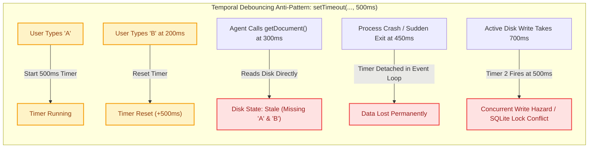
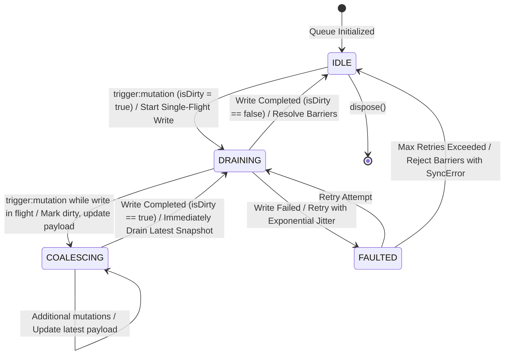
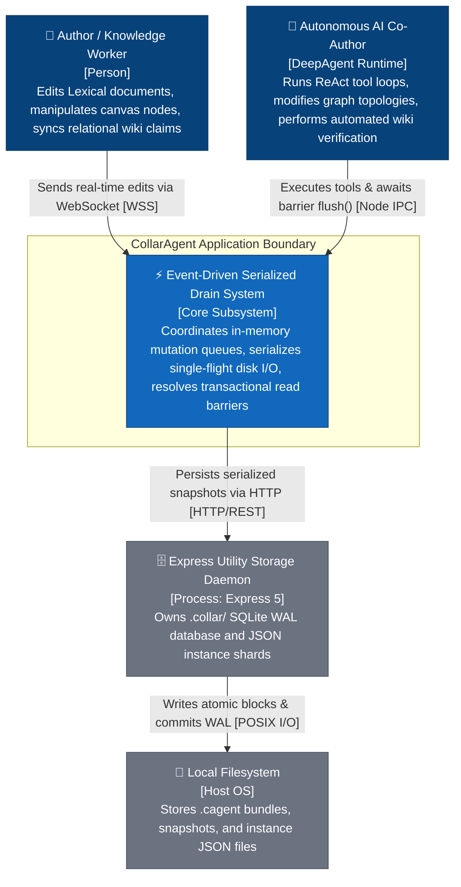
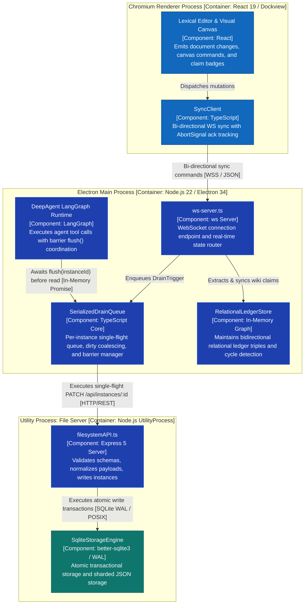
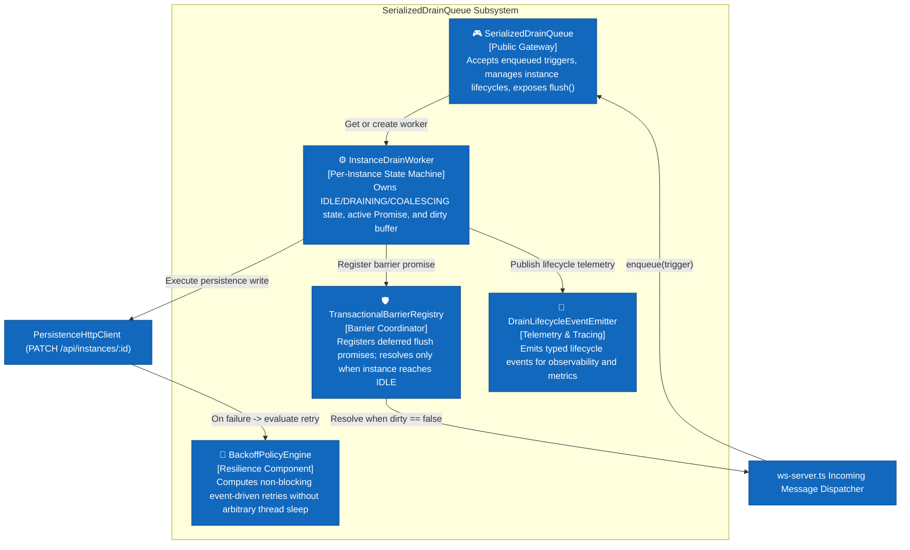

# Event-Driven Serialized Drain System

## Architectural Blueprint & Design Catalog

Welcome to the **Event-Driven Serialized Drain System** architecture catalog. This directory contains the complete architectural specification, C4 models, EventStorming workflows, TypeScript event contracts, migration plan, and Architecture Decision Record (ADR) for transitioning CollarAgent from time-driven persistence debouncing (`setTimeout(..., 500)`) to a deterministic, event-driven serialized drain queue with transactional barrier guarantees.

---

## 1. Executive Summary

In CollarAgent's local-first architecture, rich-text document edits, graph canvas commands, and relational knowledge-graph ledger triples flow over a local WebSocket server (`ws-server.ts`) to an Express 5 utility process backed by a sharded SQLite/JSON persistence layer (`.collar/` workspace).

Previously, persistence was throttled using a naive **temporal debounce** mechanism (`setTimeout(..., 500)`). While common in simple web apps, temporal debouncing introduces severe architectural liabilities in a local-first desktop IDE paired with autonomous AI agents:

1. **Concurrency Violations & Lock Contention**: Overlapping disk writes occur when a subsequent timer fires before an in-flight HTTP/filesystem write completes.
2. **Stale Reads by Autonomous Agents**: When an AI agent executes tools (`getDocument`, `listCanvases`, `loadLedger`) immediately after user typing, the tool reads unpersisted disk state because the changes are stranded in memory awaiting the 500ms clock tick.
3. **Fragile, Slow Test Suites**: Unit and integration tests are forced to introduce arbitrary `sleep(600)` delays to assert disk state, leading to flaky CI pipelines and violated coding rules (Rule 2.1 "No hardcoded constants").
4. **Silent Error Loss**: Unhandled promise rejections inside detached `setTimeout` callbacks cannot be propagated back to the originating client or session supervisor.

The **Event-Driven Serialized Drain System** eliminates all temporal timers in favor of a **state-machine-driven, single-flight drain queue**. State transitions occur reactively upon domain triggers (`trigger:document_edit`, `trigger:canvas_edit`, `trigger:claim_sync`, `trigger:flush_barrier`), guaranteeing:

- **Strict Concurrency = 1**: At most one write I/O is active per instance.
- **Zero Hardcoded Timeout Delays**: Writes fire immediately when the queue is idle.
- **Continuous Dirty Coalescing**: High-frequency user keystrokes update the latest in-memory representation and set a dirty flag; when the active I/O finishes, the coalesced state drains immediately.
- **Deterministic Transactional Barriers (`flush()`)**: Autonomous agents and test runners await a barrier promise that resolves only when all in-flight and coalesced writes have settled on disk.
- **End-to-End Cancellation Propagation**: Full support for `AbortSignal` and structured `SyncError` taxonomy without generic fallbacks.

---

## 2. Problem Statement: The Flaws of Temporal Debouncing

### Critical Vulnerabilities Identified:

- **Uncoordinated Concurrency**: If disk I/O latency exceeds 500ms (e.g. large file export, disk saturation, antivirus scan), multiple HTTP requests strike Express concurrently, violating SQLite single-writer guarantees.
- **Stranded In-Memory State**: Between the moment a user finishes an edit and the 500ms timer elapses, the filesystem is out of sync. When an agent tool or background linter reads disk files (`L1StructuralLinter`, `createFsWikiWorkspaceAdapter`), it reads obsolete data, creating phantom inconsistencies.
- **Uncaught Promise Rejections**: Errors occurring within the `setTimeout(async () => { await save... }, 500)` callback are uncatchable by the mutation initiator, causing silent persistence dropouts.
- **Cancellation Blindness**: Timers cannot be bound to user session cancellation tokens, preventing clean teardown when switching workspaces or closing windows.

---

## 3. The Core Architecture: Event-Driven Serialized Drain

### Core Invariants & Guarantees:

1. **Single-Flight Invariant**: For any given `instanceId`, exactly one asynchronous persistence operation (`saveDocumentInstanceToApi`) is executed at any point in time (`activeDrainPromise !== null`).
2. **Zero Sleep Invariant**: No `setTimeout`, `setInterval`, or hardcoded sleep loops govern the persistence pipeline. Write scheduling is purely reactive.
3. **Dirty-Coalescing Invariant**: Any mutation received while a write is in-flight does not spawn an uncoordinated task; it updates the pending snapshot in memory and flips `isDirty = true`.
4. **Barrier Resolution Invariant**: A `flush(instanceId)` barrier returns a promise that resolves only after the currently active write AND any coalesced pending write have both successfully settled on disk.
5. **Deterministic Cancellation**: All asynchronous operations accept an optional `AbortSignal`. Aborted operations reject immediately with `SyncErrorCode.SYNC_DRAIN_ABORTED`.

---

## 4. Level 1: System Context (C1)

The System Context diagram illustrates the actors, boundaries, and integrations of the Event-Driven Serialized Drain System.

---

## 5. Level 2: Container Topology (C2)

The Container diagram zooms into the runtime processes, showing the exact communication protocols and isolation boundaries.

---

## 6. Level 3: Component Breakdown (C3)

The Component diagram reveals the internal modular composition of the `SerializedDrainQueue` and its integration within `ws-server.ts`.

---

## 7. EventStorming Domain Workflow

The EventStorming domain workflow maps the chronological event timeline, connecting actors, commands, domain events, aggregates, policies, and failure paths.

```mermaid
flowchart LR
    %% EventStorming Semantic Styling
    classDef event fill:#ff9800,stroke:#e65100,color:#000
    classDef command fill:#2196f3,stroke:#0d47a1,color:#fff
    classDef actor fill:#ffeb3b,stroke:#f57f17,color:#000
    classDef system fill:#9c27b0,stroke:#4a148c,color:#fff
    classDef aggregate fill:#4caf50,stroke:#1b5e20,color:#fff
    classDef policy fill:#e91e63,stroke:#880e4f,color:#fff
    classDef hotspot fill:#f44336,stroke:#b71c1c,color:#fff

    User[Author / Editor]:::actor
    Agent[DeepAgent Co-Author]:::actor

    CmdEdit[Submit Document Edit]:::command
    CmdBarrier[Request Flush Barrier]:::command

    EvtEditReceived[DocumentEditReceived]:::event
    EvtDrainStarted[SingleFlightDrainStarted]:::event
    EvtMutationCoalesced[PendingMutationCoalesced]:::event
    EvtSnapshotPersisted[SnapshotPersistedToStorage]:::event
    EvtBarrierResolved[FlushBarrierResolved]:::event
    EvtDrainFailed[DrainAttemptFailed]:::event

    AggWorker[InstanceDrainWorker Aggregate]:::aggregate
    AggLedger[RelationalLedgerStore Aggregate]:::aggregate

    PolCoalesce[Whenever InFlight -> Coalesce Dirty Snapshot]:::policy
    PolClaimSync[Whenever Doc Persisted -> Sync Wiki Claims]:::policy
    PolRetry[Whenever I/O Error -> Schedule Immediate Retry]:::policy

    SysStorage[Storage Utility Daemon]:::system
    HotLock[? Lock contention under concurrent agent tool calls]:::hotspot

    User --> CmdEdit
    CmdEdit --> EvtEditReceived
    EvtEditReceived --> AggWorker
    AggWorker --> EvtDrainStarted
    EvtDrainStarted --> SysStorage

    User -.rapid typing.-> CmdEdit
    CmdEdit --> PolCoalesce
    PolCoalesce --> EvtMutationCoalesced
    EvtMutationCoalesced --> AggWorker

    SysStorage --> EvtSnapshotPersisted
    EvtSnapshotPersisted --> PolClaimSync
    PolClaimSync --> AggLedger

    Agent --> CmdBarrier
    CmdBarrier --> AggWorker
    EvtSnapshotPersisted --> EvtBarrierResolved
    EvtBarrierResolved --> Agent

    SysStorage -.I/O Failure.-> EvtDrainFailed
    EvtDrainFailed --> PolRetry
    PolRetry -.mitigates.-> HotLock
```

---

## 8. Catalog Documentation Index

This architectural catalog is organized into dedicated, deep-dive specifications:

| Document                                                                                                                               | Purpose                                    | Key Contents                                                                                                                                       |
| :------------------------------------------------------------------------------------------------------------------------------------- | :----------------------------------------- | :------------------------------------------------------------------------------------------------------------------------------------------------- |
| **[system-architecture.md](file:///Users/goldenfung/Documents/collaragent/docs/event-driven-system/system-architecture.md)**           | Deep-dive C4 Architectural Spec & Dynamics | Detailed C1–C3 diagrams, FSM statechart, Sequence diagrams for keystroke coalescing, agent tool barriers, and error backpressure                   |
| **[event-contracts.md](file:///Users/goldenfung/Documents/collaragent/docs/event-driven-system/event-contracts.md)**                   | Formal Interface & Type Contracts          | Discriminated unions for `DrainTrigger` & `DrainLifecycleEvent`, `ISerializedDrainQueue` interface, `SyncErrorCode` enum, cancellation contracts   |
| **[migration-plan.md](file:///Users/goldenfung/Documents/collaragent/docs/event-driven-system/migration-plan.md)**                     | Phased Migration & Quality Gate Plan       | 5-phase migration roadmap, testing harness (barrier-based unit tests without `sleep()`), rollback safeguards                                       |
| **[hardcoded-timeouts-audit.md](file:///Users/goldenfung/Documents/collaragent/docs/event-driven-system/hardcoded-timeouts-audit.md)** | Codebase-Wide Timeout & Delay Audit        | Exhaustive inventory of all hardcoded `setTimeout`, `setInterval`, and delay constants across 5 subsystems with risk ratings and remediation paths |
| **[ADR-012](file:///Users/goldenfung/Documents/collaragent/docs/design-catalog/adrs/adr-012-event-driven-serialized-drain-system.md)** | Formal Architecture Decision Record        | Context, technical decision, trade-off evaluation matrix, and operational consequences                                                             |
