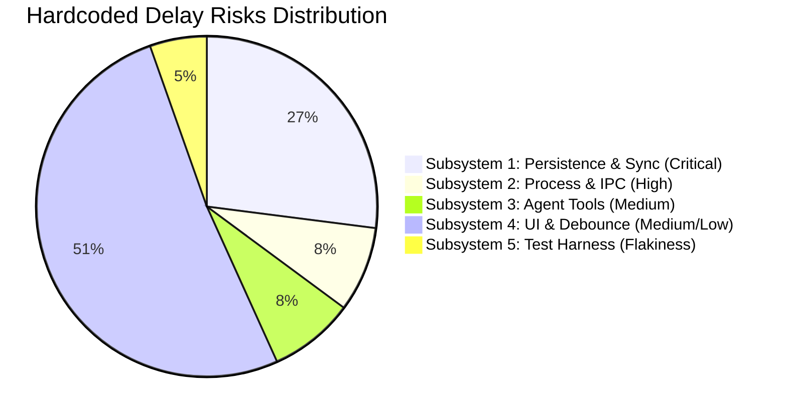

# Codebase Audit: Hardcoded Timeouts, Delays, and Temporal Timers

## 1. Executive Summary

This document provides an exhaustive inventory of all hardcoded timeout delay values, temporal timers (`setTimeout`, `setInterval`), and duration constants across the CollarAgent codebase.

Per **Coding Rule 2.1 ("Hardcoded values or parameters are forbidden in this project")** and **Coding Rule 2.2 ("AVOID using fallbacks... design robust error code enum")**, hardcoded delay timeouts introduce severe architectural anti-patterns:

1. **False Latency**: Waiting for an arbitrary fixed duration (e.g. 500ms) when the underlying I/O or network operation could complete in 5ms.
2. **Race Conditions & Stale Reads**: Failing to await true operational completion, resulting in reading stale disk states when load exceeds the arbitrary threshold.
3. **Fragile Tests**: Arbitrary sleeps in test suites that cause intermittent CI failures depending on CPU load.
4. **Lack of Cancellation**: Inability to propagate user intent and cancellation tokens (`AbortSignal`) cleanly through the asynchronous pipeline.

---

## 2. Exhaustive Inventory by Subsystem

### Subsystem 1: Core Persistence & Synchronization Engine (Critical Risk)

These timers govern persistence of rich-text documents, canvas graphs, and knowledge-graph relational ledgers. They directly cause SQLite lock contention, data loss risks on crash, and read-after-write races for autonomous AI agents.

| File Location                                                                                                                                                | Line | Mechanism          | Value           | Architectural Purpose                                           | Violation & Risk Assessment                                                                                              |
| :----------------------------------------------------------------------------------------------------------------------------------------------------------- | :--- | :----------------- | :-------------- | :-------------------------------------------------------------- | :----------------------------------------------------------------------------------------------------------------------- |
| [`src/main/server/ws/ws-server.ts`](file:///Users/goldenfung/Documents/collaragent/src/main/server/ws/ws-server.ts#L750)                                     | 750  | `setTimeout`       | `500ms`         | Debounces relational ledger persistence (`debouncedSaveLedger`) | **High Risk**: Causes stale reads when agent tools inspect wiki ledger immediately after typing.                         |
| [`src/main/server/ws/ws-server.ts`](file:///Users/goldenfung/Documents/collaragent/src/main/server/ws/ws-server.ts#L866)                                     | 866  | `setTimeout`       | `500ms`         | Debounces document & canvas persistence (`debouncedSave`)       | **High Risk**: Unawaited in-flight writes allow concurrent POST requests to hit Express, causing SQLite WAL busy errors. |
| [`src/main/server/fileServer/storageEngine.ts`](file:///Users/goldenfung/Documents/collaragent/src/main/server/fileServer/storageEngine.ts#L690)             | 690  | Hardcoded Variable | `500ms`         | Adaptive debounce base interval (`delay = 500`)                 | **High Risk**: Arbitrary delay heuristic in legacy V3 storage engine.                                                    |
| [`src/main/server/fileServer/storageEngine.ts`](file:///Users/goldenfung/Documents/collaragent/src/main/server/fileServer/storageEngine.ts#L691)             | 691  | Hardcoded Variable | `2000ms`        | High-frequency mutation threshold (`changeCount > 10`)          | **High Risk**: Delays disk write by 2 full seconds under heavy editing.                                                  |
| [`src/main/server/fileServer/storageEngine.ts`](file:///Users/goldenfung/Documents/collaragent/src/main/server/fileServer/storageEngine.ts#L692)             | 692  | Hardcoded Variable | `1000ms`        | Medium-frequency mutation threshold (`changeCount > 5`)         | **High Risk**: Delays disk write by 1 second.                                                                            |
| [`src/main/server/fileServer/storageEngine.ts`](file:///Users/goldenfung/Documents/collaragent/src/main/server/fileServer/storageEngine.ts#L712)             | 712  | `setTimeout`       | `4000ms`        | Maximum wait ceiling (`Math.max(delay * 2, 4000)`)              | **High Risk**: Arbitrary max wait timer before forcing disk flush.                                                       |
| [`src/main/server/fileServer/config/sqliteConfig.ts`](file:///Users/goldenfung/Documents/collaragent/src/main/server/fileServer/config/sqliteConfig.ts#L26)  | 26   | Config Constant    | `30000ms` (30s) | Idle WAL checkpoint trigger delay (`idleCheckpointDelayMs`)     | **Medium Risk**: Hardcoded constant in config rather than event-driven WAL maintenance.                                  |
| [`src/main/server/fileServer/SqliteStorageEngine.ts`](file:///Users/goldenfung/Documents/collaragent/src/main/server/fileServer/SqliteStorageEngine.ts#L725) | 725  | `setTimeout`       | `30000ms` (30s) | Sets up idle WAL checkpoint callback                            | **Medium Risk**: Runs on arbitrary clock ticks instead of transaction volume thresholds.                                 |
| [`src/main/server/fileServer/config/sqliteConfig.ts`](file:///Users/goldenfung/Documents/collaragent/src/main/server/fileServer/config/sqliteConfig.ts#L22)  | 22   | Config Constant    | `5000ms` (5s)   | SQLite busy timeout (`busyTimeoutMs = 5000`)                    | **Medium Risk**: Fixed database driver busy ceiling.                                                                     |
| [`src/workspace/sync/SyncClient.ts`](file:///Users/goldenfung/Documents/collaragent/src/workspace/sync/SyncClient.ts#L232)                                   | 232  | `setTimeout`       | `timeoutMs`     | Client command ack deadline timer (`pendingAcks`)               | **Medium Risk**: Relies on `setTimeout` instead of caller `AbortSignal` propagation.                                     |

---

### Subsystem 2: Process Lifecycle & Inter-Process Communication (IPC) (High Risk)

These timers govern child process initialization, message exchanges between Electron Main and the Utility Process, and graceful window closing.

| File Location                                                                                                                | Line | Mechanism    | Value             | Architectural Purpose                                     | Violation & Risk Assessment                                                          |
| :--------------------------------------------------------------------------------------------------------------------------- | :--- | :----------- | :---------------- | :-------------------------------------------------------- | :----------------------------------------------------------------------------------- |
| [`src/main/windows/WindowManager.ts`](file:///Users/goldenfung/Documents/collaragent/src/main/windows/WindowManager.ts#L48)  | 48   | `setTimeout` | `30000ms` (30s)   | IPC request timeout waiting for filesystem process        | **High Risk**: Hardcoded 30-second hang if the utility process deadlocks or crashes. |
| [`src/main/windows/WindowManager.ts`](file:///Users/goldenfung/Documents/collaragent/src/main/windows/WindowManager.ts#L100) | 100  | `setTimeout` | `30000ms` (30s)   | Safety fallback waiting for natural process exit          | **High Risk**: Prevents instant window close if a process hangs during shutdown.     |
| [`src/main/windows/WindowManager.ts`](file:///Users/goldenfung/Documents/collaragent/src/main/windows/WindowManager.ts#L211) | 211  | `setTimeout` | `100000ms` (100s) | Fork startup timeout waiting for filesystem ready message | **High Risk**: 100-second hardcoded timeout; freezes startup diagnostics.            |

---

### Subsystem 3: AI Agent Tools & Network Reachability (Medium Risk)

These timers govern tool discovery, fallback queries, and health checks.

| File Location                                                                                                                                          | Line | Mechanism         | Value         | Architectural Purpose                                 | Violation & Risk Assessment                                                        |
| :----------------------------------------------------------------------------------------------------------------------------------------------------- | :--- | :---------------- | :------------ | :---------------------------------------------------- | :--------------------------------------------------------------------------------- |
| [`src/workspace/wstools/listDocumentInstances.ts`](file:///Users/goldenfung/Documents/collaragent/src/workspace/wstools/listDocumentInstances.ts#L32)  | 32   | Local Constant    | `2000ms` (2s) | `DEFAULT_TIMEOUT_MS = 2000` for WebSocket discovery   | **Medium Risk**: Hardcoded fallback timeout instead of signal-driven discovery.    |
| [`src/workspace/wstools/listDocumentInstances.ts`](file:///Users/goldenfung/Documents/collaragent/src/workspace/wstools/listDocumentInstances.ts#L295) | 295  | `setTimeout`      | `2000ms`      | Races WebSocket response against timeout promise      | **Medium Risk**: Hardcoded race condition handler.                                 |
| [`src/collaragent/telemetry/langfuse.ts`](file:///Users/goldenfung/Documents/collaragent/src/collaragent/telemetry/langfuse.ts#L449)                   | 449  | Default Parameter | `3000ms` (3s) | `timeoutMs: number = 3000` in `checkLangfuseHealth()` | **Low Risk**: Diagnostic network probe ceiling; should allow caller `AbortSignal`. |

---

### Subsystem 4: UI Editor & Component State Debouncers (Medium-to-Low Risk)

These timers debounce local user input in the React DOM, manage visual animations, or defer execution across React render cycles.

| File Location                                                                                                                                                                      | Line | Mechanism     | Value         | Architectural Purpose                                               | Violation & Risk Assessment                                                                       |
| :--------------------------------------------------------------------------------------------------------------------------------------------------------------------------------- | :--- | :------------ | :------------ | :------------------------------------------------------------------ | :------------------------------------------------------------------------------------------------ |
| [`src/workspace/editor/components/SkillEditor.tsx`](file:///Users/goldenfung/Documents/collaragent/src/workspace/editor/components/SkillEditor.tsx#L179)                           | 179  | `setTimeout`  | `800ms`       | Debounced disk save on editing `SKILL.md` frontmatter/body          | **Medium Risk**: Temporal debouncing of filesystem writes; can lose text on sudden tab close.     |
| [`src/workspace/editor/components/MemoEditor.tsx`](file:///Users/goldenfung/Documents/collaragent/src/workspace/editor/components/MemoEditor.tsx#L96)                              | 96   | `setTimeout`  | `800ms`       | Debounced markdown conversion on memo canvas card change            | **Medium Risk**: Temporal debouncing of canvas card markdown commits.                             |
| [`src/renderer/components/Workspace/Workspace.tsx`](file:///Users/goldenfung/Documents/collaragent/src/renderer/components/Workspace/Workspace.tsx#L287)                           | 287  | `setTimeout`  | `300ms`       | Debounced Dockview panel layout persistence to localStorage         | **Low Risk**: Debounces high-frequency panel resize divider dragging.                             |
| [`src/workspace/editor/plugins/FindPlugin.tsx`](file:///Users/goldenfung/Documents/collaragent/src/workspace/editor/plugins/FindPlugin.tsx#L247)                                   | 247  | `setTimeout`  | `200ms`       | Debounced search query execution on keystroke                       | **Low Risk**: Pure search filter input throttling.                                                |
| [`src/workspace/editor/plugins/FindPlugin.tsx`](file:///Users/goldenfung/Documents/collaragent/src/workspace/editor/plugins/FindPlugin.tsx#L276)                                   | 276  | `setTimeout`  | `200ms`       | Debounced search query re-run on query change                       | **Low Risk**: Pure search filter input throttling.                                                |
| [`src/workspace/editor/plugins/FindPlugin.tsx`](file:///Users/goldenfung/Documents/collaragent/src/workspace/editor/plugins/FindPlugin.tsx#L294)                                   | 294  | `setTimeout`  | `10ms`        | Focus delay for search input element                                | **Low Risk**: DOM focus stabilization.                                                            |
| [`src/renderer/components/Layout/ProgressBar.tsx`](file:///Users/goldenfung/Documents/collaragent/src/renderer/components/Layout/ProgressBar.tsx#L51)                              | 51   | `setInterval` | `100ms`       | Progress bar incremental animation tick                             | **Low Risk**: Visual animation frame tick.                                                        |
| [`src/renderer/components/Layout/ProgressBar.tsx`](file:///Users/goldenfung/Documents/collaragent/src/renderer/components/Layout/ProgressBar.tsx#L59)                              | 59   | `setTimeout`  | `300ms`       | Delay before fading out finished progress bar                       | **Low Risk**: Visual animation transition.                                                        |
| [`src/renderer/components/Chat/AgentStream.tsx`](file:///Users/goldenfung/Documents/collaragent/src/renderer/components/Chat/AgentStream.tsx#L72)                                  | 72   | `setInterval` | `5000ms` (5s) | Toggles streaming badge text between "Working..." / "Generating..." | **Low Risk**: Pure visual label oscillation.                                                      |
| [`src/renderer/components/Chat/SubagentStreamPane.tsx`](file:///Users/goldenfung/Documents/collaragent/src/renderer/components/Chat/SubagentStreamPane.tsx#L48)                    | 48   | `setTimeout`  | `2000ms` (2s) | Resets "Copied" clipboard toast status                              | **Low Risk**: Ephemeral UI toast timer.                                                           |
| [`src/renderer/components/Settings/MCPServerSettings.tsx`](file:///Users/goldenfung/Documents/collaragent/src/renderer/components/Settings/MCPServerSettings.tsx#L470)             | 470  | `setTimeout`  | `2000ms` (2s) | Resets "Saved" badge status                                         | **Low Risk**: Ephemeral UI toast timer.                                                           |
| [`src/renderer/components/Settings/ToolList.tsx`](file:///Users/goldenfung/Documents/collaragent/src/renderer/components/Settings/ToolList.tsx#L89)                                | 89   | `setTimeout`  | `2000ms` (2s) | Resets "Saved" badge status                                         | **Low Risk**: Ephemeral UI toast timer.                                                           |
| [`src/workspace/editor/plugins/BlockIdPlugin.tsx`](file:///Users/goldenfung/Documents/collaragent/src/workspace/editor/plugins/BlockIdPlugin.tsx#L44)                              | 44   | `setTimeout`  | `2000ms` (2s) | Removes temporary highlight ring from target block on jump          | **Low Risk**: Ephemeral visual highlight ring.                                                    |
| [`src/workspace/editor/hooks/useReport.ts`](file:///Users/goldenfung/Documents/collaragent/src/workspace/editor/hooks/useReport.ts#L60)                                            | 60   | `setTimeout`  | `1000ms` (1s) | Cleans up aria-live screen reader announcement element              | **Low Risk**: Accessibility live-region cleanup.                                                  |
| [`src/workspace/contexts/instance/InstanceContext.tsx`](file:///Users/goldenfung/Documents/collaragent/src/workspace/contexts/instance/InstanceContext.tsx#L412)                   | 412  | `setTimeout`  | `0ms`         | React render cycle deferral to prevent Error #185                   | **Medium Risk**: Workaround for React render cycle; should use `queueMicrotask` or state machine. |
| [`src/renderer/components/Chat/MessageInput.tsx`](file:///Users/goldenfung/Documents/collaragent/src/renderer/components/Chat/MessageInput.tsx#L258)                               | 258  | `setTimeout`  | `0ms`         | Defer cursor positioning after textarea state update                | **Low Risk**: Browser DOM cursor update.                                                          |
| [`src/renderer/components/Chat/MessageInput.tsx`](file:///Users/goldenfung/Documents/collaragent/src/renderer/components/Chat/MessageInput.tsx#L276)                               | 276  | `setTimeout`  | `0ms`         | Defer cursor positioning after slash command insertion              | **Low Risk**: Browser DOM cursor update.                                                          |
| [`src/workspace/editor/plugins/DraggableBlockPlugin.tsx`](file:///Users/goldenfung/Documents/collaragent/src/workspace/editor/plugins/DraggableBlockPlugin.tsx#L176)               | 176  | `setTimeout`  | `0ms`         | Restores drag element transform after drag starts                   | **Low Risk**: Browser HTML5 drag-and-drop workaround.                                             |
| [`src/workspace/editor/plugins/TableActionMenuPlugin/index.tsx`](file:///Users/goldenfung/Documents/collaragent/src/workspace/editor/plugins/TableActionMenuPlugin/index.tsx#L809) | 809  | `setTimeout`  | `0ms`         | Defers table action menu position calculation                       | **Low Risk**: DOM layout recalculation.                                                           |

---

### Subsystem 5: Test Suites & Verification Harnesses (Quality Liability)

These hardcoded sleeps exist in tests to wait for asynchronous timers to settle, causing test flakiness and slow CI.

| File Location                                                                                                                                                                      | Line | Mechanism    | Value  | Architectural Purpose                            | Violation & Risk Assessment                                               |
| :--------------------------------------------------------------------------------------------------------------------------------------------------------------------------------- | :--- | :----------- | :----- | :----------------------------------------------- | :------------------------------------------------------------------------ |
| [`src/main/server/ws/__tests__/wsServerLedger.test.ts`](file:///Users/goldenfung/Documents/collaragent/src/main/server/ws/__tests__/wsServerLedger.test.ts#L166)                   | 166  | `setTimeout` | `50ms` | Waits for debounced ledger persistence to settle | **High Risk**: Arbitrary delay; will fail under slow CI CPU environments. |
| [`src/main/server/fileServer/__tests__/FileSystemSaver.test.ts`](file:///Users/goldenfung/Documents/collaragent/src/main/server/fileServer/__tests__/FileSystemSaver.test.ts#L230) | 230  | `setTimeout` | `2ms`  | Waits for tick                                   | **Low Risk**: Test micro-tick.                                            |

---

## 3. Prioritized Remediation Strategy

### Remediation Blueprint:

1. **Priority 1: Replace Persistence Debouncers with Event-Driven Serialized Drain Queue**
   - Eliminate `ws-server.ts:750` (`500ms`) and `ws-server.ts:866` (`500ms`).
   - Implement `SerializedDrainQueue`: mutations coalesce continuously while writes are in flight; writes fire immediately when `IDLE`.
   - Replace test sleep in `wsServerLedger.test.ts:166` with `await wsHandle.flush()`.
2. **Priority 2: Process Lifecycle & IPC Cancellation Token Propagation**
   - In `WindowManager.ts` (lines 48, 100, 211), eliminate `30000ms` and `100000ms` arbitrary timeouts.
   - Bind IPC requests to caller-passed `AbortSignal` with explicit `TimeoutError` mappings and event-driven process exit listeners (`proc.once('exit')`).
3. **Priority 3: Agent Tool & Discovery Determinism**
   - In `listDocumentInstances.ts`, eliminate `DEFAULT_TIMEOUT_MS = 2000`. Query the REST endpoint directly where available, and pass `signal?: AbortSignal` for WebSocket queries.
4. **Priority 4: UI Debouncers & React Deferrals**
   - Replace `setTimeout(..., 0)` workarounds (e.g. `InstanceContext.tsx:412`) with `queueMicrotask()` or clean state-machine action dispatchers.
   - For pure visual timers (toast dismissals, highlight rings), centralize numeric values into UI theme tokens or animation duration constants instead of magic numbers.
