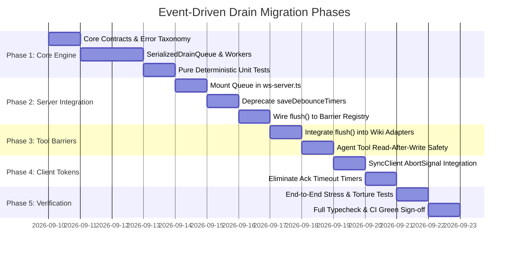

# Event-Driven Serialized Drain System: Migration & Implementation Plan

## 1. Executive Summary

This plan outlines the systematic, phased engineering migration to replace legacy temporal debouncing (`setTimeout(..., 500)`) in `src/main/server/ws/ws-server.ts` with the deterministic **Event-Driven Serialized Drain System**.

The migration is divided into five isolated, test-driven phases to ensure zero regressions, complete backward compatibility, and continuous validation against project coding rules (Rule 2.1 "No Hardcoded Constants", Rule 4.1 "Zero Any", Rule 6.1/6.2 "Centralized Error Code Taxonomy").

---

## 2. Phased Migration Roadmap



---

## 3. Phase-by-Phase Breakdown

### Phase 1: Core Engine & Unit Test Suite

- **Location**: `src/workspace/sync/drain/` or `src/main/server/sync/`
- **Components to Implement**:
  1. `types.ts`: Formal exports of `DrainTrigger` (including `DocumentEditTrigger`, `CanvasCommandTrigger`, `CanvasSnapshotTrigger`, `InstanceDeletedTrigger`, `ClaimSyncTrigger`, `LedgerMutationTrigger`, `FlushBarrierTrigger`), `InstancePayload`, `FlushOptions`, `DrainLifecycleEvent` (including `DrainRetryingEvent`), `DrainWorkerState`, and `ISerializedDrainQueue`.
  2. `errors.ts`: `SyncErrorCode` enum and `SyncError` diagnostic class.
  3. `BackoffPolicyEngine.ts`: Implementation of `IBackoffPolicyEngine` (mathematical jitter and exponential backoff calculator; pure function, zero side-effects, no sleep).
  4. `TransactionalBarrierRegistry.ts`: Implementation of `ITransactionalBarrierRegistry` (deferred promises resolved upon state reaching `IDLE` or rejected upon timeout/cancellation).
  5. `InstanceDrainWorker.ts`: Implementation of `IInstanceDrainWorker` (per-instance state machine: `IDLE` $\leftrightarrow$ `DRAINING` $\leftrightarrow$ `COALESCING` $\leftrightarrow$ `RETRYING` $\to$ `DISPOSED`).
  6. `SerializedDrainQueue.ts`: Central facade and lifecycle manager supporting worker creation, clean `evict(instanceId)`, and global/per-instance `flush()`.
- **Verification Gate**:
  - Implement comprehensive unit tests in `src/workspace/sync/drain/__tests__/SerializedDrainQueue.test.ts`.
  - Test 1: Single trigger writes immediately without delay.
  - Test 2: Rapid sequential triggers coalesce into exactly one subsequent write.
  - Test 3: Concurrent `flush()` awaits both active and coalesced writes.
  - Test 4: `AbortSignal` aborts waiting barrier immediately.
  - Test 5: Simulated network error triggers non-blocking retry; resolves barrier upon recovery.
  - Test 6: Canvas snapshot triggers and instance deletion eviction operate cleanly without leaks.

---

### Phase 2: Server-side Integration in `ws-server.ts`

- **Location**: `src/main/server/ws/ws-server.ts`
- **Actions**:
  1. Instantiate `SerializedDrainQueue` inside `startWsServer()`, passing an `InstancePersistenceAdapter` that wraps `saveDocumentInstanceToApi` and returns `InstancePersistenceResult`.
  2. Deprecate and remove `saveDebounceTimers: Map<string, NodeJS.Timeout>`.
  3. Deprecate and remove `ledgerSaveDebounceTimer: NodeJS.Timeout | null`.
  4. Replace `debouncedSave(instanceId, projectId, payload)` with `drainQueue.enqueue({ type: 'trigger:document_edit', ... })` or `{ type: 'trigger:canvas_snapshot', ... }` based on payload shape.
  5. Replace `debouncedSaveLedger()` with `drainQueue.enqueue({ type: 'trigger:ledger_mutation', ... })`.
  6. Wire instance deletion / watcher close events to `drainQueue.evict(instanceId)` or `trigger:instance_deleted` to prevent worker memory leaks.
  7. Refactor `wsHandle.flush(instanceId?: string, options?: FlushOptions)` to delegate directly to `drainQueue.flush(instanceId, options)`.
- **Verification Gate**:
  - Run existing WebSocket integration tests in `src/main/server/ws/__tests__/`.
  - Verify zero `setTimeout` calls in persistence code paths.

---

### Phase 3: Adapter & Tool Read Barrier Integration

- **Location**: `src/collaragent/tools/wiki/adapters.ts`, `src/workspace/wiki/L1StructuralLinter.ts`
- **Actions**:
  1. Update `LiveWikiWorkspaceAdapter` methods (`getDocument`, `listDocuments`, `getCanvas`, `loadLedger`) to accept `options?: FlushOptions & { flushBeforeRead?: boolean }`.
  2. When `flushBeforeRead` is true (or when invoked within an AI tool execution turn), invoke `wsHandle.flush(instanceId, options)` before issuing HTTP `fetch` or reading from disk.
  3. In `L1StructuralLinter.ts`, ensure lint audits flush dirty instances before checking bidirectional claim consistency.
- **Verification Gate**:
  - Integration test: Simulate user typing claim $\to$ immediately invoke `LiveWikiWorkspaceAdapter.loadLedger()` $\to$ verify 100% fresh state returned with zero sleep delays.

---

### Phase 4: Client-side Cancellation Token Propagation in `SyncClient.ts`

- **Location**: `src/workspace/sync/SyncClient.ts`
- **Actions**:
  1. Extend `SendOptions` with `signal?: AbortSignal`.
  2. If `signal` is provided and aborts before the server's `sync-ack` arrives, immediately remove from `pendingAcks` and reject with `SYNC_DRAIN_ABORTED`.
  3. Deprecate hardcoded `timeoutMs` in favor of parent cancellation token propagation (`AbortSignal.any([parentSignal, AbortSignal.timeout(timeoutMs)])`).
- **Verification Gate**:
  - Unit tests in `src/workspace/sync/__tests__/SyncClient.test.ts` verifying immediate abort cleanup without dangling timers.

---

### Phase 5: Verification, Benchmarking & Deprecation Cleanup

- **Actions**:
  1. Execute `yarn typecheck:node` and `yarn typecheck:web` to ensure zero type errors across all workspaces.
  2. Run `npx vitest run` across the entire codebase (525+ tests) to guarantee zero regressions.
  3. Benchmark keystroke throughput under high concurrency (1,000 synthetic keystrokes within 200ms) to measure memory footprint and SQLite lock duration.

---

## 4. Deterministic Testing Strategy (Zero-Sleep Testing)

Legacy test suites frequently suffered from flaky failures caused by arbitrary `sleep(600)` delays waiting for 500ms debouncers. The Event-Driven Serialized Drain System enables 100% deterministic testing using barrier promises:

```typescript
// Legacy Flaky Test Anti-Pattern:
await client.send(updateCommand)
await new Promise((resolve) => setTimeout(resolve, 600)) // FLAKY & HARDCODED!
const onDisk = await fs.readFile(instancePath)

// Modern Deterministic Barrier Test Pattern:
await client.send(updateCommand)
await wsServerHandle.flush(instanceId) // ZERO SLEEP, DETERMINISTIC DRAIN!
const onDisk = await fs.readFile(instancePath)
expect(onDisk).toEqual(expectedState)
```

---

## 5. Rollback & Safety Safeguards

1. **Isolation of Persistence Gateway**: The `InstancePersistenceAdapter` contract matches the existing `saveDocumentInstanceToApi` signature exactly, allowing instantaneous rollback if unexpected regressions occur.
2. **Graceful Teardown Guard**: During window close or process termination, `wsServerHandle.close()` calls `await drainQueue.flush()`, ensuring zero unpersisted edits remain in memory.
3. **Fail-Closed Barrier Timeout**: While hardcoded delay timers are removed from normal operation, barrier promises accept an optional `AbortSignal` with caller-managed deadlines (e.g. 5000ms max ceiling during shutdown) to prevent infinite deadlocks if the storage daemon crashes.
