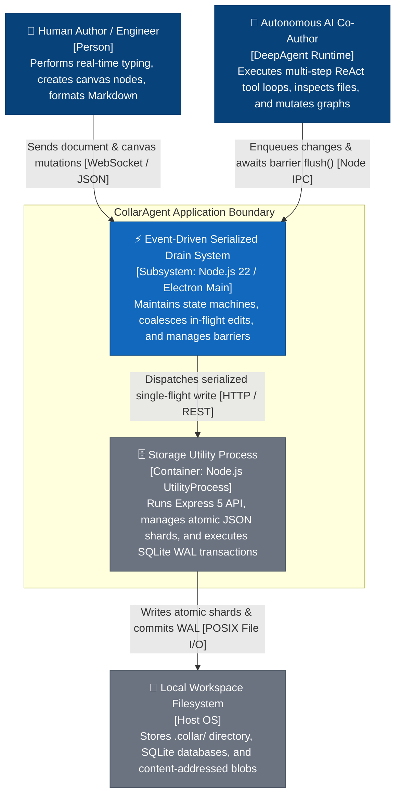
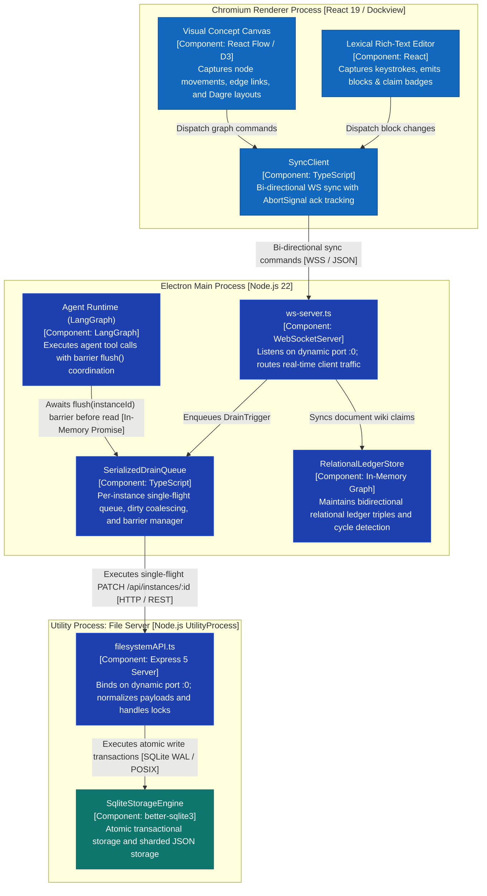
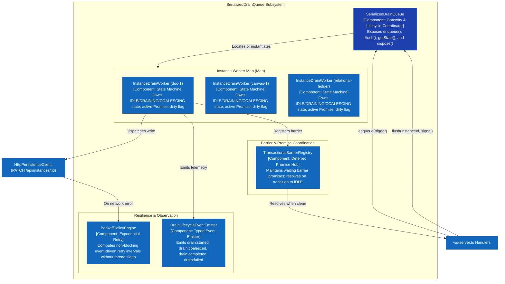
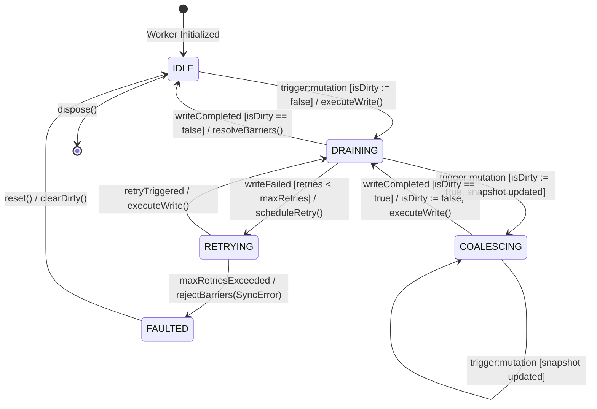
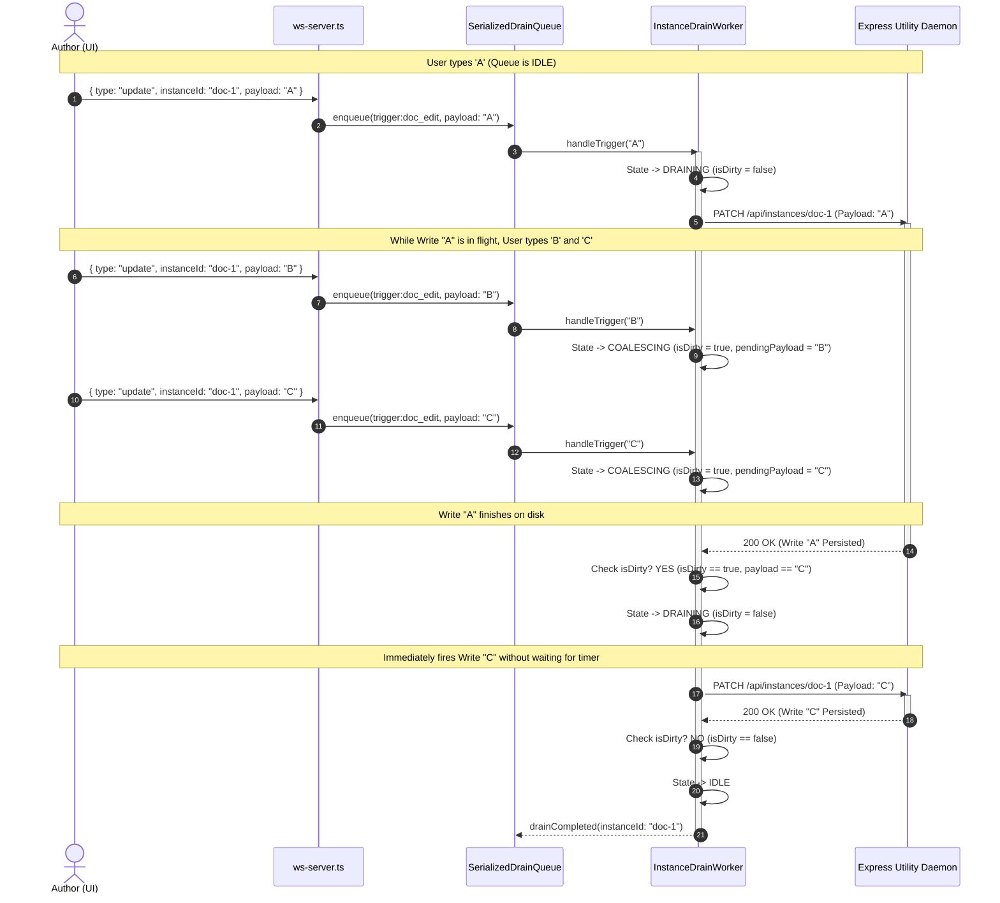
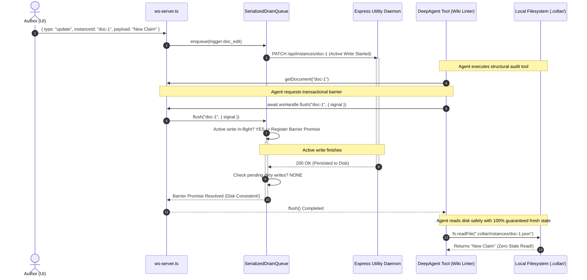
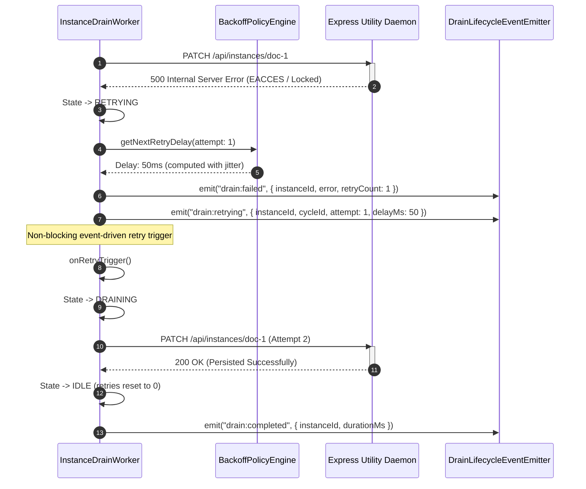

# Event-Driven Serialized Drain System: System Architecture

## 1. Architectural Overview & Design Goals

The **Event-Driven Serialized Drain System** is the transactional core that coordinates real-time in-memory workspace mutations (Lexical rich-text documents, visual canvas DAG commands, and relational knowledge-graph ledger claims) and their persistent disk representation in CollarAgent's local-first architecture.

### Primary Architectural Goals:

1. **Single-Flight Serialization**: Guarantee that for any given instance (document, canvas, or ledger), at most one disk I/O operation is executing at any moment.
2. **Deterministic Barrier Synchronization**: Provide a `flush(instanceId)` barrier that allows autonomous AI agents and test harnesses to await complete disk synchronization before performing filesystem reads, eliminating read-after-write race conditions.
3. **Zero Hardcoded Timeout Delays**: Replace temporal debouncing (`setTimeout(..., 500)`) with an event-driven state machine that fires immediately when the I/O channel is idle and coalesces continuous modifications without artificial latency.
4. **End-to-End Cancellation Propagation**: Propagate `AbortSignal` through all asynchronous drain, barrier, and retry phases without dangling handles.
5. **Fail-Closed Diagnostic Taxonomy**: Eliminate unhandled timer rejections and silent failures; categorize all synchronization errors under the centralized `SYNC_` error code taxonomy with preserved error causes.

---

## 2. Level 1: System Context (C1)

The C1 diagram shows the primary human and autonomous actors collaborating within CollarAgent and interacting with the local persistence boundary.

---

## 3. Level 2: Container Topology (C2)

The C2 diagram details the multi-process Electron boundaries, ports, and wire protocols connecting the Renderer, Main Host, and Utility Process.

---

## 4. Level 3: Component Architecture (C3)

The C3 diagram zooms into the internal components of the `SerializedDrainQueue` subsystem within the Main Process.

### Component Responsibilities:

- **`SerializedDrainQueue` (Gateway - `ISerializedDrainQueue`)**: The central access point. Routes triggers to per-instance workers, manages worker lifecycle (instantiation, clean eviction via `evict(instanceId)` or `trigger:instance_deleted` to prevent memory leaks), and coordinates global or per-instance `flush(instanceId?, options?: FlushOptions)` barriers.
- **`InstanceDrainWorker` (State Machine Engine - `IInstanceDrainWorker`)**: Owns the lifecycle for a single instance. Maintains the active drain promise, current in-memory `InstancePayload` (supporting rich-text `DocumentPayload`, canvas `GraphCanvasDTO`, and relational ledger edges), dirty bit, and failure retry counter.
- **`TransactionalBarrierRegistry` (`ITransactionalBarrierRegistry`)**: Manages collections of deferred promises created by `flush()` calls with `FlushOptions` (`AbortSignal` cancellation and optional timeout deadline). When an instance reaches the `IDLE` state with no dirty state remaining, all associated barrier promises resolve concurrently.
- **`BackoffPolicyEngine` (`IBackoffPolicyEngine`)**: Pure mathematical module calculating exponential retry delays with jitter based on `BackoffPolicyConfig`. Never calls `sleep()`; yields a retry signal used by the worker's asynchronous event loop.
- **`DrainLifecycleEventEmitter`**: Strictly typed EventEmitter broadcasting diagnostic events (`drain:started`, `drain:coalesced`, `drain:completed`, `drain:failed`, `drain:retrying`, `drain:idle`) for testing, auditing, and Langfuse/OpenTelemetry telemetry.

---

## 5. Level 4: Code & Detailed Dynamics (C4)

### 5.1 Finite State Machine: `InstanceDrainWorker`

### State Machine Transition Rules:

| Current State               | Inbound Trigger / Event                        | Guard Condition            | Next State       | Action / Side Effect                                                                                |
| :-------------------------- | :--------------------------------------------- | :------------------------- | :--------------- | :-------------------------------------------------------------------------------------------------- |
| **`IDLE`**                  | `trigger:mutation` / `trigger:document_edit`   | None                       | **`DRAINING`**   | Set `isDirty = false`, store latest snapshot, launch active write promise.                          |
| **`IDLE`**                  | `trigger:canvas_snapshot`                      | None                       | **`DRAINING`**   | Set `isDirty = false`, store latest `GraphCanvasDTO` snapshot, launch active write promise.         |
| **`IDLE`**                  | `trigger:flush_barrier`                        | `isDirty == false`         | **`IDLE`**       | Immediately resolve barrier promise (already consistent).                                           |
| **`DRAINING`**              | `trigger:mutation` / `trigger:canvas_snapshot` | Active write in-flight     | **`COALESCING`** | Set `isDirty = true`, overwrite in-memory pending snapshot with latest payload.                     |
| **`DRAINING`**              | `trigger:flush_barrier`                        | None                       | **`DRAINING`**   | Register deferred promise in barrier registry for current cycle.                                    |
| **`DRAINING`**              | `writeCompleted`                               | `isDirty == false`         | **`IDLE`**       | Resolve all registered barrier promises; emit `drain:completed`.                                    |
| **`DRAINING`**              | `writeCompleted`                               | `isDirty == true`          | **`DRAINING`**   | Reset `isDirty = false`; immediately trigger new write promise with coalesced payload.              |
| **`DRAINING`**              | `writeFailed`                                  | `retryCount < maxRetries`  | **`RETRYING`**   | Increment `retryCount`; schedule next event-driven retry; emit `drain:failed` and `drain:retrying`. |
| **`COALESCING`**            | `trigger:mutation` / `trigger:canvas_snapshot` | None                       | **`COALESCING`** | Update latest in-memory payload (coalesce newest state).                                            |
| **`COALESCING`**            | `writeCompleted`                               | None                       | **`DRAINING`**   | Active write resolved; reset `isDirty = false`; fire next write immediately.                        |
| **`RETRYING`**              | `retryTriggered`                               | None                       | **`DRAINING`**   | Dispatch write attempt to storage HTTP API.                                                         |
| **`RETRYING`**              | `maxRetriesExceeded`                           | `retryCount >= maxRetries` | **`FAULTED`**    | Reject all waiting barriers with `SYNC_DRAIN_PERSIST_FAILED`; emit `drain:failed`.                  |
| **`ANY (Except DISPOSED)`** | `trigger:instance_deleted` / `evict(id)`       | None                       | **`DISPOSED`**   | Reject pending barriers with `SYNC_DRAIN_QUEUE_DISPOSED`, clear in-memory buffers, teardown worker. |

---

### 5.2 Runtime Sequence Flow 1: High-Frequency Keystroke Coalescing

This sequence illustrates how continuous user typing (keystrokes A, B, C in rapid succession) is safely coalesced into exactly two single-flight writes without temporal timers.

---

### 5.3 Runtime Sequence Flow 2: Autonomous AI Agent Read Barrier (`flush()`)

This sequence illustrates how an AI Agent tool call eliminates read-after-write race conditions by awaiting `flush()` before inspecting the filesystem.

---

### 5.4 Runtime Sequence Flow 3: Error Backpressure & Non-Blocking Retry

This sequence illustrates how the system handles transient disk or network errors without blocking threads or losing data.

