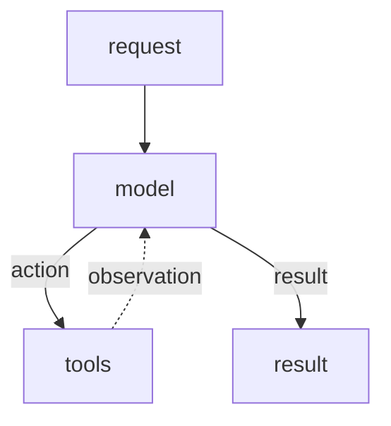
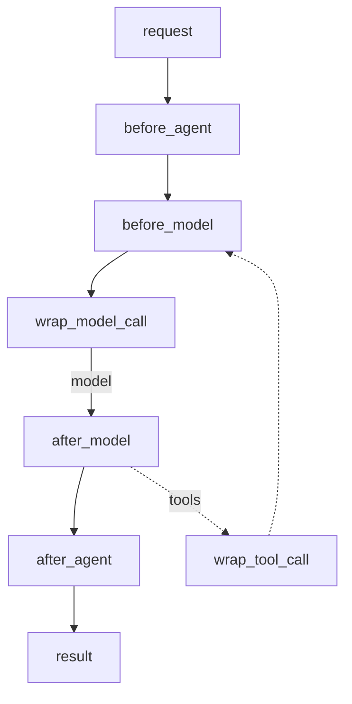

# Overview

> Control and customize agent execution at every step

Middleware provides a way to more tightly control what happens inside the agent. Middleware is useful for the following:

* Tracking agent behavior with logging, analytics, and debugging.
* Transforming prompts, [tool selection](docs/langchain/middleware/built-in#llm-tool-selector), and output formatting.
* Adding [retries](docs/langchain/middleware/built-in#tool-retry), [fallbacks](docs/langchain/middleware/built-in#model-fallback), and early termination logic.
* Applying [rate limits](docs/langchain/middleware/built-in#model-call-limit), guardrails, and [PII detection](docs/langchain/middleware/built-in#pii-detection).

Add middleware by passing them to `createAgent`:

```typescript  theme={null}
import {
  createAgent,
  summarizationMiddleware,
  humanInTheLoopMiddleware,
} from "langchain";

const agent = createAgent({
  model: "gpt-4o",
  tools: [...],
  middleware: [summarizationMiddleware, humanInTheLoopMiddleware],
});
```

## The agent loop

The core agent loop involves calling a model, letting it choose tools to execute, and then finishing when it calls no more tools:



Middleware exposes hooks before and after each of those steps:


