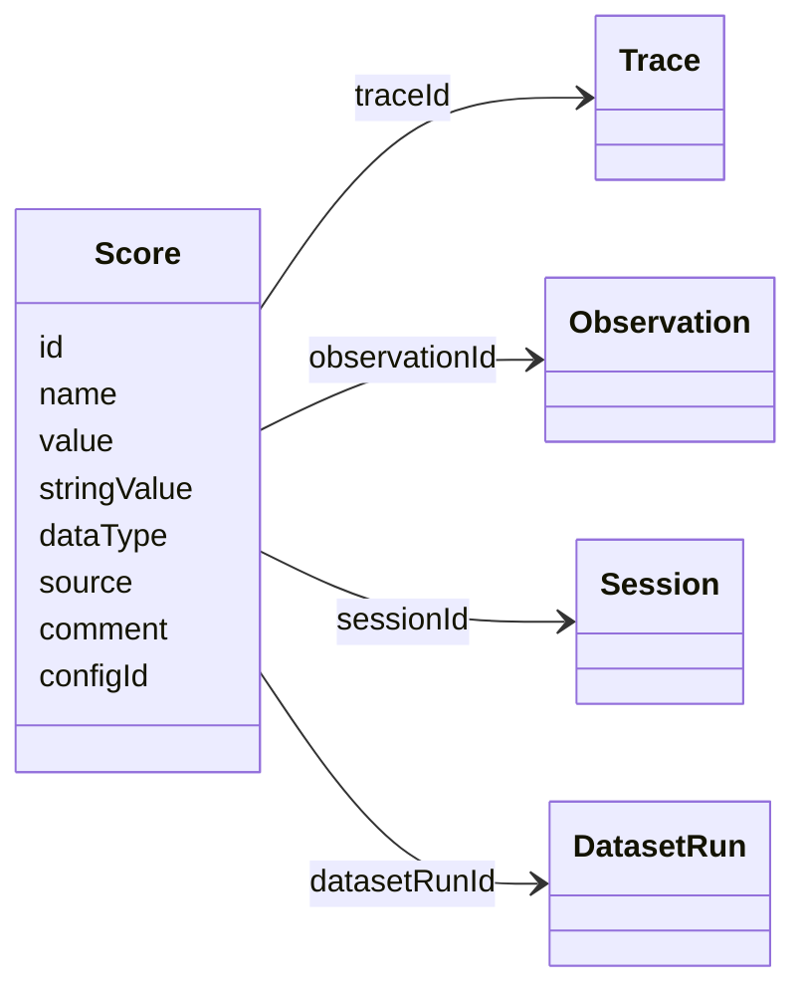
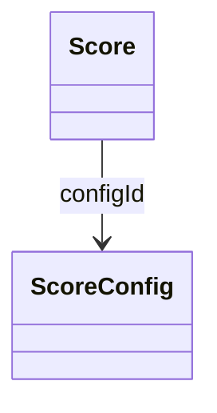

# Evaluation Overview

Evals give you a repeatable check of your LLM application's behavior. You replace guesswork with data, and catch regressions before you ship a change.

<Frame fullWidth>
  
</Frame>

Evaluation runs across most of the [AI engineering loop](/academy/ai-engineering-loop): you score live traces in production, turn interesting examples into datasets, run experiments to compare changes, and judge the results with manual or automated evaluators. It happens both **online**, on live production traces, and **offline**, before you ship a change.

The AI Engineering Loop:

- [Trace](/academy/tracing): traces, sessions, agents, prompts
- [Monitor](/academy/monitoring): dashboards, LLM-as-judge, feedback
- [Build datasets](/academy/datasets): datasets, features-as-tests
- [Experiment](/academy/experiments): prompts, models, code variants
- [Evaluate](/academy/evaluate): judges, custom evals, annotation

Want to see it in action? [**Create a free account**](/cloud) and explore Langfuse Evaluation in the [interactive example project](/docs/demo).

## Getting Started

Start with the [Core Concepts](/docs/evaluation/core-concepts) page. It explains how evaluators, scores, datasets, and experiments fit together in Langfuse, which makes the rest of the docs much easier to navigate.

Once you have that context, use the table below to find the right feature page:

| If you want to...                                   | Use this Langfuse feature                                                                                                                                                                                                                   |
| --------------------------------------------------- | ------------------------------------------------------------------------------------------------------------------------------------------------------------------------------------------------------------------------------------------- |
| Review and rate traces manually                     | [Annotation Queues](/docs/evaluation/evaluation-methods/annotation-queues), [Scores via UI](/docs/evaluation/evaluation-methods/scores-via-ui)                                                                                              |
| Collect feedback from your end users                | [User Feedback](/docs/observability/features/user-feedback)                                                                                                                                                                                 |
| Leave open-ended notes on traces                    | [Text scores](/docs/evaluation/scores/overview#score-types), [Annotation Queues](/docs/evaluation/evaluation-methods/annotation-queues)                                                                                                     |
| Build a reusable set of test cases                  | [Datasets](/docs/evaluation/experiments/datasets)                                                                                                                                                                                           |
| Compare prompt, model, or code changes side by side | [Experiments via UI](/docs/evaluation/experiments/experiments-via-ui), [Experiments via SDK](/docs/evaluation/experiments/experiments-via-sdk), [Experiments via OpenTelemetry](/docs/evaluation/experiments/experiments-via-opentelemetry) |
| Block deploys on regressions                        | [CI/CD experiments](/docs/evaluation/experiments/experiments-ci-cd)                                                                                                                                                                         |
| Run deterministic checks                            | [Code Evaluators](/docs/evaluation/evaluation-methods/code-evaluators)                                                                                                                                                                      |
| Automatically score live production traces          | [LLM-as-a-Judge](/docs/evaluation/evaluation-methods/llm-as-a-judge), [Scores via API/SDK](/docs/evaluation/evaluation-methods/scores-via-sdk)                                                                                              |
| See how scores trend over time                      | [Score Analytics](/docs/evaluation/scores/score-analytics), [custom dashboards](/docs/metrics/features/custom-dashboards)                                                                                                                   |

Already know what you're looking for? Browse _Evaluation Methods_ and _Experiments_ in the sidebar.

## GitHub Discussions

<!-- agent-instructions -->

---

## Agent Instructions

This page is part of the [Langfuse](https://langfuse.com) documentation, published as plain Markdown for AI agents. Every page is available as Markdown by appending `.md` to its URL, or by sending an `Accept: text/markdown` header. This page: `https://langfuse.com/docs/evaluation/overview.md`.

### Querying these docs

If the answer is not on this page, query the documentation instead of guessing:

- **Semantic search** across all Langfuse docs, returning an answer with the relevant pages and excerpts. Ask a specific, self-contained question:

  ```bash
  curl -sG "https://langfuse.com/api/search-docs" --data-urlencode "query=How do I trace a LangGraph agent?"
  ```

- **Index of every page**: <https://langfuse.com/llms.txt>, with per-section indexes [llms-docs.txt](https://langfuse.com/llms-docs.txt), [llms-integrations.txt](https://langfuse.com/llms-integrations.txt), and [llms-self-hosting.txt](https://langfuse.com/llms-self-hosting.txt).

### Before writing Langfuse code

- **Install the [Langfuse Agent Skill](https://langfuse.com/docs/api-and-data-platform/features/agent-skill).** It encodes Langfuse's own best practices for instrumentation, prompt management, and evaluation, and materially improves results.
- **Read [What does a good trace look like?](https://langfuse.com/docs/observability/best-practices.md)** before instrumenting an application.
- **Verify endpoints, parameters, and response fields** against the [API reference](https://api.reference.langfuse.com) instead of inferring them from code examples.
- **Use the [Langfuse CLI](https://langfuse.com/docs/api-and-data-platform/features/cli)** (`npx langfuse-cli api <resource> <action>`) to read or write traces, prompts, datasets, and scores from the terminal.

Found an error in these docs? Please open an issue at <https://github.com/langfuse/langfuse-docs/issues>.

---

---

title: Concepts
description: Learn the fundamental concepts behind LLM evaluation in Langfuse - Scores, Evaluation Methods, Datasets, and Experiments.
---

# Core Concepts

This page digs into the different concepts of evaluations, and what's available in Langfuse.

If you are still deciding _what_ to measure, [Choosing what to evaluate in the Langfuse Academy](/academy/evaluate/choosing-what-to-evaluate) works through how to turn observed failures into a small set of metrics, and [Writing good evaluators](/academy/evaluate/writing-evaluators) covers how to make those checks trustworthy.

Ready to start?

- [Create a dataset](/docs/evaluation/experiments/datasets) to measure your LLM application's performance consistently
- [Run an experiment](/docs/evaluation/core-concepts#experiments) to get an overview of how your application is doing
- [Set up LLM-as-a-Judge](/docs/evaluation/evaluation-methods/llm-as-a-judge) to evaluate your live traces
- [Create a code evaluator](/docs/evaluation/evaluation-methods/code-evaluators) for deterministic checks

## The Evaluation Loop

LLM applications often have a constant [loop of testing and monitoring](/academy/ai-engineering-loop).

**[Offline evaluation](/academy/evaluate)** lets you test your application against a fixed dataset before you deploy. You run your new prompt or model against test cases, review the [scores](#scores), iterate until the results look good, then deploy your changes. In Langfuse, you can do that by running [Experiments](/docs/evaluation/core-concepts#experiments).

**[Online evaluation](/academy/monitoring)** scores live traces to catch issues in real traffic. When you find edge cases your dataset didn't cover, you add them back to your dataset so future experiments will catch them.

The AI Engineering Loop:

- [Trace](/academy/tracing): traces, sessions, agents, prompts
- [Monitor](/academy/monitoring): dashboards, LLM-as-judge, feedback
- [Build datasets](/academy/datasets): datasets, features-as-tests
- [Experiment](/academy/experiments): prompts, models, code variants
- [Evaluate](/academy/evaluate): judges, custom evals, annotation

> **Here's an example workflow** for building a customer support chatbot
>
> 1. You update your prompt to make responses less formal.
> 2. Before deploying, you run an **experiment**: test the new prompt against your dataset of customer questions **(offline evaluation)**.
> 3. You review the scores and outputs. The tone improved, but responses are longer and some miss important links.
> 4. You refine the prompt and run the experiment again.
> 5. The results look good now. You deploy the new prompt to production.
> 6. You monitor with **online evaluation** to catch any new edge cases.
> 7. You notice that a customer asked a question in French, but the bot responded in English.
> 8. You add this French query to your dataset so future experiments will catch this issue.
> 9. You update your prompt to support French responses and run another experiment.
>
> Over time, your dataset grows from a couple of examples to a diverse, representative set of real-world test cases.

## Scores [#scores]

[Scores](/docs/evaluation/scores/overview) are Langfuse's universal data object for storing evaluation results. Any time you want to assign a quality judgment to an LLM output, whether by a human annotation, an LLM judge, a programmatic check, or end-user feedback, the result is stored as a score.

Scores can be attached to traces, observations, sessions, or dataset runs. Every score has a **name**, a **value**, and a **data type** (`NUMERIC`, `CATEGORICAL`, `BOOLEAN`, or `TEXT`). Learn more about [score types](/docs/evaluation/scores/overview#score-types), [how to create scores](/docs/evaluation/scores/overview#how-to-create-scores), and [score analytics](/docs/evaluation/scores/score-analytics) on the dedicated [Scores](/docs/evaluation/scores/overview) page.

## Evaluation Methods [#evaluation-methods]

Evaluation methods are the functions that score traces, observations, sessions, or dataset runs. You can use a variety of evaluation methods to add [scores](#scores).

| Method                                                                     | What                                                                       | Use when                                                                  |
| -------------------------------------------------------------------------- | -------------------------------------------------------------------------- | ------------------------------------------------------------------------- |
| [LLM-as-a-Judge](/docs/evaluation/evaluation-methods/llm-as-a-judge)       | Use an LLM to evaluate outputs based on custom criteria                    | Subjective assessments at scale (tone, accuracy, helpfulness)             |
| [Code evaluators](/docs/evaluation/evaluation-methods/code-evaluators)     | Run custom Python or TypeScript logic to score observations or experiments | Deterministic checks, structured output validation, custom business rules |
| [Scores via UI](/docs/evaluation/evaluation-methods/scores-via-ui)         | Manually add scores to traces directly in the Langfuse UI                  | Quick quality spot checks, reviewing individual traces                    |
| [Annotation Queues](/docs/evaluation/evaluation-methods/annotation-queues) | Structured human review workflows with customizable queues                 | Building ground truth, systematic labeling, team collaboration            |
| [Scores via API/SDK](/docs/evaluation/evaluation-methods/scores-via-sdk)   | Programmatically add scores using the Langfuse API or SDK                  | Custom evaluation pipelines, deterministic checks, automated workflows    |

When setting up new evaluation methods, you can use [Score Analytics](/docs/evaluation/scores/score-analytics) to analyze or sense-check the scores you produce.

## Online evaluation [#online-evaluation]

For online evaluation, create a rule to match incoming production observations. The rule triggers its attached evaluators, which score those observations. This helps you catch issues in real traffic.

### Evaluators and rules [#evaluators-and-rules]

Evaluators define how Langfuse scores data. Rules define which incoming observations Langfuse scores.

<table>
  <thead>
    <tr>
      <th>What</th>
      <th>Used for</th>
    </tr>
  </thead>
  <tbody>
    <tr>
      <td>Evaluator</td>
      <td>
        <ul>
          <li>
            [Batch evaluation](#batch-evaluation): score selected historical observations.
          </li>
          <li>
            [Online evaluation](#online-evaluation): attach it to a rule to score incoming production observations.
          </li>
          <li>
            [Prompt experiments](/docs/evaluation/experiments/experiments-via-ui): score experiment runs.
          </li>
        </ul>
      </td>
    </tr>
    <tr>
      <td>Rule</td>
      <td>You want to select incoming observations using filters and a sampling rate, then trigger one or more evaluators on them.</td>
    </tr>
  </tbody>
</table>

You can reuse an evaluator across rules. For LLM-as-a-Judge, Langfuse validates the evaluator's default variable mapping against observations that match the rule. Override the mapping for a specific evaluator-rule assignment when the data has a different shape.

### Monitoring with dashboards

Use [custom dashboards](/docs/metrics/features/custom-dashboards) to monitor scores and application performance over time.

## Batch evaluation [#batch-evaluation]

Use batch evaluation to score a selected set of historical observations after they have been ingested. This is useful when you want to test a new or updated evaluator against existing production data.

To use an LLM-as-a-Judge evaluator for batch evaluation, enable the [Langfuse v4 preview](/docs/v4) toggle for the evaluator. To use the same evaluator on newly ingested data in real time, upgrade to Python SDK ≥ 4.7.0 or JS/TS SDK ≥ 5.4.0. If you ingest directly via OTEL, [set `x-langfuse-ingestion-version: 4` on your OTEL span exporter](/integrations/native/opentelemetry#real-time-ingestion).

1. Open the Traces table.
2. Filter to the timeframe and trace criteria you want to evaluate.
3. Select the matching rows.
4. Click Actions → Evaluate.
5. Choose an evaluator and run it on the selected traces.

<Frame fullWidth>
  
</Frame>

The resulting scores are attached to the matching observations in each selected trace.

## Experiments [#experiments]

An experiment runs your application against a dataset and evaluates the outputs. This is how you test changes before deploying to production.

### Definitions

Before diving into experiments, it's helpful to understand the building blocks in Langfuse: datasets, dataset items, tasks, scores, and experiments.

| Object                | Definition                                                                                                                                                                                                                                                                                                                                               |
| --------------------- | -------------------------------------------------------------------------------------------------------------------------------------------------------------------------------------------------------------------------------------------------------------------------------------------------------------------------------------------------------- |
| **Dataset**           | A collection of test cases (dataset items). You can run experiments on a dataset.                                                                                                                                                                                                                                                                        |
| **Dataset item**      | One item in a dataset. Each dataset item contains an input (the scenario to test) and optionally an expected output.                                                                                                                                                                                                                                     |
| **Task**              | The application code that you want to test in an experiment. This will be performed on each dataset item, and you will score the output.                                                                                                                                                                                                                 |
| **Evaluation Method** | A function that scores experiment results. In the context of a Langfuse experiment, this can be a [code evaluator](/docs/evaluation/evaluation-methods/code-evaluators), a score ingested from your own code via [API/SDK](/docs/evaluation/evaluation-methods/scores-via-sdk), or [LLM-as-a-Judge](/docs/evaluation/evaluation-methods/llm-as-a-judge). |
| **Score**             | The output of an evaluation. See [Scores](#scores) for the available data types and details.                                                                                                                                                                                                                                                             |
| **Experiment Run**    | A single execution of your task against all items in a dataset, producing outputs (and scores).                                                                                                                                                                                                                                                          |

You can find the data model for these objects [here](/docs/evaluation/experiments/data-model).

### How these work together

This is what happens conceptually:

When you run an experiment on a given **dataset**, each of the **dataset items** will be passed to the **task function** you defined. The task function is generally an LLM call that happens in your application, that you want to test. The task function produces an output for each dataset item. This process is called an **experiment run**. The resulting collection of outputs linked to the dataset items are the **experiment results**.

Often, you want to score these experiment results. You can use various [evaluation methods](#evaluation-methods) that take in the dataset item and the output produced by the task function, and produce a score based on criteria you define. Based on these scores, you can then get a complete picture of how your application performs across all test cases.

<Frame fullWidth>
  
</Frame>

You can compare experiment runs to see if a new prompt version improves scores, or identify specific inputs where your application struggles. Based on these experiment results, you can decide whether the change is ready to be deployed to production.

You can find more details on how these objects link together under the hood on the [data model page](/docs/evaluation/experiments/data-model).

### Ways to run experiments

You can **run experiments programmatically using the Langfuse SDK**. This gives you full control over the task, evaluation logic, and more. [Learn more about running experiments via SDK](/docs/evaluation/experiments/experiments-via-sdk).

You can **run experiments directly from the Langfuse interface** by selecting a dataset and prompt version. This is useful for quick iterations on prompts without writing code. [Learn more about running experiments via UI](/docs/evaluation/experiments/experiments-via-ui).

If you already emit traces through OpenTelemetry and are not using the Python or JS/TS SDK, **attach experiment attributes to those spans** so Langfuse groups them as an experiment run. [Learn more about experiments via OpenTelemetry](/docs/evaluation/experiments/experiments-via-opentelemetry).

      **Langfuse Execution**


      **Local/CI Execution**


      **Langfuse Dataset**


      [Experiments via UI](/docs/evaluation/experiments/experiments-via-ui)


      [Experiments via SDK](/docs/evaluation/experiments/experiments-via-sdk) or
      [OpenTelemetry](/docs/evaluation/experiments/experiments-via-opentelemetry)


      **Local Dataset**


      Not supported


      [Experiments via SDK](/docs/evaluation/experiments/experiments-via-sdk) or
      [OpenTelemetry](/docs/evaluation/experiments/experiments-via-opentelemetry)

_While it's optional, we recommend managing the underlying [Datasets](/docs/evaluation/experiments/datasets) in Langfuse as it allows for [1] In-UI comparison tables of different experiments on the same data and [2] Iteratively improve dataset based on production/staging traces._

<!-- agent-instructions -->

---

## Agent Instructions

This page is part of the [Langfuse](https://langfuse.com) documentation, published as plain Markdown for AI agents. Every page is available as Markdown by appending `.md` to its URL, or by sending an `Accept: text/markdown` header. This page: `https://langfuse.com/docs/evaluation/core-concepts.md`.

### Querying these docs

If the answer is not on this page, query the documentation instead of guessing:

- **Semantic search** across all Langfuse docs, returning an answer with the relevant pages and excerpts. Ask a specific, self-contained question:

  ```bash
  curl -sG "https://langfuse.com/api/search-docs" --data-urlencode "query=How do I trace a LangGraph agent?"
  ```

- **Index of every page**: <https://langfuse.com/llms.txt>, with per-section indexes [llms-docs.txt](https://langfuse.com/llms-docs.txt), [llms-integrations.txt](https://langfuse.com/llms-integrations.txt), and [llms-self-hosting.txt](https://langfuse.com/llms-self-hosting.txt).

### Before writing Langfuse code

- **Install the [Langfuse Agent Skill](https://langfuse.com/docs/api-and-data-platform/features/agent-skill).** It encodes Langfuse's own best practices for instrumentation, prompt management, and evaluation, and materially improves results.
- **Read [What does a good trace look like?](https://langfuse.com/docs/observability/best-practices.md)** before instrumenting an application.
- **Verify endpoints, parameters, and response fields** against the [API reference](https://api.reference.langfuse.com) instead of inferring them from code examples.
- **Use the [Langfuse CLI](https://langfuse.com/docs/api-and-data-platform/features/cli)** (`npx langfuse-cli api <resource> <action>`) to read or write traces, prompts, datasets, and scores from the terminal.

Found an error in these docs? Please open an issue at <https://github.com/langfuse/langfuse-docs/issues>.

---

---

title: Overview
description: Scores are Langfuse's universal data object for storing evaluation results. Learn about score types, how to create scores, and when to use them.
sidebarTitle: Overview
---

# Scores

Scores are Langfuse's universal data object for storing evaluation results. Any time you want to assign a quality judgment to an LLM output, whether by a [human annotation](/docs/evaluation/evaluation-methods/scores-via-ui), an [LLM judge](/docs/evaluation/evaluation-methods/llm-as-a-judge), a [programmatic check](/docs/evaluation/evaluation-methods/scores-via-sdk), or end-user feedback, the result is stored as a score.

Every score has a **name** (like `"correctness"` or `"helpfulness"`), a **value**, and a **[data type](#score-types)**. Scores also support an optional **[comment](#score-comments)** for additional context.

Scores can be attached to [traces](/docs/observability/data-model#observations-and-traces), [observations](/docs/observability/data-model#observations-and-traces), [sessions](/docs/observability/data-model#sessions), or [dataset runs](/docs/evaluation/experiments/data-model). Most commonly, scores are attached to traces to evaluate a single end-to-end interaction.

Once you have scores, they show up in [score analytics](/docs/evaluation/scores/score-analytics), can be visualized in [custom dashboards](/docs/metrics/features/custom-dashboards), and can be queried via the [API](/docs/api).

## When to Use Scores [#when-to-use-scores]

Scores become useful when you want to go beyond observing what your application does and start measuring how well it does it. Common use cases:

- **Collecting user feedback**: Capture thumbs up/down or star ratings from your users and attach them to traces. See the [user feedback guide](/docs/observability/features/user-feedback).
- **Monitoring production quality**: Set up automated evaluators (like [LLM-as-a-Judge](/docs/evaluation/evaluation-methods/llm-as-a-judge)) to continuously score live traces for things like hallucination, relevance, or tone.
- **Running guardrails**: Score whether outputs pass safety checks like PII detection, format validation, or content policy compliance.
- **Comparing changes with experiments**: When you change a prompt, model, or pipeline, run an [experiment](/docs/evaluation/experiments) to score the new version against a dataset.

## Score Types [#score-types]

Langfuse supports four score data types:

| Type          | Value                                                                       | Use when                                                                                                                                                                                                                                                |
| ------------- | --------------------------------------------------------------------------- | ------------------------------------------------------------------------------------------------------------------------------------------------------------------------------------------------------------------------------------------------------- |
| `NUMERIC`     | Float (e.g. `0.9`)                                                          | Continuous judgments like accuracy, relevance, or similarity scores                                                                                                                                                                                     |
| `CATEGORICAL` | String from predefined categories (e.g. `"correct"`, `"partially correct"`) | Discrete classifications where the set of possible values is known upfront                                                                                                                                                                              |
| `BOOLEAN`     | `0` or `1`                                                                  | Pass/fail checks like hallucination detection or format validation                                                                                                                                                                                      |
| `TEXT`        | Free-form string (1-500 characters)                                         | Open-ended annotations like reviewer notes or qualitative feedback. Often used for [open coding](https://en.wikipedia.org/wiki/Open_coding) before formalizing into quantifiable scores via [axial coding](https://en.wikipedia.org/wiki/Axial_coding). |

Text scores are designed for qualitative, open-ended scoring. Because free-form text cannot be meaningfully aggregated or compared, text scores are not supported in [experiments](/docs/evaluation/core-concepts#experiments), [LLM-as-a-Judge](/docs/evaluation/evaluation-methods/llm-as-a-judge), or [score analytics](/docs/evaluation/scores/score-analytics).

## How to Create Scores [#how-to-create-scores]

There are five ways to add scores:

- **LLM-as-a-Judge**: Set up [automated evaluators](/docs/evaluation/evaluation-methods/llm-as-a-judge) that score traces based on custom criteria (e.g. hallucination, tone, relevance). These can return numeric or categorical scores plus reasoning, and can run on live production traces or on experiment results.
- **Code evaluators**: Run [custom Python or TypeScript evaluators](/docs/evaluation/evaluation-methods/code-evaluators) in Langfuse for deterministic checks such as exact match, JSON validation, or custom business rules.
- **Scores via UI**: Team members [manually score](/docs/evaluation/evaluation-methods/scores-via-ui) traces, observations, or sessions directly in the Langfuse UI. Requires a [score config](/faq/all/manage-score-configs) to be set up first.
- **Annotation Queues**: Set up [structured review workflows](/docs/evaluation/evaluation-methods/annotation-queues) where reviewers work through batches of traces.
- **Scores via API/SDK**: [Programmatically add scores](/docs/evaluation/evaluation-methods/scores-via-sdk) from your application code. This is the way to go for user feedback (thumbs up/down, star ratings), guardrail results, or custom evaluation pipelines.

## Should I Use Scores or Tags? [#scores-vs-tags]

|                | Scores                                                               | Tags                                                |
| -------------- | -------------------------------------------------------------------- | --------------------------------------------------- |
| **Purpose**    | Measure _how good_ something is                                      | Describe _what_ something is                        |
| **Data**       | Numeric, categorical, boolean, or text value                         | Simple string label                                 |
| **When added** | Can be added at any time, including long after the trace was created | Set during tracing and cannot be changed afterwards |
| **Used for**   | Quality measurement, analytics, experiments                          | Filtering, segmentation, organizing                 |

As a rule of thumb: if you already know the category at tracing time (e.g. which feature or API endpoint triggered the trace), use a [tag](/docs/observability/features/tags). If you need to classify or evaluate traces later, use a score.

## Score Comments [#score-comments]

Every score supports an optional **comment** field. Use it to capture reasoning (e.g. why an LLM judge assigned a particular score), reviewer notes, or context that helps others understand the score value. Comments are shown alongside scores in the Langfuse UI.

Use a [`TEXT` score](#score-types) instead of comments to capture standalone qualitative feedback -- comments are best for additional reasoning on an existing score.

<!-- agent-instructions -->

---

## Agent Instructions

This page is part of the [Langfuse](https://langfuse.com) documentation, published as plain Markdown for AI agents. Every page is available as Markdown by appending `.md` to its URL, or by sending an `Accept: text/markdown` header. This page: `https://langfuse.com/docs/evaluation/scores/overview.md`.

### Querying these docs

If the answer is not on this page, query the documentation instead of guessing:

- **Semantic search** across all Langfuse docs, returning an answer with the relevant pages and excerpts. Ask a specific, self-contained question:

  ```bash
  curl -sG "https://langfuse.com/api/search-docs" --data-urlencode "query=How do I trace a LangGraph agent?"
  ```

- **Index of every page**: <https://langfuse.com/llms.txt>, with per-section indexes [llms-docs.txt](https://langfuse.com/llms-docs.txt), [llms-integrations.txt](https://langfuse.com/llms-integrations.txt), and [llms-self-hosting.txt](https://langfuse.com/llms-self-hosting.txt).

### Before writing Langfuse code

- **Install the [Langfuse Agent Skill](https://langfuse.com/docs/api-and-data-platform/features/agent-skill).** It encodes Langfuse's own best practices for instrumentation, prompt management, and evaluation, and materially improves results.
- **Read [What does a good trace look like?](https://langfuse.com/docs/observability/best-practices.md)** before instrumenting an application.
- **Verify endpoints, parameters, and response fields** against the [API reference](https://api.reference.langfuse.com) instead of inferring them from code examples.
- **Use the [Langfuse CLI](https://langfuse.com/docs/api-and-data-platform/features/cli)** (`npx langfuse-cli api <resource> <action>`) to read or write traces, prompts, datasets, and scores from the terminal.

Found an error in these docs? Please open an issue at <https://github.com/langfuse/langfuse-docs/issues>.

---

---

title: Overview
description: Scores are Langfuse's universal data object for storing evaluation results. Learn about score types, how to create scores, and when to use them.
sidebarTitle: Overview
---

# Scores

Scores are Langfuse's universal data object for storing evaluation results. Any time you want to assign a quality judgment to an LLM output, whether by a [human annotation](/docs/evaluation/evaluation-methods/scores-via-ui), an [LLM judge](/docs/evaluation/evaluation-methods/llm-as-a-judge), a [programmatic check](/docs/evaluation/evaluation-methods/scores-via-sdk), or end-user feedback, the result is stored as a score.

Every score has a **name** (like `"correctness"` or `"helpfulness"`), a **value**, and a **[data type](#score-types)**. Scores also support an optional **[comment](#score-comments)** for additional context.

Scores can be attached to [traces](/docs/observability/data-model#observations-and-traces), [observations](/docs/observability/data-model#observations-and-traces), [sessions](/docs/observability/data-model#sessions), or [dataset runs](/docs/evaluation/experiments/data-model). Most commonly, scores are attached to traces to evaluate a single end-to-end interaction.

Once you have scores, they show up in [score analytics](/docs/evaluation/scores/score-analytics), can be visualized in [custom dashboards](/docs/metrics/features/custom-dashboards), and can be queried via the [API](/docs/api).

## When to Use Scores [#when-to-use-scores]

Scores become useful when you want to go beyond observing what your application does and start measuring how well it does it. Common use cases:

- **Collecting user feedback**: Capture thumbs up/down or star ratings from your users and attach them to traces. See the [user feedback guide](/docs/observability/features/user-feedback).
- **Monitoring production quality**: Set up automated evaluators (like [LLM-as-a-Judge](/docs/evaluation/evaluation-methods/llm-as-a-judge)) to continuously score live traces for things like hallucination, relevance, or tone.
- **Running guardrails**: Score whether outputs pass safety checks like PII detection, format validation, or content policy compliance.
- **Comparing changes with experiments**: When you change a prompt, model, or pipeline, run an [experiment](/docs/evaluation/experiments) to score the new version against a dataset.

## Score Types [#score-types]

Langfuse supports four score data types:

| Type          | Value                                                                       | Use when                                                                                                                                                                                                                                                |
| ------------- | --------------------------------------------------------------------------- | ------------------------------------------------------------------------------------------------------------------------------------------------------------------------------------------------------------------------------------------------------- |
| `NUMERIC`     | Float (e.g. `0.9`)                                                          | Continuous judgments like accuracy, relevance, or similarity scores                                                                                                                                                                                     |
| `CATEGORICAL` | String from predefined categories (e.g. `"correct"`, `"partially correct"`) | Discrete classifications where the set of possible values is known upfront                                                                                                                                                                              |
| `BOOLEAN`     | `0` or `1`                                                                  | Pass/fail checks like hallucination detection or format validation                                                                                                                                                                                      |
| `TEXT`        | Free-form string (1-500 characters)                                         | Open-ended annotations like reviewer notes or qualitative feedback. Often used for [open coding](https://en.wikipedia.org/wiki/Open_coding) before formalizing into quantifiable scores via [axial coding](https://en.wikipedia.org/wiki/Axial_coding). |

Text scores are designed for qualitative, open-ended scoring. Because free-form text cannot be meaningfully aggregated or compared, text scores are not supported in [experiments](/docs/evaluation/core-concepts#experiments), [LLM-as-a-Judge](/docs/evaluation/evaluation-methods/llm-as-a-judge), or [score analytics](/docs/evaluation/scores/score-analytics).

## How to Create Scores [#how-to-create-scores]

There are five ways to add scores:

- **LLM-as-a-Judge**: Set up [automated evaluators](/docs/evaluation/evaluation-methods/llm-as-a-judge) that score traces based on custom criteria (e.g. hallucination, tone, relevance). These can return numeric or categorical scores plus reasoning, and can run on live production traces or on experiment results.
- **Code evaluators**: Run [custom Python or TypeScript evaluators](/docs/evaluation/evaluation-methods/code-evaluators) in Langfuse for deterministic checks such as exact match, JSON validation, or custom business rules.
- **Scores via UI**: Team members [manually score](/docs/evaluation/evaluation-methods/scores-via-ui) traces, observations, or sessions directly in the Langfuse UI. Requires a [score config](/faq/all/manage-score-configs) to be set up first.
- **Annotation Queues**: Set up [structured review workflows](/docs/evaluation/evaluation-methods/annotation-queues) where reviewers work through batches of traces.
- **Scores via API/SDK**: [Programmatically add scores](/docs/evaluation/evaluation-methods/scores-via-sdk) from your application code. This is the way to go for user feedback (thumbs up/down, star ratings), guardrail results, or custom evaluation pipelines.

## Should I Use Scores or Tags? [#scores-vs-tags]

|                | Scores                                                               | Tags                                                |
| -------------- | -------------------------------------------------------------------- | --------------------------------------------------- |
| **Purpose**    | Measure _how good_ something is                                      | Describe _what_ something is                        |
| **Data**       | Numeric, categorical, boolean, or text value                         | Simple string label                                 |
| **When added** | Can be added at any time, including long after the trace was created | Set during tracing and cannot be changed afterwards |
| **Used for**   | Quality measurement, analytics, experiments                          | Filtering, segmentation, organizing                 |

As a rule of thumb: if you already know the category at tracing time (e.g. which feature or API endpoint triggered the trace), use a [tag](/docs/observability/features/tags). If you need to classify or evaluate traces later, use a score.

## Score Comments [#score-comments]

Every score supports an optional **comment** field. Use it to capture reasoning (e.g. why an LLM judge assigned a particular score), reviewer notes, or context that helps others understand the score value. Comments are shown alongside scores in the Langfuse UI.

Use a [`TEXT` score](#score-types) instead of comments to capture standalone qualitative feedback -- comments are best for additional reasoning on an existing score.

<!-- agent-instructions -->

---

## Agent Instructions

This page is part of the [Langfuse](https://langfuse.com) documentation, published as plain Markdown for AI agents. Every page is available as Markdown by appending `.md` to its URL, or by sending an `Accept: text/markdown` header. This page: `https://langfuse.com/docs/evaluation/scores/overview.md`.

### Querying these docs

If the answer is not on this page, query the documentation instead of guessing:

- **Semantic search** across all Langfuse docs, returning an answer with the relevant pages and excerpts. Ask a specific, self-contained question:

  ```bash
  curl -sG "https://langfuse.com/api/search-docs" --data-urlencode "query=How do I trace a LangGraph agent?"
  ```

- **Index of every page**: <https://langfuse.com/llms.txt>, with per-section indexes [llms-docs.txt](https://langfuse.com/llms-docs.txt), [llms-integrations.txt](https://langfuse.com/llms-integrations.txt), and [llms-self-hosting.txt](https://langfuse.com/llms-self-hosting.txt).

### Before writing Langfuse code

- **Install the [Langfuse Agent Skill](https://langfuse.com/docs/api-and-data-platform/features/agent-skill).** It encodes Langfuse's own best practices for instrumentation, prompt management, and evaluation, and materially improves results.
- **Read [What does a good trace look like?](https://langfuse.com/docs/observability/best-practices.md)** before instrumenting an application.
- **Verify endpoints, parameters, and response fields** against the [API reference](https://api.reference.langfuse.com) instead of inferring them from code examples.
- **Use the [Langfuse CLI](https://langfuse.com/docs/api-and-data-platform/features/cli)** (`npx langfuse-cli api <resource> <action>`) to read or write traces, prompts, datasets, and scores from the terminal.

Found an error in these docs? Please open an issue at <https://github.com/langfuse/langfuse-docs/issues>.

---

---

title: Data Model
description: Data model for Score and ScoreConfig objects in Langfuse.
sidebarTitle: Data Model
---

# Scores Data Model

This page describes the data model for score-related objects in Langfuse. For an overview of what scores are and when to use them, see the [Scores overview](/docs/evaluation/scores/overview). For datasets, experiment runs, and function definitions, see the [Experiments data model](/docs/evaluation/experiments/data-model).

For detailed reference please refer to

- the [Python SDK reference](https://python.reference.langfuse.com)
- the [JS/TS SDK reference](https://js.reference.langfuse.com)
- the [API reference](https://api.reference.langfuse.com)

## Scores [#scores]

Scores are the data object to store evaluation results. They are used to assign evaluation scores to traces, observations, sessions, or dataset runs. Scores can be added manually via annotations, programmatically via the SDK/API, or automatically via LLM-as-a-Judge evaluators.

<br />



Scores have the following properties:

- Each Score references **exactly one** of `Trace`, `Observation`, `Session`, or `DatasetRun`
- Scores are either **numeric**, **categorical**, **boolean**, or **text** (see [Score Types](/docs/evaluation/scores/overview#score-types))
- Scores can **optionally be linked to a `ScoreConfig`** to ensure they comply with a specific schema

### Score object [#score-object]

| Attribute       | Type   | Required | Description                                                                                                                                                                                    |
| --------------- | ------ | -------- | ---------------------------------------------------------------------------------------------------------------------------------------------------------------------------------------------- |
| `id`            | string | Yes      | Unique identifier of the score. Auto-generated by SDKs. Optionally can also be used as an idempotency key to update scores.                                                                    |
| `name`          | string | Yes      | Name of the score, e.g. user_feedback, hallucination_eval                                                                                                                                      |
| `value`         | number | No       | Numeric value of the score. Always defined for numeric and boolean scores. Optional for categorical scores. Not used for text scores.                                                          |
| `stringValue`   | string | No       | String value of the score. Used for categorical, boolean (string equivalent), and text data types. Automatically set for categorical scores based on the config if the `configId` is provided. |
| `dataType`      | string | No       | Automatically set based on the config data type when the `configId` is provided. Otherwise can be defined manually as `NUMERIC`, `CATEGORICAL`, `BOOLEAN`, or `TEXT`                           |
| `source`        | string | Yes      | Automatically set based on the source of the score. Can be either `API`, `EVAL`, or `ANNOTATION`                                                                                               |
| `comment`       | string | No       | Evaluation comment, commonly used for user feedback, eval reasoning output or internal notes                                                                                                   |
| `traceId`       | string | No       | Id of the trace the score relates to                                                                                                                                                           |
| `observationId` | string | No       | Id of the observation (e.g. LLM call) the score relates to                                                                                                                                     |
| `sessionId`     | string | No       | Id of the session the score relates to                                                                                                                                                         |
| `datasetRunId`  | string | No       | Id of the dataset run the score relates to                                                                                                                                                     |
| `configId`      | string | No       | Score config id to ensure that the score follows a specific schema. Can be defined in the Langfuse UI or via API.                                                                              |

### Common Use Cases [#common-use-cases]

| Level       | Description                                                                |
| ----------- | -------------------------------------------------------------------------- |
| Trace       | Used for evaluation of a single interaction. (most common)                 |
| Observation | Used for evaluation of a single observation below the trace level.         |
| Session     | Used for comprehensive evaluation of outputs across multiple interactions. |
| Dataset Run | Used for performance scores of a Dataset Run.                              |

## Score Config [#score-config]

Score configs are used to ensure that your scores follow a specific schema. Using score configs allows you to standardize your scoring schema across your team and ensure that scores are consistent and comparable for future analysis.

You can define a `ScoreConfig` in the Langfuse UI or via our API. Configs are immutable but can be archived (and restored anytime).



A score config includes:

- **Score name**
- **Data type:** `NUMERIC`, `CATEGORICAL`, `BOOLEAN`, `TEXT`
- **Constraints on score value range** (Min/Max for numerical, Custom categories for categorical data types, 1-500 characters for text)

### ScoreConfig object [#scoreconfig-object]

| Attribute     | Type    | Required | Description                                                                           |
| ------------- | ------- | -------- | ------------------------------------------------------------------------------------- |
| `id`          | string  | Yes      | Unique identifier of the score config.                                                |
| `name`        | string  | Yes      | Name of the score config, e.g. user_feedback, hallucination_eval                      |
| `dataType`    | string  | Yes      | Can be either `NUMERIC`, `CATEGORICAL`, `BOOLEAN`, or `TEXT`                          |
| `isArchived`  | boolean | No       | Whether the score config is archived. Defaults to false                               |
| `minValue`    | number  | No       | Sets minimum value for numerical scores. If not set, the minimum value defaults to -∞ |
| `maxValue`    | number  | No       | Sets maximum value for numerical scores. If not set, the maximum value defaults to +∞ |
| `categories`  | list    | No       | Defines categories for categorical scores. List of objects with label value pairs     |
| `description` | string  | No       | Provides further description of the score configuration                               |

<!-- agent-instructions -->

---

## Agent Instructions

This page is part of the [Langfuse](https://langfuse.com) documentation, published as plain Markdown for AI agents. Every page is available as Markdown by appending `.md` to its URL, or by sending an `Accept: text/markdown` header. This page: `https://langfuse.com/docs/evaluation/scores/data-model.md`.

### Querying these docs

If the answer is not on this page, query the documentation instead of guessing:

- **Semantic search** across all Langfuse docs, returning an answer with the relevant pages and excerpts. Ask a specific, self-contained question:

  ```bash
  curl -sG "https://langfuse.com/api/search-docs" --data-urlencode "query=How do I trace a LangGraph agent?"
  ```

- **Index of every page**: <https://langfuse.com/llms.txt>, with per-section indexes [llms-docs.txt](https://langfuse.com/llms-docs.txt), [llms-integrations.txt](https://langfuse.com/llms-integrations.txt), and [llms-self-hosting.txt](https://langfuse.com/llms-self-hosting.txt).

### Before writing Langfuse code

- **Install the [Langfuse Agent Skill](https://langfuse.com/docs/api-and-data-platform/features/agent-skill).** It encodes Langfuse's own best practices for instrumentation, prompt management, and evaluation, and materially improves results.
- **Read [What does a good trace look like?](https://langfuse.com/docs/observability/best-practices.md)** before instrumenting an application.
- **Verify endpoints, parameters, and response fields** against the [API reference](https://api.reference.langfuse.com) instead of inferring them from code examples.
- **Use the [Langfuse CLI](https://langfuse.com/docs/api-and-data-platform/features/cli)** (`npx langfuse-cli api <resource> <action>`) to read or write traces, prompts, datasets, and scores from the terminal.

Found an error in these docs? Please open an issue at <https://github.com/langfuse/langfuse-docs/issues>.

---

---

title: LLM-as-a-Judge
sidebarTitle: LLM-as-a-Judge
description: "Learn how LLM-as-a-Judge evaluation works — use large language models to automatically score, evaluate, and monitor your LLM application outputs at scale with rubric-guided assessments."
---

# LLM-as-a-Judge

LLM-as-a-Judge is an evaluation methodology where an LLM is used to assess the quality of outputs produced by another LLM application. Instead of relying solely on human reviewers or simple heuristic metrics, you prompt a capable model (the "judge") to score and reason about application outputs against defined criteria.

This approach has become one of the most popular methods for evaluating LLM applications because it combines the nuance of human judgment with the scalability of automated evaluation.

## How LLM-as-a-Judge Works

The core idea is straightforward: present an LLM with the input, the application's output, and a scoring rubric, then ask it to evaluate the output. The judge model produces a [`score`](/docs/evaluation/scores/overview) along with reasoning explaining its assessment.

A typical LLM-as-a-Judge prompt includes:

1. **Evaluation criteria** — a rubric defining what "good" looks like (e.g., "Score 1 if the answer is factually incorrect, 5 if fully accurate and well-sourced")
2. **Input context** — the original user query or prompt
3. **Output to evaluate** — the application's response
4. **Optional reference** — ground truth or expected output for comparison

The judge model then returns a structured score and reasoning that can be tracked, aggregated, and analyzed over time. In Langfuse, that score can be numeric, categorical, or boolean. Use numeric scores for continuous judgments like helpfulness from `0` to `1`. Use categorical scores when you want explicit labels such as `correct`, `partially_correct`, or `incorrect`. Use boolean scores for binary decisions where the outcome is `true` or `false`, such as whether a user is disagreeing with the assistant, whether a request is out-of-scope, or whether an answer violates policy. For more production-monitoring examples, see [LLM-as-a-Judge for Production Monitoring](/blog/2026-04-01-llm-as-a-judge-production-monitoring).

## Why use LLM-as-a-Judge?

- **Scalable:** Judge thousands of outputs quickly versus human annotators.
- **Human‑like:** Captures nuance (e.g. helpfulness, toxicity, relevance) better than simple metrics, especially when rubric‑guided.
- **Repeatable:** With a fixed rubric, you can rerun the same prompts to get consistent scores.

## How to use LLM-as-a-Judge?

LLM-as-a-Judge evaluators can run on **Observations** (individual operations) or **Experiments** (controlled test datasets). Observation-level evaluators are the recommended target for live production data; trace-level evaluators are deprecated (see below). Your choice depends on whether you're testing in development or monitoring production, and what level of granularity you need.

### Decision Tree

<Card className="border-2 border-primary">
  <CardContent className="p-4 text-center font-semibold">
    Which data needs to be evaluated?
  </CardContent>
</Card>

↓

  <Card className="border-2 border-primary w-full">
    <CardHeader className="p-4">
      <CardTitle className="text-base text-center">Live Production Data</CardTitle>
      <CardDescription className="text-center text-xs">Monitor real-time traffic</CardDescription>
    </CardHeader>
  </Card>

↓

    <Card className="border-2 border-primary">
      <CardContent className="p-3">
        Observations
        Individual operations: LLM calls, retrievals, tool calls
      </CardContent>
    </Card>

  <Card className="border-2 border-primary w-full">
    <CardHeader className="p-4">
      <CardTitle className="text-base text-center">Offline Experiment Data</CardTitle>
      <CardDescription className="text-center text-xs">Test in controlled environment</CardDescription>
    </CardHeader>
  </Card>

↓

  <Card className="border-2 border-primary w-full">
    <CardContent className="p-3">
      Experiments
      Controlled test cases with datasets
    </CardContent>
  </Card>

**Production Pattern**: Teams typically use **Experiments** during development to validate changes, then deploy **Observation-level** evaluators in production for scalable, precise monitoring.

### Understanding Each Evaluation Target [#understanding-each-evaluation-target]

<Tabs items={["Live Production Data", "Offline Experiment Data"]}>
<Tab>

Evaluate live production traffic to monitor your LLM application performance in real-time.

Run evaluators on individual observations within your traces—such as LLM calls, retrieval operations, embedding generations, or tool calls.

#### Data available to observation-level evaluators [#observation-evaluator-context]

Observation-level evaluators map variables from the matched observation. You can select its input, output, metadata, or tool calls. Expected output and experiment item metadata are available only in prompt experiments.

They do not load sibling or child observations from the same trace. If your evaluator needs the overall request and response of an application or agent invocation, target a logical root observation that records that overall input and output. A logical root is an observation without a physical parent or an observation explicitly marked as an application root by the SDK. It can therefore have a physical parent. The evaluator still only sees data on that root observation; it will not automatically include data from child observations unless your application writes the required summary or context onto the root observation.

Use the **Is Root Observation** filter in a [rule](/docs/evaluation/core-concepts#evaluators-and-rules) to target logical roots. This is different from filtering for an empty physical parent, which only selects observations without a physical parent.

**Why target Observations**

- **Dramatically faster execution**: Evaluations complete in seconds, not minutes. Eliminates evaluation delays and backlogs. Asynchronous architecture processes thousands of evaluations per minute.
- **Operation-level precision**: Filter by observation type to evaluate only final LLM responses or retrieval steps, not entire workflows. Reduces evaluation volume and cost by targeting specific operations.
- **Compositional evaluation**: Run different evaluators on different operations within one trace. Toxicity on LLM outputs, relevance on retrievals, accuracy on generations—simultaneously.
- **Combined filtering**: Stack observation filters (type, name, metadata) with trace filters (userId, sessionId, tags, version). Example: "all LLM generations in conversations tagged 'customer-support' for premium users".

**Data Flow**

When an incoming observation matches a rule's filters, the rule triggers its attached evaluators. Scores are attached to the specific observation, resulting in one score per observation per evaluator. Multiple observations in the same trace can each receive scores.

**Example Use Cases**

- Evaluate helpfulness of only the final chatbot response to users
- Monitor toxicity scores on all customer-facing LLM generations
- Track retrieval relevance for RAG systems by targeting document retrieval observations

</Tab>

<Tab>

Run evaluators on controlled test datasets to compare model versions, prompt variations, or system configurations in a reproducible environment.

**Why target Experiments**

- You need reproducible benchmarks for decision-making
- Comparing multiple prompt versions or model configurations
- You have datasets with expected outputs (ground truth)

**Data Flow**

Each experiment run generates traces that are automatically scored by your selected evaluators. Think of each experiment item as a test case: input → execution → output → evaluation.

1. Create a dataset with test inputs and (optionally) expected outputs. You may also define your test data locally.
2. Run experiment via UI or SDK—this executes your application code for each dataset item. See [Experiments via UI](/docs/evaluation/experiments/experiments-via-ui) or [Experiments via SDK](/docs/evaluation/experiments/experiments-via-sdk) for more information.
3. Selected evaluators to automatically score the generated outputs
4. Compare results across experiment runs to make data-driven decisions

**Example Use Case**

- Compare GPT-4 vs Claude Opus on 50 customer support questions, evaluate both for accuracy and helpfulness, then deploy the better-performing model

</Tab>
</Tabs>

## Set up step-by-step [#set-up-step-by-step]

<Steps>

### Set up an LLM Connection

To use an LLM-as-a-Judge evaluator, you need to set up an [LLM Connection](/docs/administration/llm-connection).

### Create an LLM-as-a-Judge evaluator

Go to the Evaluators page and click **New evaluator**. In the template gallery, choose **LLM-as-a-Judge** to start with a blank prompt, or select a template provided by Langfuse. A template prepopulates a new evaluator that you can edit without changing the original.

<Frame fullWidth>
  
</Frame>

### Define the evaluator

An evaluator defines how data is scored: its [judge prompt](/academy/evaluate/writing-evaluators#writing-a-good-llm-as-a-judge), model, score definition, and default variable mappings. [Rules](/docs/evaluation/core-concepts#evaluators-and-rules) select the incoming observations on which it runs.

1. Select the model to use. Use the [project default model](#project-default-model) or set a dedicated model for this evaluator.
2. Write or edit the evaluation prompt with `{{variables}}` for the data the judge needs, such as `{{input}}`, `{{output}}`, or `{{ground_truth}}`.
3. Choose a [score type](/docs/evaluation/scores/overview#score-types): Numeric for values such as helpfulness from `0` to `1`, Categorical for labels, or Boolean for `true` / `false` decisions. For Categorical scores, define the allowed categories. You can allow multiple matches when more than one category may apply.

### Map variables

Map each prompt variable by clicking the data you want to use. For online evaluation, you can select an observation's input, output, metadata, or tool calls. If you plan to use the evaluator in prompt experiments, also map **Expected Output** and **Experiment Item Metadata**.

### Test evaluator

On the right, filter to representative sample observations, select one, and run the evaluator. Inspect the score and reasoning, then iterate on the model, prompt, score definition, or mappings until the result is useful.

<Frame fullWidth>
  
</Frame>

### Save the evaluator

After saving, you can:

- Create a [rule](/docs/evaluation/core-concepts#evaluators-and-rules) from the filters you used to select test samples, or attach the evaluator to an existing rule to run it on incoming observations.
- Continue without a rule. You can still use the evaluator for [batch evaluation](/docs/evaluation/core-concepts#batch-evaluation) or [prompt experiments](/docs/evaluation/experiments/experiments-via-ui).

</Steps>

✨ Done! You have created an evaluator, tested it with sample observations, and can run it online with a rule.

Need deterministic custom logic? Use [code
evaluators](/docs/evaluation/evaluation-methods/code-evaluators) or
ingest scores from an [external evaluation
pipeline](/docs/evaluation/evaluation-methods/scores-via-sdk).

**Deprecation of trace-level evaluators:** Trace-level evaluators are built on the old trace-centric data model and are deprecated as part of [Langfuse v4](/docs/v4). On Langfuse Cloud, existing trace-level evaluators keep running until the v4 cutover on November 16, 2026 (2026-11-16); after that they stop producing results. On self-hosted Langfuse v4, once running in `events_only` mode, they will no longer produce results. Multi-span evaluations will build on the new observations-first data model. To move existing trace-level evaluators, follow the [upgrade guide](/faq/all/llm-as-a-judge-migration).

## Choose prompt message roles [#prompt-message-roles]

Messages are sent to the LLM-as-a-Judge model in order. You do not need every role; a single **User** message is enough for a simple evaluator.

| Role          | When to use it                                                                                                                                                          | Example                                                                 |
| ------------- | ----------------------------------------------------------------------------------------------------------------------------------------------------------------------- | ----------------------------------------------------------------------- |
| **System**    | Set stable evaluator instructions, its rubric, and constraints that apply to every case. A system message must be the first message.                                    | `You are a strict evaluator. Check whether the answer is grounded.`     |
| **User**      | Provide the evaluation task and changing data through mapped variables.                                                                                                 | `Evaluate {{output}} against {{ground_truth}}.`                         |
| **Assistant** | Add a few-shot example of how the LLM-as-a-Judge evaluator should respond, or represent an assistant turn before a follow-up user message in a multi-turn conversation. | `The answer is not grounded because it contradicts the reference text.` |

## Multi-modal evaluation [#multi-modal-evaluation]

LLM-as-a-Judge evaluators can score observations that contain images, audio, documents, and other media. Add a variable such as `{{input}}` or `{{output}}` to the evaluator prompt, then map it to an observation field that contains [Langfuse media](/docs/observability/features/multi-modality). Langfuse resolves the media reference and sends the attachment to the LLM-as-a-Judge model together with the surrounding text.

For example, use multi-modal evaluators to:

- Compare an image description with the source image.
- Evaluate a voice agent response against the original audio.
- Check whether an answer is grounded in an attached PDF.

The selected LLM-as-a-Judge model and provider must support the media type. Langfuse returns an evaluator error if the media cannot be sent to that model. Self-hosters can configure media delivery and attachment size limits with the [`LANGFUSE_EVALUATOR_MEDIA_*` environment variables](/self-hosting/configuration#llm-as-a-judge-media).

## Project default model [#project-default-model]

A project default model is used for evaluators unless you select a dedicated model for an evaluator. It lets you use one model configuration across your project instead of setting a model for every evaluator individually.

When you update the project default model, every evaluator that uses it automatically runs with the new model. This makes it easier to update your evaluation model consistently across the project.

## Programmatic Setup via API [#api]

Beyond the UI, you can set up and manage LLM-as-a-Judge evaluation programmatically through the public API. This is useful for version-controlling your evaluation setup, replicating it across projects, or automating rollouts from a deployment pipeline.

The setup is split into two resources:

- **Evaluators** define _how_ to score data: the judge prompt, its `{{variables}}`, default variable mappings, the structured output definition (numeric, boolean, or categorical), and the optional model configuration. Each evaluator has a stable ID. Updating its definition creates a new version, and active rules automatically use the latest version.
- **Evaluation rules** define _which_ live observations are evaluated: filters, sampling rate, and one or more evaluator assignments. An assignment can use the evaluator's default mapping or override it for that rule. The `tool_calls` mapping source is available for observation data.

A typical flow is to create an evaluator, read back its stable ID, variables, and output definition, then create a rule and attach one or more evaluators to it.

The endpoints are designed to be explored and consumed by coding agents. The recommended way to set up evaluators programmatically is to point an agent at the API reference and have it create the evaluators and wire up the evaluation rules for you.

Observation evaluation rules support a boolean `isRootObservation` filter with the `=` and `<>` operators. To target logical roots, include this filter in the rule:

```json
{
  "type": "boolean",
  "column": "isRootObservation",
  "operator": "=",
  "value": true
}
```

See the stable [Evaluators](https://api.reference.langfuse.com/#tag/evaluators) and [Evaluation Rules](https://api.reference.langfuse.com/#tag/evaluationrules) API reference for the full request and response schemas.

## Advanced Topics

### Advanced score configuration

In Advanced, use the score description and score reasoning fields to give the model more detail about the structured output it should return. This helps the judge return the intended score and explanation.

### Migrating from Trace-Level to Observation-Level Evaluators

If you have existing evaluators running on traces and want to upgrade to running on observations for better performance and reliability, check out our comprehensive [Evaluator Migration Guide](/faq/all/llm-as-a-judge-migration).

### Troubleshooting Observation-Level Evaluators

If your observation-level evaluator isn't executing, see [Why is my observation-level evaluator not executing?](/faq/all/observation-eval-not-executing) for common causes and solutions.

### Backfill historical observation scores

Use [batch evaluation](/docs/evaluation/core-concepts#batch-evaluation) to run an LLM-as-a-Judge evaluator on selected historical observations.

## Debug LLM-as-a-Judge Executions

Every LLM-as-a-Judge evaluator execution creates a full trace, giving you complete visibility into the evaluation process. This allows you to debug prompt issues, inspect model responses, monitor token usage, and trace evaluation history.

You can show the LLM-as-a-Judge execution traces by filtering for the environment `langfuse-llm-as-a-judge` in the tracing table:

<Frame fullWidth>
  
</Frame>

<Details>
<Summary>LLM-as-a-Judge Execution Status</Summary>

- **Completed**: Evaluation finished successfully.
- **Error**: Evaluation failed (click execution trace ID for details).
- **Delayed**: Evaluation hit rate limits by the LLM provider and is being retried with exponential backoff.
- **Pending**: Evaluation is queued and waiting to run.

</Details>

## FAQ

<Details>
<Summary>What is LLM-as-a-Judge evaluation?</Summary>

LLM-as-a-Judge is an evaluation methodology where a large language model (the "judge") assesses the quality of outputs from another LLM application. The judge model is given the input, the application's output, and a scoring rubric, then produces a score with reasoning. It's one of the most popular approaches for evaluating LLM applications because it combines human-like nuance with automated scalability.

</Details>

<Details>
<Summary>How accurate is LLM-as-a-Judge compared to human evaluation?</Summary>

Research shows that strong LLM judges (such as GPT-5 class models) achieve 80-90% agreement with human evaluators on many quality dimensions, which is comparable to inter-annotator agreement between humans. Accuracy improves significantly with well-designed rubrics and clear evaluation criteria. For best results, calibrate your LLM-as-a-Judge setup against a small set of human-annotated examples.

</Details>

<Details>
<Summary>What models work best as LLM judges?</Summary>

The most capable models generally produce the best evaluations. Models with strong instruction-following and reasoning capabilities (such as GPT-4o, Claude Sonnet, or Gemini Pro) are commonly used. The judge model should support structured output so scores can be reliably parsed. In Langfuse, you configure the judge model via [LLM Connections](/docs/administration/llm-connection).

</Details>

<Details>
<Summary>How much does LLM-as-a-Judge cost?</Summary>

Cost depends on the judge model and the size of the inputs being evaluated. A typical evaluation costs $0.01-0.10 per assessment. You can manage costs by: (1) using sampling to evaluate a percentage of traces, (2) targeting specific observations instead of full traces, and (3) choosing cost-effective judge models for simpler evaluations.

</Details>

<Details>
<Summary>Can I use LLM-as-a-Judge for RAG evaluation?</Summary>

Yes. LLM-as-a-Judge is particularly effective for RAG pipelines. You can evaluate faithfulness (is the answer grounded in the retrieved context?), relevance (does the answer address the question?), and completeness (does the answer cover all relevant information?). Langfuse also integrates with [RAGAS](/resources/engineering/evaluation-of-rag-with-ragas) for specialized RAG evaluation metrics.

</Details>

## Related Resources

- [Langfuse Academy: Evaluation](/academy/evaluate) covers how LLM-as-a-judge fits with manual review and code evaluators.
- [Writing good evaluators](/academy/evaluate/writing-evaluators) explains how to design judge prompts you can trust.
- [Choosing what to evaluate](/academy/evaluate/choosing-what-to-evaluate) helps you decide which quality checks are worth automating.
- [Calibrate your LLM-as-a-judge](/guides/llm-as-a-judge-calibration-skill) to check whether your judge agrees with how you would label cases.

## GitHub Discussions

<!-- agent-instructions -->

---

## Agent Instructions

This page is part of the [Langfuse](https://langfuse.com) documentation, published as plain Markdown for AI agents. Every page is available as Markdown by appending `.md` to its URL, or by sending an `Accept: text/markdown` header. This page: `https://langfuse.com/docs/evaluation/evaluation-methods/llm-as-a-judge.md`.

### Querying these docs

If the answer is not on this page, query the documentation instead of guessing:

- **Semantic search** across all Langfuse docs, returning an answer with the relevant pages and excerpts. Ask a specific, self-contained question:

  ```bash
  curl -sG "https://langfuse.com/api/search-docs" --data-urlencode "query=How do I trace a LangGraph agent?"
  ```

- **Index of every page**: <https://langfuse.com/llms.txt>, with per-section indexes [llms-docs.txt](https://langfuse.com/llms-docs.txt), [llms-integrations.txt](https://langfuse.com/llms-integrations.txt), and [llms-self-hosting.txt](https://langfuse.com/llms-self-hosting.txt).

### Before writing Langfuse code

- **Install the [Langfuse Agent Skill](https://langfuse.com/docs/api-and-data-platform/features/agent-skill).** It encodes Langfuse's own best practices for instrumentation, prompt management, and evaluation, and materially improves results.
- **Read [What does a good trace look like?](https://langfuse.com/docs/observability/best-practices.md)** before instrumenting an application.
- **Verify endpoints, parameters, and response fields** against the [API reference](https://api.reference.langfuse.com) instead of inferring them from code examples.
- **Use the [Langfuse CLI](https://langfuse.com/docs/api-and-data-platform/features/cli)** (`npx langfuse-cli api <resource> <action>`) to read or write traces, prompts, datasets, and scores from the terminal.

Found an error in these docs? Please open an issue at <https://github.com/langfuse/langfuse-docs/issues>.

---

---

title: Code evaluators
description: Use Python or TypeScript code in Langfuse to run deterministic evaluations on observations and experiments.
---

# Code evaluators

**Self-hosted:** Code evaluators require a configured [code evaluator
dispatcher](/self-hosting/configuration/code-evaluators). They are disabled
when no dispatcher is set.

Code evaluators require observations ingested with an OpenTelemetry-based SDK:
Python SDK v3+ or JS/TS SDK v4+. If needed, see the [Python v2 → v3 migration
guide](/docs/observability/sdk/upgrade-path/python-v2-to-v3) or [JS/TS v3 →
v4 migration guide](/docs/observability/sdk/upgrade-path/js-v3-to-v4).

Code evaluators run custom Python or TypeScript logic in Langfuse and return one or more [scores](/docs/evaluation/scores/overview). Use them for deterministic, objective checks where code is more reliable than a model-based judgment.

Common examples include exact match checks, regex validation, JSON parseability, schema validation, keyword checks, tool-call checks, and custom business rules.

Use [LLM-as-a-Judge](/docs/evaluation/evaluation-methods/llm-as-a-judge) instead when the evaluation needs semantic judgment, rubric-based reasoning, or subjective assessment such as helpfulness, tone, or answer quality.

## How to use code evaluators?

Code evaluators can run on two types of data: **Observations** (individual operations from live production traffic) or **Experiments** (controlled test datasets). Your choice depends on whether you're testing in development or
monitoring production.

### Decision tree

<Card className="border-2 border-primary">
  <CardContent className="p-4 text-center font-semibold">
    Which data needs deterministic evaluation?
  </CardContent>
</Card>

↓

  <Card className="border-2 border-primary w-full">
    <CardHeader className="p-4">
      <CardTitle className="text-base text-center">Live production data</CardTitle>
      <CardDescription className="text-center text-xs">Monitor real-time traffic</CardDescription>
    </CardHeader>
  </Card>

↓

  <Card className="border-2 border-primary w-full">
    <CardContent className="p-3">
      Observations
      Individual operations: LLM calls, retrievals, tool calls
    </CardContent>
  </Card>

  <Card className="border-2 border-primary w-full">
    <CardHeader className="p-4">
      <CardTitle className="text-base text-center">Offline experiment data</CardTitle>
      <CardDescription className="text-center text-xs">Test in controlled environment</CardDescription>
    </CardHeader>
  </Card>

↓

  <Card className="border-2 border-primary w-full">
    <CardContent className="p-3">
      Experiments
      Controlled test cases with datasets
    </CardContent>
  </Card>

**Production pattern**: Teams typically use **Experiments** during development to validate deterministic checks, then deploy **Observation-level** evaluators in production for scalable monitoring.

### Understanding each evaluation target

<Tabs items={["Live production data", "Offline experiment data"]}>
<Tab>

Run evaluators on individual observations within your traces, such as LLM calls, retrieval operations, embedding generations, or tool calls.

Use the **Is Root Observation** filter to target logical roots: observations without a physical parent or observations explicitly marked as application roots by the SDK. A logical root may still have a physical parent; use a name or type filter when you need a specific operation instead.

**Why target observations**

- **Operation-level precision**: Filter by observation type to evaluate only the operations that matter, not complete traces.
- **Deterministic production monitoring**: Check JSON validity, schema compliance, exact matches, or business rules on live traffic.
- **Compositional evaluation**: Run different code evaluators on different operations within one trace.
- **Combined filtering**: Stack observation filters with trace filters such as `userId`, `sessionId`, tags, version, and metadata.

**Data flow**

When an incoming observation matches a rule's filters, the rule triggers its attached code evaluators. Scores are attached to the specific observation.

**Example use cases**

- Validate that final LLM responses are parseable JSON
- Check whether a tool call includes required arguments
- Enforce custom business rules for selected model calls

</Tab>

<Tab>

Run evaluators on controlled test datasets to compare model versions, prompt variations, or system configurations in a reproducible environment.

**Why target experiments**

- You need deterministic pass/fail checks for development workflows
- You want to compare multiple prompt versions or model configurations
- You have datasets with expected outputs or metadata that your evaluator should inspect

**Data flow**

Each experiment run generates traces and observations that can be scored by your selected evaluators. The evaluator receives observation data plus experiment item context, such as expected output and item metadata.

1. Create a dataset with test inputs and, optionally, expected outputs.
2. Run an experiment via UI or SDK. See [Experiments via UI](/docs/evaluation/experiments/experiments-via-ui) or [Experiments via SDK](/docs/evaluation/experiments/experiments-via-sdk).
3. Select code evaluators to score the generated observations.
4. Compare results across experiment runs to make data-driven decisions.

**Example use case**

- Compare two prompt versions on a dataset of support questions and check whether each response contains the required JSON fields

</Tab>
</Tabs>

## Set up step-by-step

<Steps>

### Create a code evaluator

Go to the Evaluators page and click **New evaluator**. In the template gallery, choose **Code evaluator**, then select Python or TypeScript.

<Frame fullWidth>
  
</Frame>

### Define and test the evaluator

The evaluator definition contains the language and `evaluate` function that Langfuse runs. [Rules](/docs/evaluation/core-concepts#evaluators-and-rules) select the incoming observations on which it runs.

Implement the `evaluate` function. Keep the code deterministic and within the [runtime constraints](#runtime-constraints).

On the right, filter to representative sample observations, select one, and run the evaluator. Use the test result to confirm that the observation and experiment fields passed to `ctx` match what your code expects.

Unlike LLM-as-a-Judge, code evaluators do not have a separate variable-mapping step. Your code reads the data it needs directly from `ctx`.

<Frame fullWidth>
  
</Frame>

### Save the evaluator

After saving, you can:

- Create a [rule](/docs/evaluation/core-concepts#evaluators-and-rules) from the filters you used to select test samples, or attach the evaluator to an existing rule to run it on incoming observations.
- Continue without a rule. You can still use the evaluator for [batch evaluation](/docs/evaluation/core-concepts#batch-evaluation) or [prompt experiments](/docs/evaluation/experiments/experiments-via-ui).

</Steps>

## Function contract [#function-contract]

Each evaluator exposes an `evaluate` function. Langfuse passes an `EvaluationContext` and expects an `EvaluationResult` with one or more scores.

<LangTabs items={["Python", "TypeScript"]}>
<Tab>

```python
from dataclasses import dataclass, field
from typing import Any


@dataclass
class ToolCall:
    id: str = ""
    name: str = ""
    arguments: Any = None
    type: str = ""
    index: int = 0


@dataclass
class ObservationContext:
    input: Any = None
    output: Any = None
    metadata: Any = None
    tool_calls: list[ToolCall] = field(default_factory=list)


@dataclass
class ExperimentContext:
    item_expected_output: Any = None
    item_metadata: Any = None


@dataclass
class EvaluationContext:
    observation: ObservationContext
    experiment: ExperimentContext | None = None


@dataclass
class Score:
    name: str
    value: int | float | str | bool
    data_type: str
    comment: str | None = None
    config_id: str | None = None
    metadata: dict[str, Any] | None = None


@dataclass
class EvaluationResult:
    scores: list[Score]


def evaluate(ctx: EvaluationContext) -> EvaluationResult:
    output_present = ctx.observation.output is not None

    return EvaluationResult(
        scores=[
            Score(
                name="Output present",
                value=output_present,
                data_type="BOOLEAN",
                comment=(
                    "Observation output is present."
                    if output_present
                    else "Observation output is missing."
                ),
                metadata={"rule": "output_present"},
            )
        ]
    )
```

</Tab>
<Tab>

```ts
type ToolCall = {
  id: string
  name: string
  arguments: unknown
  type: string
  index: number
}

type EvaluationContext = {
  observation: {
    input: any
    output: any
    metadata: any
    toolCalls: ToolCall[]
  }
  experiment:
    | {
        itemExpectedOutput: any
        itemMetadata: any
      }
    | undefined
}

type ScoreBase = {
  name: string
  comment?: string
  configId?: string | null
  metadata?: Record<string, unknown>
}

type NumericScore = ScoreBase & {
  dataType: 'NUMERIC'
  value: number
}

type BooleanScore = ScoreBase & {
  dataType: 'BOOLEAN'
  value: boolean
}

type CategoricalScore = ScoreBase & {
  dataType: 'CATEGORICAL'
  value: string
}

type TextScore = ScoreBase & {
  dataType: 'TEXT'
  value: string
}

type Score = NumericScore | BooleanScore | CategoricalScore | TextScore

type EvaluationResult = {
  scores: Score[]
}

function evaluate({
  observation: { input, output, metadata, toolCalls },
  experiment
}: EvaluationContext): EvaluationResult {
  const itemExpectedOutput = experiment?.itemExpectedOutput
  const itemMetadata = experiment?.itemMetadata
  const outputPresent = output != null

  return {
    scores: [
      {
        name: 'Output present',
        value: outputPresent,
        dataType: 'BOOLEAN',
        comment: outputPresent
          ? 'Observation output is present.'
          : 'Observation output is missing.',
        metadata: {
          rule: 'output_present',
          hasInput: input != null,
          hasObservationMetadata: metadata != null,
          toolCallCount: toolCalls.length,
          hasExpectedOutput: itemExpectedOutput != null,
          hasExperimentMetadata: itemMetadata != null
        }
      }
    ]
  }
}
```

</Tab>
</LangTabs>

### Context fields

| Field                                                                                             | Description                                                                                         |
| ------------------------------------------------------------------------------------------------- | --------------------------------------------------------------------------------------------------- |
| `ctx.observation.input`                                                                           | The input recorded on the observation selected by the evaluator target.                             |
| `ctx.observation.output`                                                                          | The output recorded on the observation selected by the evaluator target.                            |
| `ctx.observation.metadata`                                                                        | The metadata recorded on the observation.                                                           |
| `ctx.observation.tool_calls` (Python) / `ctx.observation.toolCalls` (TypeScript)                  | Ordered calls with `id`, `name`, `arguments`, `type`, and `index`. Valid JSON arguments are parsed. |
| `ctx.experiment`                                                                                  | Present only when the evaluator runs on an experiment.                                              |
| `ctx.experiment.item_expected_output` (Python) / `ctx.experiment.itemExpectedOutput` (TypeScript) | Expected output from the experiment item.                                                           |
| `ctx.experiment.item_metadata` (Python) / `ctx.experiment.itemMetadata` (TypeScript)              | Metadata from the experiment item.                                                                  |

### Score fields

| Field                    | Description                                                                                                                                     |
| ------------------------ | ----------------------------------------------------------------------------------------------------------------------------------------------- |
| `name`                   | Required score name.                                                                                                                            |
| `value`                  | Required score value.                                                                                                                           |
| `data_type` / `dataType` | Required score data type. Supported values are [`NUMERIC`, `CATEGORICAL`, `BOOLEAN`, and `TEXT`](/docs/evaluation/scores/overview#score-types). |
| `comment`                | Optional reasoning or explanation stored with the score.                                                                                        |
| `config_id` / `configId` | Optional score config ID. When provided, the score must satisfy the referenced [score config](/faq/all/manage-score-configs).                   |
| `metadata`               | Optional metadata stored with the score.                                                                                                        |

## Example: Exact match

This example returns a boolean score that passes when the observation output exactly matches the experiment item's expected output.

<LangTabs items={["Python", "TypeScript"]}>
<Tab>

```python
def evaluate(ctx: EvaluationContext) -> EvaluationResult:
    """Evaluates one observation and returns one or more Langfuse scores."""
    expected_output = (
        ctx.experiment.item_expected_output if ctx.experiment is not None else None
    )
    matches_expected_output = (
        expected_output is not None and ctx.observation.output == expected_output
    )

    return EvaluationResult(
        scores=[
            Score(
                name="Exact match",
                value=matches_expected_output,
                data_type="BOOLEAN",
                comment=(
                    "Output exactly matches the expected output."
                    if matches_expected_output
                    else "Output does not match the expected output."
                ),
            )
        ]
    )
```

</Tab>
<Tab>

```ts
/**
 * Evaluates one observation and returns one or more Langfuse scores.
 */
function evaluate({
  observation: { input, output, metadata },
  experiment
}: EvaluationContext): EvaluationResult {
  const itemExpectedOutput = experiment?.itemExpectedOutput
  const itemMetadata = experiment?.itemMetadata
  const matchesExpectedOutput = itemExpectedOutput != null && output === itemExpectedOutput

  return {
    scores: [
      {
        name: 'Exact match',
        value: matchesExpectedOutput,
        dataType: 'BOOLEAN',
        comment: matchesExpectedOutput
          ? 'Output exactly matches the expected output.'
          : 'Output does not match the expected output.',
        metadata: {
          hasInput: input != null,
          hasObservationMetadata: metadata != null,
          hasExperimentMetadata: itemMetadata != null
        }
      }
    ]
  }
}
```

</Tab>
</LangTabs>

## Debug code evaluator executions [#debug-code-evaluator-executions]

Every code evaluator execution creates a trace, giving you complete visibility into the evaluation process. This lets you inspect the selected inputs and outputs, experiment context, runtime latency, returned scores, logs, and errors.

You can show code evaluator execution traces by filtering for the environment `langfuse-code-eval` in the tracing table:

<Frame fullWidth>
  
</Frame>

<Details>
<Summary>Code evaluator execution status</Summary>

- **Completed**: Evaluation finished successfully and returned valid scores.
- **Error**: Evaluation failed (click the execution trace ID for inputs, outputs, latency, logs, and error details).
- **Pending**: Evaluation is queued and waiting to run.

</Details>

Use the evaluator test run before enabling a new evaluator. It is the fastest way to validate the selected observation data, experiment context, score names, score values, and score data types.

## Runtime constraints [#runtime-constraints]

Code evaluators are intended for compact, deterministic checks that can run quickly and safely for many observations.

Need a specific third-party library or network access for code
evaluators? Please share your use case in [GitHub
Discussions](https://github.com/orgs/langfuse/discussions). Your feedback
helps us understand where broader runtime support would be useful.

| Constraint        | Limit / guidance                                                                                                                                                                                                                                           |
| ----------------- | ---------------------------------------------------------------------------------------------------------------------------------------------------------------------------------------------------------------------------------------------------------- |
| Languages         | Write evaluators in Python or TypeScript. On self-hosted deployments, Python requires the `aws-lambda` dispatcher; `insecure-local` supports TypeScript/JavaScript only.                                                                                   |
| TypeScript syntax | Use [erasable TypeScript syntax](https://www.typescriptlang.org/docs/handbook/release-notes/typescript-5-8.html#the---erasablesyntaxonly-option). Type annotations and interfaces are fine; avoid enums, namespaces, decorators, and parameter properties. |
| Dependencies      | Use the language standard library ([Python](https://docs.python.org/3/library/index.html) & [TS/JS](https://nodejs.org/download/release/latest-v24.x/docs/api/all.html)). Third-party packages are not available in the evaluator runtime.                 |
| Network access    | Evaluators run without network egress. Keep all required data in the observation or experiment context.                                                                                                                                                    |
| Runtime limit     | Evaluators must complete within 2 seconds.                                                                                                                                                                                                                 |
| Result shape      | Return at least one score from `evaluate`.                                                                                                                                                                                                                 |
| Source size       | Keep evaluator source code under 256 KB.                                                                                                                                                                                                                   |
| Input size        | Keep the dispatch payload, including source code and selected variables, under 5.5 MB.                                                                                                                                                                     |
| Result size       | Keep evaluator results under 256 KB.                                                                                                                                                                                                                       |

## FAQ

<Details>
<Summary>How do I debug timeout errors?</Summary>

Timeouts usually mean the evaluator is doing too much work for the 2 second runtime limit or trying to access the network. Network requests are blocked by the runtime and can surface as timeout errors.

To debug this, run the evaluator on a small sample observation, remove network calls, avoid large loops or expensive parsing, and reduce the amount of input, output, metadata, or experiment context selected for the evaluator.

</Details>

<Details>
<Summary>Can I use third-party packages?</Summary>

No. Code evaluators currently support standard libraries only. If your evaluation requires a third-party package, run that logic in your own infrastructure and ingest the result with [Scores via API/SDK](/docs/evaluation/evaluation-methods/scores-via-sdk).

</Details>

<Details>
<Summary>Why does the experiment context sometimes not exist?</Summary>

`ctx.experiment` is only present when the evaluator runs on an experiment. For live observation evaluators, write your code so it handles `ctx.experiment` being `None` in Python or `undefined` in TypeScript.

</Details>

<Details>
<Summary>Can I create code evaluators via API or SDK?</Summary>

Yes. In addition to the Langfuse UI, the stable public evaluator endpoints accept `type: "code"` to create code evaluators and reference them from evaluation rules. See the [Evaluators API reference](https://api.reference.langfuse.com/#tag/evaluators).

If you want to run deterministic evaluation logic in your own application or CI pipeline, use [Scores via API/SDK](/docs/evaluation/evaluation-methods/scores-via-sdk) to ingest the resulting scores into Langfuse.

</Details>

<Details>
<Summary>Why can't I find code evaluator execution traces?</Summary>

Code evaluator executions use the internal environment `langfuse-code-eval`. Internal environments are hidden from the default tracing view, so filter the tracing table by `environment = langfuse-code-eval` or open the execution trace from the related score.

</Details>

<Details>
<Summary>How do I configure code evaluators on self-hosted Langfuse?</Summary>

For self-hosted deployments, configure the code evaluator dispatcher and execution worker in [Code evaluators](/self-hosting/configuration/code-evaluators).

The only SDK requirement is OpenTelemetry-based ingestion:

- Python SDK v3+ (OTel-based). If you are on Python SDK v2, see the [Python v2 → v3 migration guide](/docs/observability/sdk/upgrade-path/python-v2-to-v3).
- JS/TS SDK v4+ (OTel-based). If you are on JS/TS SDK v3, see the [JS/TS v3 → v4 migration guide](/docs/observability/sdk/upgrade-path/js-v3-to-v4).

</Details>

## GitHub Discussions

If you run into issues with one of the runtime constraints, or if a constraint blocks an important evaluation use case, please contribute details in GitHub Discussions.

<!-- agent-instructions -->

---

## Agent Instructions

This page is part of the [Langfuse](https://langfuse.com) documentation, published as plain Markdown for AI agents. Every page is available as Markdown by appending `.md` to its URL, or by sending an `Accept: text/markdown` header. This page: `https://langfuse.com/docs/evaluation/evaluation-methods/code-evaluators.md`.

### Querying these docs

If the answer is not on this page, query the documentation instead of guessing:

- **Semantic search** across all Langfuse docs, returning an answer with the relevant pages and excerpts. Ask a specific, self-contained question:

  ```bash
  curl -sG "https://langfuse.com/api/search-docs" --data-urlencode "query=How do I trace a LangGraph agent?"
  ```

- **Index of every page**: <https://langfuse.com/llms.txt>, with per-section indexes [llms-docs.txt](https://langfuse.com/llms-docs.txt), [llms-integrations.txt](https://langfuse.com/llms-integrations.txt), and [llms-self-hosting.txt](https://langfuse.com/llms-self-hosting.txt).

### Before writing Langfuse code

- **Install the [Langfuse Agent Skill](https://langfuse.com/docs/api-and-data-platform/features/agent-skill).** It encodes Langfuse's own best practices for instrumentation, prompt management, and evaluation, and materially improves results.
- **Read [What does a good trace look like?](https://langfuse.com/docs/observability/best-practices.md)** before instrumenting an application.
- **Verify endpoints, parameters, and response fields** against the [API reference](https://api.reference.langfuse.com) instead of inferring them from code examples.
- **Use the [Langfuse CLI](https://langfuse.com/docs/api-and-data-platform/features/cli)** (`npx langfuse-cli api <resource> <action>`) to read or write traces, prompts, datasets, and scores from the terminal.

Found an error in these docs? Please open an issue at <https://github.com/langfuse/langfuse-docs/issues>.

---

---

title: Annotation Queues
description: Manage your annotation tasks with ease using our new workflow tooling. Create queues, add traces to them, and get a simple UI to review and label LLM application traces in Langfuse.
---

# Annotation Queues [#annotation-queues]

Annotation Queues are a manual [evaluation method](/docs/evaluation/core-concepts#evaluation-methods) which is built for domain experts to add [scores](/docs/evaluation/scores/overview) and comments to traces, observations or sessions.

## Why use Annotation Queues?

- Manually explore application results and add scores and comments to them
- Allow domain experts to add scores and comments to a subset of traces
- Add [corrected outputs](/docs/observability/features/corrections) to capture what the model should have generated
- Align your LLM-as-a-Judge evaluation with human annotation

## Set up step-by-step

<Steps>

### Create a new Annotation Queue

- Click on `New Queue` to create a new queue.
- Select the [`Score Configs`](/docs/evaluation/scores/data-model#score-config) you want to use for this queue.
- Set the `Queue name` and `Description` (optional).
- Assign users to the queue (optional).

An Annotation Queue requires a score config that defines the scoring dimensions for the annotation tasks. See [how to create and manage Score Configs](/faq/all/manage-score-configs#create-a-score-config) for details.

### Add Traces, Observations or Sessions to the Queue

Once you have created annotation queues, you can assign traces, observations or sessions to them.

<Tabs items={["Bulk Selection", "Single Item"]}>
<Tab>
To add multiple traces, sessions or observations to a queue:

1. Select Traces, Observations or Sessions via the checkboxes.
2. Click on the "Actions" dropdown menu
3. Click on `Add to queue` to add the selected traces, sessions or observations to the queue.
4. Select the queue you want to add the traces, sessions or observations to.

<Frame fullWidth>
  
</Frame>

</Tab>
<Tab>

To add single traces, sessions or observations:

1. Click on the `Annotate` dropdown
2. Select the queue you want to add the trace, session or observation to

<Frame fullWidth></Frame>

</Tab>
</Tabs>

### Process Annotation Queue

You will see an annotation task for each item in the queue.

1. On the `Annotate` Card add scores on the defined dimensions
2. Click on `Complete + next` to move to the next annotation task or finish the queue

</Steps>

## Keyboard shortcuts [#keyboard-shortcuts]

Processing a queue is fully keyboard-driven, so you can score items without reaching for the mouse. The shortcuts follow a navigate-then-edit model and are suppressed while you are typing in a text field or while a dialog or dropdown is open. Press `?` in the queue to open the in-app cheatsheet.

| Key                    | Action                                                  |
| ---------------------- | ------------------------------------------------------- |
| `→` / `←`              | Next / previous item in the queue                       |
| `↑` / `↓`              | Move between score fields (wraps at the ends)           |
| `1`–`9`                | Select the Nth option on a categorical or boolean field |
| `Enter`                | Commit the current value, or open a dropdown            |
| `Esc`                  | Leave a text field and return to field navigation       |
| `Cmd`/`Ctrl` + `Enter` | Complete the item and advance to the next               |
| `?`                    | Open the keyboard shortcuts cheatsheet                  |

Number badges appear on categorical options when a field is focused, and the `⌘↵` / `Ctrl↵` hint is shown on the **Mark Completed** button. The score-field shortcuts (`↑`/`↓`, `1`–`9`, `Enter`, `Esc`) also work in the inline **Annotate** drawer on trace, observation, and session pages; the queue navigation keys (`→`/`←`, `Cmd`/`Ctrl` + `Enter`) apply when processing a queue.

## Manage Annotation Queues via API

You can manage annotation queues via the [API](https://api.reference.langfuse.com/#tag/annotationqueues/GET/api/public/annotation-queues). This allows for scaling and automating your annotation workflows or using Langfuse as the backbone for a [custom vibe coded annotation tool](/blog/2025-11-25-vibe-coding-custom-annotation-ui).

<!-- agent-instructions -->

---

## Agent Instructions

This page is part of the [Langfuse](https://langfuse.com) documentation, published as plain Markdown for AI agents. Every page is available as Markdown by appending `.md` to its URL, or by sending an `Accept: text/markdown` header. This page: `https://langfuse.com/docs/evaluation/evaluation-methods/annotation-queues.md`.

### Querying these docs

If the answer is not on this page, query the documentation instead of guessing:

- **Semantic search** across all Langfuse docs, returning an answer with the relevant pages and excerpts. Ask a specific, self-contained question:

  ```bash
  curl -sG "https://langfuse.com/api/search-docs" --data-urlencode "query=How do I trace a LangGraph agent?"
  ```

- **Index of every page**: <https://langfuse.com/llms.txt>, with per-section indexes [llms-docs.txt](https://langfuse.com/llms-docs.txt), [llms-integrations.txt](https://langfuse.com/llms-integrations.txt), and [llms-self-hosting.txt](https://langfuse.com/llms-self-hosting.txt).

### Before writing Langfuse code

- **Install the [Langfuse Agent Skill](https://langfuse.com/docs/api-and-data-platform/features/agent-skill).** It encodes Langfuse's own best practices for instrumentation, prompt management, and evaluation, and materially improves results.
- **Read [What does a good trace look like?](https://langfuse.com/docs/observability/best-practices.md)** before instrumenting an application.
- **Verify endpoints, parameters, and response fields** against the [API reference](https://api.reference.langfuse.com) instead of inferring them from code examples.
- **Use the [Langfuse CLI](https://langfuse.com/docs/api-and-data-platform/features/cli)** (`npx langfuse-cli api <resource> <action>`) to read or write traces, prompts, datasets, and scores from the terminal.

Found an error in these docs? Please open an issue at <https://github.com/langfuse/langfuse-docs/issues>.

---

---

title: Annotation Queues
description: Manage your annotation tasks with ease using our new workflow tooling. Create queues, add traces to them, and get a simple UI to review and label LLM application traces in Langfuse.
---

# Annotation Queues [#annotation-queues]

Annotation Queues are a manual [evaluation method](/docs/evaluation/core-concepts#evaluation-methods) which is built for domain experts to add [scores](/docs/evaluation/scores/overview) and comments to traces, observations or sessions.

## Why use Annotation Queues?

- Manually explore application results and add scores and comments to them
- Allow domain experts to add scores and comments to a subset of traces
- Add [corrected outputs](/docs/observability/features/corrections) to capture what the model should have generated
- Align your LLM-as-a-Judge evaluation with human annotation

## Set up step-by-step

<Steps>

### Create a new Annotation Queue

- Click on `New Queue` to create a new queue.
- Select the [`Score Configs`](/docs/evaluation/scores/data-model#score-config) you want to use for this queue.
- Set the `Queue name` and `Description` (optional).
- Assign users to the queue (optional).

An Annotation Queue requires a score config that defines the scoring dimensions for the annotation tasks. See [how to create and manage Score Configs](/faq/all/manage-score-configs#create-a-score-config) for details.

### Add Traces, Observations or Sessions to the Queue

Once you have created annotation queues, you can assign traces, observations or sessions to them.

<Tabs items={["Bulk Selection", "Single Item"]}>
<Tab>
To add multiple traces, sessions or observations to a queue:

1. Select Traces, Observations or Sessions via the checkboxes.
2. Click on the "Actions" dropdown menu
3. Click on `Add to queue` to add the selected traces, sessions or observations to the queue.
4. Select the queue you want to add the traces, sessions or observations to.

<Frame fullWidth>
  
</Frame>

</Tab>
<Tab>

To add single traces, sessions or observations:

1. Click on the `Annotate` dropdown
2. Select the queue you want to add the trace, session or observation to

<Frame fullWidth></Frame>

</Tab>
</Tabs>

### Process Annotation Queue

You will see an annotation task for each item in the queue.

1. On the `Annotate` Card add scores on the defined dimensions
2. Click on `Complete + next` to move to the next annotation task or finish the queue

</Steps>

## Keyboard shortcuts [#keyboard-shortcuts]

Processing a queue is fully keyboard-driven, so you can score items without reaching for the mouse. The shortcuts follow a navigate-then-edit model and are suppressed while you are typing in a text field or while a dialog or dropdown is open. Press `?` in the queue to open the in-app cheatsheet.

| Key                    | Action                                                  |
| ---------------------- | ------------------------------------------------------- |
| `→` / `←`              | Next / previous item in the queue                       |
| `↑` / `↓`              | Move between score fields (wraps at the ends)           |
| `1`–`9`                | Select the Nth option on a categorical or boolean field |
| `Enter`                | Commit the current value, or open a dropdown            |
| `Esc`                  | Leave a text field and return to field navigation       |
| `Cmd`/`Ctrl` + `Enter` | Complete the item and advance to the next               |
| `?`                    | Open the keyboard shortcuts cheatsheet                  |

Number badges appear on categorical options when a field is focused, and the `⌘↵` / `Ctrl↵` hint is shown on the **Mark Completed** button. The score-field shortcuts (`↑`/`↓`, `1`–`9`, `Enter`, `Esc`) also work in the inline **Annotate** drawer on trace, observation, and session pages; the queue navigation keys (`→`/`←`, `Cmd`/`Ctrl` + `Enter`) apply when processing a queue.

## Manage Annotation Queues via API

You can manage annotation queues via the [API](https://api.reference.langfuse.com/#tag/annotationqueues/GET/api/public/annotation-queues). This allows for scaling and automating your annotation workflows or using Langfuse as the backbone for a [custom vibe coded annotation tool](/blog/2025-11-25-vibe-coding-custom-annotation-ui).

<!-- agent-instructions -->

---

## Agent Instructions

This page is part of the [Langfuse](https://langfuse.com) documentation, published as plain Markdown for AI agents. Every page is available as Markdown by appending `.md` to its URL, or by sending an `Accept: text/markdown` header. This page: `https://langfuse.com/docs/evaluation/evaluation-methods/annotation-queues.md`.

### Querying these docs

If the answer is not on this page, query the documentation instead of guessing:

- **Semantic search** across all Langfuse docs, returning an answer with the relevant pages and excerpts. Ask a specific, self-contained question:

  ```bash
  curl -sG "https://langfuse.com/api/search-docs" --data-urlencode "query=How do I trace a LangGraph agent?"
  ```

- **Index of every page**: <https://langfuse.com/llms.txt>, with per-section indexes [llms-docs.txt](https://langfuse.com/llms-docs.txt), [llms-integrations.txt](https://langfuse.com/llms-integrations.txt), and [llms-self-hosting.txt](https://langfuse.com/llms-self-hosting.txt).

### Before writing Langfuse code

- **Install the [Langfuse Agent Skill](https://langfuse.com/docs/api-and-data-platform/features/agent-skill).** It encodes Langfuse's own best practices for instrumentation, prompt management, and evaluation, and materially improves results.
- **Read [What does a good trace look like?](https://langfuse.com/docs/observability/best-practices.md)** before instrumenting an application.
- **Verify endpoints, parameters, and response fields** against the [API reference](https://api.reference.langfuse.com) instead of inferring them from code examples.
- **Use the [Langfuse CLI](https://langfuse.com/docs/api-and-data-platform/features/cli)** (`npx langfuse-cli api <resource> <action>`) to read or write traces, prompts, datasets, and scores from the terminal.

Found an error in these docs? Please open an issue at <https://github.com/langfuse/langfuse-docs/issues>.
