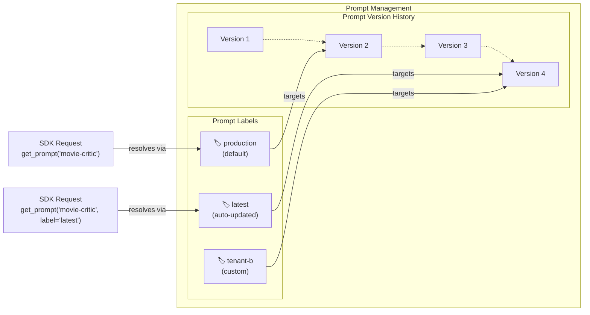

# Prompt Management

Prompt management is a systematic approach to storing, versioning, and retrieving prompts for your LLM application. Instead of hardcoding prompts in your application code, you manage them centrally in Langfuse.

<Frame fullWidth>
  
</Frame>

Want to see it in action? [**Create a free account**](/cloud) and explore Langfuse Prompt Management in the [interactive example project](/docs/demo).

### Decouple Prompt Updates from Code Deployment

In most LLM applications, **prompt iteration and code deployment** are managed by **different people**. Product managers and domain experts iterate on prompts, while engineers manage deployments.

With prompts in code, a simple text change requires engineering involvement, code review, and a full deployment cycle, turning a 2-minute update into hours or days of waiting.

When prompts live in Langfuse, non-technical team members update them directly in the UI while your application automatically fetches the latest version. This **separation of concerns** means **prompt updates deploy instantly**, without needing to involve engineering or triggering a deployment.

### No latency, no availability risk

**Langfuse Prompt Management adds no latency to your application**. Prompts are cached client-side by the SDK, so retrieving them is as fast as reading from memory. See [the caching docs page](/docs/prompt-management/features/caching) for more details.

## Getting started

Start by [adding your first prompt](/docs/prompt-management/get-started) to Langfuse, and connecting it to your application. You can either create a prompt from scratch in the UI or import existing prompts from your application.

Take a moment to understand the core concepts: [prompt types, versioning, labels, and configuration](/docs/prompt-management/data-model).

Once you have prompts in Langfuse and are using them in your application, there are a few things you can do to get the most out of Langfuse Prompt Management:

- [Link prompts to traces](/docs/prompt-management/features/link-to-traces) to analyze performance by prompt version
- [Use version control and labels](/docs/prompt-management/features/prompt-version-control) to manage deployments across environments

Looking for something specific? Take a look under _Features_ for guides on specific topics.

<!-- agent-instructions -->

---

## Agent Instructions

This page is part of the [Langfuse](https://langfuse.com) documentation, published as plain Markdown for AI agents. Every page is available as Markdown by appending `.md` to its URL, or by sending an `Accept: text/markdown` header. This page: `https://langfuse.com/docs/prompt-management/overview.md`.

### Querying these docs

If the answer is not on this page, query the documentation instead of guessing:

- **Semantic search** across all Langfuse docs, returning an answer with the relevant pages and excerpts. Ask a specific, self-contained question:

  ```bash
  curl -sG "https://langfuse.com/api/search-docs" --data-urlencode "query=How do I trace a LangGraph agent?"
  ```

- **Index of every page**: <https://langfuse.com/llms.txt>, with per-section indexes [llms-docs.txt](https://langfuse.com/llms-docs.txt), [llms-integrations.txt](https://langfuse.com/llms-integrations.txt), and [llms-self-hosting.txt](https://langfuse.com/llms-self-hosting.txt).

### Before writing Langfuse code

- **Install the [Langfuse Agent Skill](https://langfuse.com/docs/api-and-data-platform/features/agent-skill).** It encodes Langfuse's own best practices for instrumentation, prompt management, and evaluation, and materially improves results.
- **Read [What does a good trace look like?](https://langfuse.com/docs/observability/best-practices.md)** before instrumenting an application.
- **Verify endpoints, parameters, and response fields** against the [API reference](https://api.reference.langfuse.com) instead of inferring them from code examples.
- **Use the [Langfuse CLI](https://langfuse.com/docs/api-and-data-platform/features/cli)** (`npx langfuse-cli api <resource> <action>`) to read or write traces, prompts, datasets, and scores from the terminal.

Found an error in these docs? Please open an issue at <https://github.com/langfuse/langfuse-docs/issues>.

---

---

title: Concepts
sidebarTitle: Concepts
description: Core concepts of Langfuse Prompt Management including prompt types, versioning, labels, and configuration.
---

# Core Concepts

This page discusses prompt management concepts and best practices. If you haven't already, check out the [overview](/docs/prompt-management/overview) page on why it's valuable for observability of your application.

Ready to start? Check out the [Get Started guide](/docs/prompt-management/get-started) to create your first prompt.

## The Prompt Object

Langfuse considers a prompt to be a combination of both the instructions for the LLM (this can be a single string or an array of messages) and, optionally, [additional configuration](/docs/prompt-management/features/config) that influences the behavior.

The prompt object also has a couple of attributes for managing different versions, variants, and deployments. This page will guide you through the most important principles of how to use prompts productively.

For detailed information about all prompt object fields and methods, see the [SDK reference documentation](https://langfuse-js-git-main-langfuse.vercel.app/interfaces/_langfuse_core.Prompt.Chat.html).

### Chat vs Text Prompts [#text-vs-chat-prompts]

Langfuse supports two prompt types. The `type` field determines the format and cannot be changed after creation.

**Text prompts** are single strings, ideal for simple use cases or when you only need a system message.

**Chat prompts** are arrays of messages with specific roles (system, user, assistant), useful when you want to manage complete conversation structures, include example exchanges, or handle chat history.

```json filename="Text prompt example"
{
  "name": "movie-critic",
  "type": "text",
  "prompt": "As a movie critic, do you like Dune 2?",
  "version": 1
}
```

```json filename="Chat prompt example"
{
  "name": "movie-critic-chat",
  "type": "chat",
  "prompt": [
    {
      "role": "system",
      "content": "You are a movie critic."
    },
    {
      "role": "user",
      "content": "Do you like Dune 2?"
    }
  ],
  "version": 1
}
```

**When to use chat prompts:** Most applications start with a text prompt. As you build more complex logic that requires managing multiple messages, role-based structures, or chat history, it makes sense to switch to chat prompts. This allows you to manage the complete conversation structure in your prompt management system.

### Dynamic rendering of prompts [#dynamic-rendering-of-prompts]

You can add variables to your prompts that can be dynamically filled out at runtime. There are different types of variables you can use, explained below.

Prompts support three ways to insert dynamic content at runtime:

| Type                                                                          | Use Case                                                                  |
| ----------------------------------------------------------------------------- | ------------------------------------------------------------------------- |
| [Variables](/docs/prompt-management/features/variables)                       | Insert dynamic text into messages                                         |
| [Prompt References](/docs/prompt-management/features/composability)           | Reuse prompts across other prompts, avoid duplicating common instructions |
| [Message Placeholders](/docs/prompt-management/features/message-placeholders) | Insert arrays of messages (e.g., chat history)                            |

## Prompt Caching [#prompt-caching]

Langfuse Prompt Management uses cached prompts for 2 main reasons

1. it adds no latency to your application.
2. it removes availability risk.

This means your first few traces after updating a prompt might still be using the old version. If immediate updates are critical for your use case, you can disable caching or configure a shorter TTL (time-to-live).

See the [caching documentation](/docs/prompt-management/features/caching) for details on how caching works and how to configure it.

## Versioning and Labels

Understanding how versions and labels work together is essential for managing prompts in production. They serve different but complementary purposes.

**Versions** provide an immutable history of every prompt change. Each update creates a new version (1, 2, 3...).

**Labels** are pointers to specific versions. Your code would typically point to labels. Common labels include:

- `production` - Default label, used by production applications
- `latest` - Always points to the newest version
- Custom labels - Create labels for staging, testing, tenants, or A/B tests

Learn more about [versioning and labels](/docs/prompt-management/features/prompt-version-control).



### Deployment Workflow

Here's a typical workflow for deploying prompt changes:

1. **Create and test:** Create a new prompt version (automatically gets the `latest` label)
2. **Validate:** Test the new version in your development environment or using the playground
3. **Deploy:** Update the `production` label to point to the new version
4. **Monitor:** Your production application automatically picks up the new version on the next fetch
5. **Rollback if needed:** Simply reassign the `production` label back to a previous version

Since your code references the labels, all this happens without changing code.

<!-- agent-instructions -->

---

## Agent Instructions

This page is part of the [Langfuse](https://langfuse.com) documentation, published as plain Markdown for AI agents. Every page is available as Markdown by appending `.md` to its URL, or by sending an `Accept: text/markdown` header. This page: `https://langfuse.com/docs/prompt-management/data-model.md`.

### Querying these docs

If the answer is not on this page, query the documentation instead of guessing:

- **Semantic search** across all Langfuse docs, returning an answer with the relevant pages and excerpts. Ask a specific, self-contained question:

  ```bash
  curl -sG "https://langfuse.com/api/search-docs" --data-urlencode "query=How do I trace a LangGraph agent?"
  ```

- **Index of every page**: <https://langfuse.com/llms.txt>, with per-section indexes [llms-docs.txt](https://langfuse.com/llms-docs.txt), [llms-integrations.txt](https://langfuse.com/llms-integrations.txt), and [llms-self-hosting.txt](https://langfuse.com/llms-self-hosting.txt).

### Before writing Langfuse code

- **Install the [Langfuse Agent Skill](https://langfuse.com/docs/api-and-data-platform/features/agent-skill).** It encodes Langfuse's own best practices for instrumentation, prompt management, and evaluation, and materially improves results.
- **Read [What does a good trace look like?](https://langfuse.com/docs/observability/best-practices.md)** before instrumenting an application.
- **Verify endpoints, parameters, and response fields** against the [API reference](https://api.reference.langfuse.com) instead of inferring them from code examples.
- **Use the [Langfuse CLI](https://langfuse.com/docs/api-and-data-platform/features/cli)** (`npx langfuse-cli api <resource> <action>`) to read or write traces, prompts, datasets, and scores from the terminal.

Found an error in these docs? Please open an issue at <https://github.com/langfuse/langfuse-docs/issues>.

---

---

title: Link to Traces
sidebarTitle: Link to Traces
description: Link Langfuse Prompts to Traces.
---

# Link Prompts to Traces

Linking prompts to [traces](/docs/observability) enables tracking of metrics and evaluations per prompt version. It's the foundation of improving prompt quality over time.

After linking prompts and traces, navigating to a generation span in Langfuse will highlight the prompt that was used to generate the response. To access the metrics, navigate to your prompt and click on the `Metrics` tab.

## How to Link Prompts to Traces

<LangTabs items={["Python SDK", "JS/TS SDK", "OpenAI SDK (Python)", "OpenAI SDK (JS/TS)", "Langchain (Python)", "Langchain (JS/TS)", "Vercel AI SDK"]}>
<Tab>

For generations created with the Langfuse Python SDK, pass the prompt directly to the generation using the `prompt` keyword argument. This links the prompt only to the intended generation and is the recommended approach.

You can set the prompt on a specific generation with one of the following Langfuse Python SDK methods. For more information, see the [SDK documentation](/docs/observability/sdk/python/instrumentation).

**Decorators**

```python
from langfuse import observe, get_client

langfuse = get_client()

@observe(as_type="generation")
def nested_generation():
    prompt = langfuse.get_prompt("movie-critic")

    langfuse.update_current_generation(
        prompt=prompt,
    )

@observe()
def main():
  nested_generation()

main()
```

**Context Managers**

```python
from langfuse import get_client

langfuse = get_client()

prompt = langfuse.get_prompt("movie-critic")

with langfuse.start_as_current_observation(
    as_type="generation",
    name="movie-generation",
    model="gpt-4o",
    prompt=prompt
) as generation:
    # Your LLM call here
    generation.update(output="LLM response")
```

**Manual observations**

```python
from langfuse import get_client

langfuse = get_client()

prompt = langfuse.get_prompt("movie-critic")

generation = langfuse.start_observation(
    name="movie-generation",
    as_type="generation",
    model="gpt-4o",
    prompt=prompt
)

# Your LLM call here

generation.update(output="LLM response")
generation.end()  # Important: manually end the generation
```

**Propagate a prompt to multiple generations**

Use `propagate_attributes(prompt=prompt)` when multiple generations created within the same context use the same prompt version. This option is available in Python SDK 4.14.0 and later.

```python /propagate_attributes(prompt=prompt)/
from langfuse import get_client, propagate_attributes

langfuse = get_client()
prompt = langfuse.get_prompt("movie-critic")

with propagate_attributes(prompt=prompt):
    with langfuse.start_as_current_observation(
        as_type="generation",
        name="movie-review",
    ) as generation:
        generation.update(
            input=prompt.compile(movie="Dune 2"),
            output="A sweeping, ambitious sequel.",
        )

    with langfuse.start_as_current_observation(
        as_type="generation",
        name="movie-review",
    ) as generation:
        generation.update(
            input=prompt.compile(movie="Arrival"),
            output="A thoughtful and moving science-fiction film.",
        )
```

**Third-party instrumentation**

Propagation is also useful when an instrumentation library creates generations for you and does not expose a Langfuse `prompt` argument. For example, with the [LiteLLM OpenTelemetry integration](/integrations/frameworks/litellm-sdk):

```python /propagate_attributes(prompt=prompt)/
import litellm
from langfuse import get_client, propagate_attributes

langfuse = get_client()
prompt = langfuse.get_prompt("movie-critic")

litellm.callbacks = ["langfuse_otel"]

with propagate_attributes(prompt=prompt):
    response = litellm.completion(
        model="gpt-4o",
        messages=[
            {
                "role": "user",
                "content": prompt.compile(movie="Dune 2"),
            }
        ],
    )
```

This also works with the OpenAI Agents SDK and OpenInference instrumentations exported through the Langfuse Python SDK. Only generation observations are linked to the prompt. If a generation sets its own prompt explicitly, that prompt takes precedence over the propagated prompt.

</Tab>

<Tab>

There are three ways to create traces with the Langfuse JS/TS SDK. For more information, see the [SDK documentation](/docs/observability/sdk/typescript/instrumentation).

**Observe wrapper**

```ts
import { LangfuseClient } from '@langfuse/client'
import { observe, updateActiveObservation } from '@langfuse/tracing'

const langfuse = new LangfuseClient()

const callLLM = async (input: string) => {
  const prompt = await langfuse.prompt.get('my-prompt')

  updateActiveObservation({ prompt }, { asType: 'generation' })

  return await invokeLLM(input)
}

export const observedCallLLM = observe(callLLM)
```

**Context manager**

```ts
import { LangfuseClient } from '@langfuse/client'
import { startActiveObservation } from '@langfuse/tracing'

const langfuse = new LangfuseClient()

startActiveObservation(
  'llm',
  async (generation) => {
    const prompt = await langfuse.prompt.get('my-prompt')
    generation.update({ prompt })
  },
  { asType: 'generation' }
)
```

**Manual observations**

```ts
import { LangfuseClient } from '@langfuse/client'
import { startObservation } from '@langfuse/tracing'

const prompt = await new LangfuseClient().prompt.get('my-prompt')

startObservation(
  'llm',
  {
    prompt
  },
  { asType: 'generation' }
)
```

</Tab>

<Tab>

```python /langfuse_prompt=prompt/
from langfuse.openai import openai
from langfuse import get_client

langfuse = get_client()

prompt = langfuse.get_prompt("calculator")

openai.chat.completions.create(
  model="gpt-4o",
  messages=[
    {"role": "system", "content": prompt.compile(base=10)},
    {"role": "user", "content": "1 + 1 = "}],
  langfuse_prompt=prompt
)
```

</Tab>

<Tab>
Please make sure you have [OpenTelemetry already set up](/docs/observability/sdk/overview#initialize-tracing) for tracing.

```ts /langfusePrompt,/
import { observeOpenAI } from '@langfuse/openai'
import OpenAI from 'openai'

const langfusePrompt = await langfuse.prompt.get('prompt-name') // Fetch a previously created prompt

const res = await observeOpenAI(new OpenAI(), {
  langfusePrompt
}).completions.create({
  prompt: langfusePrompt.prompt,
  model: 'gpt-4o',
  max_tokens: 300
})
```

</Tab>

<Tab>

```python
from langfuse import get_client
from langfuse.langchain import CallbackHandler
from langchain_core.prompts import ChatPromptTemplate, PromptTemplate
from langchain_openai import ChatOpenAI, OpenAI

langfuse = get_client()

# Initialize the Langfuse handler
langfuse_handler = CallbackHandler()
```

**Text prompts**

```python /"langfuse_prompt"/
langfuse_text_prompt = langfuse.get_prompt("movie-critic")

## Pass the langfuse_text_prompt to the PromptTemplate as metadata to link it to generations that use it
langchain_text_prompt = PromptTemplate.from_template(
    langfuse_text_prompt.get_langchain_prompt(),
    metadata={"langfuse_prompt": langfuse_text_prompt},
)

## Use the text prompt in a Langchain chain
llm = OpenAI()
completion_chain = langchain_text_prompt | llm

completion_chain.invoke({"movie": "Dune 2", "criticlevel": "expert"}, config={"callbacks": [langfuse_handler]})
```

**Chat prompts**

```python /"langfuse_prompt"/
langfuse_chat_prompt = langfuse.get_prompt("movie-critic-chat", type="chat")

## Manually set the metadata on the langchain_chat_prompt to link it to generations that use it
langchain_chat_prompt = ChatPromptTemplate.from_messages(
    langfuse_chat_prompt.get_langchain_prompt()
)

langchain_chat_prompt.metadata = {"langfuse_prompt": langfuse_chat_prompt}

## or use the ChatPromptTemplate constructor directly.
## Note that using ChatPromptTemplate.from_template led to issues in the past
## See: https://github.com/langfuse/langfuse/issues/5374
langchain_chat_prompt = ChatPromptTemplate(
    langfuse_chat_prompt.get_langchain_prompt(),
    metadata={"langfuse_prompt": langfuse_chat_prompt}
)

## Use the chat prompt in a Langchain chain
chat_llm = ChatOpenAI()
chat_chain = langchain_chat_prompt | chat_llm

chat_chain.invoke({"movie": "Dune 2", "criticlevel": "expert"}, config={"callbacks": [langfuse_handler]})
```

If you use the `with_config` method on the PromptTemplate to create a new
Langchain Runnable with updated config, please make sure to pass the
`langfuse_prompt` in the `metadata` key as well.

Set the `langfuse_prompt` metadata key only on PromptTemplates and not
additionally on the LLM calls or elsewhere in your chains.

</Tab>

<Tab>

Please make sure you have [OpenTelemetry already set up](/docs/observability/sdk/overview#initialize-tracing) for tracing.

```ts
import { LangfuseClient } from '@langfuse/client'
import { CallbackHandler } from '@langfuse/langchain'

import { PromptTemplate } from '@langchain/core/prompts'
import { ChatOpenAI, OpenAI } from '@langchain/openai'

const langfuseHandler = new CallbackHandler()

const langfuse = new LangfuseClient()
```

**Text prompts**

```ts /metadata: { langfusePrompt:/
const langfuseTextPrompt = await langfuse.prompt.get('movie-critic') // Fetch a previously created text prompt

// Pass the langfuseTextPrompt to the PromptTemplate as metadata to link it to generations that use it
const langchainTextPrompt = PromptTemplate.fromTemplate(
  langfuseTextPrompt.getLangchainPrompt()
).withConfig({
  metadata: { langfusePrompt: langfuseTextPrompt }
})

const model = new OpenAI()
const chain = langchainTextPrompt.pipe(model)

await chain.invoke({ movie: 'Dune 2', criticlevel: 'expert' }, { callbacks: [langfuseHandler] })
```

**Chat prompts**

```ts /metadata: { langfusePrompt:/
const langfuseChatPrompt = await langfuse.prompt.get('movie-critic-chat', {
  type: 'chat'
}) // type option infers the prompt type as chat (default is 'text')

const langchainChatPrompt = ChatPromptTemplate.fromMessages(
  langfuseChatPrompt.getLangchainPrompt().map((m) => [m.role, m.content])
).withConfig({
  metadata: { langfusePrompt: langfuseChatPrompt }
})

const chatModel = new ChatOpenAI()
const chatChain = langchainChatPrompt.pipe(chatModel)

await chatChain.invoke({ movie: 'Dune 2', criticlevel: 'expert' }, { callbacks: [langfuseHandler] })
```

</Tab>

<Tab>

Link Langfuse prompts to Vercel AI SDK generations by setting the `langfusePrompt` property in the `metadata` field:

```typescript /langfusePrompt: fetchedPrompt.toJSON()/
import { generateText } from 'ai'
import { LangfuseClient } from '@langfuse/client'

const langfuse = new LangfuseClient()

const fetchedPrompt = await langfuse.prompt.get('my-prompt')

const result = await generateText({
  model: openai('gpt-4o'),
  prompt: fetchedPrompt.prompt,
  experimental_telemetry: {
    isEnabled: true,
    metadata: {
      langfusePrompt: fetchedPrompt.toJSON()
    }
  }
})
```

</Tab>

</LangTabs>

If a [fallback
prompt](/docs/prompt-management/features/guaranteed-availability#fallback) is
used, no link will be created.

## Metrics Reference

Once prompts are linked to traces, Langfuse automatically aggregates the following metrics per prompt version. You can compare them across prompt versions in the Metrics tab in the Langfuse UI:

- Median generation latency
- Median generation input tokens
- Median generation output tokens
- Median generation costs
- Generation count
- Median [score](/docs/evaluation/scores/data-model#scores) value
- First and last generation timestamp

<!-- agent-instructions -->

---

## Agent Instructions

This page is part of the [Langfuse](https://langfuse.com) documentation, published as plain Markdown for AI agents. Every page is available as Markdown by appending `.md` to its URL, or by sending an `Accept: text/markdown` header. This page: `https://langfuse.com/docs/prompt-management/features/link-to-traces.md`.

### Querying these docs

If the answer is not on this page, query the documentation instead of guessing:

- **Semantic search** across all Langfuse docs, returning an answer with the relevant pages and excerpts. Ask a specific, self-contained question:

  ```bash
  curl -sG "https://langfuse.com/api/search-docs" --data-urlencode "query=How do I trace a LangGraph agent?"
  ```

- **Index of every page**: <https://langfuse.com/llms.txt>, with per-section indexes [llms-docs.txt](https://langfuse.com/llms-docs.txt), [llms-integrations.txt](https://langfuse.com/llms-integrations.txt), and [llms-self-hosting.txt](https://langfuse.com/llms-self-hosting.txt).

### Before writing Langfuse code

- **Install the [Langfuse Agent Skill](https://langfuse.com/docs/api-and-data-platform/features/agent-skill).** It encodes Langfuse's own best practices for instrumentation, prompt management, and evaluation, and materially improves results.
- **Read [What does a good trace look like?](https://langfuse.com/docs/observability/best-practices.md)** before instrumenting an application.
- **Verify endpoints, parameters, and response fields** against the [API reference](https://api.reference.langfuse.com) instead of inferring them from code examples.
- **Use the [Langfuse CLI](https://langfuse.com/docs/api-and-data-platform/features/cli)** (`npx langfuse-cli api <resource> <action>`) to read or write traces, prompts, datasets, and scores from the terminal.

Found an error in these docs? Please open an issue at <https://github.com/langfuse/langfuse-docs/issues>.

---

---

title: Version Control
sidebarTitle: Version Control
description: Use prompt labels to fetch specific prompt versions in the SDKs.
---

# Prompt Version Control

In Langfuse, version control & deployment of prompts is managed via `versions` and `labels`.

## Implementation

### Versions & Labels [#versions--labels]

Each prompt version is automatically assigned a `version ID`. Additionally, you can assign `labels` to follow your own versioning scheme.

Labels can be used to assign prompts to environments (staging, production), tenants (tenant-1, tenant-2), or experiments (prod-a, prod-b).

<LangTabs items={["Langfuse UI","Python SDK", "JS/TS SDK"]}>
<Tab>

Use the Langfuse UI to assign labels to a prompt.

</Tab>
<Tab>

Use the Python SDK to assign labels to a prompt when creating a new prompt version.

```python {5}
langfuse.create_prompt(
    name="movie-critic",
    type="text",
    prompt="As a {{criticlevel}} movie critic, do you like {{movie}}?",
    labels=["production"],  # add the label "production" to the prompt version
)
```

Alternatively, you can also update the labels of an existing prompt version using the Python SDK:

```python {5}
langfuse = Langfuse()
langfuse.update_prompt(
    name="movie-critic",
    version=1,
    new_labels=["john", "doe"], # assign these labels to the prompt version
)
```

</Tab>
<Tab>

Use the JS/TS SDK to assign labels to a prompt when creating a new prompt version.

```ts {5}
import { LangfuseClient } from '@langfuse/client'

const langfuse = new LangfuseClient()

await langfuse.prompt.create({
  name: 'movie-critic',
  type: 'text',
  prompt: 'As a {{criticlevel}} critic, do you like {{movie}}?',
  labels: ['production'] // add the label "production" to the prompt version
})
```

Alternatively, you can also update the labels of an existing prompt version using the JS/TS SDK:

```ts {5}
await langfuse.prompt.update({
  name: 'movie-critic',
  version: 1,
  newLabels: ['john', 'doe']
})
```

</Tab>
</LangTabs>

## Fetching by Label or Version

When fetching prompts to use them in your application you can either do so by fetching a specific version or label.
Here are code examples for fetching prompts by label or version.

**To "deploy" a prompt version**, you have to assign the label `production` or any environment label you created to that prompt version.

Some notes on fetching prompts:

- The `latest` label points to the most recently created version.
- When using a prompt without specifying a label, Langfuse will serve the version with the `production` label.

<LangTabs items={["Python SDK", "JS/TS SDK"]}>
<Tab>

```python
from langfuse import get_client

# Initialize Langfuse client
langfuse = get_client()

# Get specific version
prompt = langfuse.get_prompt("movie-critic", version=1)

# Get specific label
prompt = langfuse.get_prompt("movie-critic", label="staging")

# Get latest prompt version. The 'latest' label is automatically maintained by Langfuse.
prompt = langfuse.get_prompt("movie-critic", label="latest")
```

</Tab>

<Tab>

```ts
import { LangfuseClient } from '@langfuse/client'

const langfuse = new LangfuseClient()

// Get specific version of a prompt (here version 1)
const prompt = await langfuse.prompt.get('movie-critic', {
  version: 1
})

// Get specific label
const prompt = await langfuse.prompt.get('movie-critic', {
  label: 'staging'
})

// Get latest prompt version. The 'latest' label is automatically maintained by Langfuse.
const prompt = await langfuse.prompt.get('movie-critic', {
  label: 'latest'
})
```

</Tab>

</LangTabs>

## Operational workflows

### Rollbacks

When a prompt has a `production` label, then that version will be served by default in the SDKs. You can quickly rollback to a previous version by setting the `production` label to that previous version in the Langfuse UI.

### Prompt Diffs

The prompt version diff view shows you the changes you made to the prompt over time. This helps you understand how the prompt has evolved and what changes have been made to debug issues or understand the impact of changes.

### Protected prompt labels [#protected-prompt-labels]

Protected prompt labels give project admins and owners ([RBAC docs](/docs/rbac)) the ability to prevent labels from being modified or deleted, ensuring better control over prompt deployment.

Once a label such as `production` is marked as protected:

- `viewer` and `member` roles cannot modify or delete the label from prompts, preventing changes to the `production` prompt version. This also blocks the deletion of the prompt.
- `admin` and `owner` roles can still modify or delete the label, effectively changing the `production` prompt version.

Admins and owners can update a label's protection status in the project settings.

## Related Resources

- Prompts are scoped to a project — if you use separate projects for different environments, see [how to sync prompts between them](/faq/all/managing-different-environments)
- To compare prompt versions on a dataset before promoting a label, run [Experiments](/docs/evaluation/core-concepts#experiments).

<!-- agent-instructions -->

---

## Agent Instructions

This page is part of the [Langfuse](https://langfuse.com) documentation, published as plain Markdown for AI agents. Every page is available as Markdown by appending `.md` to its URL, or by sending an `Accept: text/markdown` header. This page: `https://langfuse.com/docs/prompt-management/features/prompt-version-control.md`.

### Querying these docs

If the answer is not on this page, query the documentation instead of guessing:

- **Semantic search** across all Langfuse docs, returning an answer with the relevant pages and excerpts. Ask a specific, self-contained question:

  ```bash
  curl -sG "https://langfuse.com/api/search-docs" --data-urlencode "query=How do I trace a LangGraph agent?"
  ```

- **Index of every page**: <https://langfuse.com/llms.txt>, with per-section indexes [llms-docs.txt](https://langfuse.com/llms-docs.txt), [llms-integrations.txt](https://langfuse.com/llms-integrations.txt), and [llms-self-hosting.txt](https://langfuse.com/llms-self-hosting.txt).

### Before writing Langfuse code

- **Install the [Langfuse Agent Skill](https://langfuse.com/docs/api-and-data-platform/features/agent-skill).** It encodes Langfuse's own best practices for instrumentation, prompt management, and evaluation, and materially improves results.
- **Read [What does a good trace look like?](https://langfuse.com/docs/observability/best-practices.md)** before instrumenting an application.
- **Verify endpoints, parameters, and response fields** against the [API reference](https://api.reference.langfuse.com) instead of inferring them from code examples.
- **Use the [Langfuse CLI](https://langfuse.com/docs/api-and-data-platform/features/cli)** (`npx langfuse-cli api <resource> <action>`) to read or write traces, prompts, datasets, and scores from the terminal.

Found an error in these docs? Please open an issue at <https://github.com/langfuse/langfuse-docs/issues>.

---

---

title: Config
sidebarTitle: Config
description: The prompt config in Langfuse is an optional JSON object attached to each prompt that stores structured data such as model parameters (like model name, temperature), function/tool parameters, or JSON schemas.
---

# Prompt Config

The prompt `config` in Langfuse is an **optional arbitrary JSON object** attached to each prompt, that can be used by code executing the LLM call. Common use cases include:

- [storing model parameters](#using-the-config) (`model`, `temperature`, `max_tokens`)
- [storing structured output schemas](#structured-outputs) (`response_format`)
- [storing function/tool definitions](#function-calling) (`tools`, `tool_choice`)

Because the config is **versioned together with the prompt**, you can manage all parameters in one place. This makes it easy to switch models, update schemas, or tune behavior without touching your application code.

<Frame fullWidth>
  
</Frame>

## Setting the config

Setting the config can be done both via the Langfuse prompt UI and via the SDKs.

<Tabs items={["UI", "Python SDK", "JS/TS SDK"]}>
<Tab>

To add or edit a config for your prompt:

1. Navigate to **Prompt Management** in the Langfuse UI
2. Select or create a prompt
3. In the prompt editor, find the **Config** field (JSON editor)
4. Enter your config as a valid JSON object
5. Save the prompt — the config is now versioned with this prompt version

</Tab>
<Tab>

Pass the `config` parameter when creating or updating a prompt:

```python
from langfuse import get_client

langfuse = get_client()

# example config with a model and temperature
config = {
    "model": "gpt-4o",
    "temperature": 0
}

langfuse.create_prompt(
  name="invoice-extractor",
  type="chat",
  prompt=[
    {
      "role": "system",
      "content": "Extract structured data from invoices."
      }
  ],
  config=config
)

```

</Tab>
<Tab>

Pass the `config` parameter when creating or updating a prompt:

```typescript
import { LangfuseClient } from '@langfuse/client'

const langfuse = new LangfuseClient()

// example config with a model and temperature
const config = {
  model: 'gpt-4o',
  temperature: 0
}

await langfuse.prompt.create({
  name: 'invoice-extractor',
  type: 'chat',
  prompt: [{ role: 'system', content: 'Extract structured data from invoices.' }],
  config: config
})
```

</Tab>
</Tabs>

You can test your prompt with its config directly in the [Playground](/docs/prompt-management/features/playground).

## Using the config [#using-the-config]

The example below retrieves the AI model and temperature from the prompt config.

After fetching a prompt, access the config via the `config` property and pass the values to your LLM call.

<Tabs items={["Python SDK", "JS/TS SDK"]}>
<Tab>

This example uses the [Langfuse OpenAI integration](/docs/integrations/openai/python/get-started) for tracing, but this is optional.
You can use any method to call your LLM (e.g., OpenAI SDK directly, other providers, etc.).

```python
from langfuse import get_client

# Initialize Langfuse OpenAI client for this example.
from langfuse.openai import OpenAI
client = OpenAI()

langfuse = get_client()

# Fetch prompt
prompt = langfuse.get_prompt("invoice-extractor")

# Access config values
cfg = prompt.config
model = cfg.get("model")
temperature = cfg.get("temperature")

# Use in your LLM call
client.chat.completions.create(
  model=model,
  temperature=temperature,
  messages=prompt.prompt
)
```

</Tab>
<Tab>

This example uses the [Langfuse OpenAI integration](/docs/integrations/openai/js/get-started) for tracing, but this is optional.
You can use any method to call your LLM (e.g., OpenAI SDK directly, other providers, etc.) and still use the config.

```typescript
import { LangfuseClient } from '@langfuse/client'

// Initialize OpenAI client for this example.
import OpenAI from 'openai'
import { observeOpenAI } from '@langfuse/openai'
const client = observeOpenAI(new OpenAI())

const langfuse = new LangfuseClient()

// Fetch prompt
const prompt = await langfuse.prompt.get('invoice-extractor')

// Access config values
const cfg = prompt.config
const model = cfg.model
const temperature = cfg.temperature

// Use in your LLM call
client.chat.completions.create({
  model,
  temperature,
  messages: prompt.prompt
})
```

</Tab>
</Tabs>

## Example use cases

### Structured Outputs [#structured-outputs]

When you need your LLM to return data in a specific JSON format, store the schema in your prompt config. This keeps the schema versioned alongside your prompt and lets you update it without code changes.

**Best practice:** Use `response_format` with `type: "json_schema"` and `strict: true` to enforce the schema. This ensures the model's output exactly matches your expected structure. If you're using Pydantic models, convert them with `type_to_response_format_param` — see the [OpenAI Structured Outputs guide](/docs/integrations/openai/python/structured-outputs).

```python
from langfuse import get_client
from langfuse.openai import OpenAI

langfuse = get_client()
client = OpenAI()

# Fetch prompt with config containing response_format
prompt = langfuse.get_prompt("invoice-extractor")
system_message = prompt.compile()

# Extract parameters from config
cfg = prompt.config

# Example config:
# {
#   "response_format": {
#     "type": "json_schema",
#     "json_schema": {
#       "name": "invoice_schema",
#       "schema": {
#         "type": "object",
#         "properties": {
#           "invoice_number": { "type": "string" },
#           "total": { "type": "number" }
#         },
#         "required": ["invoice_number", "total"],
#         "additionalProperties": false
#       },
#       "strict": true
#     }
#   }
# }

response_format = cfg.get("response_format")

res = client.chat.completions.create(
  model="gpt-4o",
  messages=[
    {"role": "system", "content": system_message},
    {"role": "user", "content": "Extract invoice number and total from: ..."},
  ],
  response_format=response_format,
  langfuse_prompt=prompt,  # Links this generation to the prompt version in Langfuse
)

# Response is guaranteed to match your schema
content = res.choices[0].message.content
```

### Function Calling [#function-calling]

For agents and tool-using applications, store your function definitions in the prompt config. This allows you to version and update your available tools alongside your prompts.

**Best practice:** Store `tools` (function definitions with JSON Schema parameters) and `tool_choice` in your config. This keeps your function signatures versioned and lets you add, modify, or remove tools without deploying code changes.

```python
from langfuse import get_client
from langfuse.openai import OpenAI

langfuse = get_client()
client = OpenAI()

# Fetch prompt with config containing tools
prompt = langfuse.get_prompt("weather-agent")
system_message = prompt.compile()

# Extract parameters from config
cfg = prompt.config

# Example config:
# {
#   "tools": [
#     {
#       "type": "function",
#       "function": {
#         "name": "get_current_weather",
#         "description": "Get the current weather in a given location",
#         "parameters": {
#           "type": "object",
#           "properties": {
#             "location": { "type": "string", "description": "City and country" },
#             "unit": { "type": "string", "enum": ["celsius", "fahrenheit"] }
#           },
#           "required": ["location"],
#           "additionalProperties": false
#         }
#       }
#     }
#   ],
#   "tool_choice": { "type": "auto" }
# }

tools = cfg.get("tools", [])
tool_choice = cfg.get("tool_choice")

res = client.chat.completions.create(
  model="gpt-4o",
  messages=[
    {"role": "system", "content": system_message},
    {"role": "user", "content": "What's the weather in Berlin?"},
  ],
  tools=tools,
  tool_choice=tool_choice,
  langfuse_prompt=prompt,  # Links this generation to the prompt version in Langfuse
)
```

For complete end-to-end examples, see the [OpenAI Functions cookbook](/guides/cookbook/prompt_management_openai_functions) and the [Structured Outputs docs](/integrations/model-providers/openai-py#structured-output).

<!-- agent-instructions -->

---

## Agent Instructions

This page is part of the [Langfuse](https://langfuse.com) documentation, published as plain Markdown for AI agents. Every page is available as Markdown by appending `.md` to its URL, or by sending an `Accept: text/markdown` header. This page: `https://langfuse.com/docs/prompt-management/features/config.md`.

### Querying these docs

If the answer is not on this page, query the documentation instead of guessing:

- **Semantic search** across all Langfuse docs, returning an answer with the relevant pages and excerpts. Ask a specific, self-contained question:

  ```bash
  curl -sG "https://langfuse.com/api/search-docs" --data-urlencode "query=How do I trace a LangGraph agent?"
  ```

- **Index of every page**: <https://langfuse.com/llms.txt>, with per-section indexes [llms-docs.txt](https://langfuse.com/llms-docs.txt), [llms-integrations.txt](https://langfuse.com/llms-integrations.txt), and [llms-self-hosting.txt](https://langfuse.com/llms-self-hosting.txt).

### Before writing Langfuse code

- **Install the [Langfuse Agent Skill](https://langfuse.com/docs/api-and-data-platform/features/agent-skill).** It encodes Langfuse's own best practices for instrumentation, prompt management, and evaluation, and materially improves results.
- **Read [What does a good trace look like?](https://langfuse.com/docs/observability/best-practices.md)** before instrumenting an application.
- **Verify endpoints, parameters, and response fields** against the [API reference](https://api.reference.langfuse.com) instead of inferring them from code examples.
- **Use the [Langfuse CLI](https://langfuse.com/docs/api-and-data-platform/features/cli)** (`npx langfuse-cli api <resource> <action>`) to read or write traces, prompts, datasets, and scores from the terminal.

Found an error in these docs? Please open an issue at <https://github.com/langfuse/langfuse-docs/issues>.

---

---

title: A/B Testing
sidebarTitle: A/B Testing
description: Use Open Source Prompt Management in Langfuse to systematically test and improve your LLM prompts with A/B testing.
---

# A/B Testing of LLM Prompts

[Langfuse Prompt Management](/docs/prompts/get-started) enables A/B testing by allowing you to label different versions of a prompt (e.g., `prod-a` and `prod-b`). Your application can randomly alternate between these versions, while Langfuse tracks performance metrics like response latency, cost, token usage, and evaluation metrics for each version.

**When to use A/B testing?**

A/B testing helps you see how different prompt versions work in real situations, adding to what you learn from testing on datasets. This works best when:

- Your app has good ways to measure success, deals with many different kinds of user inputs, and can handle some ups and downs in performance. This usually works for consumer apps where mistakes aren't a big deal.
- You've already tested thoroughly on your test data and want to try your changes with a small group of users before rolling out to everyone (also called canary deployment).

## Implementation

<Steps>

### Label your Prompt Versions

Label your prompt versions (e.g., `prod-a` and `prod-b`) to identify different variants for testing.

### Fetch Prompts and Run A/B Test

<LangTabs items={["Python SDK", "JS/TS SDK"]}>
<Tab>

```python
from langfuse import get_client
import random
from langfuse.openai import openai

# Requires environment variables for initialization
from langfuse import get_client
langfuse = get_client()

# Fetch prompt versions
prompt_a = langfuse.get_prompt("my-prompt-name", label="prod-a")
prompt_b = langfuse.get_prompt("my-prompt-name", label="prod-b")

# Randomly select version
selected_prompt = random.choice([prompt_a, prompt_b])

# Use in LLM call
response = openai.chat.completions.create(
    model="gpt-3.5-turbo",
    messages=[{"role": "user", "content": selected_prompt.compile(variable="value")}],
    # Link prompt to generation for analytics
    langfuse_prompt=selected_prompt
)
result_text = response.choices[0].message.content
```

</Tab>
<Tab>

```js
import { LangfuseClient } from '@langfuse/client'
import { observeOpenAI } from '@langfuse/openai'

import OpenAI from 'openai'

// Requires environment variables for initialization
const langfuse = new LangfuseClient()

// Create and wrap OpenAI client
const openai = observeOpenAI(new OpenAI())

// Fetch prompt versions
const promptA = await langfuse.prompt.get('my-prompt-name', {
  label: 'prod-a'
})
const promptB = await langfuse.prompt.get('my-prompt-name', {
  label: 'prod-b'
})

// Randomly select version
const selectedPrompt = Math.random() < 0.5 ? promptA : promptB

// Use in LLM call
const completion = await openai.chat.completions.create({
  model: 'gpt-3.5-turbo',
  messages: [
    {
      role: 'user',
      content: selectedPrompt.compile({ variable: 'value' })
    }
  ],
  // Link prompt to generation for analytics
  langfusePrompt: selectedPrompt
})
const resultText = completion.choices[0].message.content
```

</Tab>
</LangTabs>

Refer to [prompt management documentation](/docs/prompts/get-started) for additional examples on how to fetch and use prompts.

### Analyze Results

Compare metrics for each prompt version in the Langfuse UI:

**Key metrics available for comparison:**

- Response latency and token usage
- Cost per request
- Quality evaluation scores
- Custom metrics you define

</Steps>

## Related Resources

- To benchmark complete application behavior on datasets (not just prompt selection), use [Experiments](/docs/evaluation/core-concepts#experiments).

<!-- agent-instructions -->

---

## Agent Instructions

This page is part of the [Langfuse](https://langfuse.com) documentation, published as plain Markdown for AI agents. Every page is available as Markdown by appending `.md` to its URL, or by sending an `Accept: text/markdown` header. This page: `https://langfuse.com/docs/prompt-management/features/a-b-testing.md`.

### Querying these docs

If the answer is not on this page, query the documentation instead of guessing:

- **Semantic search** across all Langfuse docs, returning an answer with the relevant pages and excerpts. Ask a specific, self-contained question:

  ```bash
  curl -sG "https://langfuse.com/api/search-docs" --data-urlencode "query=How do I trace a LangGraph agent?"
  ```

- **Index of every page**: <https://langfuse.com/llms.txt>, with per-section indexes [llms-docs.txt](https://langfuse.com/llms-docs.txt), [llms-integrations.txt](https://langfuse.com/llms-integrations.txt), and [llms-self-hosting.txt](https://langfuse.com/llms-self-hosting.txt).

### Before writing Langfuse code

- **Install the [Langfuse Agent Skill](https://langfuse.com/docs/api-and-data-platform/features/agent-skill).** It encodes Langfuse's own best practices for instrumentation, prompt management, and evaluation, and materially improves results.
- **Read [What does a good trace look like?](https://langfuse.com/docs/observability/best-practices.md)** before instrumenting an application.
- **Verify endpoints, parameters, and response fields** against the [API reference](https://api.reference.langfuse.com) instead of inferring them from code examples.
- **Use the [Langfuse CLI](https://langfuse.com/docs/api-and-data-platform/features/cli)** (`npx langfuse-cli api <resource> <action>`) to read or write traces, prompts, datasets, and scores from the terminal.

Found an error in these docs? Please open an issue at <https://github.com/langfuse/langfuse-docs/issues>.
