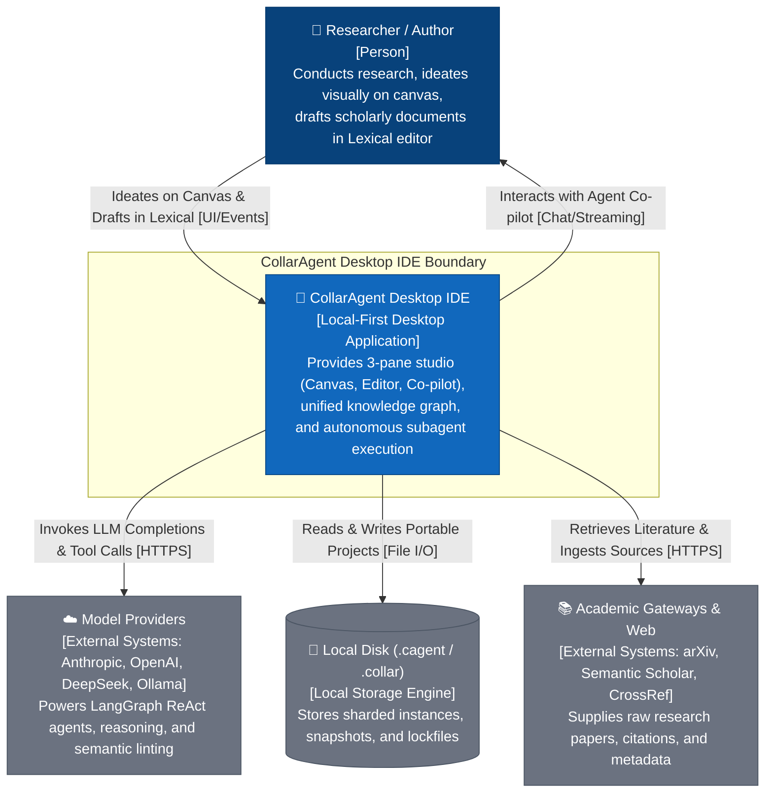
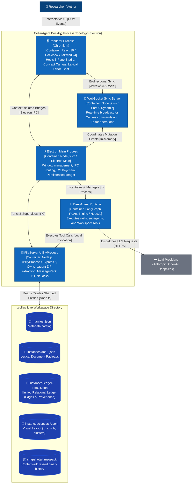
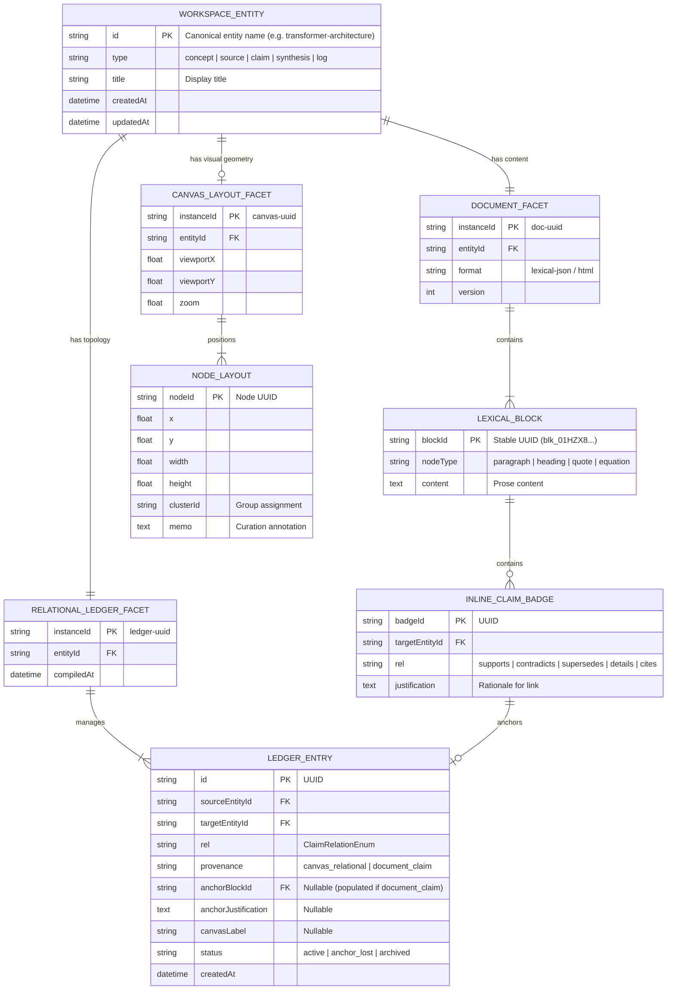
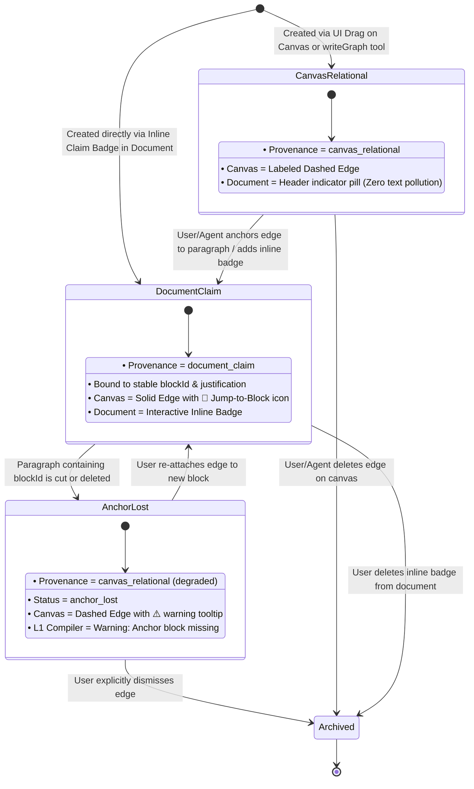
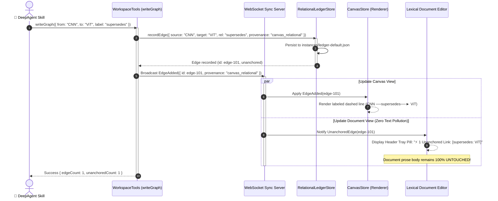
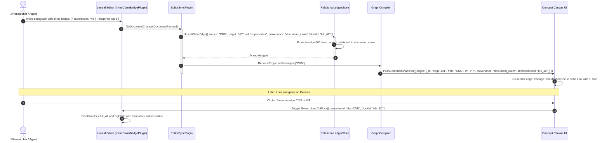
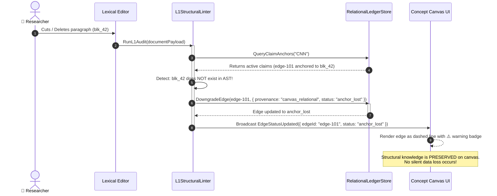
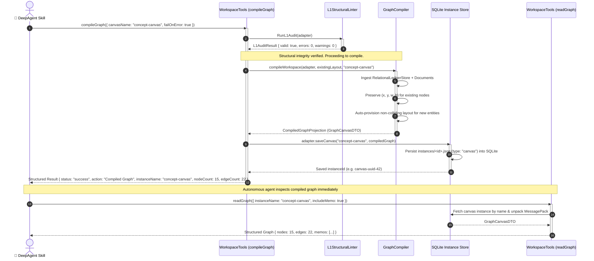

# C4 System Architecture: Workspace-as-Wiki Bi-Directional Knowledge Engine

## 1. Executive Summary & Document Control

- **System**: CollarAgent Desktop IDE & DeepAgent Runtime
- **Subsystem**: Workspace-as-Wiki Knowledge Engine (`@workspace/*`, `@collaragent/tools/*`, `@shared/*`)
- **Status**: Implemented & Verified Architecture (Phases 0–4 Completed)
- **Architectural Scope**:
  - Unified Entity & Multi-Facet Model (Document, Relational Ledger, Canvas Layout)
  - Bi-Directional Synchronization (Visual Ideation $\rightleftharpoons$ Prose Crystallization)
  - Two-Provenance Relational Ledger (`canvas_relational` vs. `document_claim`)
  - Two-Tier Linting (L1 Deterministic Compiler + L2 LLM Semantic Audit)
  - Headless Developer CLI (`yarn wiki:lint`, `yarn wiki:compile`)
  - Deterministic SQLite Canvas Compilation (`compileGraph`) with Workspace Tool Standard Compliance
- **Authoritative References**:
  - Specification: [`docs/llm-wiki/spec-workspace-as-wiki.md`](file:///Users/goldenfung/Documents/collaragent/docs/llm-wiki/spec-workspace-as-wiki.md)
  - Diagnostic & Analysis: [`docs/llm-wiki/analysis.md`](file:///Users/goldenfung/Documents/collaragent/docs/llm-wiki/analysis.md)
  - ADR-001 (Multi-process topology): [`docs/design-catalog/adrs/adr-001-multi-process-architecture.md`](file:///Users/goldenfung/Documents/collaragent/docs/design-catalog/adrs/adr-001-multi-process-architecture.md)
  - ADR-002 (Sharded Storage V3): `CagentStorage` V3 sharded layout
  - ADR-005 (Mathematical Inversion): [`src/collaragent/runtime/InverseCommandEngine.ts`](file:///Users/goldenfung/Documents/collaragent/src/collaragent/runtime/InverseCommandEngine.ts)

---

## 2. Level 1: System Context (C1)

The System Context diagram establishes the boundaries of the CollarAgent system, the primary human and autonomous actors, and external system integrations.

---

## 3. Level 2: Container Topology (C2)

The Container diagram illustrates the deployable process topology of CollarAgent, communication channels, data stores, and runtime modules.

---

## 4. Level 3: Component Architecture (C3)

Zooming inside the **Workspace Knowledge Engine** and **DeepAgent Runtime** containers reveals how documents, the relational ledger, the canvas, and compiler passes interact.

```mermaid
flowchart TB
    %% C3 Styling
    classDef component fill:#1168bd,stroke:#0b4884,color:#fff;
    classDef database fill:#1e40af,stroke:#1d4ed8,color:#fff;
    classDef external fill:#6b7280,stroke:#4b5563,color:#fff;
    classDef boundary fill:none,stroke:#94a3b8,stroke-width:2px,stroke-dasharray: 5 5;

    subgraph WorkspaceModule ["Workspace Subsystem (src/workspace)"]
        subgraph EditorSubsystem ["Lexical Document Subsystem"]
            CardEditor["📝 CardEditor Component<br/>Rich-text authoring surface"]:::component
            InlineBadgePlugin["🏷️ InlineClaimBadgePlugin<br/>Renders & manages inline clickable badges"]:::component
            ClaimBadgeTransformer["🔤 ClaimBadgeTransformer<br/>Parses [[rel:entity|justification]] markdown"]:::component
            EditorSyncPlugin["🔄 EditorSyncPlugin<br/>Synchronizes block changes over WS"]:::component
            BlockIdentityRegistry["🆔 BlockIdentityRegistry<br/>Maintains stable UUIDs across edits/splits"]:::component
        end

        subgraph CanvasSubsystem ["Concept Canvas Subsystem"]
            CanvasComponent["🗺️ Canvas Component<br/>Infinite 2D graph workspace"]:::component
            CanvasStore["📦 Canvas Zustand Store<br/>Manages node positions, selection, groups"]:::component
            CanvasSyncPlugin["🔄 CanvasSyncPlugin<br/>Applies batched atomic commands"]:::component
            CanvasDiffEngine["⚡ CanvasDiffEngine<br/>Computes atomic commands from state diffs"]:::component
        end

        subgraph WikiEngine ["Knowledge Compiler Subsystem (src/workspace/wiki)"]
            LinkExtractor["🔍 LinkExtractor<br/>Parses inline claim badges from blocks"]:::component
            RelationalLedgerStore["⚖️ RelationalLedgerStore<br/>In-memory & persisted edge truth with provenance"]:::component
            GraphCompiler["⚙️ GraphCompiler<br/>Compiles ledger + layout into Canvas Snapshot"]:::component
            InvertedIndexManager["🗂️ InvertedIndexManager<br/>Maintains getBacklinks() / getOutlinks()"]:::component
            L1Linter["🛡️ L1StructuralLinter<br/>Detects unresolved symbols, orphans, anchor_lost"]:::component
            L2Linter["🧠 L2SemanticLinter<br/>LLM-assisted contradiction, staleness & gap audits"]:::component
            LegacyBootstrapper["🔄 LegacyArchiveBootstrapper<br/>Synthesizes ledger from legacy V3 canvas"]:::component
            CLIEntry["💻 Headless CLI (wiki-cli.mjs)<br/>Standalone runner via jiti"]:::component
        end
    end

    subgraph AgentToolsSubsystem ["DeepAgent WorkspaceTools (src/collaragent/tools)"]
        ToolWriteGraph["🔨 writeGraph Tool<br/>Visual ideation: writes canvas_relational edges"]:::component
        ToolEditDocument["✏️ editDocument Tool<br/>Edits prose and adds inline claim badges"]:::component
        ToolIngestSource["📥 ingestSource Tool<br/>Atomic source ingestion & multi-file fanout"]:::component
        ToolQueryFileBack["💬 queryAndFileBack Tool<br/>Graph traversal, synthesis & filing"]:::component
        ToolLintWorkspace["🔍 lintWorkspace Tool<br/>Triggers L1 compiler + L2 semantic lint"]:::component
        ToolCompileGraph["🗺️ compileGraph Tool<br/>Lints & compiles ledger into SQLite canvas"]:::component
    end

    StorageEngine[("💾 Storage Engine (.collar/instances/ & SQLite)")]:::database

    %% Editor Interactions
    CardEditor --> InlineBadgePlugin
    CardEditor --> ClaimBadgeTransformer
    InlineBadgePlugin --> BlockIdentityRegistry
    CardEditor --> EditorSyncPlugin
    EditorSyncPlugin -->|"Emits block mutations"| LinkExtractor
    LinkExtractor -->|"Updates document_claim edges"| RelationalLedgerStore

    %% Canvas Interactions
    CanvasComponent --> CanvasStore
    CanvasComponent --> CanvasSyncPlugin
    CanvasComponent -->|"UI drag edge (canvas_relational)"| RelationalLedgerStore
    CanvasSyncPlugin --> CanvasDiffEngine

    %% Compiler Pipeline
    RelationalLedgerStore -->|"Topological Truth"| GraphCompiler
    CanvasStore -->|"Visual Layout Coordinates"| GraphCompiler
    GraphCompiler -->|"Emits Compiled Canvas Snapshot"| CanvasComponent
    RelationalLedgerStore --> InvertedIndexManager
    RelationalLedgerStore --> L1Linter
    RelationalLedgerStore --> L2Linter
    RelationalLedgerStore <-->|"Persists ledger-*.json"| StorageEngine
    StorageEngine <-->|"Bootstraps legacy archives"| LegacyBootstrapper
    CLIEntry --> L1Linter
    CLIEntry --> L2Linter
    CLIEntry --> GraphCompiler

    %% Agent Tool Invocations
    ToolWriteGraph -->|"Writes canvas_relational edges"| RelationalLedgerStore
    ToolWriteGraph -->|"Updates coordinates"| CanvasStore
    ToolEditDocument -->|"Updates document blocks"| EditorSyncPlugin
    ToolIngestSource -->|"Atomic transaction"| RelationalLedgerStore
    ToolIngestSource -->|"Atomic transaction"| StorageEngine
    ToolQueryFileBack -->|"Traverses backlink index"| InvertedIndexManager
    ToolLintWorkspace -->|"Runs deterministic checks"| L1Linter
    ToolLintWorkspace -->|"Runs semantic checks"| L2Linter
    ToolCompileGraph -->|"Pre-check lint gate"| L1Linter
    ToolCompileGraph -->|"Compiles & persists canvas"| GraphCompiler
    ToolCompileGraph -->|"Persists canvas instance to SQLite"| StorageEngine
```

---

## 5. Level 4: Code & Detailed Dynamics (C4)

### 5.1 Domain Entity Relationship Diagram (ERD)

The ERD illustrates the **Single Entity, Multi-Facet** model and the relational schema connecting documents, claims, ledger edges, and canvas layout.

---

### 5.2 State Machine: Relational Edge Lifecycle & Graceful Degradation

The finite state machine governs how edges transition between visual ideation, formal crystallization, and refactoring events.

---

### 5.3 Runtime Interaction Flow 1: Bi-Directional Visual Ideation (`writeGraph` $\to$ Document)

Illustrates an agent using `writeGraph` to brainstorm relationships without polluting human document prose.

---

### 5.4 Runtime Interaction Flow 2: Prose Crystallization (Document $\to$ Canvas Click-to-Block)

Illustrates a human or agent writing an inline claim badge in a document, compiling to the ledger, and jumping from the canvas.

---

### 5.5 Runtime Interaction Flow 3: Graceful Degradation on Block Deletion

Illustrates what happens when a user deletes a paragraph that contained an anchored claim.

---

### 5.6 Runtime Interaction Flow 4: Lint-Gated Graph Compilation to SQLite (`compileGraph` $\to$ Canvas $\to$ `readGraph`)

Illustrates an autonomous agent triggering `compileGraph` to lint document linkages, compile the relational ledger, preserve visual layout, and persist the materialized canvas directly to the SQLite database for subsequent `readGraph` queries.

---

## 6. Architectural Trade-offs & Evaluation Matrix

| Decision Area                    | Evaluated Approach                                                                  | Selected Architecture                                    | Architectural Rationale                                                                                                                  |
| :------------------------------- | :---------------------------------------------------------------------------------- | :------------------------------------------------------- | :--------------------------------------------------------------------------------------------------------------------------------------- |
| **Topological Truth**            | 1. Canvas owns edges 2. Document owns edges 3. Dual-source sync             | **Unified Relational Ledger (Option 3 with Provenance)** | Avoids split-brain drift and eliminates synthetic prose pollution in user documents while maintaining a single ground truth.             |
| **Edge Creation in Canvas**      | 1. Read-only canvas 2. Auto-inject sentences 3. Staged / Ledger edge        | **Ledger Edge (`canvas_relational`)**                    | Allows unconstrained visual-first brainstorming. Drawing an edge never pollutes the human's document with auto-generated text.           |
| **Link UI in Editor**            | 1. Gutter pills 2. Markdown syntax `[[X]]` 3. Inline clickable badges       | **Inline Clickable Badges (`InlineClaimBadgeNode`)**     | Provides direct visual anchoring to specific claims while enabling rich popovers and click-to-block shortcuts without regex parsing.     |
| **Orphan/Broken Link Detection** | 1. LLM reads all files 2. Pure compiler pass                                    | **Two-Tier Linting (L1 Compiler + L2 LLM)**              | L1 provides instant, deterministic, zero-token structural integrity; L2 focuses exclusively on high-value semantic contradictions.       |
| **Paragraph Deletion Handling**  | 1. Delete canvas edge 2. Block paragraph deletion 3. Graceful degradation   | **Graceful Degradation (`status: anchor_lost`)**         | Refactoring text never destroys visual knowledge; edges revert to unanchored state with clear warnings.                                  |
| **Workspace Graph Inspection**   | 1. Agent reads filesystem JSON directly 2. Dedicated compilation tool to SQLite | **Lint-Gated `compileGraph` Tool**                       | Agents operate inside sandboxes without raw disk access; compiling to SQLite enables immediate inspection via existing `readGraph` tool. |
| **Tool Protocol Concurrency**    | 1. Dynamic ad-hoc tool arrays 2. Name-keyed deduplication map                   | **Deduplicated `WorkspaceMiddleware` Tool Map**          | Guarantees mathematically unique tool names sent to LLM providers, strictly satisfying Anthropic/Console Go wire constraints.            |

---

## 7. Security & Failure Mode Analysis

1. **Circular Supersedence Gate (Tarjan SCC)**:
   - _Risk_: An agent or human creates cyclical causal claims ($A \text{ supersedes } B \text{ supersedes } C \text{ supersedes } A$).
   - _Mitigation_: The L1 Linter executes Tarjan's Strongly Connected Components (SCC) algorithm restricted to the `rel: 'supersedes'` subgraph during edge upsert. Any SCC with $>1$ node fails closed with `WORKSPACE_WIKI_CIRCULAR_SUPERSEDENCE`, returning structured `cycle` entity sequences and offending `edgeIds` in `error.details` with actionable fix recommendations.
2. **Crash Resilience & Atomic Inversion**:
   - _Risk_: A multi-file atomic operation (`ingestSource`) fails halfway through writing document 3 of 4.
   - _Mitigation_: All disk mutations are paired with mathematically sound inverse commands in `InverseCommandEngine` (ADR-005). If any step fails, inverse operations (`ledger:remove_edge`, `editor:restore_block`) are applied in reverse sequence, guaranteeing atomic consistency.
3. **Cross-Process File Concurrency & Workspace Locking**:
   - _Risk_: Electron Main, UtilityProcess, and WebSocket server concurrent read/write collisions on `ledger-default.json`.
   - _Mitigation_: Governed by `<path>.lock` concurrency protocols (`{ pid, time }`) established in ADR-002 and `baseVersion` optimistic concurrency checks in WebSocket sync.
4. **Lexical Block ID Desynchronization**:
   - _Risk_: Users splitting or merging paragraphs sever anchored claim links.
   - _Mitigation_: Handled by `blockIdentityRegistry.ts` in-place re-anchoring; paragraph deletion triggers graceful degradation (`status: 'anchor_lost'`) rather than knowledge graph edge deletion.
5. **Provider Tool Name Collision & Wire Failures**:
   - _Risk_: Active tools contain duplicate identifiers when merging read and write tool definitions, causing LLM providers to reject the request with HTTP 400 (`[invalid_request_error] Tool names must be unique`).
   - _Mitigation_: `createWorkspaceMiddleware` compiles `activeTools` through a `Map<string, Tool>` keyed by `tool.name`. Tool wrappers enforce standard result envelope `{ status, action, code, message, recommendFix }` with `extractErrorInfo` to prevent unhandled runtime exceptions.
