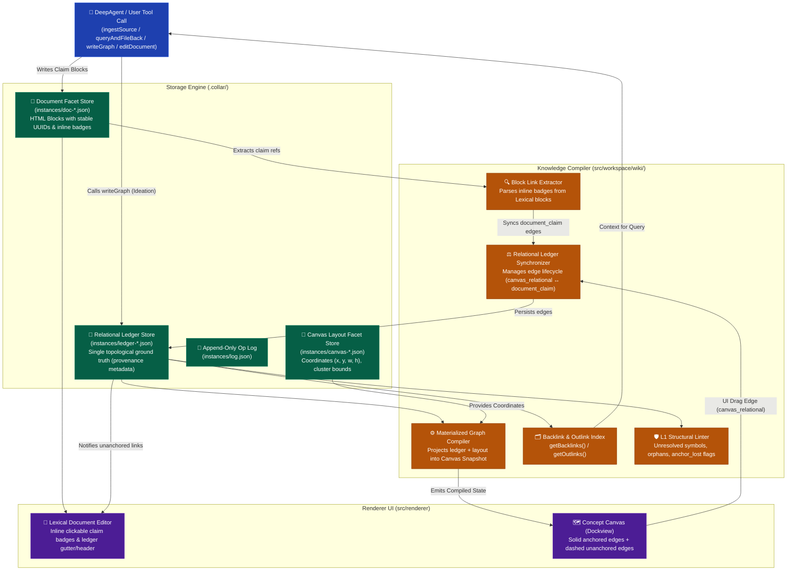

# Specification: Workspace-as-Wiki Knowledge Engine

## 1. Document Control & Architectural Context

- **Feature / Subsystem**: Workspace Knowledge Model, Document-Graph Derivation & Typed Claim Compiler (`@workspace/*`, `@collaragent/tools/*`, `@shared/*`)
- **Status**: Implemented & Verified Architecture (Phases 0–4 Completed)
- **Target Release**: CollarAgent Core Runtime 2026.x
- **Authoritative References**:
  - Karpathy LLM-Wiki Pattern: [`docs/llm-wiki/andrej-parpathy-llm-wiki.md`](file:///Users/goldenfung/Documents/collaragent/docs/llm-wiki/andrej-parpathy-llm-wiki.md)
  - Architectural Diagnostic & Proposal: [`docs/llm-wiki/analysis.md`](file:///Users/goldenfung/Documents/collaragent/docs/llm-wiki/analysis.md)
  - C4 System Architecture: [`docs/llm-wiki/c4-system-architecture.md`](file:///Users/goldenfung/Documents/collaragent/docs/llm-wiki/c4-system-architecture.md)
  - Storage Engine (ADR-002): `CagentStorage` V3 sharded layout (`.collar/instances/<id>.json`, `manifest.json`)
  - Command Reversal Engine (ADR-005): [`src/collaragent/runtime/InverseCommandEngine.ts`](file:///Users/goldenfung/Documents/collaragent/src/collaragent/runtime/InverseCommandEngine.ts)
  - Coding & Architecture Invariants: [`.agents/rules/coding-rules.md`](file:///Users/goldenfung/Documents/collaragent/.agents/rules/coding-rules.md)

---

## 2. Objective & Vision

### 2.1 Problem Statement

Currently, CollarAgent operates with two decoupled, parallel artifacts:

1. **Document Instances**: Lexical rich-text instances containing content, but previously lacking a machine-checkable relational link language between concepts or claims (resolved via `InlineClaimBadgeNode` and `CLAIM_BADGE_TRANSFORMER`).
2. **Concept Canvas Instances**: Graph instances storing nodes and edges via `writeGraph`, but previously decoupled from document content. An edit in a document never updated the canvas, and updating the canvas never updated documents (resolved via `RelationalLedgerStore`, `GraphCompiler`, and `compileGraph`).
3. **Prompt-Only Discipline**: Previous research skills enforced updates via prompt instructions (the "Feedback Loop Mandate"). Autonomous agents frequently forgot to execute multi-step cross-referencing and logging under context pressure (resolved by compiling discipline into atomic tools: `ingestSource`, `queryAndFileBack`, `lintWorkspace`, `compileGraph`).
4. **Empirical Defect (Resolved 2026-09-08 & 2026-09-09)**: `readGraph({ includeMemo: true })` dropped memo text bodies due to attribute extraction discrepancies in [`manageGraph.ts`](file:///Users/goldenfung/Documents/collaragent/src/workspace/wstools/manageGraph.ts); fixed and verified with regression tests. The entity-document auto-link feature was restored and verified via `GraphCompiler.ts` auto-layout provisioning.

### 2.2 Objective

Transform CollarAgent's workspace into a **single-source-of-truth, bi-directional, agent-native knowledge engine**:

- **Unify Entity Identity & Multi-Facet Model**: 1 Entity Name = 1 Canonical Identity. An entity encompasses three synchronized facets:
  1. _Content Facet_: Lexical document carrying prose and inline claim badges.
  2. _Relational Ledger Facet_: The single topological ground truth for all inbound and outbound edges.
  3. _Layout Facet_: Concept canvas preserving 2D coordinates $(x, y, w, h)$ and clustering.
- **Bi-Directional Ideation & Crystallization**: Support visual-first brainstorming on the canvas (`canvas_relational` provenance) without polluting document prose with synthetic text, while enabling formal claims written in documents (`document_claim` provenance) to project onto the canvas with click-to-block navigation.
- **Machine-Checkable Block-Level Links with Inline Clickable Badges**: Rich-text blocks carry stable IDs and typed relational references (`supports`, `contradicts`, `supersedes`, `details`, `derived_from`, `cites`) rendered in Lexical as interactive inline badges.
- **Deterministic Graph Compiler & Synchronization**: The concept canvas topology is a projection of the Relational Ledger. Canvas persistence is constrained strictly to visual layout coordinates and clustering.
- **System-Enforced Atomic Operations**: Higher-level tools (`ingestSource`, `queryAndFileBack`, `lintWorkspace`) execute cross-file fanouts, ledger updates, index compilation, and append-only logging atomically within single tool invocations.
- **Two-Tier Linting & Graceful Degradation**: L1 deterministic compiler passes for structural integrity + L2 LLM-assisted semantic reasoning. Deleting a text block gracefully degrades an anchored edge to an unanchored canvas link rather than dropping knowledge.

---

## 3. Tech Stack & Dependencies

- **Language / Runtime**: TypeScript 5.x (Strict mode, Zero `any`, No `@ts-ignore`)
- **Document Engine**: Lexical (`@lexical/react`, KaTeX math, Prism syntax, GFM markdown transformers)
- **Canvas Engine**: React 19 + Custom Canvas Store + Dagre / d3-hierarchy + Leiden clustering worker
- **Validation**: Zod 3.x (Runtime schema validation at all tool, IPC, and compiler boundaries)
- **State & Sync**: WebSocket Sync Server (`src/main/server/ws/`), WebSocket Client Connection Pool, Zustand stores
- **Persistence Engine**: `CagentStorage` V3 sharded layout (MessagePack / JSON snapshots in `.collar/`)
- **Agent Framework**: `@collaragent` runtime (LangGraph ReAct engine, LangChain tools)

---

## 4. Architectural Boundaries & Invariants

### 4.1 Boundaries (Three-Tier System)

- **Always Do**:
  - Enforce zero `any` and strict runtime Zod validation on all link schemas and compiler inputs.
  - Define centralized error codes in `WorkspaceErrorCode` (prefix `WORKSPACE_WIKI_*`).
  - Preserve cause chains when throwing structured `WorkspaceError`.
  - Maintain absolute platform independence in `src/shared/`: no Electron, DOM, or `node:fs` imports.
  - Keep canvas visual layout coordinates decoupled from compiled relational topology.
  - Preserve backwards compatibility for loading existing `.cagent` V3 archives.

- **Ask First**:
  - Modifying the on-disk `.collar/` directory format or altering `CagentStorage` V3 file names.
  - Deprecating existing low-level tools (`writeGraph`, `editDocument`) before read-side compiler projection is fully verified.
  - Introducing any new external npm dependencies.

- **Never Do**:
  - Never allow graph nodes and edges to be persisted as an independent source of truth that can drift from document content.
  - Never emit unredacted LLM payloads or API secrets in logs or compiler errors.
  - Never use blind fallback logic (e.g. defaulting missing relations to arbitrary strings).
  - Never use `@ts-ignore`, `@ts-nocheck`, or `any` casts.

---

## 5. System Architecture & Container Topology



---

## 6. Data Model Specifications

### 6.1 Entity Identity & Facets

An entity represents a single semantic unit across the entire workspace:

```typescript
export type EntityType = 'concept' | 'source' | 'claim' | 'synthesis' | 'log'

export interface WorkspaceEntity {
  id: string // Canonical unique name (e.g. "autonomous-agent-loop")
  type: EntityType
  title: string
  facets: {
    contentInstanceId: string // Lexical Document instance ID (prose body)
    ledgerInstanceId: string // Relational Ledger instance ID (single topological truth)
    layoutInstanceId?: string // Canvas instance ID (visual geometry: x, y, w, h)
  }
  meta: {
    createdAt: string
    updatedAt: string
    tags: string[]
    sourceOfTruth: 'ledger' // Topology source of truth is the unified ledger
  }
}
```

### 6.2 The Unified Relational Ledger & Provenance Model

The Relational Ledger is the single topological ground truth for all inbound and outbound edges:

```typescript
import { z } from 'zod'

export const ClaimRelationEnum = z.enum([
  'supports', // Evidence or claim affirming the target
  'contradicts', // Evidence or claim in direct tension/conflict
  'supersedes', // Updated version replacing older claim/data
  'details', // Hierarchical elaboration or breakdown
  'derived_from', // Provenance / lineage
  'cites', // Reference to raw source material
  'relates_to' // General associational link
])
export type ClaimRelation = z.infer<typeof ClaimRelationEnum>

export const EdgeProvenanceEnum = z.enum([
  'canvas_relational', // Ideation: Created visually on canvas or via writeGraph (unanchored)
  'document_claim' // Crystallization: Anchored to a specific Lexical block with justification
])
export type EdgeProvenance = z.infer<typeof EdgeProvenanceEnum>

export const RelationalLedgerEntrySchema = z.object({
  id: z.string().uuid(),
  sourceEntityId: z.string().min(1),
  targetEntityId: z.string().min(1),
  rel: ClaimRelationEnum,
  provenance: EdgeProvenanceEnum,

  // Populated when provenance === 'document_claim'
  anchor: z
    .object({
      blockId: z.string().min(1),
      justification: z.string().min(1),
      selectedTextSnippet: z.string().optional()
    })
    .optional(),

  // Populated when provenance === 'canvas_relational'
  canvasContext: z
    .object({
      label: z.string().optional(),
      createdVia: z.enum(['ui_drag', 'writeGraph'])
    })
    .optional(),

  status: z.enum(['active', 'anchor_lost', 'archived']).default('active'),

  meta: z.object({
    createdAt: z.string().datetime(),
    updatedAt: z.string().datetime(),
    author: z.enum(['user', 'agent'])
  })
})
export type RelationalLedgerEntry = z.infer<typeof RelationalLedgerEntrySchema>
```

### 6.3 Lexical Editor Representation: Inline Clickable Badges

In the Lexical document editor, claim references are rendered as **first-class inline clickable badges** (`InlineClaimBadgeNode`).

#### 6.3.1 HTML DOM & Interactive Affordances

```html
<p data-block-id="blk_01HZX8...">
  The multi-head attention mechanism computes representations across disparate subspaces in parallel
  <span
    data-lexical-claim-badge="true"
    data-target-entity="transformer-architecture"
    data-rel="details"
    data-justification="Explains parallel attention subspaces"
    class="inline-flex items-center px-1.5 py-0.5 rounded text-xs font-medium bg-primary-100 text-primary-800 hover:bg-primary-200 cursor-pointer"
  >
    ⚡ details: transformer-architecture </span
  >...
</p>
```

- **Interactive Affordances**:
  - Clicking an inline badge reveals a popover displaying target entity summary, justification, and a _"Jump to Canvas Node"_ shortcut.
  - Hovering previews the linked entity's lead paragraph.

#### 6.3.2 Lexical AST Node Data Structure

The node extends `DecoratorNode<JSX.Element>` in [`src/workspace/editor/nodes/InlineClaimBadgeNode.tsx`](file:///Users/goldenfung/Documents/collaragent/src/workspace/editor/nodes/InlineClaimBadgeNode.tsx) to provide self-contained interactive rendering, DOM serialization, and JSON persistence:

```typescript
import { DecoratorNode, type SerializedLexicalNode, type Spread, type NodeKey, type DOMExportOutput, type DOMConversionMap } from 'lexical'
import { ClaimRelation, ClaimRelationEnum } from '@shared/wiki/types'

export type SerializedInlineClaimBadgeNode = Spread<
  {
    badgeId: string
    targetEntityId: string
    rel: ClaimRelation
    justification: string
  },
  SerializedLexicalNode
>

export class InlineClaimBadgeNode extends DecoratorNode<JSX.Element> {
  __badgeId: string
  __targetEntityId: string
  __rel: ClaimRelation
  __justification: string

  static getType(): string {
    return 'inline-claim-badge'
  }

  static clone(node: InlineClaimBadgeNode): InlineClaimBadgeNode {
    return new InlineClaimBadgeNode(
      node.__targetEntityId,
      node.__rel,
      node.__justification,
      node.__badgeId,
      node.__key
    )
  }

  constructor(
    targetEntityId: string,
    rel: ClaimRelation,
    justification: string,
    badgeId?: string,
    key?: NodeKey
  ) {
    super(key)
    this.__targetEntityId = targetEntityId
    this.__rel = rel
    this.__justification = justification
    this.__badgeId = badgeId || globalThis.crypto?.randomUUID?.() || `badge-${Date.now()}`
  }

  exportDOM(): DOMExportOutput {
    const element = document.createElement('span')
    element.setAttribute('data-lexical-claim-badge', 'true')
    element.setAttribute('data-badge-id', this.__badgeId)
    element.setAttribute('data-target-entity', this.__targetEntityId)
    element.setAttribute('data-rel', this.__rel)
    element.setAttribute('data-justification', this.__justification)
    element.className = 'inline-claim-badge'
    element.textContent = `⚡ ${this.__rel}: ${this.__targetEntityId}`
    return { element }
  }

  static importDOM(): DOMConversionMap | null {
    return {
      span: (domNode: HTMLElement) => {
        if (!domNode.hasAttribute('data-lexical-claim-badge')) return null
        return {
          conversion: (element: HTMLElement) => {
            const targetEntityId = element.getAttribute('data-target-entity') || ''
            const rel = (element.getAttribute('data-rel') || 'relates_to') as ClaimRelation
            const justification = element.getAttribute('data-justification') || ''
            const badgeId = element.getAttribute('data-badge-id') || undefined
            return {
              node: new InlineClaimBadgeNode(targetEntityId, rel, justification, badgeId)
            }
          },
          priority: 2
        }
      }
    }
  }

  exportJSON(): SerializedInlineClaimBadgeNode {
    return {
      type: 'inline-claim-badge',
      version: 1,
      badgeId: this.__badgeId,
      targetEntityId: this.__targetEntityId,
      rel: this.__rel,
      justification: this.__justification
    }
  }

  static importJSON(serializedNode: SerializedInlineClaimBadgeNode): InlineClaimBadgeNode {
    return new InlineClaimBadgeNode(
      serializedNode.targetEntityId,
      serializedNode.rel,
      serializedNode.justification,
      serializedNode.badgeId
    )
  }

  decorate(): JSX.Element {
    return (
      <ClaimBadgeComponent
        badgeId={this.__badgeId}
        targetEntityId={this.__targetEntityId}
        rel={this.__rel}
        justification={this.__justification}
      />
    )
  }
}
```

#### 6.3.3 Document Persistence Schema (`@shared/schemas/instances.ts`)

To persist claim linkages cleanly inside `DocumentPayload` blocks across WebSocket synchronization and MessagePack snapshots, [`InlineRunSchema`](file:///Users/goldenfung/Documents/collaragent/src/shared/schemas/instances.ts#L79) is extended with an optional `claimBadge` descriptor:

```typescript
export const ClaimBadgeSchema = z.object({
  badgeId: z.string().min(1).describe('Unique ID of the claim badge.'),
  targetEntityId: z.string().min(1).describe('Target entity ID or slug.'),
  rel: ClaimRelationEnum.describe('Typed relational predicate.'),
  justification: z.string().describe('Human/Agent justification explaining the connection.')
})
export type ClaimBadge = z.infer<typeof ClaimBadgeSchema>

export const InlineRunSchema = z.object({
  text: z.string().describe('The text content of the run.'),
  bold: z.boolean().optional(),
  italic: z.boolean().optional(),
  underline: z.boolean().optional(),
  fontSize: z.string().optional(),
  fontFamily: z.string().optional(),
  color: z.string().optional(),
  backgroundColor: z.string().optional(),
  commentIds: z.array(z.string()).optional(),
  equation: z.string().optional(),
  inline: z.boolean().optional(),
  claimBadge: ClaimBadgeSchema.optional().describe('Inline claim badge linkage metadata.')
})
```

#### 6.3.4 Markdown Shortcut Syntax & TextMatchTransformer

[`CardEditor.tsx`](file:///Users/goldenfung/Documents/collaragent/src/workspace/editor/components/CardEditor.tsx) executes real-time markdown conversions via `MarkdownShortcutPlugin` and `PasteMarkdownPlugin`. To allow researchers and LLMs to author claim linkages naturally in plain text, the system defines a markdown linkage syntax:

$$\text{Syntax: } \texttt{[[rel:targetEntity|justification]]}$$

Example: `[[details:transformer-architecture|Explains parallel attention subspaces]]`

The syntax is parsed and serialized via `CLAIM_BADGE_TRANSFORMER` in [`src/workspace/editor/transformers/markdown/ClaimBadgeTransformer.ts`](file:///Users/goldenfung/Documents/collaragent/src/workspace/editor/transformers/markdown/ClaimBadgeTransformer.ts):

```typescript
import { TextMatchTransformer } from '@lexical/markdown'
import {
  $createInlineClaimBadgeNode,
  $isInlineClaimBadgeNode,
  InlineClaimBadgeNode
} from '../../nodes/InlineClaimBadgeNode'
import { ClaimRelation, ClaimRelationEnum } from '@shared/wiki/types'

const CLAIM_BADGE_REGEX =
  /\[\[(supports|contradicts|supersedes|details|derived_from|cites|relates_to):([a-zA-Z0-9_-]+)(?:\|([^\]]+))?\]\]/

export const CLAIM_BADGE_TRANSFORMER: TextMatchTransformer = {
  dependencies: [InlineClaimBadgeNode],
  export: (node) => {
    if (!$isInlineClaimBadgeNode(node)) return null
    const justification = node.getJustification()
    const target = node.getTargetEntityId()
    const rel = node.getRel()
    return justification ? `[[${rel}:${target}|${justification}]]` : `[[${rel}:${target}]]`
  },
  importRegExp: CLAIM_BADGE_REGEX,
  regExp: CLAIM_BADGE_REGEX,
  replace: (textNode, match) => {
    const [, relStr, targetEntityId, justification = ''] = match
    const relParsed = ClaimRelationEnum.safeParse(relStr)
    if (!relParsed.success) return
    const badgeNode = $createInlineClaimBadgeNode(
      targetEntityId,
      relParsed.data,
      justification.trim()
    )
    textNode.replace(badgeNode)
  },
  trigger: ']',
  type: 'text-match'
}
```

#### 6.3.5 DOM Block Anchoring Contract (`data-block-id`)

For the concept canvas to execute **Click-to-Block** jumps and scroll the Lexical editor directly to the source paragraph, each paragraph and heading rendered by [`CardEditor.tsx`](file:///Users/goldenfung/Documents/collaragent/src/workspace/editor/components/CardEditor.tsx) must project its stable `blockId` into the live DOM:

1. When hydrating or typing, [`blockIdentityRegistry.ts`](file:///Users/goldenfung/Documents/collaragent/src/workspace/editor/utils/blockIdentityRegistry.ts) binds `nodeKey` to a stable `blockId`.
2. A mutation listener in `InlineBadgePlugin` attaches `data-block-id="blk_..."` onto the rendered HTML element.
3. When the user clicks the 📄 jump icon on a canvas edge, the canvas emits `JumpToBlock({ blockId })`. The editor queries `[data-block-id="${blockId}"]`, executes `scrollIntoView({ behavior: 'smooth', block: 'center' })`, and applies a temporary pulse highlight animation (`ring-2 ring-primary-500`).

### 6.4 Edge Lifecycle & Graceful Degradation Rules

1. **Visual Ideation $\to$ Crystallized Claim**:
   - When an edge begins as `canvas_relational` (via canvas UI or `writeGraph`), it renders as a labeled dashed line on the canvas and appears in the document's header/tray as an _Unanchored Relationship_.
   - When the user or agent clicks _"Anchor to block"_ or types an inline badge, the ledger entry updates to `provenance: 'document_claim'`, attaching `blockId` and `justification`. The canvas edge becomes a solid line with a 📄 jump-to-block indicator.
2. **Graceful Degradation on Paragraph Deletion**:
   - If a paragraph containing an anchored claim is deleted or cut, the edge is **not silently purged** from the knowledge graph.
   - The ledger entry transitions to `provenance: 'canvas_relational'` with `status: 'anchor_lost'`.
   - The canvas displays the edge as dashed with a warning tooltip: _"Anchor block removed from document"_, allowing the user to re-anchor or deliberately dismiss the relationship.
3. **Automatic Deduplication & Promotion**:
   - If an edge already exists as `canvas_relational` and a matching relation is added in the document, the existing ledger entry is promoted in-place rather than creating redundant parallel edges.

### 6.5 Compiled Canvas Projection (Read-Side DTO)

The compiled canvas snapshot merges the Relational Ledger's topological truth with the Canvas Layout store's visual coordinates:

```typescript
export interface CompiledGraphProjection {
  workspaceId: string
  entities: Map<string, { id: string; title: string; type: EntityType }>
  nodes: Array<{
    id: string
    entity: string
    group?: string
    layout: { x: number; y: number; width: number; height: number }
    memo?: string
    hasMemo: boolean
  }>
  edges: Array<{
    id: string
    from: string
    to: string
    rel: ClaimRelation
    label?: string
    provenance: EdgeProvenance
    anchorBlockId?: string
    status: 'active' | 'anchor_lost'
  }>
  unresolvedSymbols: Array<{ fromEntity: string; targetEntity: string; edgeId: string }>
  compiledAt: string
}
```

### 6.6 Ledger Storage Topology: Single Workspace-Level Instance

To eliminate cross-file multi-write synchronization hazards and avoid $O(N)$ filesystem scans during backlink queries:

- **Topology Decision**: The Relational Ledger is stored as a **single workspace-level instance** per project at `.collar/instances/ledger-default.json` (or `.collar/instances/ledger-default/content.msgpack`).
- **Entity Binding**: In `WorkspaceEntity`, `facets.ledgerInstanceId` is uniformly bound to `'ledger-default'` across all entities in that workspace.
- **Complexity Guarantee**: Both outlink lookups (`getOutlinks(entityId)`) and backlink lookups (`getBacklinks(entityId)`) operate in memory in $O(1)$ time via indexed adjacency maps (`Map<string, Set<RelationalLedgerEntry>>`).
- **Schema Registration**: `InstanceTypeSchema` in `@shared/schemas/instances.ts` is extended with `'ledger'`:
  ```typescript
  export const InstanceTypeSchema = z.enum(['document', 'canvas', 'ledger'])
  ```

### 6.7 WebSocket Protocol & LedgerCommand Wire Schemas

The Relational Ledger is synchronized over WebSocket on dynamic port `:0` at path `ws/ledger/:instanceId` (defaulting to `ws/ledger/ledger-default`), adhering to the standard `SyncClient` protocol (`sync-command`, `sync-ack`, `sync-snapshot`, with `baseVersion` concurrency control):

```typescript
import { StagedCommand } from '@shared/commands'
import { RelationalLedgerEntry } from '@shared/wiki/types'

export type LedgerCommand =
  | UpsertLedgerEdgeCommand
  | RemoveLedgerEdgeCommand
  | DegradeLedgerEdgeCommand
  | RestoreLedgerEdgeCommand

export interface UpsertLedgerEdgeCommand extends StagedCommand {
  type: 'ledger:upsert_edge'
  entry: RelationalLedgerEntry
}

export interface RemoveLedgerEdgeCommand extends StagedCommand {
  type: 'ledger:remove_edge'
  edgeId: string
}

export interface DegradeLedgerEdgeCommand extends StagedCommand {
  type: 'ledger:degrade_edge'
  edgeId: string
  reason: 'anchor_lost'
}

export interface RestoreLedgerEdgeCommand extends StagedCommand {
  type: 'ledger:restore_edge'
  edgeId: string
  anchor: {
    blockId: string
    justification: string
    selectedTextSnippet?: string
  }
}
```

### 6.8 Mathematical Inversion Specification (`InverseCommandEngine`)

In accordance with ADR-005, all ledger mutations define exact mathematical inverses to guarantee transactional rollback:

| Executed Command                           | Previous State Captured                             | Computed Inverse Command                           |
| :----------------------------------------- | :-------------------------------------------------- | :------------------------------------------------- |
| `ledger:upsert_edge` (new edge)            | `previousState: { existed: false }`                 | `ledger:remove_edge` with `edgeId: cmd.entry.id`   |
| `ledger:upsert_edge` (promotion or update) | `previousState: { existed: true, entry: oldEntry }` | `ledger:upsert_edge` with `entry: oldEntry`        |
| `ledger:remove_edge`                       | `previousState: { removedEntry: oldEntry }`         | `ledger:upsert_edge` with `entry: oldEntry`        |
| `ledger:degrade_edge`                      | `previousState: { previousAnchor: oldAnchor }`      | `ledger:restore_edge` with `anchor: oldAnchor`     |
| `ledger:restore_edge`                      | `previousState: { previousStatus: 'anchor_lost' }`  | `ledger:degrade_edge` with `reason: 'anchor_lost'` |

### 6.9 Lexical Block Lifecycle & ID Reconciliation Protocol

To prevent prose refactoring from accidentally severing claim anchors, [`blockIdentityRegistry.ts`](file:///Users/goldenfung/Documents/collaragent/src/workspace/editor/utils/blockIdentityRegistry.ts) governs block identity across mutations:

1. **Paragraph Split (`Enter`)**:
   - The original paragraph keeps its existing `blockId`.
   - The newly created paragraph receives a fresh UUID from `createBlockId()`.
   - If split _after_ an inline badge: the badge remains in the original paragraph (`blockId` unchanged).
   - If split _before_ an inline badge: the badge moves into the new paragraph; `InlineBadgePlugin` re-anchors the edge in-place with `anchor.blockId = newBlockId` (zero degradation).
2. **Paragraph Merge (`Backspace`)**:
   - When paragraph 2 is merged into paragraph 1, paragraph 1's `blockId` survives.
   - Any badges formerly in paragraph 2 are re-anchored to paragraph 1's `blockId`.
3. **Agent Overwrites (`editDocument`)**:
   - The `editDocument` tool accepts optional `blockId` tags.
   - For modified blocks containing identical inline badge targets, existing `blockId` values are preserved.
   - Only blocks genuinely deleted without corresponding claim badges trigger `status: 'anchor_lost'`.

---

## 7. Atomic Operations & Bi-Directional Tooling Contracts (`src/collaragent/tools/`)

To eliminate reliance on prompt discipline and enable bidirectional authoring, the following tooling contracts govern graph and document synchronization:

### 7.1 `writeGraph` (Bi-Directional Visual Ideation)

- **Role**: Agents continue calling `writeGraph` during Stage 1 Brainstorming and Stage 2 Literature Review.
- **Contract**:
  - Automatically provisions nodes with their layout coordinates $(x, y, w, h)$.
  - Writes new edges into the **Relational Ledger** with `provenance: 'canvas_relational'`.
  - **Zero Text Pollution**: Never mutates, cuts, or injects synthetic sentences into Lexical document bodies.
  - Broadcasts update to Document Editor: surfaces unanchored relation indicators in the document header/tray.

### 7.2 `ingestSource` (Atomic Source Ingestion)

- **Objective**: Ingest an external raw source, extract takeaways, generate or update target concept documents with typed inline claim badges, record edges into the Relational Ledger, update `index.md`, and record an entry into `log.md` in one atomic operation.
- **Signature**:
  ```typescript
  export const IngestSourceInputSchema = z.object({
    sourceTitle: z.string(),
    sourceType: z.enum(['paper', 'article', 'dataset', 'meeting', 'interview']),
    rawContent: z.string(),
    claims: z.array(
      z.object({
        targetEntity: z.string(),
        rel: ClaimRelationEnum,
        claimText: z.string(),
        justification: z.string()
      })
    ),
    summary: z.string()
  })
  ```
- **Atomicity Guarantee**: If updating any target document or ledger entry fails, the entire transaction rolls back via `InverseCommandEngine`.

### 7.3 `queryAndFileBack` (Synthesize & Compound Knowledge)

- **Objective**: Query across the compiled backlink/outlink graph, synthesize an answer, and immediately file the synthesis back into the workspace as a new typed entity document with bidirectional ledger relations.

### 7.4 `lintWorkspace` (Two-Tier Workspace Audit)

- **Objective**: Execute a two-tier linting audit.
  - **L1 (Deterministic Compiler)**: Checks for unresolved link references (`unresolved_symbol`), duplicate entity titles, orphan documents (inbound degree = 0), unreferenced sources, and `anchor_lost` edges where the source block was removed.
  - **L2 (LLM-Assisted Semantic Audit)**: Identifies conflicting claims (`rel: 'contradicts'`), evaluates stale data superseded by newer sources, and surfaces uncovered research gaps.

### 7.5 Unanchored Relationships Tray & UI Interaction Model (`CardEditor.tsx`)

When edges are created on the canvas or via `writeGraph` (`canvas_relational`), they are surfaced to human researchers inside [`CardEditor.tsx`](file:///Users/goldenfung/Documents/collaragent/src/workspace/editor/components/CardEditor.tsx) without altering the document's prose:

- **Location**: Rendered as a collapsible header tray (`UnanchoredLinksTray`) directly above the Lexical content editable area.
- **Affordances**:
  1. **Outbound Pills**: `⚡ [details: ViT] ➕` (interactive badge rendered in primary color).
  2. **Inbound Pills**: `⚡ [← supported by: ResNet] ➕` (interactive badge rendered in neutral surface color).
  3. **Click-to-Anchor (`➕`)**: Clicking `➕` inserts `[[rel:targetEntity|justification]]` at the active cursor position, which instantly compiles into an `InlineClaimBadgeNode` and promotes the ledger edge to `provenance: 'document_claim'` with solid canvas rendering.
  4. **Drag-and-Drop**: Users can drag any unanchored pill directly into prose paragraphs to drop an `InlineClaimBadgeNode`.
  5. **Dismiss (`✕`)**: Removes the ideation edge from the ledger and canvas.

### 7.6 Headless Developer CLI & CI Compiler Gate (`yarn wiki:lint`)

To ensure structural knowledge integrity is enforceable in continuous integration and automated developer workflows without launching the Electron desktop app or incurring LLM token costs:

- **CLI Commands**:
  ```bash
  # Run L1 deterministic compiler integrity checks against a .cagent archive or workspace dir
  yarn wiki:lint [path-to-cagent-or-dir]

  # Compile canvas projection snapshot to JSON stdout or file
  yarn wiki:compile [path-to-cagent-or-dir] [--out ./compiled-graph.json]
  ```
- **Programmatic TypeScript API (`@workspace/wiki/compiler`)**:
  ```typescript
  export interface L1Diagnostic {
    code: WorkspaceErrorCodeType
    severity: 'error' | 'warning'
    message: string
    entityId: string
    edgeId?: string
    anchorBlockId?: string
  }

  export interface L1AuditResult {
    valid: boolean
    errors: L1Diagnostic[]
    warnings: L1Diagnostic[]
    compiledAt: string
  }

  export function runL1Audit(workspaceDir: string): Promise<L1AuditResult>
  export function compileWorkspace(workspaceDir: string): Promise<CompiledGraphProjection>
  ```

### 7.7 Tarjan Cycle Detection Algorithm & Error Payload Contract

A cyclic supersedence graph ($A \text{ supersedes } B \text{ supersedes } C \text{ supersedes } A$) breaks temporal causality. The L1 compiler strictly gates against cyclic supersedence:

- **Algorithm**: During every ledger edge insertion or recompile, the compiler executes Tarjan's Strongly Connected Components (SCC) algorithm restricted to the directed subgraph of edges where `rel === 'supersedes'`.
- **Failing Closed**: Any SCC containing $>1$ vertex triggers an immediate fail-closed error rejecting the mutation:
  ```typescript
  throw new WorkspaceError(
    WorkspaceErrorCode.WORKSPACE_WIKI_CIRCULAR_SUPERSEDENCE,
    `Circular supersedence cycle detected: ${cycleEntities.join(' -> ')}`,
    {
      subsystem: 'WORKSPACE',
      details: {
        cycle: cycleEntities, // e.g. ['CNN', 'ResNet', 'ViT', 'CNN']
        edgeIds: cycleEdgeIds, // Edge IDs forming the cycle
        triggerEdgeId: newEdge.id // Edge causing the cycle
      },
      recommendFix: `Remove or alter the relation predicate on one of the cycle edges (${cycleEdgeIds.join(', ')}) to restore a directed acyclic graph.`
    }
  )
  ```

### 7.8 Legacy Archive Migration Protocol (`StorageMigrationEngine` / `LegacyArchiveBootstrapper`)

Existing `.cagent` V3 archives lack `ledger-default.json`. [`LegacyArchiveBootstrapper.ts`](file:///Users/goldenfung/Documents/collaragent/src/workspace/wiki/LegacyArchiveBootstrapper.ts) automatically bootstraps the Relational Ledger during archive extraction:

1. **Detection**: On opening an archive, verify whether `.collar/instances/ledger-default.json` exists.
2. **Synthesis**: If missing, iterate over all canvas instances (`instances/canvas-*.json`). For each canvas relationship:
   - Resolve `from.nodeId` and `to.nodeId` to canonical entity names.
   - Map `attrs.label` to `ClaimRelationEnum` (defaulting to `'relates_to'` if unrecognized).
   - Create a `RelationalLedgerEntry` with `provenance: 'canvas_relational'`, `status: 'active'`, and `author: 'user'`.
3. **Write**: Persist the synthesized records to `.collar/instances/ledger-default.json`.
4. **Manifest Update**: Register `ledger-default` in `manifest.json` under `instances` with `type: 'ledger'`.

### 7.9 `compileGraph` (Lint-Gated Concept Canvas Materialization to SQLite)

Autonomous sandbox agents require a mechanism to compile document linkages and relational ledger entries into an active Concept Canvas stored in SQLite so that `readGraph` can immediately inspect the compiled graph topology.

- **Location**: [`src/collaragent/tools/wiki/compileGraph.ts`](file:///Users/goldenfung/Documents/collaragent/src/collaragent/tools/wiki/compileGraph.ts)
- **Lint Gate**: Runs L1 structural integrity checks before compiling. If errors exist and `failOnError: true` (default), compilation aborts with `WORKSPACE_WIKI_COMPILATION_FAILED` and returns an actionable report for the LLM to resolve broken links.
- **Layout Preservation**: Ingests existing canvas layout coordinates $(x, y, w, h)$ from the database, auto-allocates non-colliding coordinates for new entities using centralized `@shared/constants`, and persists the compiled `GraphCanvasDTO` directly to SQLite via `adapter.saveCanvas(canvasName, compiledGraph)`.
- **Structured Return**: Returns `{ status: 'success', action: 'Compiled Graph', instanceId, instanceName, nodeCount, edgeCount, relationsBreakdown, lintReport, report }`.

### 7.10 Workspace Tool Standard & Provider Protocol Compatibility

To guarantee strict compliance with upstream LLM wire protocols (e.g. Anthropic, Console Go) and ensure seamless UI integration:

1. **Zero Duplicate Tool Names**: Upstream providers reject requests containing duplicate tool identifiers with HTTP 400 (`[invalid_request_error] Tool names must be unique`). `createWorkspaceMiddleware` in [`src/collaragent/middleware/workspace.ts`](file:///Users/goldenfung/Documents/collaragent/src/collaragent/middleware/workspace.ts) cleanly partitions `readTools` vs `writeTools` and compiles `activeTools` through a `Map<string, Tool>` keyed by `tool.name`.
2. **Standard Result Envelope**: Every workspace tool must return a structured JSON object:
   - Success: `{ status: 'success', action: string, instanceName?: string, ... }`
   - Error: `{ status: 'error', action: string, code: WorkspaceErrorCode, message: string, recommendFix?: string }`
3. **Exception Trapping**: Tool handlers never throw unhandled exceptions out of tool execution. All errors are caught and converted using `extractErrorInfo(err)` from [`WorkspaceTools.ts`](file:///Users/goldenfung/Documents/collaragent/src/collaragent/tools/WorkspaceTools.ts).
4. **Canonical Tool Registry**: All workspace tools (`compileGraph`, `lintWorkspace`, `ingestSource`, `queryAndFileBack`, `createProject`, `removeProject`, `readDocument`, etc.) must be registered in `WORKSPACE_TOOL_NAMES` in [`src/shared/constants.ts`](file:///Users/goldenfung/Documents/collaragent/src/shared/constants.ts) so that [`createFilesystemMiddleware`](file:///Users/goldenfung/Documents/collaragent/src/collaragent/middleware/filesystem.ts) exempts them from tool eviction and [`WorkspaceCard.tsx`](file:///Users/goldenfung/Documents/collaragent/src/renderer/components/Chat/WorkspaceCard.tsx) renders interactive cards with error styling, entity links, and metric pills.

---

## 8. Concrete Code Style & Implementation Snippet

### 8.1 Centralized Error Code Enum

Error codes must strictly adhere to project taxonomy:

```typescript
export const WorkspaceErrorCode = {
  // Existing error codes...
  WORKSPACE_WIKI_ENTITY_COLLISION: 'WORKSPACE_WIKI_ENTITY_COLLISION',
  WORKSPACE_WIKI_UNRESOLVED_SYMBOL: 'WORKSPACE_WIKI_UNRESOLVED_SYMBOL',
  WORKSPACE_WIKI_CIRCULAR_SUPERSEDENCE: 'WORKSPACE_WIKI_CIRCULAR_SUPERSEDENCE',
  WORKSPACE_WIKI_CYCLE_DETECTED: 'WORKSPACE_WIKI_CYCLE_DETECTED',
  WORKSPACE_WIKI_COMPILATION_FAILED: 'WORKSPACE_WIKI_COMPILATION_FAILED',
  WORKSPACE_WIKI_INVALID_LINK_SCHEMA: 'WORKSPACE_WIKI_INVALID_LINK_SCHEMA',
  WORKSPACE_WIKI_ANCHOR_BLOCK_NOT_FOUND: 'WORKSPACE_WIKI_ANCHOR_BLOCK_NOT_FOUND',
  WORKSPACE_WIKI_LEDGER_SYNC_FAILED: 'WORKSPACE_WIKI_LEDGER_SYNC_FAILED',
  WORKSPACE_WIKI_MIGRATION_FAILED: 'WORKSPACE_WIKI_MIGRATION_FAILED'
} as const

export type WorkspaceErrorCodeType = (typeof WorkspaceErrorCode)[keyof typeof WorkspaceErrorCode]
```

### 8.2 Compiler Pure Function Example

```typescript
import { RelationalLedgerEntry, RelationalLedgerEntrySchema } from '@shared/wiki/types'
import { WorkspaceError, WorkspaceErrorCode } from '@shared/errors/WorkspaceErrors'

export function validateLedgerEntry(entry: unknown): RelationalLedgerEntry {
  const parsed = RelationalLedgerEntrySchema.safeParse(entry)
  if (!parsed.success) {
    throw new WorkspaceError(
      WorkspaceErrorCode.WORKSPACE_WIKI_INVALID_LINK_SCHEMA,
      `Invalid relational ledger entry: ${parsed.error.message}`,
      { cause: parsed.error }
    )
  }
  return parsed.data
}
```

---

## 9. Testing Strategy & Quality Gates

### 9.1 Test Matrix

| Layer                             | Test Location                                                         | Focus                                                                |
| :-------------------------------- | :-------------------------------------------------------------------- | :------------------------------------------------------------------- |
| **Unit: Schema & Parsing**        | `src/workspace/wiki/__tests__/linkParser.test.ts`                     | HTML block parsing, inline badge extraction, Zod ref validation      |
| **Unit: Relational Ledger**       | `src/workspace/wiki/__tests__/relationalLedger.test.ts`               | Ledger CRUD, deduplication, promotion from canvas to claim           |
| **Unit: Graph Compiler**          | `src/workspace/wiki/__tests__/graphCompiler.test.ts`                  | Deterministic node/edge projection, backlink index generation        |
| **Unit: L1 Structural Lint**      | `src/workspace/wiki/__tests__/l1Linter.test.ts`                       | Orphan detection, unresolved symbols, anchor_lost degradation        |
| **Unit: Tarjan Cycle Detection**  | `src/workspace/wiki/__tests__/tarjanCycle.test.ts`                    | Circular supersedence detection, SCC diagnostics                     |
| **Unit: Headless CLI & Compiler** | `src/workspace/wiki/__tests__/wikiCli.test.ts`                        | Headless execution of `wiki:lint` and `wiki:compile`                 |
| **Unit: Archive Migration**       | `src/main/server/fileServer/__tests__/StorageMigrationEngine.test.ts` | Auto-bootstrapping `ledger-default.json` from legacy canvas          |
| **Integration: WS Sync**          | `src/workspace/sync/__tests__/wikiSync.test.ts`                       | Materialized view emission over WebSocket on document & canvas edits |
| **Regression: Memo Fix**          | `src/workspace/wstools/__tests__/manageGraph.test.ts`                 | Verify `includeMemo: true` returns full memo strings                 |

### 9.2 Commands

```bash
# Typecheck Node & Web targets
yarn typecheck

# Execute all Vitest unit & integration tests
npx vitest run src/workspace/wiki/__tests__/

# Run specific regression test for graph read/write
npx vitest run src/workspace/wstools/__tests__/manageGraph.test.ts

# Run headless L1 integrity audit CLI
yarn wiki:lint

# Compile workspace graph projection headlessly
yarn wiki:compile

# Run ESLint validation
yarn lint
```

---

## 10. Reframed Success Criteria

- **SC-1 (Memo Retrieval Fix)**: `readGraph({ includeMemo: true })` returns non-empty `memo` string fields on all nodes having non-empty attributes, validated via automated test in `manageGraph.test.ts`.
- **SC-2 (Deterministic Ledger Compilation)**: Given $N$ entities in the Relational Ledger, the compiler produces an identical canvas projection snapshot across repeated runs with $0$ non-deterministic jitter.
- **SC-3 (Zero Text Pollution on Canvas Edit)**: Calling `writeGraph` adds edges to the concept canvas and records `canvas_relational` entries in the ledger, with byte-identical preservation of all document text bodies.
- **SC-4 (Interactive Inline Badges & Click-to-Block)**: Writing an inline claim badge in the Lexical editor creates a `document_claim` edge; clicking the edge on the concept canvas scrolls to and highlights the source Lexical block.
- **SC-5 (Graceful Degradation on Block Deletion)**: Deleting a paragraph containing an anchored claim transitions the edge to `canvas_relational` with `status: 'anchor_lost'` without purging the edge from the canvas.
- **SC-6 (L1 Lint Gate)**: Referencing an unknown entity ID immediately triggers `WORKSPACE_WIKI_UNRESOLVED_SYMBOL` in the L1 compiler pass without invoking an LLM.
- **SC-7 (Atomic Ingest Parity)**: The `ingestSource` tool creates the raw source document, updates 3+ target concept documents, updates `index.md`, and appends to `log.md` in a single transaction; failure on step 3 rolls back steps 1 and 2 completely.
- **SC-8 (Headless CLI Parity)**: `yarn wiki:lint` executes L1 checks against any workspace or `.cagent` file in $<500$ms with 0 LLM calls, returning exit code 0 for valid workspaces and exit code 1 with structured diagnostic errors for invalid ones.
- **SC-9 (Tarjan SCC Diagnostic Precision)**: When a cycle $A \to B \to A$ is introduced with `rel: 'supersedes'`, the compiler rejects the mutation with `WORKSPACE_WIKI_CIRCULAR_SUPERSEDENCE`, returning the exact cycle entity array and offending edge IDs in `error.details`.
- **SC-10 (Legacy Archive Bootstrap Parity)**: Loading a legacy V3 `.cagent` archive containing canvas nodes and relationships automatically provisions `.collar/instances/ledger-default.json` with corresponding `canvas_relational` edges, verified with $0$ data loss.

---

## 11. Staged Implementation Plan (Roadmap)

```
Phase 0 (Namespace Unification) ──────► [DONE: Read-side disambiguation verified]
      │
      ▼
Phase 1 (Immediate Fixes & Relational Ledger Substrate) ──► [DONE: Verified via vitest]
      ├── Fix readGraph memo retrieval bug in manageGraph.ts (DONE)
      ├── Build Relational Ledger store (.collar/instances/ledger-*.json) (DONE)
      ├── Update writeGraph to write canvas_relational edges to Ledger (DONE)
      └── Align WorkspaceTools.ts schema & docstrings (DONE)
      │
      ▼
Phase 2 (Lexical Inline Badges & Bi-directional Projection) ──► [DONE: Verified via vitest]
      ├── Implement InlineClaimBadgeNode in Lexical editor (DONE)
      ├── Connect EditorSyncPlugin to sync document_claim edges to Ledger (DONE)
      ├── Implement Click-to-Block jump from canvas edge to document block (DONE)
      └── Implement Graceful Degradation (anchor_lost) on block deletion (DONE)
      │
      ▼
Phase 3 (High-Level Atomic Operations) ──► [DONE: Verified via vitest]
      ├── Implement ingestSource, queryAndFileBack, lintWorkspace tools (DONE)
      ├── Implement Tarjan SCC cycle gate for supersedes relation (DONE)
      ├── Implement ADR-005 mathematical rollback in InverseCommandEngine (DONE)
      └── Update agent skills to invoke atomic tools rather than manual writeGraph (DONE)
      │
      ▼
Phase 4 (Incremental Event-Sourcing & L2 Semantic Linter & SQLite Canvas) ──► [DONE: Verified via vitest]
      ├── Two-tier Linter (L1 compiler pass + L2 LLM semantic verification) (DONE)
      ├── Incremental graph materialization in GraphCompiler.ts (DONE)
      ├── Legacy archive bootstrapper in LegacyArchiveBootstrapper.ts (DONE)
      ├── Headless developer CLI (yarn wiki:lint, yarn wiki:compile) (DONE)
      ├── compileGraph tool for SQLite canvas materialization (DONE)
      └── Defensive tool deduplication & Workspace Tool standard alignment (DONE)
```

---

## 12. Resolved Design Decisions & Invariants

### 12.1 Decisions Log

1. **Editor UI Representation (Resolved 2026-09-08)**:
   - _Decision_: Claim links are rendered as **inline clickable badges** (`InlineClaimBadgeNode`) inside the Lexical editor paragraphs.
   - _Affordances_: Display relationship type (e.g. `⚡ supports: transformer-architecture`), target entity, and popover for justification and canvas jump.
2. **Canvas Manual Overrides & Bi-Directionality (Resolved 2026-09-08)**:
   - _Decision_: Adopt the **Unified Relational Ledger with Two Provenance Levels** (`canvas_relational` vs `document_claim`).
   - _Behavior_: Edges drawn on canvas or via `writeGraph` are recorded as `canvas_relational` edges in the ledger without polluting document prose. They can later be anchored to specific paragraphs, promoting them to `document_claim`. If a paragraph is deleted, anchored edges gracefully degrade to `canvas_relational` with `anchor_lost: true`.
3. **Ledger Storage Scope & Sharding Topology (Resolved 2026-09-08)**:
   - _Decision_: Store the Relational Ledger as a **single workspace-level instance** per project at `.collar/instances/ledger-default.json`.
   - _Rationale_: Eliminates cross-file multi-write race conditions and enables $O(1)$ in-memory lookups for both backlinks and outlinks.
4. **WebSocket Protocol & Ledger Wire Commands (Resolved 2026-09-08)**:
   - _Decision_: Synchronize the ledger over `ws/ledger/:instanceId` using typed `LedgerCommand` envelopes (`ledger:upsert_edge`, `ledger:remove_edge`, `ledger:degrade_edge`, `ledger:restore_edge`) governed by `baseVersion` concurrency control.
5. **Mathematical Inversion for Rollback (Resolved 2026-09-08)**:
   - _Decision_: Formalize exact inverse operations in `InverseCommandEngine` (ADR-005) capturing previous edge entries, anchors, and statuses to guarantee clean atomic rollbacks for `ingestSource`.
6. **Lexical Block Lifecycle & ID Reconciliation Protocol (Resolved 2026-09-08)**:
   - _Decision_: Governed by `blockIdentityRegistry.ts`. Paragraph splits allocate new UUIDs while re-anchoring existing badges in-place; paragraph merges re-anchor badges to the surviving block; agent overwrites preserve block IDs for matching claim targets.
7. **Unanchored Relationships Tray & Affordances (Resolved 2026-09-08)**:
   - _Decision_: Render an interactive `UnanchoredLinksTray` inside `CardEditor.tsx` above the document content, supporting click-to-anchor (`➕`), drag-and-drop insertion, and dismissal (`✕`).
8. **Headless Developer CLI & CI Compiler Gate (Resolved 2026-09-08)**:
   - _Decision_: Provide `yarn wiki:lint` and `yarn wiki:compile` allowing headless execution of L1 compiler checks and graph projections in CI with zero LLM token costs.
9. **Tarjan Cycle Detection Algorithm & Fail-Closed Protocol (Resolved 2026-09-08)**:
   - _Decision_: Gate all `rel: 'supersedes'` mutations with Tarjan's SCC algorithm, throwing `WORKSPACE_WIKI_CIRCULAR_SUPERSEDENCE` with complete cycle paths and offending edge IDs in `error.details`.
10. **Legacy Archive Bootstrap Migration (Resolved 2026-09-08)**:
    - _Decision_: `LegacyArchiveBootstrapper.ts` automatically bootstraps `ledger-default.json` from legacy canvas relationships on archive load, ensuring full backward compatibility for existing user projects.
11. **SQLite Canvas Compilation via `compileGraph` (Resolved 2026-09-09)**:
    - _Decision_: Implement `compileGraph` tool (`src/collaragent/tools/wiki/compileGraph.ts`) compiling the relational ledger and documents into a canonical `GraphCanvasDTO` directly persisted to SQLite under `instances` (`type: 'canvas'`), allowing immediate `readGraph` inspection for autonomous sandbox agents with layout preservation and non-colliding layout positioning.
12. **Workspace Tool Standard & Defensive Middleware Deduplication (Resolved 2026-09-09)**:
    - _Decision_: Compile `activeTools` in `createWorkspaceMiddleware` through a `Map<string, Tool>` keyed by `tool.name`. Enforce structured result envelopes (`{ status, action, instanceName, ... }`) and exception trapping via `extractErrorInfo(err)` across all workspace tools, guaranteeing zero duplicate tool names to LLM providers (preventing Anthropic/Console Go 400 `invalid_request_error`). Register all tools in `WORKSPACE_TOOL_NAMES` in `@shared/constants.ts` and support structured rendering in `WorkspaceCard.tsx`.

### 12.2 Architectural Invariants

1. **Single Source of Topology**: The Relational Ledger is the single source of truth for graph edges. Both the Document Editor and Concept Canvas are synchronized viewports and mutators of this ledger.
2. **Layout Decoupling**: Concept canvas persistence stores _only_ visual layout coordinates $(x, y, w, h)$ and clustering. Topology is derived from the ledger.
3. **Storage Engine Compatibility**: Sharded layout under `.collar/instances/` preserves full backward compatibility with `.cagent` V3 archives.
