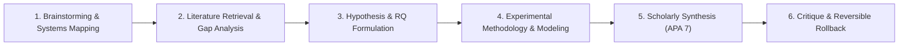

# Cognitive Psychology: End-to-End Research Showcase

This showcase documents a complete, 6-stage end-to-end scientific research workflow in **Cognitive Psychology**, executed collaboratively between a human researcher and DeepAgent in CollarAgent.

## Research Focus

- **Topic**: Cognitive Load Dynamics and Dual-Task Interference in Multimodal Research Workspaces.
- **Theoretical Foundations**:
  - Sweller's Cognitive Load Theory (Intrinsic, Extraneous, and Germane Load).
  - Baddeley's Multicomponent Model of Working Memory (Central Executive, Phonological Loop, Visuospatial Sketchpad).
  - Mayer's Cognitive Theory of Multimedia Learning (Spatial Contiguity and Split-Attention Effects).
- **Core Investigation**: How spatial concept mapping (infinite canvas) interacted with scholarly text authoring (document editor) modulates cognitive throughput and working memory saturation during complex academic sensemaking.

---

## The 6 Research Lifecycle Stages

| Stage  | Document                                                                                                                                                                | Research Activity                                                                                                          | CollarAgent System Interaction                                                                        | Primary Tools & Engine                                                                                                                                                                                                                                                                                                                                               |
| :----- | :---------------------------------------------------------------------------------------------------------------------------------------------------------------------- | :------------------------------------------------------------------------------------------------------------------------- | :---------------------------------------------------------------------------------------------------- | :------------------------------------------------------------------------------------------------------------------------------------------------------------------------------------------------------------------------------------------------------------------------------------------------------------------------------------------------------------------- |
| **01** | [stage-01-idea-brainstorming.md](file:///Users/goldenfung/Documents/collaragent/docs/scenario-showcase/cognitive-psychology/stage-01-idea-brainstorming.md)             | First-principles deconstruction of cognitive load; mapping subsystem roots and feedback loops.                             | Generates visual knowledge graph and concept hierarchy on the Infinite Canvas.                        | [`writeMindMap`](file:///Users/goldenfung/Documents/collaragent/src/collaragent/tools/WorkspaceTools.ts#L1082), [`writeGraph`](file:///Users/goldenfung/Documents/collaragent/src/collaragent/tools/WorkspaceTools.ts#L969), [`holistic-thinking-analyst`](file:///Users/goldenfung/Documents/collaragent/src/collaragent/skills/holistic-thinking-analyst/SKILL.md) |
| **02** | [stage-02-literature-retrieval.md](file:///Users/goldenfung/Documents/collaragent/docs/scenario-showcase/cognitive-psychology/stage-02-literature-retrieval.md)         | Empirical prior art search across working memory models, split-attention literature, and dual-task paradigms.              | Subagent delegation for literature synthesis; populates comparative evidence matrix.                  | [`internetSearch`](file:///Users/goldenfung/Documents/collaragent/src/collaragent/tools/SearchTools.ts#L14), [`apa-research-execution-specialist`](file:///Users/goldenfung/Documents/collaragent/src/collaragent/skills/apa-research-execution-specialist/SKILL.md)                                                                                                 |
| **03** | [stage-03-hypothesis-and-rq.md](file:///Users/goldenfung/Documents/collaragent/docs/scenario-showcase/cognitive-psychology/stage-03-hypothesis-and-rq.md)               | Formulating formal Research Questions ($RQ_1, RQ_2$) and directional hypotheses ($H_1, H_2$); operationalizing constructs. | Authors structured document sections with operationalized independent and dependent variables.        | [`createDocument`](file:///Users/goldenfung/Documents/collaragent/src/collaragent/tools/WorkspaceTools.ts#L799), [`editDocument`](file:///Users/goldenfung/Documents/collaragent/src/collaragent/tools/WorkspaceTools.ts#L820)                                                                                                                                       |
| **04** | [stage-04-experimental-methodology.md](file:///Users/goldenfung/Documents/collaragent/docs/scenario-showcase/cognitive-psychology/stage-04-experimental-methodology.md) | Designing a dual-task N-back + concept mapping experimental protocol; statistical power calculations; KaTeX modeling.      | Inserts apparatus specs, trial timelines, and mathematical formulas into the Lexical document.        | [`editDocument`](file:///Users/goldenfung/Documents/collaragent/src/collaragent/tools/WorkspaceTools.ts#L820), KaTeX rendering                                                                                                                                                                                                                                       |
| **05** | [stage-05-scholarly-synthesis.md](file:///Users/goldenfung/Documents/collaragent/docs/scenario-showcase/cognitive-psychology/stage-05-scholarly-synthesis.md)           | Assembling strict APA 7th Edition manuscript sections (Introduction, Lit Review, Method, Planned Analysis).                | Generates AST-compliant tables, formatted references, and hierarchical headings without schema drift. | [`createDocument`](file:///Users/goldenfung/Documents/collaragent/src/collaragent/tools/WorkspaceTools.ts#L799), [`AssertionEngine`](file:///Users/goldenfung/Documents/collaragent/evals/assertions/AssertionEngine.ts#L22)                                                                                                                                         |
| **06** | [stage-06-critique-and-rollback.md](file:///Users/goldenfung/Documents/collaragent/docs/scenario-showcase/cognitive-psychology/stage-06-critique-and-rollback.md)       | Peer review critique; detecting an uncontrolled confounding variable; staging and executing mathematical rollback.         | Inverts patched command sequence; restores baseline state with 100% snapshot byte parity.             | [`InverseCommandEngine`](file:///Users/goldenfung/Documents/collaragent/src/collaragent/runtime/InverseCommandEngine.ts), [`AssertionEngine`](file:///Users/goldenfung/Documents/collaragent/evals/assertions/AssertionEngine.ts#L162)                                                                                                                               |
