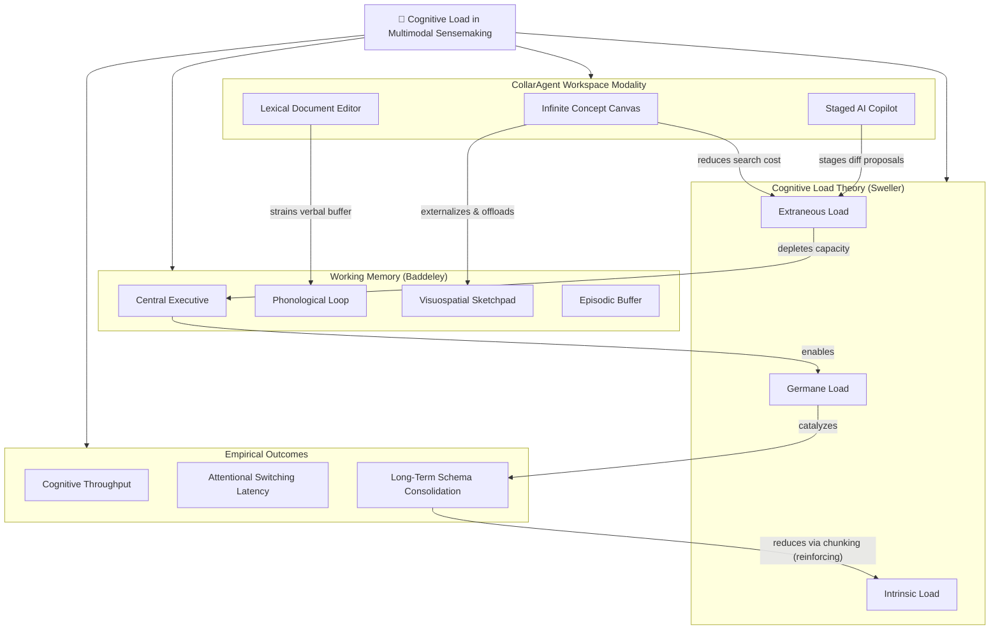

# Stage 1: Idea Brainstorming & Systems Mapping

## Scenario Overview

- **Scenario ID**: `SCN-PSY-01`
- **Domain**: Cognitive Psychology
- **Lifecycle Stage**: 1 (Idea Brainstorming & Systems Mapping)
- **Primary Objective**: Apply Systems Thinking and First Principles to deconstruct Sweller's Cognitive Load Theory and Baddeley's Working Memory model, externalizing the mental model into an interactive knowledge graph on the CollarAgent Concept Canvas.
- **Participating Agent**: DeepAgent with [`holistic-thinking-analyst`](file:///Users/goldenfung/Documents/collaragent/src/collaragent/skills/holistic-thinking-analyst/SKILL.md) skill.
- **Workspace Tools Used**: [`writeMindMap`](file:///Users/goldenfung/Documents/collaragent/src/collaragent/tools/WorkspaceTools.ts#L1082), [`writeGraph`](file:///Users/goldenfung/Documents/collaragent/src/collaragent/tools/WorkspaceTools.ts#L969).

---

## 1. Human Researcher Intent & Prompt

The researcher wants to explore how spatial node-link interfaces (like visual concept canvases) affect cognitive load compared to linear text documents during academic sensemaking.

```markdown
User:
I want to investigate how researchers manage cognitive load when using a split-pane interface
combining an infinite concept canvas with a scholarly text editor. Let's start from first principles
and build a systems model of Cognitive Load Theory and Working Memory bottlenecks on the canvas.
Map out the major subsystems, micro-components, directional influences, and reinforcing feedback loops.
```

---

## 2. Agent Cognitive Sequence (`holistic-thinking-analyst`)

Following the directives in [`holistic-thinking-analyst/SKILL.md`](file:///Users/goldenfung/Documents/collaragent/src/collaragent/skills/holistic-thinking-analyst/SKILL.md#L29-L57), the agent performs a structured 7-step analysis inside its reasoning process:

1. **First Principles Core & Lateral Framing**:
   - _Assumptions challenged_: Linear document authoring is standard because thinking is linear. _Fact_: Human working memory organizes knowledge in schemas (associative networks), not linear streams.
   - _Irreducible truths_: Working memory capacity is finite ($7 \pm 2$ chunks or 3–4 visual objects, Cowan 2001). Total cognitive load is the additive sum: $L_{\text{total}} = L_{\text{intrinsic}} + L_{\text{extraneous}} + L_{\text{germane}}$.
2. **Major Subsystems (Mind Map Roots)**:
   - Categorized into 4 structural pillars:
     1. `[WM] Working Memory Architecture`
     2. `[CLT] Cognitive Load Dimensions`
     3. `[UI] Workspace Modality (Spatial Canvas vs. Document)`
     4. `[OUT] Cognitive Performance & Schema Formation`
3. **Micro-Systems**:
   - Deconstructs `[WM]` into _Central Executive_, _Phonological Loop_, and _Visuospatial Sketchpad_.
   - Deconstructs `[CLT]` into _Intrinsic Load_ (task difficulty), _Extraneous Load_ (interface friction), and _Germane Load_ (schema construction).
4. **Relationship Mapping**:
   - Directional vectors expressing information flow (e.g., UI split-attention _amplifies_ extraneous load; visuospatial sketchpad offloading _reduces_ phonological contention).
5. **Feedback Loops**:
   - _Loop 1 (Vicious Cycle)_: High Extraneous Load $\rightarrow$ Exhausted Central Executive $\rightarrow$ Disorganized External Representation $\rightarrow$ Increased Visual Search Time $\rightarrow$ Higher Extraneous Load.
   - _Loop 2 (Virtuous Cycle)_: Canvas Spatial Clustering $\rightarrow$ Chunk Compression $\rightarrow$ Freed Working Memory $\rightarrow$ Active Schema Construction (Germane Load).
6. **Second-Order Effects**:
   - Offloading structure to a 2D canvas frees working memory for high-level semantic critique, but introduces spatial navigation overhead if zoom/pan is undisciplined.
7. **Leverage Point**:
   - Minimizing window switching friction between canvas nodes and document blocks is the highest-leverage intervention to prevent cognitive thrashing.

---

## 3. Tool Execution on Workspace Canvas

The agent invokes [`writeMindMap`](file:///Users/goldenfung/Documents/collaragent/src/collaragent/tools/WorkspaceTools.ts#L1082) to plant the hierarchy, followed by [`writeGraph`](file:///Users/goldenfung/Documents/collaragent/src/collaragent/tools/WorkspaceTools.ts#L969) in `merge` mode to encode directional dynamics:

### Tool Call 1: Plant Structural Hierarchy (`writeMindMap`)

```json
{
  "project": "Cognitive-Psychology-Study",
  "root": {
    "name": "Cognitive Load Dynamics in Multimodal Sensemaking",
    "children": [
      {
        "name": "[WM] Working Memory Subsystems",
        "children": [
          { "name": "Central Executive (Attentional Control)" },
          { "name": "Phonological Loop (Verbal Working Memory)" },
          { "name": "Visuospatial Sketchpad (Spatial Representation)" },
          { "name": "Episodic Buffer (Multimodal Integration)" }
        ]
      },
      {
        "name": "[CLT] Cognitive Load Types (Sweller)",
        "children": [
          { "name": "Intrinsic Load (Domain Material Complexity)" },
          { "name": "Extraneous Load (Interface & Split-Attention Friction)" },
          { "name": "Germane Load (Active Schema Construction)" }
        ]
      },
      {
        "name": "[UI] Workspace Modality",
        "children": [
          { "name": "Infinite Concept Canvas (2D Spatial Graphs)" },
          { "name": "Lexical Scholarly Editor (1D Linear Text)" },
          { "name": "Staged Proposal Copilot (AI Assistance)" }
        ]
      },
      {
        "name": "[OUT] Cognitive Outcomes",
        "children": [
          { "name": "Cognitive Throughput (Items/Minute)" },
          { "name": "Attentional Switching Latency" },
          { "name": "Long-Term Memory Schema Formation" }
        ]
      }
    ]
  }
}
```

### Tool Call 2: Cross-Subsystem Dynamics & Feedback Loops (`writeGraph`)

```json
{
  "project": "Cognitive-Psychology-Study",
  "mode": "merge",
  "graph": {
    "relationships": [
      {
        "source": "Infinite Concept Canvas (2D Spatial Graphs)",
        "target": "Visuospatial Sketchpad (Spatial Representation)",
        "label": "externalizes & offloads"
      },
      {
        "source": "Lexical Scholarly Editor (1D Linear Text)",
        "target": "Phonological Loop (Verbal Working Memory)",
        "label": "strains verbal buffer"
      },
      {
        "source": "Infinite Concept Canvas (2D Spatial Graphs)",
        "target": "Extraneous Load (Interface & Split-Attention Friction)",
        "label": "reduces visual search friction"
      },
      {
        "source": "Extraneous Load (Interface & Split-Attention Friction)",
        "target": "Central Executive (Attentional Control)",
        "label": "depletes capacity (inhibits)"
      },
      {
        "source": "Central Executive (Attentional Control)",
        "target": "Germane Load (Active Schema Construction)",
        "label": "enables high-order synthesis"
      },
      {
        "source": "Germane Load (Active Schema Construction)",
        "target": "Long-Term Memory Schema Formation",
        "label": "catalyzes consolidation"
      },
      {
        "source": "Long-Term Memory Schema Formation",
        "target": "Intrinsic Load (Domain Material Complexity)",
        "label": "reduces via chunking (reinforcing loop)"
      }
    ]
  }
}
```

---

## 4. Resulting Concept Canvas Graph



---

## 5. Human-Agent Co-Work Touchpoint

1. **Visual Confirmation**: The researcher inspects the canvas in the left pane of CollarAgent.
2. **Refinement**: The researcher notices that "Attentional Switching Latency" between the canvas and document pane needs explicit isolation.
3. **Interactive Adjustment**: The researcher moves the `Attentional Switching Latency` node between `Canvas` and `Doc` and pins an annotation: _"Primary dependent variable for dual-task experiment"_.
4. **Transition to Stage 2**: With the conceptual architecture anchored in the canvas, the team transitions to retrieving empirical literature on split-attention and dual-task interference.
