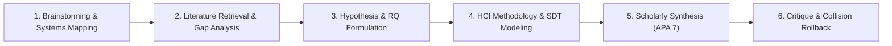

# Human-Computer Interaction: End-to-End Research Showcase

This showcase documents a complete, 6-stage end-to-end scientific research workflow in **Human-Computer Interaction (HCI) & Mixed-Initiative AI Systems**, executed collaboratively between a human researcher and DeepAgent in CollarAgent.

## Research Focus

- **Topic**: Mixed-Initiative Interaction, Sense of Agency, and Defect Detection in Staged AI Co-Authoring Workspaces.
- **Theoretical Foundations**:
  - Horvitz's Principles of Mixed-Initiative User Interfaces (Uncertainty modeling, direct manipulation coupling, non-invasive awareness).
  - Shneiderman's Human-Centered AI Framework (High Automation coupled with High Human Control).
  - Parasuraman & Manzey's Model of Automation Bias and Complacency.
  - Macmillan & Creelman's Signal Detection Theory ($d'$ Sensitivity and $c$ Decision Criterion in human supervisory control).
- **Core Investigation**: How non-destructive staged proposal diffs (versus direct autonomous overwrites and modal confirmation dialogs) modulate user defect detection rates ($d'$), perceived agency, and task completion velocity during complex knowledge synthesis.

---

## The 6 Research Lifecycle Stages

| Stage  | Document                                                                                                                                               | Research Activity                                                                                                                           | CollarAgent System Interaction                                                                                        | Primary Tools & Engine                                                                                                                                                                                                                                                                                                                                               |
| :----- | :----------------------------------------------------------------------------------------------------------------------------------------------------- | :------------------------------------------------------------------------------------------------------------------------------------------ | :-------------------------------------------------------------------------------------------------------------------- | :------------------------------------------------------------------------------------------------------------------------------------------------------------------------------------------------------------------------------------------------------------------------------------------------------------------------------------------------------------------- |
| **01** | [stage-01-idea-brainstorming.md](file:///Users/goldenfung/Documents/collaragent/docs/scenario-showcase/hci/stage-01-idea-brainstorming.md)             | First-principles deconstruction of mixed-initiative agency; mapping state transitions, locus of control, and automation bias.               | Generates visual knowledge graph of initiative handover protocols on the Concept Canvas.                              | [`writeMindMap`](file:///Users/goldenfung/Documents/collaragent/src/collaragent/tools/WorkspaceTools.ts#L1082), [`writeGraph`](file:///Users/goldenfung/Documents/collaragent/src/collaragent/tools/WorkspaceTools.ts#L969), [`holistic-thinking-analyst`](file:///Users/goldenfung/Documents/collaragent/src/collaragent/skills/holistic-thinking-analyst/SKILL.md) |
| **02** | [stage-02-literature-retrieval.md](file:///Users/goldenfung/Documents/collaragent/docs/scenario-showcase/hci/stage-02-literature-retrieval.md)         | Empirical prior art search across automation complacency, mixed-initiative authoring (Horvitz, Fast, Glassman), and diff inspection.        | Subagent delegation for HCI literature synthesis; populates comparative evidence matrix.                              | [`internetSearch`](file:///Users/goldenfung/Documents/collaragent/src/collaragent/tools/SearchTools.ts#L14), [`apa-research-execution-specialist`](file:///Users/goldenfung/Documents/collaragent/src/collaragent/skills/apa-research-execution-specialist/SKILL.md)                                                                                                 |
| **03** | [stage-03-hypothesis-and-rq.md](file:///Users/goldenfung/Documents/collaragent/docs/scenario-showcase/hci/stage-03-hypothesis-and-rq.md)               | Formulating formal Research Questions ($RQ_1, RQ_2$) and directional hypotheses ($H_1, H_2$); operationalizing agency and defect detection. | Authors structured document sections with operationalized independent, dependent, and psychometric variables.         | [`createDocument`](file:///Users/goldenfung/Documents/collaragent/src/collaragent/tools/WorkspaceTools.ts#L799), [`editDocument`](file:///Users/goldenfung/Documents/collaragent/src/collaragent/tools/WorkspaceTools.ts#L820)                                                                                                                                       |
| **04** | [stage-04-experimental-methodology.md](file:///Users/goldenfung/Documents/collaragent/docs/scenario-showcase/hci/stage-04-experimental-methodology.md) | Within-subjects Latin square user study protocol ($N = 36$); Signal Detection Theory ($d'$, $c$) and Net Productive Velocity in KaTeX.      | Inserts Latin square counterbalancing, stimulus vignette controls, and mathematical models into the Lexical document. | [`editDocument`](file:///Users/goldenfung/Documents/collaragent/src/collaragent/tools/WorkspaceTools.ts#L820), KaTeX rendering                                                                                                                                                                                                                                       |
| **05** | [stage-05-scholarly-synthesis.md](file:///Users/goldenfung/Documents/collaragent/docs/scenario-showcase/hci/stage-05-scholarly-synthesis.md)           | Assembling strict APA 7th Edition manuscript sections (Title Page, Abstract, Method, Planned Results Table 1, References).                  | Generates AST-compliant HCI performance tables and formatted references without schema drift.                         | [`createDocument`](file:///Users/goldenfung/Documents/collaragent/src/collaragent/tools/WorkspaceTools.ts#L799), [`AssertionEngine`](file:///Users/goldenfung/Documents/collaragent/evals/assertions/AssertionEngine.ts#L22)                                                                                                                                         |
| **06** | [stage-06-critique-and-rollback.md](file:///Users/goldenfung/Documents/collaragent/docs/scenario-showcase/hci/stage-06-critique-and-rollback.md)       | Concurrent co-editing conflict and race condition recovery; staged rejection; mathematical command stream rollback.                         | Inverts patched command sequence; restores human typing baseline with 100% snapshot byte parity.                      | [`InverseCommandEngine`](file:///Users/goldenfung/Documents/collaragent/src/collaragent/runtime/InverseCommandEngine.ts), [`AssertionEngine`](file:///Users/goldenfung/Documents/collaragent/evals/assertions/AssertionEngine.ts#L162)                                                                                                                               |
