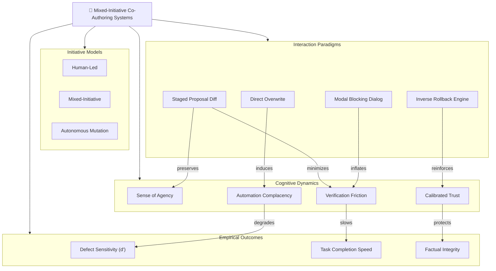

# Stage 1: Idea Brainstorming & Systems Mapping

## Scenario Overview

- **Scenario ID**: `SCN-HCI-01`
- **Domain**: Human-Computer Interaction (HCI) & Mixed-Initiative Systems
- **Lifecycle Stage**: 1 (Idea Brainstorming & Systems Mapping)
- **Primary Objective**: Apply Systems Thinking and First Principles to deconstruct user agency, mixed-initiative interaction models (Horvitz, 1999), and automation bias in AI co-authoring systems. Externalize the mental model into an interactive knowledge graph on the CollarAgent Concept Canvas.
- **Participating Agent**: DeepAgent with [`holistic-thinking-analyst`](file:///Users/goldenfung/Documents/collaragent/src/collaragent/skills/holistic-thinking-analyst/SKILL.md) skill.
- **Workspace Tools Used**: [`writeMindMap`](file:///Users/goldenfung/Documents/collaragent/src/collaragent/tools/WorkspaceTools.ts#L1082), [`writeGraph`](file:///Users/goldenfung/Documents/collaragent/src/collaragent/tools/WorkspaceTools.ts#L969).

---

## 1. Human Researcher Intent & Prompt

The researcher wants to investigate how different interaction paradigms for AI assistance (direct autonomous overwrite vs. modal confirmation dialogs vs. non-destructive staged diff proposals) affect human agency and defect catch rates.

```markdown
User:
I want to design an HCI study exploring human-agent co-authoring dynamics.
Let's start from first principles:

1. Deconstruct the mixed-initiative spectrum: Who holds the initiative (Human vs. Agent vs. Shared)?
2. Analyze failure modes of AI assistance: Automation bias (blind acceptance) vs. Alert fatigue
   (constant interruption) vs. Destruction of human work.
3. Model CollarAgent's staged diff proposal architecture as a mixed-initiative state machine.
4. Identify reinforcing feedback loops between verification friction, trust calibration,
   and defect escape rate.
   Map this out as a comprehensive knowledge graph on the workspace canvas.
```

---

## 2. Agent Cognitive Sequence (`holistic-thinking-analyst`)

Following [`holistic-thinking-analyst/SKILL.md`](file:///Users/goldenfung/Documents/collaragent/src/collaragent/skills/holistic-thinking-analyst/SKILL.md#L29-L57), DeepAgent executes the 7-step sequence:

1. **First Principles Core & Lateral Framing**:
   - _Assumptions challenged_: More automation is always better for productivity. _Fact_: Unchecked automation removes the human from the cognitive loop, inducing automation complacency where subtle AI hallucinations are approved without scrutiny.
   - _Irreducible truths_: Co-authoring requires shared state. Writing is non-linear thinking. If the user cannot predict or easily revert what the agent changes, their psychological Sense of Agency (SoA) collapses, causing defensive rejection of the tool.
2. **Major Subsystems (Mind Map Roots)**:
   - 4 macro-level structural pillars:
     1. `[AGNC] Locus of Control & Initiative Models`
     2. `[MECH] AI Proposal Presentation Mechanisms`
     3. `[COGN] Cognitive Biases & Verification Costs`
     4. `[PERF] Co-Authoring Velocity & Defect Escape`
3. **Micro-Systems**:
   - Deconstructs `[MECH]` into _Direct Autonomous Overwrite_, _Modal Confirmation Dialog_, and _Non-Destructive Staged Proposal Diff_.
   - Deconstructs `[COGN]` into _Automation Complacency_, _Alert Fatigue_, _Cognitive Verification Friction_, and _Sense of Agency (SoA)_.
4. **Relationship Mapping**:
   - Directional vectors (e.g., Autonomous Overwrite _induces_ Automation Complacency $\rightarrow$ _elevates_ Defect Escape Rate; Staged Diff _lowers_ Verification Friction $\rightarrow$ _preserves_ Sense of Agency).
5. **Feedback Loops**:
   - _Vicious Cycle (Modal Alert Fatigue)_: High Interruption Frequency $\rightarrow$ User Cognitive Overload $\rightarrow$ Habitual "Accept All" Clicking $\rightarrow$ Hallucinations Escape into Manuscript $\rightarrow$ Eviscerated Scientific Trust.
   - _Virtuous Cycle (Non-Destructive Staging)_: Staged Diff Previews $\rightarrow$ Low Verification Overhead $\rightarrow$ Rapid Human Inspection $\rightarrow$ Calibrated Trust & Zero Silent Overwrites.
6. **Second-Order Effects**:
   - Providing instant mathematical reversibility (undo) empowers users to delegate broader exploratory synthesis to agents without risk of corrupting hours of human work.
7. **Leverage Point**:
   - Decoupling **proposal generation** from **state commitment** via a staging area (git-like staging for documents/canvases) is the highest-leverage architectural intervention.

---

## 3. Tool Execution on Workspace Canvas

The agent invokes [`writeMindMap`](file:///Users/goldenfung/Documents/collaragent/src/collaragent/tools/WorkspaceTools.ts#L1082) and [`writeGraph`](file:///Users/goldenfung/Documents/collaragent/src/collaragent/tools/WorkspaceTools.ts#L969):

### Tool Call 1: Plant Structural Hierarchy (`writeMindMap`)

```json
{
  "project": "HCI-CoAuthoring-Study",
  "root": {
    "name": "Mixed-Initiative Human-AI Co-Authoring Systems",
    "children": [
      {
        "name": "[AGNC] Initiative & Control Handover",
        "children": [
          { "name": "Human-Led Direct Manipulation" },
          { "name": "Mixed-Initiative Cooperative Handshake" },
          { "name": "Autonomous Agent Mutation" }
        ]
      },
      {
        "name": "[MECH] Proposal Presentation Paradigms",
        "children": [
          { "name": "Direct In-Place Overwrite (No Review)" },
          { "name": "Modal Blocking Dialog (Interruptive)" },
          { "name": "Non-Destructive Staged Proposal Diff" },
          { "name": "Mathematical Inverse Rollback Engine" }
        ]
      },
      {
        "name": "[COGN] Human Cognitive States",
        "children": [
          { "name": "Sense of Agency (SoA)" },
          { "name": "Automation Complacency & Bias" },
          { "name": "Verification Cognitive Friction" },
          { "name": "Calibrated System Trust" }
        ]
      },
      {
        "name": "[PERF] Co-Authoring Outcomes",
        "children": [
          { "name": "Defect Discrimination Sensitivity (d-prime)" },
          { "name": "Task Completion Velocity (WPM)" },
          { "name": "Manuscript Factual Integrity" }
        ]
      }
    ]
  }
}
```

### Tool Call 2: Relational Dependencies & Dynamic Feedback Loops (`writeGraph`)

```json
{
  "project": "HCI-CoAuthoring-Study",
  "mode": "merge",
  "graph": {
    "relationships": [
      {
        "source": "Direct In-Place Overwrite (No Review)",
        "target": "Automation Complacency & Bias",
        "label": "triggers uninspected commits"
      },
      {
        "source": "Modal Blocking Dialog (Interruptive)",
        "target": "Verification Cognitive Friction",
        "label": "inflates interruption overhead"
      },
      {
        "source": "Non-Destructive Staged Proposal Diff",
        "target": "Verification Cognitive Friction",
        "label": "minimizes inspection cost"
      },
      {
        "source": "Non-Destructive Staged Proposal Diff",
        "target": "Sense of Agency (SoA)",
        "label": "preserves human control"
      },
      {
        "source": "Automation Complacency & Bias",
        "target": "Defect Discrimination Sensitivity (d-prime)",
        "label": "degrades detection accuracy"
      },
      {
        "source": "Mathematical Inverse Rollback Engine",
        "target": "Calibrated System Trust",
        "label": "guarantees zero-risk exploration"
      }
    ]
  }
}
```

---

## 4. Resulting Mixed-Initiative Systems Graph



---

## 5. Human-Agent Co-Work Touchpoint

1. **Researcher Verification**: The researcher inspects the canvas in CollarAgent, verifying that the tri-part interaction paradigm (Direct Overwrite vs. Modal Dialog vs. Staged Diff) is cleanly modeled.
2. **Refinement**: The researcher notes that **Signal Detection Theory ($d'$)** should serve as the primary objective metric for defect discrimination, ensuring we separate true defect detection from user guessing bias.
3. **Transition**: The team advances to Stage 2: Literature Retrieval & Gap Analysis.
