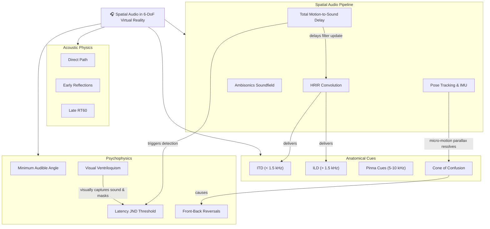

# Stage 1: Idea Brainstorming & Systems Mapping

## Scenario Overview

- **Scenario ID**: `SCN-ACO-01`
- **Domain**: Psychoacoustics & Spatial Audio (Acoustic DSP + Cognitive Psychology)
- **Lifecycle Stage**: 1 (Idea Brainstorming & Systems Mapping)
- **Primary Objective**: Apply Systems Thinking and First Principles to deconstruct spatial auditory perception, binaural signal processing (ITD, ILD, HRTFs), and motion-to-sound latency in 6-DoF virtual environments. Externalize the mental model into an interactive knowledge graph on the CollarAgent Concept Canvas.
- **Participating Agent**: DeepAgent with [`holistic-thinking-analyst`](file:///Users/goldenfung/Documents/collaragent/src/collaragent/skills/holistic-thinking-analyst/SKILL.md) skill.
- **Workspace Tools Used**: [`writeMindMap`](file:///Users/goldenfung/Documents/collaragent/src/collaragent/tools/WorkspaceTools.ts#L1082), [`writeGraph`](file:///Users/goldenfung/Documents/collaragent/src/collaragent/tools/WorkspaceTools.ts#L969).

---

## 1. Human Researcher Intent & Prompt

The researcher wants to explore how latency in dynamic binaural audio rendering affects spatial sound localization accuracy and perceptual immersion in 6-DoF virtual reality.

```markdown
User:
I want to design a psychoacoustics experiment investigating motion-to-sound latency thresholds
in 6-DoF spatial audio rendering. Let's start from first principles:

1. Deconstruct the physical and anatomical mechanisms of spatial hearing (ITD, ILD, spectral pinna cues, HRTF).
2. Model the acoustic signal processing pipeline (tracking -> Ambisonics decoding -> binaural convolution -> D/A conversion).
3. Map how head motion parallax resolves the cone of confusion, and where perceptual latency breaks this feedback loop.
   Map this out as an interactive systems knowledge graph on our canvas.
```

---

## 2. Agent Cognitive Sequence (`holistic-thinking-analyst`)

Following [`holistic-thinking-analyst/SKILL.md`](file:///Users/goldenfung/Documents/collaragent/src/collaragent/skills/holistic-thinking-analyst/SKILL.md#L29-L57), DeepAgent executes the 7-step analytical sequence:

1. **First Principles Core & Lateral Framing**:
   - _Assumptions challenged_: Sound localization is purely static and determined at the eardrum. _Fact_: The auditory system is fundamentally dynamic; micro-head movements (wobble) are essential to resolve front-back ambiguities.
   - _Irreducible physical truths_: Speed of sound $c \approx 343\text{ m/s}$. Average interaural distance $d \approx 17.5\text{ cm}$. Maximum physical ITD at $90^\circ$ azimuth is $\sim 650\text{ }\mu\text{s}$. Frequencies below $1.5\text{ kHz}$ are localized via phase delays (ITD); frequencies above $1.5\text{ kHz}$ are localized via head shadow attenuation (ILD).
2. **Major Subsystems (Mind Map Roots)**:
   - 4 macro-level structural pillars:
     1. `[PHYS] Acoustic Physics & Propagation`
     2. `[DSP] Real-Time Spatial Audio Pipeline`
     3. `[ANAT] Anatomical & Spectral Filtering (HRTF)`
     4. `[PERC] Psychoacoustic Perception & Latency`
3. **Micro-Systems**:
   - Deconstructs `[ANAT]` into _Interaural Time Difference (ITD)_, _Interaural Level Difference (ILD)_, _Pinna Cavity Notches ($5\text{--}10\text{ kHz}$)_, and _Torso/Shoulder Reflections_.
   - Deconstructs `[DSP]` into _6-DoF Pose Sensor_, _Kalman Filter Prediction_, _Higher-Order Ambisonics (HOA) Rotation_, and _Binaural Room Impulse Response (BRIR) Convolution_.
4. **Relationship Mapping**:
   - Directional dependencies (e.g., Head rotation _shifts_ acoustic incidence angle $\rightarrow$ dynamic ITD modulation $\rightarrow$ disambiguates cone of confusion).
5. **Feedback Loops**:
   - _Balancing Loop (Spatial Grounding)_: Head Rotates $\rightarrow$ Visual Scene Shifts & Auditory Cues Counter-Rotate $\rightarrow$ Stable Auditory Externalization ($E_{\text{ext}}$) $\rightarrow$ Confidence in Source Location.
   - _Destructive Loop (Latency Divergence)_: High Processing Delay ($> 40\text{ ms}$) $\rightarrow$ Sound Drags with Head Turn $\rightarrow$ Perceived Image Detaches from Visual Anchor $\rightarrow$ Spatial Disorientation / Cybersickness.
6. **Second-Order Effects**:
   - A rigid visual anchor (e.g., seeing the virtual speaker) recruits the _ventriloquism effect_, visually capturing sound and artificially increasing the latency detection threshold.
7. **High-Leverage Leverage Point**:
   - Isolating rotational velocity ($\omega$) during the psychophysical staircase is critical: rapid head saccades ($> 60^\circ/\text{s}$) will expose latency far more aggressively than slow exploration ($< 15^\circ/\text{s}$).

---

## 3. Tool Execution on Workspace Canvas

The agent calls [`writeMindMap`](file:///Users/goldenfung/Documents/collaragent/src/collaragent/tools/WorkspaceTools.ts#L1082) and [`writeGraph`](file:///Users/goldenfung/Documents/collaragent/src/collaragent/tools/WorkspaceTools.ts#L969):

### Tool Call 1: Plant Structural Hierarchy (`writeMindMap`)

```json
{
  "project": "Psychoacoustics-Latency-Study",
  "root": {
    "name": "Spatial Audio Perception & Latency in 6-DoF",
    "children": [
      {
        "name": "[PHYS] Acoustic Field & Propagation",
        "children": [
          { "name": "Direct Sound Path (Inverse Square Law)" },
          { "name": "Early Reflections & Precedence (Haas) Effect" },
          { "name": "Late Diffuse Reverberation (Room RT60)" }
        ]
      },
      {
        "name": "[ANAT] Binaural & Anatomical Cues",
        "children": [
          { "name": "Interaural Time Difference (ITD < 1.5 kHz)" },
          { "name": "Interaural Level Difference (ILD > 1.5 kHz)" },
          { "name": "Pinna Spectral Cues (5-10 kHz Elevation)" },
          { "name": "Cone of Confusion Ambiguities" }
        ]
      },
      {
        "name": "[DSP] 6-DoF Spatial Audio Engine",
        "children": [
          { "name": "Pose Tracking & IMU Sampling" },
          { "name": "Higher-Order Ambisonics (HOA) Soundfield" },
          { "name": "Binaural Synthesis via HRIR Convolution" },
          { "name": "Total Motion-to-Sound Latency" }
        ]
      },
      {
        "name": "[PERC] Psychophysics & Perception",
        "children": [
          { "name": "Minimum Audible Angle (MAA Threshold)" },
          { "name": "Auditory-Visual Ventriloquism Capture" },
          { "name": "Latency Just Noticeable Difference (JND)" },
          { "name": "Front-Back Reversal Errors" }
        ]
      }
    ]
  }
}
```

### Tool Call 2: Relational Vectors & Dynamic Loops (`writeGraph`)

```json
{
  "project": "Psychoacoustics-Latency-Study",
  "mode": "merge",
  "graph": {
    "relationships": [
      {
        "source": "Cone of Confusion Ambiguities",
        "target": "Front-Back Reversal Errors",
        "label": "causes"
      },
      {
        "source": "Pose Tracking & IMU Sampling",
        "target": "Cone of Confusion Ambiguities",
        "label": "head motion parallax resolves"
      },
      {
        "source": "Total Motion-to-Sound Latency",
        "target": "Binaural Synthesis via HRIR Convolution",
        "label": "delays filter update"
      },
      {
        "source": "Total Motion-to-Sound Latency",
        "target": "Latency Just Noticeable Difference (JND)",
        "label": "exceeds perceptual threshold"
      },
      {
        "source": "Auditory-Visual Ventriloquism Capture",
        "target": "Latency Just Noticeable Difference (JND)",
        "label": "increases tolerance (masks delay)"
      },
      {
        "source": "Binaural Synthesis via HRIR Convolution",
        "target": "Interaural Time Difference (ITD < 1.5 kHz)",
        "label": "encodes phase delay"
      }
    ]
  }
}
```

---

## 4. Resulting Spatial Audio Systems Graph



---

## 5. Human-Agent Co-Work Touchpoint

1. **Researcher Verification**: The researcher inspects the canvas graph, confirming that both low-frequency phase cues (ITD) and high-frequency level/pinna cues (ILD/spectral) are accounted for.
2. **Refinement**: The researcher highlights the interaction between **Head Velocity ($\omega$)** and **Ventriloquism Capture**, requesting that the subsequent literature search explicitly isolate whether visual co-presence expands the latency tolerance envelope.
3. **Transition**: The team transitions to Stage 2: Literature Retrieval & Gap Analysis.
