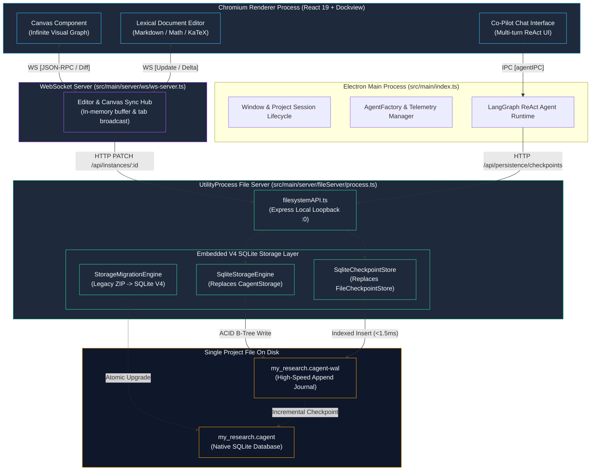
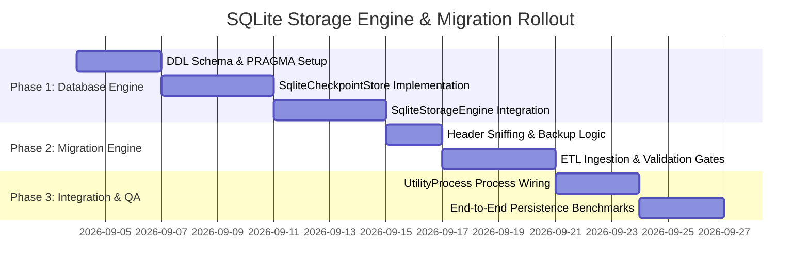

# SQLite Storage & Migration Architecture Catalog (V4)

Welcome to the **CollarAgent V4 SQLite Storage Architecture Catalog**. This catalog documents the technical specification, database schema, and migration strategy for transitioning CollarAgent from a sharded ZIP archive format to a **single-file embedded SQLite database (WAL mode)** serving directly as the native `.cagent` project container.

---

## 1. Quick Navigation Hub

| Document                                                                                                                                                                    | Description                                                                                            | Target Audience                    |
| :-------------------------------------------------------------------------------------------------------------------------------------------------------------------------- | :----------------------------------------------------------------------------------------------------- | :--------------------------------- |
| 📋 [**Requirements & Invariants**](file:///Users/goldenfung/Documents/collaragent/docs/sqlite-storage-architecture/requirements.md)                                         | Functional requirements, NFR performance budgets, and core system invariants.                          | Architects, Product Managers, SREs |
| 📑 [**Hard Requirements Spec**](file:///Users/goldenfung/Documents/collaragent/docs/sqlite-storage-architecture/spec.md)                                                    | Six-area hard requirements specification following spec-driven development.                            | Systems & Runtime Engineers, QA    |
| 🔍 [**Current ZIP Storage Bottlenecks**](file:///Users/goldenfung/Documents/collaragent/docs/sqlite-storage-architecture/current-zip-storage-problems.md)                   | Root-cause analysis of current ZIP storage: linear scans, close stalls, and memory bloat.              | Systems & Runtime Engineers        |
| 🗄️ [**Storage Engine Design**](file:///Users/goldenfung/Documents/collaragent/docs/sqlite-storage-architecture/storage-engine-design.md)                                    | SQLite PRAGMA configuration, C4 Level 4 ERD, DDL SQL schemas, B-Tree indexes, and compaction routines. | Backend & Database Engineers       |
| 🔄 [**Migration Plan**](file:///Users/goldenfung/Documents/collaragent/docs/sqlite-storage-architecture/migration-plan.md)                                                  | Automated 4-phase ETL pipeline converting legacy V2/V3 ZIP archives to V4 SQLite with zero data loss.  | Systems & Runtime Engineers        |
| 📜 [**ADR-001: SQLite Project Container**](file:///Users/goldenfung/Documents/collaragent/docs/sqlite-storage-architecture/adrs/adr-001-sqlite-embedded-project-storage.md) | Architecture Decision Record detailing context, trade-offs, evaluated alternatives, and consequences.  | Lead Architects & Stakeholders     |
| 🗺️ [**Implementation Plan**](file:///Users/goldenfung/Documents/collaragent/docs/sqlite-storage-architecture/tasks/plan.md)                                                 | Component dependency graph, vertical slices, and architectural decisions.                              | Systems & Runtime Engineers        |
| ✅ [**Task Breakdown (Todo)**](file:///Users/goldenfung/Documents/collaragent/docs/sqlite-storage-architecture/tasks/todo.md)                                               | Granular 13-task checklist across 5 implementation phases.                                             | Systems & Runtime Engineers        |

---

## 2. C2 Container Architecture

The diagram below illustrates the updated multi-process topology. Note that the **Chromium Renderer** and **WebSocket Server** continue operating without any breaking protocol or code changes:

---

## 3. Comparative Architecture Matrix (V3 vs. V4)

| Architectural Dimension          | V3 Sharded ZIP Architecture                                    | V4 Native SQLite Architecture                           |
| :------------------------------- | :------------------------------------------------------------- | :------------------------------------------------------ |
| **Physical File Representation** | ZIP file unpacked into adjacent `<name>.collar/` directory     | **Single `.cagent` file** (SQLite database in WAL mode) |
| **Workspace Mount Time**         | $O(N)$ unpack ($3,500 - 8,000\text{ms}$)                       | **$O(1)$ direct connect ($< 15\text{ms}$)**             |
| **Window Close / Shutdown**      | $O(N)$ zip compression ($2,000 - 15,000\text{ms}$)             | **$O(1)$ connection close ($< 10\text{ms}$)**           |
| **Checkpoint Point Reads**       | Linear directory traversal of JSON files ($50 - 250\text{ms}$) | **B-Tree indexed point query ($< 1.5\text{ms}$)**       |
| **Crash Durability**             | Risk of half-written files across directory tree               | **Full ACID transactional crash recovery (WAL)**        |
| **Memory Consumption**           | Monolithic in-memory JSON state + eager card load              | **Lazy loading of document/canvas BLOBs on demand**     |
| **File Transfer & Portability**  | Single `.cagent` archive (manual re-zipping required)          | **Single `.cagent` file** (always ready to share/move)  |
| **WebSocket Server Impact**      | None                                                           | **Zero breaking changes**                               |

---

## 4. Implementation Roadmap Summary

