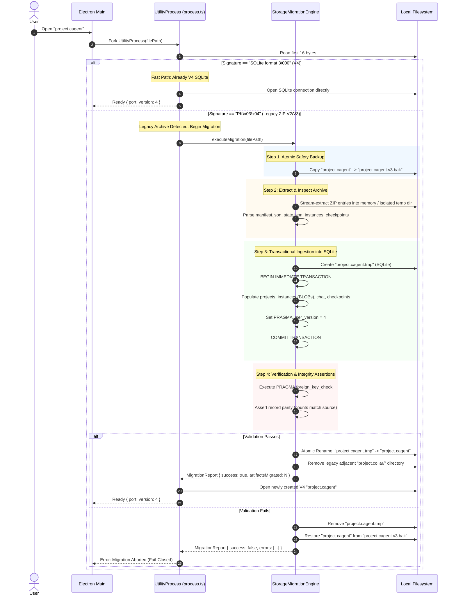

# Migration Plan: Legacy ZIP (V2/V3) to Native SQLite (V4)

## 1. Executive Summary

This document defines the automated, non-destructive migration specification for converting legacy CollarAgent project archives into the V4 SQLite database format.

### Format Taxonomy:

- **V1 / V2 (Legacy Monolithic Archive):** Single `.cagent` ZIP containing `cagent.json` (uncompressed monolithic JSON).
- **V3 (Sharded ZIP with Live Workspace):** Single `.cagent` ZIP containing `manifest.json`, `state.json`, and sharded `instances/` extracted to a live `.collar/` working directory.
- **V4 (Native SQLite Container):** Single `.cagent` file that **is directly an SQLite database** in WAL mode.

---

## 2. End-to-End Migration Sequence



---

## 3. Format Detection & Header Sniffing Protocol

When [`process.ts`](file:///Users/goldenfung/Documents/collaragent/src/main/server/fileServer/process.ts#L17) receives a file path, it reads the initial 16 bytes synchronously via `fs.readSync`:

```typescript
export type StorageFormatVersion = 'v4_sqlite' | 'legacy_zip' | 'unknown'

export function detectStorageFormat(filePath: string): StorageFormatVersion {
  const fd = fs.openSync(filePath, 'r')
  const buffer = Buffer.alloc(16)
  fs.readSync(fd, buffer, 0, 16, 0)
  fs.closeSync(fd)

  // SQLite magic bytes: "SQLite format 3\000"
  const sqliteHeader = Buffer.from([
    0x53, 0x51, 0x4c, 0x69, 0x74, 0x65, 0x20, 0x66, 0x6f, 0x72, 0x6d, 0x61, 0x74, 0x20, 0x33, 0x00
  ])

  if (buffer.equals(sqliteHeader)) {
    return 'v4_sqlite'
  }

  // ZIP PK zipfile signature: "PK\x03\x04"
  if (buffer[0] === 0x50 && buffer[1] === 0x4b && buffer[2] === 0x03 && buffer[3] === 0x04) {
    return 'legacy_zip'
  }

  return 'unknown'
}
```

---

## 4. Phase-by-Phase ETL Pipeline

### Phase 1: Pre-Migration Backup (Non-Destructive Guarantee)

Before reading or writing database structures:

1. Construct backup path: `${sourceFilePath}.v3.bak`.
2. Perform atomic file copy: `fs.promises.copyFile(sourceFilePath, backupPath, fs.constants.COPYFILE_EXCL)`.
3. If `<source>.v3.bak` already exists from an aborted run, append an epoch timestamp (`.v3.<epoch>.bak`) to prevent overwriting prior valid backups.

### Phase 2: Source Extraction & Normalization

1. If the project already has an active, dirty adjacent `.collar/` folder, use the live files in `.collar/` as the canonical source to ensure unsaved edits are preserved.
2. Otherwise, extract the `.cagent` ZIP into an isolated temporary staging directory (`os.tmpdir()/collar-migrate-<uuid>/`) using `yauzl`.
3. If a legacy V2 monolithic `cagent.json` is detected, run the existing [`ImportCagentArchive`](file:///Users/goldenfung/Documents/collaragent/src/main/server/fileServer/ImportCagentArchive.ts) in-memory normalizer to produce V3 structures before SQL ingestion.

### Phase 3: Transactional SQLite Ingestion

Open a connection to `${sourceFilePath}.tmp`:

1. Execute the DDL schema specified in [`storage-engine-design.md`](file:///Users/goldenfung/Documents/collaragent/docs/sqlite-storage-architecture/storage-engine-design.md).
2. Execute `BEGIN IMMEDIATE TRANSACTION;`:
   - **Projects:** Ingest `manifest.projects` $\rightarrow$ `projects` table.
   - **Instances:** Iterate `manifest.instances`. For each instance ID, read `instances/<id>/content.msgpack`. Insert into `instances (id, project_id, type, name, content_msgpack, metadata_json, created_at, updated_at)`.
   - **Chat Sessions:** Iterate `state.chat.sessions`. Insert into `chat_sessions` and normalize each child message into `chat_messages`.
   - **LangGraph Checkpoints:** Read all `.json` records in `checkpoints/threads/<threadId>/checkpoints/*.json` $\rightarrow$ insert into `langgraph_checkpoints`.
   - **LangGraph Blobs:** Read all files in `checkpoints/blobs/*.json`. Decode base64url filename $\rightarrow$ insert into `langgraph_blobs`.
   - **LangGraph Writes:** Read all files in `checkpoints/threads/<threadId>/writes/*.json` $\rightarrow$ insert into `langgraph_writes`.
   - **Restore Heads:** Read `checkpoints/manifests/restore-heads.json` $\rightarrow$ insert into `langgraph_restore_heads`.
   - **Snapshots & Revisions:** Ingest `state.workspaceSnapshots` and `state.fileRevisions`.
   - **User Version:** Execute `PRAGMA user_version = 4;`.
3. Execute `COMMIT;`.

---

## 5. Post-Migration Verification & Parity Checks

Prior to replacing the source file, the migration engine runs four integrity gates:

1. **Foreign Key Verification:**
   ```sql
   PRAGMA foreign_key_check;
   ```
   Must return exactly 0 rows. Any orphaned messages or writes abort the migration.
2. **Instance Count Parity:**
   ```sql
   SELECT COUNT(*) AS total FROM instances;
   ```
   Must strictly match `Object.keys(manifest.instances).length`.
3. **Checkpoint Parity:**
   ```sql
   SELECT COUNT(*) AS total FROM langgraph_checkpoints;
   ```
   Must match the total count of checkpoint JSON files on disk.
4. **BLOB Non-Corruption Assertion:**
   A random sample of up to 5 instances must be read and successfully deserialized via `unpack(content_msgpack)` without throws.

---

## 6. Atomic Cutover & Post-Migration Cleanup

1. Close the SQLite connection to the temporary database.
2. Atomically rename the temporary database file:
   ```typescript
   await fs.promises.rename(`${sourceFilePath}.tmp`, sourceFilePath)
   ```
3. If an adjacent `.collar/` folder exists, safely decommission it:
   - Check if `<folder>.lock` exists.
   - Recursively delete the `.collar/` directory (`fs.promises.rm(collarDir, { recursive: true, force: true })`).
4. Emit an operational event over IPC:
   ```json
   {
     "type": "migration:completed",
     "fromVersion": 3,
     "toVersion": 4,
     "artifactsMigrated": 482,
     "durationMs": 340,
     "backupPath": "project.cagent.v3.bak"
   }
   ```

---

## 7. Rollback & Failure Recovery Procedure

If any exception occurs during extraction, ingestion, or parity validation:

1. **Rollback Transaction:** If the SQL transaction is open, issue `ROLLBACK`.
2. **Clean Temporary Database:** Unlink `${sourceFilePath}.tmp` and any associated temporary files.
3. **Restore from Backup:** If the original file was modified or deleted, restore from `<filename>.cagent.v3.bak`.
4. **Preserve Logs:** Output a structured error report containing:
   - Error code: `CONFIG_MIGRATION_VALIDATION_FAILED` (conforming to `.agents/rules/coding-rules.md`).
   - Failed phase and entity identifier.
   - Original stack trace.
5. **Fail-Closed:** Halt workspace initialization and present a user recovery modal allowing manual export or report submission.
