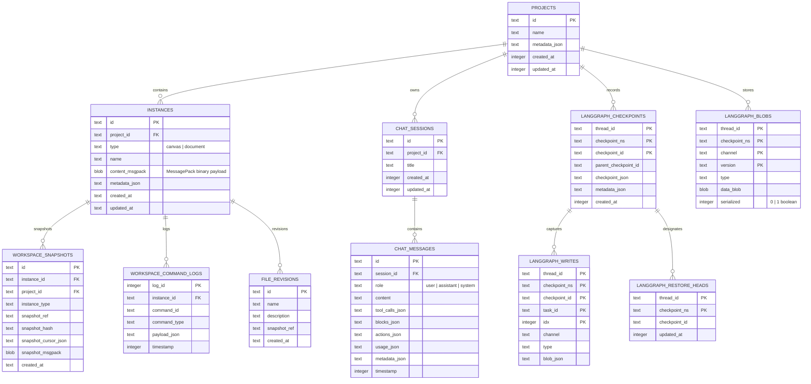

# Storage Engine Design: SQLite Embedded Project Database

## 1. Executive Summary

This document specifies the database architecture for CollarAgent's V4 storage engine. The native `.cagent` file is structured as an embedded SQLite database running with Write-Ahead Logging (WAL) enabled. It replaces the loose filesystem hierarchy (`manifest.json`, `state.json`, `instances/`, `checkpoints/`) with indexed tables and binary BLOB storage, delivering $<1.5\text{ms}$ point queries, transactional crash safety, and instant startup/shutdown.

---

## 2. SQLite Engine PRAGMA Configuration

Upon establishing a connection to a `.cagent` database file in the `utilityProcess`, the connection must be initialized with the following PRAGMAs:

```sql
-- 1. High-throughput non-blocking concurrency
PRAGMA journal_mode = WAL;

-- 2. Synchronous mode: NORMAL is durable in WAL mode and eliminates fsync stalls
PRAGMA synchronous = NORMAL;

-- 3. Strict relational integrity enforcement
PRAGMA foreign_keys = ON;

-- 4. In-memory temporary tables and indexes
PRAGMA temp_store = MEMORY;

-- 5. Cache sizing: 64 MB page cache (negative number indicates kibibytes)
PRAGMA cache_size = -64000;

-- 6. Incremental auto-vacuum to reclaim storage from pruned agent checkpoints
PRAGMA auto_vacuum = INCREMENTAL;

-- 7. Busy timeout to prevent lock contention errors under fast UI events
PRAGMA busy_timeout = 5000;

-- 8. Memory-mapped I/O (up to 128 MB for high-speed BLOB access)
PRAGMA mmap_size = 134217728;
```

---

## 3. Entity-Relationship Model (C4 Level 4)



---

## 4. Comprehensive DDL Schema Specification

```sql
-- Schema Version Tracking
PRAGMA user_version = 4;

-- ============================================================================
-- 1. PROJECTS & INSTANCES
-- ============================================================================

CREATE TABLE IF NOT EXISTS projects (
    id TEXT PRIMARY KEY NOT NULL,
    name TEXT NOT NULL,
    metadata_json TEXT NOT NULL DEFAULT '{}',
    created_at INTEGER NOT NULL,
    updated_at INTEGER NOT NULL
);

CREATE TABLE IF NOT EXISTS instances (
    id TEXT PRIMARY KEY NOT NULL,
    project_id TEXT NOT NULL REFERENCES projects(id) ON DELETE CASCADE,
    type TEXT NOT NULL CHECK(type IN ('document', 'canvas')),
    name TEXT NOT NULL,
    content_msgpack BLOB,              -- MessagePack binary payload (Lexical or GraphCanvasDTO)
    metadata_json TEXT NOT NULL DEFAULT '{}',
    created_at TEXT NOT NULL,
    updated_at TEXT NOT NULL
);

-- ============================================================================
-- 2. CHAT SESSIONS & MESSAGES
-- ============================================================================

CREATE TABLE IF NOT EXISTS chat_sessions (
    id TEXT PRIMARY KEY NOT NULL,
    project_id TEXT NOT NULL REFERENCES projects(id) ON DELETE CASCADE,
    title TEXT NOT NULL,
    created_at INTEGER NOT NULL,
    updated_at INTEGER NOT NULL
);

CREATE TABLE IF NOT EXISTS chat_messages (
    id TEXT PRIMARY KEY NOT NULL,
    session_id TEXT NOT NULL REFERENCES chat_sessions(id) ON DELETE CASCADE,
    role TEXT NOT NULL CHECK(role IN ('user', 'assistant', 'system')),
    content TEXT NOT NULL,
    tool_calls_json TEXT NOT NULL DEFAULT '[]',
    blocks_json TEXT NOT NULL DEFAULT '[]',
    actions_json TEXT NOT NULL DEFAULT '[]',
    usage_json TEXT,
    metadata_json TEXT NOT NULL DEFAULT '{}',
    timestamp INTEGER NOT NULL
);

-- ============================================================================
-- 3. LANGGRAPH EXECUTION STATE & CHECKPOINTS
-- ============================================================================

CREATE TABLE IF NOT EXISTS langgraph_checkpoints (
    thread_id TEXT NOT NULL,
    checkpoint_ns TEXT NOT NULL DEFAULT '',
    checkpoint_id TEXT NOT NULL,
    parent_checkpoint_id TEXT,
    checkpoint_json TEXT NOT NULL,      -- Lightweight checkpoint without bulky channel values
    metadata_json TEXT NOT NULL DEFAULT '{}',
    created_at INTEGER NOT NULL DEFAULT (strftime('%s', 'now') * 1000),
    PRIMARY KEY (thread_id, checkpoint_ns, checkpoint_id)
);

CREATE TABLE IF NOT EXISTS langgraph_blobs (
    thread_id TEXT NOT NULL,
    checkpoint_ns TEXT NOT NULL DEFAULT '',
    channel TEXT NOT NULL,
    version TEXT NOT NULL,
    type TEXT NOT NULL,                 -- 'json', 'bytes', 'empty', or LangChain class type
    data_blob BLOB,                     -- Serialized channel payload
    serialized INTEGER NOT NULL DEFAULT 0,
    PRIMARY KEY (thread_id, checkpoint_ns, channel, version)
);

CREATE TABLE IF NOT EXISTS langgraph_writes (
    thread_id TEXT NOT NULL,
    checkpoint_ns TEXT NOT NULL DEFAULT '',
    checkpoint_id TEXT NOT NULL,
    task_id TEXT NOT NULL,
    idx INTEGER NOT NULL,
    channel TEXT NOT NULL,
    type TEXT NOT NULL DEFAULT 'json',
    blob_json TEXT NOT NULL,
    PRIMARY KEY (thread_id, checkpoint_ns, checkpoint_id, task_id, idx)
);

CREATE TABLE IF NOT EXISTS langgraph_restore_heads (
    thread_id TEXT NOT NULL,
    checkpoint_ns TEXT NOT NULL DEFAULT '',
    checkpoint_id TEXT NOT NULL,
    updated_at INTEGER NOT NULL,
    PRIMARY KEY (thread_id, checkpoint_ns)
);

-- ============================================================================
-- 4. SNAPSHOTS, COMMAND LOGS & REVISIONS
-- ============================================================================

CREATE TABLE IF NOT EXISTS workspace_snapshots (
    id TEXT PRIMARY KEY NOT NULL,
    instance_id TEXT NOT NULL REFERENCES instances(id) ON DELETE CASCADE,
    project_id TEXT NOT NULL REFERENCES projects(id) ON DELETE CASCADE,
    instance_type TEXT NOT NULL,
    snapshot_ref TEXT NOT NULL UNIQUE,  -- sha256.msgpack identifier
    snapshot_hash TEXT NOT NULL,
    snapshot_cursor_json TEXT NOT NULL DEFAULT '{}',
    snapshot_msgpack BLOB NOT NULL,     -- Content-addressed binary state
    created_at TEXT NOT NULL
);

CREATE TABLE IF NOT EXISTS workspace_command_logs (
    log_id INTEGER PRIMARY KEY AUTOINCREMENT,
    instance_id TEXT NOT NULL REFERENCES instances(id) ON DELETE CASCADE,
    command_id TEXT NOT NULL,
    command_type TEXT NOT NULL,
    payload_json TEXT NOT NULL,
    timestamp INTEGER NOT NULL
);

CREATE TABLE IF NOT EXISTS file_revisions (
    id TEXT PRIMARY KEY NOT NULL,
    name TEXT NOT NULL,
    description TEXT,
    snapshot_ref TEXT NOT NULL REFERENCES workspace_snapshots(snapshot_ref) ON DELETE CASCADE,
    created_at TEXT NOT NULL
);

-- ============================================================================
-- 5. LARGE TOOL OUTPUTS (ADR-006)
-- ============================================================================

CREATE TABLE IF NOT EXISTS large_tool_outputs (
    id TEXT PRIMARY KEY NOT NULL,
    session_id TEXT REFERENCES chat_sessions(id) ON DELETE CASCADE,
    content_blob BLOB NOT NULL,
    byte_size INTEGER NOT NULL,
    created_at INTEGER NOT NULL
);
```

---

## 5. B-Tree Indexing Strategy

| Index Name                  | Table                    | Columns                                       | Purpose                      | Accelerated Query                                                                                                |
| :-------------------------- | :----------------------- | :-------------------------------------------- | :--------------------------- | :--------------------------------------------------------------------------------------------------------------- |
| `idx_instances_project`     | `instances`              | `(project_id)`                                | Fast catalog listing         | `SELECT id, name, type FROM instances WHERE project_id = ?`                                                      |
| `idx_chat_messages_session` | `chat_messages`          | `(session_id, timestamp ASC)`                 | Chronological chat replay    | `SELECT * FROM chat_messages WHERE session_id = ? ORDER BY timestamp ASC`                                        |
| `idx_checkpoints_lookup`    | `langgraph_checkpoints`  | `(thread_id, checkpoint_ns, created_at DESC)` | Latest checkpoint resolution | `SELECT * FROM langgraph_checkpoints WHERE thread_id = ? AND checkpoint_ns = ? ORDER BY created_at DESC LIMIT 1` |
| `idx_writes_checkpoint`     | `langgraph_writes`       | `(thread_id, checkpoint_id)`                  | Pending write hydration      | `SELECT * FROM langgraph_writes WHERE thread_id = ? AND checkpoint_id = ?`                                       |
| `idx_cmd_logs_instance`     | `workspace_command_logs` | `(instance_id, timestamp ASC)`                | Command replay & time travel | `SELECT * FROM workspace_command_logs WHERE instance_id = ? ORDER BY timestamp ASC`                              |

```sql
CREATE INDEX IF NOT EXISTS idx_instances_project ON instances(project_id);
CREATE INDEX IF NOT EXISTS idx_chat_messages_session ON chat_messages(session_id, timestamp ASC);
CREATE INDEX IF NOT EXISTS idx_checkpoints_lookup ON langgraph_checkpoints(thread_id, checkpoint_ns, created_at DESC);
CREATE INDEX IF NOT EXISTS idx_writes_checkpoint ON langgraph_writes(thread_id, checkpoint_id);
CREATE INDEX IF NOT EXISTS idx_cmd_logs_instance ON workspace_command_logs(instance_id, timestamp ASC);
```

---

## 6. Access Patterns & Query Acceleration

### 6.1 LangGraph Checkpoint Resolution (`getTuple`)

Instead of scanning file directories, [`FileSystemSaver.getTuple()`](file:///Users/goldenfung/Documents/collaragent/src/main/server/fileServer/FileSystemSaver.ts#L35) queries the database using indexed point reads:

```typescript
// 1. Resolve active restore head or latest checkpoint
const stmt = db.prepare(`
  SELECT checkpoint_id, checkpoint_json, metadata_json, parent_checkpoint_id
  FROM langgraph_checkpoints
  WHERE thread_id = ? AND checkpoint_ns = ?
  ORDER BY created_at DESC LIMIT 1
`)
const cp = stmt.get(threadId, checkpointNs)

// 2. Fetch required channel blobs in a single indexed query
const blobStmt = db.prepare(`
  SELECT channel, version, type, data_blob, serialized
  FROM langgraph_blobs
  WHERE thread_id = ? AND checkpoint_ns = ? AND channel = ? AND version = ?
`)
```

**Latency:** Reduced from $250\text{ms}$ (linear directory scan of 2,000 files) to **$< 1.5\text{ms}$**.

### 6.2 Lazy Instance Content Streaming

The server does not load all documents and cards into memory upon opening.

1. `GET /api/instances`: Queries only metadata (`id, name, type, updated_at`)—instant response.
2. `GET /api/instances/:id`: Streams `content_msgpack` on demand when the user selects a tab.

---

## 7. Concurrency, Locking & WAL Compaction

### 7.1 Multi-Process Lock Coordination

Because multiple Electron windows could inadvertently point to the same `.cagent` file:

1. When opening `project.cagent`, the utility process acquires an OS advisory lock on `project.cagent.lock` with `{ pid: process.pid, time: Date.now() }`.
2. SQLite operates in `WAL` mode, enabling non-blocking concurrent readers alongside a single serialized writer.

### 7.2 Checkpoint Compaction & Vacuuming

LangGraph step writes can accumulate dead tool results. To prevent unbound database growth:

1. **Turn Compaction:** When an agent turn finishes, intermediate `langgraph_writes` older than the last 3 turns are purged.
2. **Incremental Vacuum:** `PRAGMA incremental_vacuum(500);` runs periodically in the background when the system is idle, releasing free database pages without locking the UI.
