# Scientific Research Orchestrator

Master multi-agent orchestration framework for conducting rigorous, end-to-end scientific research. Coordinates transitions across the complete academic research lifecycle, ensuring that every theoretical claim, empirical finding, and methodological design is systematically modeled on the Concept Canvas, grounded in verified literature, and drafted into APA 7th Edition manuscripts.

---

## When to Use This Skill

- Initiating a new scientific research investigation from a broad idea or domain question.
- Managing an end-to-end research project requiring conceptual mapping, literature search, hypothesis formalization, experimental design, and academic manuscript drafting.
- Coordinating specialized subagent workers across progressive stages of the research lifecycle.
- Enforcing non-destructive staged diff reviews, audit trails, and mathematical rollbacks during scientific collaboration.

---

## Integrated Foundation Skills

This orchestrator integrates and coordinates three specialized built-in skills:

1. **`holistic-thinking-analyst`**:
   - Applied in **Stage 1 (Brainstorming & Systems Mapping)**.
   - Deconstructs research questions from First Principles, maps subsystem hierarchies, identifies dynamic feedback loops, and externalizes mental models onto the visual Concept Canvas.
2. **`apa-research-execution-specialist`**:
   - Applied in **Stage 2 (Literature Retrieval)**, **Stage 4 (Methodology)**, and **Stage 5 (Scholarly Synthesis)**.
   - Enforces linear research execution, citation grounding, APA 7th Edition structural rules (Title page, Abstract, Level 1-3 headings, references with DOIs), and 3-line horizontal table formatting.
3. **`focused-execution-specialist`**:
   - Applied across **Stage 3 (Hypotheses)** and **Stage 6 (Critique & Rollback)**.
   - Executes tightly scoped subagent tasks, maintains prompt fidelity, conducts adversarial peer review, and executes deterministic state reversibility without scope creep.

---

## The 6-Stage Scientific Research Lifecycle DAG

```mermaid
flowchart TD
    S1["Stage 1: Idea Brainstorming & Systems Mapping\n(Skill: research-stage-1-brainstorming)"] --> Gate1{"Gate 1: Canvas Graph Verified?"}
    Gate1 -- Yes --> S2["Stage 2: Literature Retrieval & Gap Analysis\n(Skill: research-stage-2-literature-retrieval)"]
    Gate1 -- No --> S1
    S2 --> Gate2{"Gate 2: Empirical Matrix & Gap Grounded?"}
    Gate2 -- Yes --> S3["Stage 3: Hypothesis & RQ Formulation\n(Skill: research-stage-3-hypothesis-formulation)"]
    Gate2 -- No --> S2
    S3 --> Gate3{"Gate 3: Variables Operationalized & Falsifiable?"}
    Gate3 -- Yes --> S4["Stage 4: Experimental Methodology & KaTeX\n(Skill: research-stage-4-experimental-methodology)"]
    Gate3 -- No --> S3
    S4 --> Gate4{"Gate 4: Protocol, Power & Equations Sound?"}
    Gate4 -- Yes --> S5["Stage 5: Structured Scholarly Synthesis (APA 7)\n(Skill: research-stage-5-scholarly-synthesis)"]
    Gate4 -- No --> S4
    S5 --> Gate5{"Gate 5: Manuscript & Tables Validated?"}
    Gate5 -- Yes --> S6["Stage 6: Critique, Verification & Rollback\n(Skill: research-stage-6-critique-rollback)"]
    Gate5 -- No --> S5
    S6 --> Done["Research Milestone Ready for Dissemination"]
```



---

## Multi-Agent Subagent Worker Topology

The Primary Orchestrator delegates tasks to specialized subagents for each stage. Each subagent operates within a bounded scope, interacts through typed workspace tools, and reports structured deliverables back to the orchestrator:

```
                          [Scientific Research Orchestrator]
                                         │
        ┌──────────────┬─────────────────┼─────────────────┬──────────────┐
        ▼              ▼                 ▼                 ▼              ▼
  [Stage 1 Worker] [Stage 2 Worker] [Stage 3 Worker] [Stage 4 Worker] [Stage 5 Worker]
   (Brainstorm)     (Literature)      (Hypothesis)      (Methodology)   (APA Synthesis)
        │                                                                 │
        └───────────────────────────────┬─────────────────────────────────┘
                                        ▼
                                 [Stage 6 Worker]
                              (Critique & Rollback)
```

### Subagent Worker Directory & Contracts

| Stage | Subagent Worker Role            | Primary Responsibility                                                                       | Input Contract                                  | Expected Deliverable                                              |
| :---- | :------------------------------ | :------------------------------------------------------------------------------------------- | :---------------------------------------------- | :---------------------------------------------------------------- |
| **1** | `conceptual-systems-analyst`    | First-principles deconstruction; extracts irreducible truths; plants 2D concept canvas.      | Broad research topic, domain prompt.            | Concept Canvas Mind Map and directional knowledge graph.          |
| **2** | `empirical-literature-scout`    | Academic literature search; comparative evidence matrix synthesis; gap isolation.            | Theoretical pillars from Stage 1 graph.         | `Literature_Review_Matrix` document and canvas citation nodes.    |
| **3** | `construct-operationalizer`     | Variable architecture definition; formal $RQ$ and directional hypothesis drafting.           | Isolated research gap from Stage 2.             | `Formal_Hypotheses_and_RQs` document.                             |
| **4** | `methodology-protocol-designer` | Experimental paradigm design; statistical power analysis; KaTeX mathematical models.         | Hypotheses and variables from Stage 3.          | `Experimental_Methodology_Protocol` document with KaTeX.          |
| **5** | `scholarly-manuscript-compiler` | Full APA 7th Edition manuscript compilation; rectangular tables; bibliographic formatting.   | Assembled sections from Stages 1-4.             | `Manuscript_Draft` document with APA Table 1.                     |
| **6** | `adversarial-peer-reviewer`     | Critical validity review; race condition detection; mathematical inverse rollback execution. | Manuscript draft and active workspace snapshot. | Peer review audit, diff review, and rollback parity confirmation. |

---

## Stage-by-Stage Orchestration Protocol

### Stage 1: Idea Brainstorming & Systems Mapping

1. **Objective**: Build a complete, interconnected "Big Picture" understanding of the research topic on the visual Concept Canvas.
2. **Subagent Delegation**: Delegate to `conceptual-systems-analyst` (using `holistic-thinking-analyst` principles).
3. **Execution Steps**:
   - Apply the 3-step First Principles method (Challenge Assumptions $\rightarrow$ Deconstruct to Irreducible Truths $\rightarrow$ Rebuild Frame).
   - Group concepts into maximum 4-5 macro subsystems (`writeMindMap`).
   - Connect micro-components with directional verbs and map reinforcing/balancing feedback loops (`writeGraph`).
4. **Stage 1 Gate Exit Criteria**:
   - Concept canvas contains at least 10-15 interconnected nodes.
   - All relationships possess explicit directional labels (e.g., `triggers`, `inhibits`, `externalizes`).
   - At least 1 reinforcing or balancing feedback loop is explicitly identified.

### Stage 2: Literature Retrieval & Gap Analysis

1. **Objective**: Ground the conceptual model in empirical literature and isolate an unaddressed scientific gap.
2. **Subagent Delegation**: Delegate to `empirical-literature-scout` (using `apa-research-execution-specialist` search mode).
3. **Execution Steps**:
   - Query academic literature using `internetSearch`.
   - Compile a comparative literature matrix using `createDocument` capturing citations, setups, findings, and limitations.
   - Project verified citations and the isolated research gap back onto the Concept Canvas using `writeGraph` in `merge` mode.
4. **Stage 2 Gate Exit Criteria**:
   - Literature matrix contains at least 3-5 foundational peer-reviewed studies.
   - An unambiguous, defensible research gap is explicitly documented and linked on the canvas.

### Stage 3: Hypothesis & Research Question Formulation

1. **Objective**: Translate the theoretical gap into falsifiable research questions and directional hypotheses.
2. **Subagent Delegation**: Delegate to `construct-operationalizer` (using `focused-execution-specialist`).
3. **Execution Steps**:
   - Operationalize all Independent Variables ($IV$), Dependent Variables ($DV$), and Covariates into concrete measurement scales.
   - Draft formal Research Questions ($RQ_1, RQ_2$) and directional statistical hypotheses ($H_1, H_2, H_3$).
   - Persist specification into `Formal_Hypotheses_and_RQs` via `createDocument`.
4. **Stage 3 Gate Exit Criteria**:
   - Every variable has an explicit measurement instrument and unit of measurement.
   - Hypotheses specify mathematical directionality (null $H_0$ vs. alternative $H_A$).

### Stage 4: Experimental Methodology & Formal Modeling

1. **Objective**: Formalize experimental controls, apparatus specifications, and mathematical equations.
2. **Subagent Delegation**: Delegate to `methodology-protocol-designer`.
3. **Execution Steps**:
   - Perform statistical power analysis ($G*\text{Power}$) specifying required sample size ($N$).
   - Formulate mathematical equations in KaTeX (e.g. Signal Detection Theory $d', c$, Cognitive Efficiency $E$, or physical sensor models).
   - Author procedural protocol (trial sequence, counterbalancing, stimulus controls) via `createDocument`.
4. **Stage 4 Gate Exit Criteria**:
   - Power calculations explicitly state alpha ($\alpha = .05$), power ($1 - \beta \ge .80$), and effect size ($f$ or $d$).
   - All mathematical formulas render validly in KaTeX blocks without syntax errors.

### Stage 5: Structured Scholarly Synthesis (APA 7)

1. **Objective**: Assemble a complete, publication-grade academic manuscript in strict APA 7th Edition style.
2. **Subagent Delegation**: Delegate to `scholarly-manuscript-compiler` (using `apa-research-execution-specialist`).
3. **Execution Steps**:
   - Author Title Page, Abstract (150-250 words) with _Keywords:_, Introduction, Method, Planned Results, and References.
   - Structure Planned Results Table 1 with strict APA formatting: 3 horizontal borders (top, bottom, header bottom) and zero vertical lines.
   - Persist complete manuscript AST via `createDocument`.
4. **Stage 5 Gate Exit Criteria**:
   - Abstract conforms strictly to the 150-250 word limit.
   - Table schema is strictly rectangular (zero jagged rows/columns).
   - In-text citations and reference list match 1-to-1 with complete bibliographic metadata.

### Stage 6: Critique, Verification & Reversible Rollback

1. **Objective**: Perform adversarial peer critique, detect ungrounded claims or concurrency collisions, and verify state reversibility.
2. **Subagent Delegation**: Delegate to `adversarial-peer-reviewer`.
3. **Execution Steps**:
   - Inspect proposed manuscript for threats to internal/external validity, confounding variables, or stale state conflicts.
   - If an ungrounded or conflicting edit is detected, reject the proposal.
   - Invert forward patch commands using mathematical command inversion, restoring baseline document state.
   - Verify 100% snapshot byte parity against baseline.
4. **Stage 6 Gate Exit Criteria**:
   - All identified defects are either resolved or cleanly reverted.
   - Zero lost human keystrokes; document and canvas pass AST integrity validation.

---

## Workspace Tool Call Signatures & Examples

The orchestrator and subagents interact with the CollarAgent runtime exclusively through typed workspace tools. Below are standard invocation examples:

### 1. Plant Structural Mind Map (`writeMindMap`)

```json
{
  "instanceName": "Cognitive-Load-Canvas",
  "projectName": "Research-Workspace",
  "direction": "RADIAL",
  "root": {
    "entity": "Cognitive Load in Multimodal Sensemaking",
    "children": [
      {
        "entity": "[WM] Working Memory Subsystems",
        "children": [
          { "entity": "Central Executive (Attentional Control)" },
          { "entity": "Visuospatial Sketchpad (Spatial Maps)" }
        ]
      },
      {
        "entity": "[CLT] Cognitive Load Types",
        "children": [
          { "entity": "Intrinsic Load (Task Difficulty)" },
          { "entity": "Extraneous Load (Interface Friction)" }
        ]
      }
    ]
  }
}
```

### 2. Connect Knowledge Graph Relationships (`writeGraph`)

```json
{
  "instanceName": "Cognitive-Load-Canvas",
  "projectName": "Research-Workspace",
  "direction": "LR",
  "mode": "merge",
  "nodes": [
    { "entity": "Visuospatial Sketchpad (Spatial Maps)" },
    { "entity": "Extraneous Load (Interface Friction)" },
    { "entity": "Central Executive (Attentional Control)" }
  ],
  "edges": [
    {
      "from": "Visuospatial Sketchpad (Spatial Maps)",
      "to": "Extraneous Load (Interface Friction)",
      "label": "reduces visual search cost"
    },
    {
      "from": "Extraneous Load (Interface Friction)",
      "to": "Central Executive (Attentional Control)",
      "label": "depletes capacity (inhibits)"
    }
  ]
}
```

### 3. Create Lexical Scholarly Document (`createDocument`)

```json
{
  "instanceName": "Literature_Review_Matrix",
  "projectName": "Research-Workspace",
  "html_content": "<h1>Empirical Foundations: Cognitive Load &amp; Dual-Task Paradigms</h1><p>This synthesis evaluates foundational investigations into working memory bottlenecks and split-attention effects.</p><table><tr><th>Study (Citation)</th><th>Paradigm</th><th>Key Finding</th><th>Research Gap</th></tr><tr><td>Sweller &amp; Chandler (1994)</td><td>Diagram + text instructions</td><td>Integrated text-diagram reduced extraneous load.</td><td>Tested passive learning only; no active dual-authoring.</td></tr></table>"
}
```

### 4. Edit Existing Document with Granular Operations (`editDocument`)

```json
{
  "instanceName": "Methodology_Protocol",
  "projectName": "Research-Workspace",
  "operations": [
    {
      "action": "insert",
      "blockId": "b_method_section",
      "anchor": "after",
      "newHtml": "<p>Cognitive efficiency (E) is modeled as the perpendicular distance from the line of neutral efficiency in standardized Z-space:</p><p>$$E = \\frac{\\bar{Z}_{\\text{Performance}} - \\bar{Z}_{\\text{Effort}}}{\\sqrt{2}}$$</p>"
    }
  ],
  "explanation": "Insert mathematical modeling of cognitive efficiency into methodology"
}
```

### 5. Query Academic Literature (`internetSearch`)

```json
{
  "query": "Sweller split attention effect dual visual text interface empirical study"
}
```

### 6. Read Document or Graph State (`readDocument` / `readGraph`)

```json
{
  "instanceName": "Literature_Review_Matrix",
  "projectName": "Research-Workspace"
}
```

```json
{
  "instanceName": "Cognitive-Load-Canvas",
  "projectName": "Research-Workspace",
  "includeMemo": true
}
```

---

## Concurrency, Staged Diffs & Reversible Rollback Directives

1. **Non-Destructive Staging Invariant**:
   - DeepAgent must NEVER overwrite human text directly in-place without generating a visible staged proposal diff.
   - The human researcher retains absolute primacy over state commits.
2. **Optimistic Concurrency Check**:
   - Before applying any automated patch, verify that the document snapshot hash matches the parent state.
   - If parent state has diverged (e.g. human edited while subagent was executing), abort the patch, re-read live state via `readDocument`, and re-base cleanly.
3. **Deterministic Mathematical Rollback**:
   - If the user or peer reviewer rejects an edit, compute the algebraic inverse of the forward command sequence (`insertBlock` $\rightarrow$ `deleteBlock`, `updateText(old, new)` $\rightarrow$ `updateText(new, old)`).
   - Execute the inverse stream via `editDocument` to restore baseline state with 100% snapshot byte parity.
